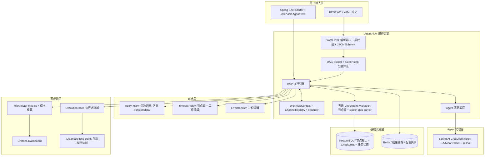
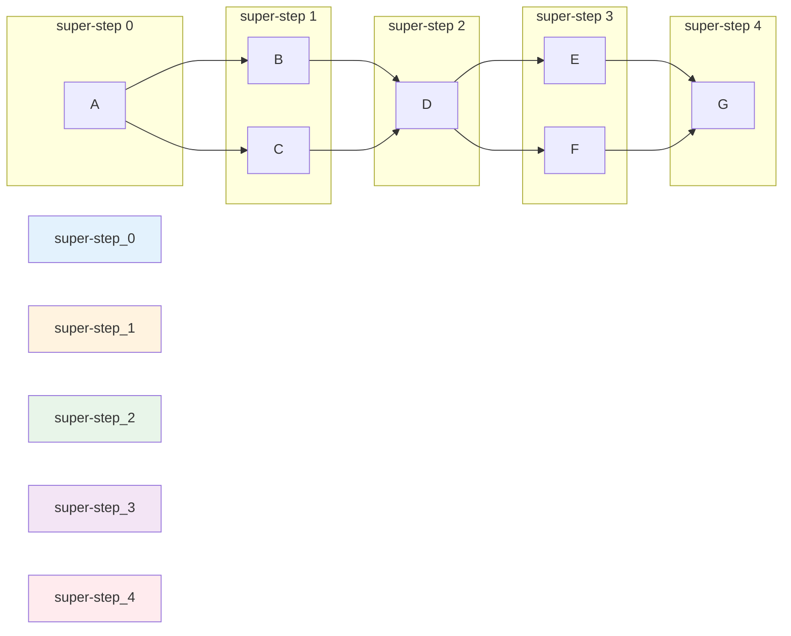
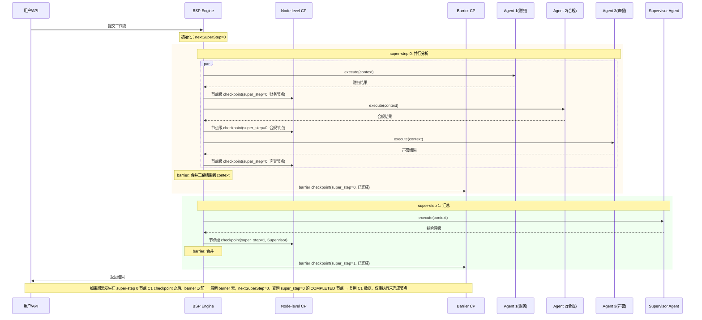
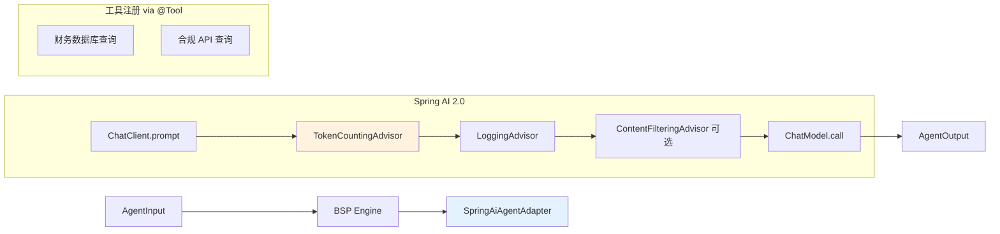
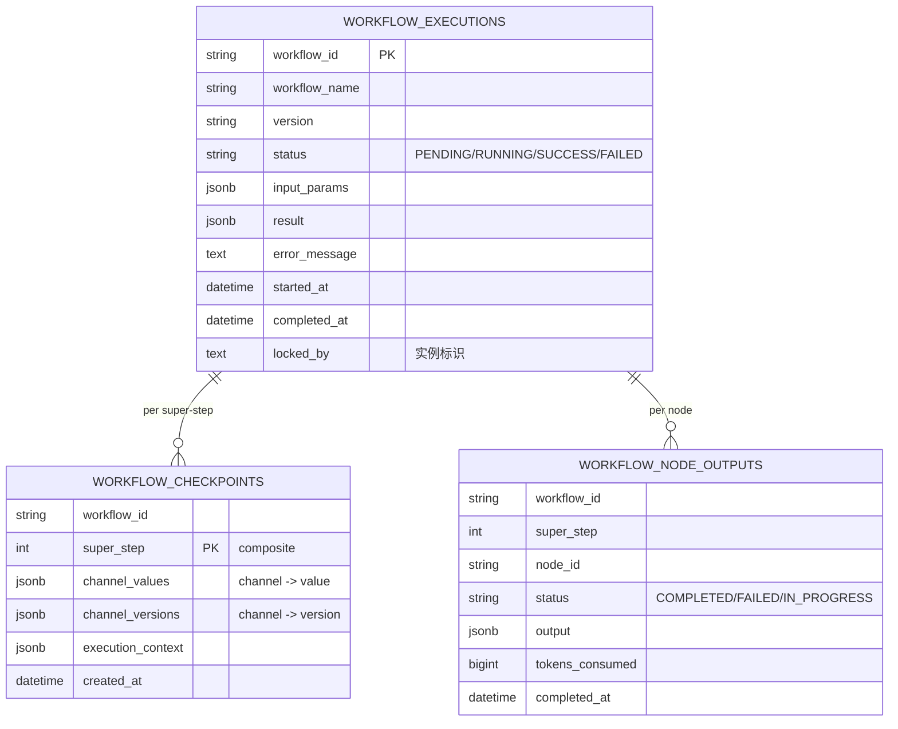
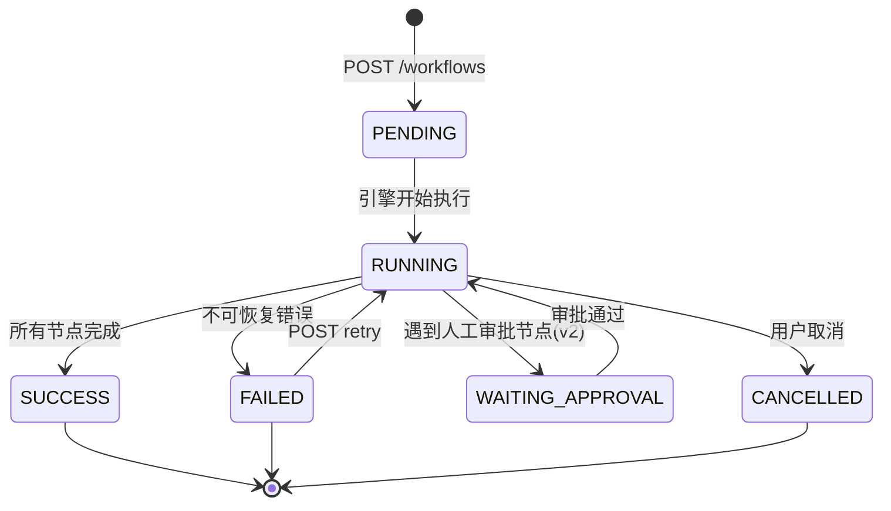

## Summary

AgentFlow 是一个 Java 原生的轻量级 Multi-Agent 编排引擎。YAML DSL 声明工作流，BSP（Bulk Synchronous Parallel）执行模型驱动，多个专业 Agent 能像微服务一样协作。v1 聚焦**静态 DAG（串行+并行 + 混合拓扑）+ PostgreSQL 持久化 Checkpoint + 调试体验**，10 周内交付。三个验证场景采用**差异化拓扑**证明引擎通用性：① 供应商风险评估（并行→汇总）、② 合同审核流水线（4 步链式串行）、③ 投资分析决策（双层 fork-join）。新增 Mock 模式（本地零成本调试）+ Workflow 版本管理（生产安全更新）。

> **v4 修订要点**：基于 ce-doc-review 6 persona 审查（coherence/feasibility/scope/security/adversarial/product），方向重确认 + 真 bug 修复：
> - 🟢 **方向**：AgentFlow 不转向——七三开（后端 70% + Agent 30%）+ 主流技术栈 + 从0复现展示后端能力，与 ToyRush/InterviewCoach 互补
> - 🔴 **P0-1 Recovery off-by-one bug**：伪代码查错层（`targetSuperStep-1` → `nextSuperStep`），修复崩溃层 LLM 重复计费
> - 🔴 **P0-2 super-step 编号统一 0-based**：分层算法/时序图/checkpoint/Recovery 全统一
> - 🔴 **P0-3/4 安全**：新增 R21（API 鉴权防 IDOR）+ R22（LLM 凭证 + 敏感数据脱敏）
> - 🔴 **P0-5 前提重写**：Problem Frame 从"生态空白"改为"从0复现展示后端能力"，补 LangGraph4j 等竞品对比 + 诚实声明
> - 🟠 **P1**：U12 super-step 数 5→4；Interview Value 重写七三开叙事
> - ⚪ **safe_auto**：6 处一致性修复（重复 Test scenarios/覆盖率/Phase 周数/表名/单元数/关键路径）

> **v3 修订要点**：基于 Senior Architect Review 反馈，重点修复以下问题：
> - 🔴 Critical：Checkpoint 恢复状态检查缺陷（C1）、KTD 数量统一为 9 个（C2）、Recovery 算法伪代码补齐（C3）、R7 Supervisor 重新定义为"轻量 Supervisor"（C4）
> - 🟠 Important：LLM 输出 schema 校验（I1）、Virtual Threads + PG Checkpoint 并发策略（I2）、CI/CD 纳入范围（I4）
> - 新增 "Recovery Protocol" 独立章节和 "Interview Value" 章节

> **v2 修订要点**：基于 4 位审查者（架构师、工程师、产品经理、风险专家）反馈，解决 3 个 Critical + 5 个 High 级问题，涵盖 BSP 算法明确化、Checkpoint 语义重构、接口合约补全、场景差异化、范围削减。

---

## Problem Frame

### 为什么做 AgentFlow

**这不是"填补生态空白"的项目，而是"从0复现展示后端工程能力"的项目。**

Multi-Agent 编排是 AI 落地的核心工程问题——多个专业 Agent 如何并行执行、状态如何持久化、失败如何恢复、成本如何追踪。业界已有成熟方案（LangGraph4j、Spring AI Alibaba Agent Framework、Spring AI 2.0 原生 Agentic Patterns），但我选择**从0用 Java 重新实现一个轻量级编排引擎**，借此展示后端工程能力：并发模型设计（BSP）、状态持久化与崩溃恢复（两级 Checkpoint + Recovery Protocol）、容错链路（Timeout/Retry/ErrorHandler）、DSL 设计与校验、可观测性、Spring Boot Starter 封装。

### 简历定位（七三开）

本项目是简历三个项目之一，承担**后端工程能力 + Agent 工程化**展示，与另外两个项目形成互补：

| 项目 | 定位 | 主打维度 |
|:---|:---|:---|
| ToyRush | 高并发后端基础 | Redis/Kafka/多级缓存 |
| InterviewCoach | AI Agent + RAG 应用 | Agent 应用能力（ReAct/RAG/Tool Calling/MCP） |
| **AgentFlow（本项目）** | **后端工程化 + Agent 工程化（七三开）** | **后端 70%（BSP/Checkpoint/容错/可观测/DSL）+ Agent 30%（Spring AI 集成）** |

### 现有方案对比（诚实版）

| 方案 | 语言 | 编排模型 | Spring 集成 | 备注 |
|:---|:---|:---|:---:|:---|
| LangGraph4j | Java | StateGraph+BSP+Checkpoint | 可集成 | LangGraph 的 Java 移植，1.7k stars，活跃 |
| Spring AI Alibaba | Java | Sequential/Parallel/Routing/Loop+Subagent | ✅ 原生 | 9.7k stars，体量最大，绑阿里云生态 |
| Spring AI 2.0 原生 | Java | 5 种 Agentic Pattern + Subagent | ✅ 原生 | 官方，Parallelization Workflow 已覆盖"并行→汇总" |
| LangGraph | Python | StateGraph+BSP | ❌ | Python 生态，不能嵌入 Java 后端 |
| **AgentFlow（本项目）** | **Java** | **DAG+BSP+两级Checkpoint** | **✅** | **从0复现，展示后端工程能力，非填补空白** |

> **诚实声明**：AgentFlow 不声称"Java 生态没有同类产品"——LangGraph4j 等已存在。本项目的价值在于**从0实现编排引擎核心**所展示的后端工程深度，而非生态空白填补。面试叙事以此为准。

### 目标用户

Java 后端开发者。已在用 Spring AI 2.0 做单 Agent 应用，需要一个方案把多个专业 Agent 编排起来，不想引入 Python sidecar 或重量级框架。


---

## Requirements

### 编排引擎核心（4 项）

- **R1.** 支持 YAML DSL 定义工作流。三种拓扑：串行（A→B→C）、并行（A→{B,C,D}→E）、混合拓扑（A→{B,C}→D→{E,F}→G），所有场景用同一套 YAML 语法。
- **R2.** BSP 执行模型：DAG 按最长路径分层为 super-steps，同一 super-step 内并行节点同时执行（Java 21 Virtual Threads），执行完毕后 barrier 同步，统一合并结果。并行写入冲突通过 channel 绑定的 Reducer 自动处理。
- **R3.** 每个 super-step 结束后自动 checkpoint 到 PostgreSQL。**节点级 checkpoint**（每个 Agent 完成后立即保存输出，避免 LLM 重复调用）+ **super-step barrier checkpoint**（统一合并所有输出）。引擎重启后从最新 checkpoint 恢复，已完成的节点跳过不重执行。
- **R4.** 每步独立容错：超时（全局默认 120s，每节点可覆盖）、失败自动重试（指数退避，初始 1s，最多 3 次）、所有重试耗尽后走 ErrorHandler 补偿逻辑。区分 transient error（可重试：网络超时、429限流）和 fatal error（不可重试：400 内容违规、参数错误）。

### Agent 集成（3 项）

- **R5.** 每个节点是一个 Agent，通过 `AgentFunction` 接口接入（`execute(AgentInput) → AgentOutput throws AgentExecutionException`）。v1 提供 `SpringAiAgentAdapter`（封装 ChatClient + Advisor Chain + @Tool 注册），v1.1 提供 `LangChain4jAgentAdapter`。
- **R6.** 节点间通过 `WorkflowContext` 传递数据。上游 Agent 输出按 channel 写入 context，下游 Agent 通过 SpEL 表达式 `${channelName.nested.field}` 引用。context 支持**类型声明**（`channels` 配置段）+ **Reducer 策略声明**（overwrite / concat / max / custom）。
- **R7.** 轻量 Supervisor 模式（v1 实现）：中央协调 Agent 通过 SpEL 引用多个上游 channel 输出进行汇总（本质是特殊化的 AgentFunction，不是引擎级能力）。v1 仅支持**静态 DAG + Super-step 层级**，不做运行时条件分支（v2 支持 `on_error: goto cleanupNode` 这样的动态跳转）。
  - **v1 实现细节**：Supervisor Agent 就是一个普通 `AgentFunction`，其 `prompt_template` 中通过 `${financeAnalysis}`, `${complianceCheck}`, `${reputation}` 引用上游节点输出。引擎本身不识别"Supervisor"概念，汇总逻辑完全由 Agent 的 prompt 驱动。

### 可观测性与调试（5 项）

- **R8.** 每个工作流执行产出一棵 `ExecutionTrace` 树：根节点=工作流级（workflowId, workflowName, startTime, endTime, status），子节点=每个 Agent 执行详情（nodeId, agentName, startTime, endTime, status, retryCount, tokensConsumed, outputSummary, errorMessage）。
- **R9.** HTTP trace dump 端点：`GET /api/workflows/{id}/trace` 返回完整执行追踪 JSON。
- **R10.** Micrometer 指标：工作流完成数/失败数（Counter）、各 Agent 步耗时分布（Timer, P50/P95/P99）、token 消耗按工作流/Agent 维度汇总（Counter）、**Workflow 级成本核算**（基于 token 数 + 模型单价，Counter + budget 告警）。
- **R11.** **Dry-run 模式**（新增）：`engine.dryRun(workflowName, inputs)` 不真正调用 LLM，走完整个 DAG 拓扑返回每步预期的 input/output schema。帮助开发者在不调 API 的情况下验证工作流结构。
- **R12.** **Diagnosis 端点**（新增）：`GET /api/workflows/{id}/diagnosis` 自动诊断常见问题（"Agent X 连续超时 3 次"、"SpEL 表达式解析失败"等）并给出修复建议。

### Mock 与版本管理（2 项，新增）

- **R13.** **Mock LLM 模式**：`@EnableAgentFlow(mockLlm=true)` 或 `agentflow.mock.enabled=true`，自动用 YAML 中配置的 mock_response 替代真实 LLM 调用。mock_response 支持按 channel 指定，让开发者本地零成本调试工作流。
- **R14.** **Workflow 版本管理**：YAML 顶层 `agentflow: {version: "1.0"}` 字段（SemVer）。Checkpoint 关联 workflow version。运行时如果 YAML 版本变更，**警告但不影响已运行实例**（旧版本实例按旧版本定义执行到结束）。

### 验证场景（3 项，差异化设计）

- **R15.** **主 Demo：供应商风险评估**（并行→汇总拓扑）。三个专家 Agent 并行分析财务/合规/声誉 → 综合评级 Agent 汇总。展示引擎的**并行执行 + 结果合并**能力。
- **R16.** **辅 Demo 1：合同审核流水线**（4 步链式串行拓扑）。合同解析 Agent → 法律风险识别 Agent → 合规建议 Agent → 最终报告 Agent。每步依赖上一步输出。展示引擎的**串行依赖链 + 上下文传递**能力。
- **R17.** **辅 Demo 2：投资分析决策**（双层 fork-join 混合拓扑）。2 个 Agent 并行收集基础信息（公司财报 + 市场数据）→ 1 个 Agent 串行可行性分析 → 2 个 Agent 并行（风险评估 + 收益预测）→ 最终投资裁决 Agent 汇总。展示引擎的**复杂拓扑组合**能力。

### 交付与部署（3 项）

- **R18.** 提供 `agentflow-spring-boot-starter`。接入路径：① 零基础设施模式（内存 Checkpoint，适合开发测试，pom + @EnableAgentFlow + 跑通 ② 生产部署模式（+ PostgreSQL 持久化）③ 分布式模式（+ Redis + Kafka，v1.1 路线图，v1 不支持））。
- **R19.** Docker Compose 一键拉起 v1 生产环境：编排引擎 + PostgreSQL + Redis。Kafka 延迟到 v1.1（v1 用内存 `@Async` + 数据库任务表做轻量替代）。
- **R20.** 提供 `agentflow-archetypes` 快速生成标准 Agent 骨架（含 prompt 管理、输出 schema、错误处理模板），降低 Agent 开发门槛。

### 安全（2 项，v4 新增）

- **R21.** **API 鉴权**：所有 REST 端点（`POST /workflows`、`GET /trace`、`GET /diagnosis`、`GET /version-check`）必须经过鉴权。v1 采用简单 API Key + per-workflow ownership 校验（workflow_id 关联创建者，仅创建者可查 trace/诊断）。防止 IDOR——任意调用方枚举 workflow_id 读取他人 trace（含 LLM prompt、输出、业务数据）。
- **R22.** **LLM 凭证与敏感数据管理**：① LLM API Key（OpenAI/DeepSeek/通义千问）通过环境变量/Spring Boot configprops 注入，**禁止写入 application.yml 或 Docker Compose 文件**；② LoggingAdvisor/StructuredLogger 对 prompt/response 做正则脱敏（Key 模式、手机号、身份证）；③ Checkpoint 的 `channel_values`、`input_params`、`result` 等 JSONB 字段若存敏感业务数据（供应商财务、合同），v1 文档标注"明文存储 + 访问受 R21 鉴权保护"，v1.1 评估列级加密。

### Deferred to Later Work（6 项）

- 运行时条件分支（v2）：Agent 输出动态决定下一个执行哪个 Agent
- 完整 Human-in-the-Loop 审批中间件（v2）：中断→外部审批→恢复执行
- Web 可视化工作流编辑器（v2）
- 多租户 SaaS 平台（v2+）
- LangChain4j Agent 适配器（v1.1）
- Kafka 异步任务分发（v1.1，用 @Async 替代）

### Outside This Product's Identity

- 不做模型训练/微调（编排已有 Agent，不训练新模型）
- 不做通用 BPM 工作流引擎（不是 Camunda/Flowable 的替代品）
- 不做 Agent 能力开发（Spring AI/LangChain4j 是 Agent 能力层）
- 不做 LLM API 网关/代理（不是 LiteLLM/Portkey 的替代品）

---

## Key Technical Decisions

- **KTD-1. 执行模型选 BSP + 最长路径分层**。Spring Statemachine 于 2025.4 终止开源维护，不用。BSP 模型：并行节点在同一 super-step 内执行、执行完毕后统一切换到下一 super-step。
  - **Rationale:** 拓扑排序 + CompletableFuture 也能并行，但并行写入冲突需要手动加锁；**BSP 的 super-step barrier 天然避免竞态**。
  - **算法补充**：DAG → super-step 分组采用最长路径分层：`level[v] = max(level[u] for u in predecessors(v)) + 1`；`superStep_k = { v | level[v] = k }`。测试用例覆盖单节点、全并行链、双独立并行路径等边界。

- **KTD-2. DSL 表达式引擎选 SpEL + 类型系统预留**。SpEL 是 Spring 生态原生表达式引擎。v1 支持 SpEL 基础功能（属性导航、集合操作、条件），但不允许反射/方法调用（使用 `SimpleEvaluationContext` 禁用安全风险）。v1.1 引入完整的 channel 类型 schema（当前 context 是 `Map<String, Object>`，运行时校验）。
  - **Rationale:** 简单 `${}` 替换不够；SpEL 功能足够但**默认是图灵完备的**，用 `SimpleEvaluationContext` 禁用 `Class.forName()` 等危险方法防注入。

- **KTD-3. Checkpoint 采用"节点级 + super-step barrier"双层策略**：
  - **节点级 checkpoint**：每个 Agent 执行完毕，立即将 output 持久化到 `workflow_node_outputs` 表。避免 super-step 中途崩溃导致 LLM 重复调用（LLM 调用成本高、时间长）。
  - **super-step barrier checkpoint**：super-step 结束时，统一合并所有节点输出到 `channel_values`，写入主 checkpoint 表。保证状态一致性。
  - **恢复逻辑（v4 修正语义）**：barrier checkpoint 的 `super_step` 记录**已完成**的 super-step 编号（0-based）。崩溃发生在 super-step N 执行中时，最新 barrier 是 N-1，恢复时 `nextSuperStep = N`，查询 **`super_step = nextSuperStep`（崩溃层本身，不是 nextSuperStep-1）** 且 `status = 'COMPLETED' AND output IS NOT NULL` 的节点输出记录，复用时跳过重执行；`status = 'IN_PROGRESS'`/`'FAILED'`/`output IS NULL` 的节点必须重执行。完整伪代码见 U5 的 Recovery Protocol。
  - **Rationale:** LangGraph 单节点 checkpoint 已被生产验证有效；完全 super-step 级 checkpoint 会因 LLM 成本高被用户诟病。

- **KTD-4. YAML 解析选 Jackson YAML + 三层校验 + JSON Schema**。三层校验：Jackson 类型映射（字段缺失/类型错误）→ 语义校验（所有边引用节点存在、节点 type 合法）→ DAG 完整性（无环、无孤立节点）。v1 提供 `agentflow-workflow-schema.json`，IDE 提供自动补全和实时校验。

- **KTD-5. 分布式锁选 Redisson（v1 简化为本地锁）**：v1 在单节点部署下使用 `ConcurrentHashMap<String, Lock>` 本地锁（无 Redis 依赖）。v1.1 升级到 Redisson 分布式锁，支持多节点。
  - **Rationale:** v1 Demo 是单节点 Docker Compose，分布式锁在单节点场景下是过度设计；Redis 依赖也会提高接入门槛。

- **KTD-6. AgentFunction 接口采用"函数式 + 异常合约 + 取消 + 流式预留"**。接口定义：
  ```java
  public interface AgentFunction {
      AgentOutput execute(AgentInput input) throws AgentExecutionException;
      default void cancel(AgentInput input) { /* noop */ }
      default boolean supportsStreaming() { return false; }
  }
  ```
  - `AgentExecutionException` 分层：`TransientException`（触发重试）vs `FatalException`（直接走 ErrorHandler）
  - 引擎持有 `List<CompletableFuture<AgentOutput>>` 活跃任务集合，支持统一取消（超时触发 barrier 时调用 `cancel()`）
  - Rationale：LangGraph 与 LangChain Runnable 深度绑定有教训；函数式接口对 Agent 实现无侵入，但必须有**明确的异常合约和取消语义**。

- **KTD-7. Spring AI Agent 适配器深度整合 Advisor Chain**。`SpringAiAgentAdapter` 接入 Spring AI 2.0 的 Advisor Chain：
  - `TokenCountingAdvisor`：自动记录 token 消耗到 Micrometer
  - `LoggingAdvisor`：自动写入 ExecutionTrace
  - `ContentFilteringAdvisor`：LLM 安全检查（可选）
  - 支持通过 YAML 配置节点级 tools：`@Tool` 注解的方法自动注册为 ToolCallback
  - Rationale：Spring AI 2.0 的 Advisor Chain 是其核心扩展机制，绕开会丢失 token 追踪、可观测性等关键能力。

- **KTD-8. v1 范围主动削减，Kafka 推 v1.1**。Kafka 异步分发在 v1 用 `@Async + 数据库任务表` 轻量替代。v1 Demo 全部同步执行，10 周内优先保证核心引擎稳定。Kafka 是 v1.1 的增强型可选模块（`agentflow-kafka-starter`）。
  - **Rationale:** 同步执行足以支撑 Demo；Kafka 部署门槛高（3 节点起），影响用户快速试用；时间线压力大的情况下，主动削范围优于延 deadline。

- **KTD-9. v1 仅支持静态 DAG，条件分支留给 v2**。条件分支技术复杂度高（动态拓扑、状态回滚、补偿逻辑），10 周内无法保质完成。三个差异化验证场景用静态 DAG + Super-step 分层完全可满足。
  - **Rationale:** 时间约束（10 周）+ 风险控制。

---

## High-Level Technical Design

### 整体架构



### BSP 执行模型与分层算法



**分层算法伪代码**：
```java
public List<SuperStep> computeSuperSteps(DAGraph<AgentNode> dag) {
    Map<String, Integer> levels = new HashMap<>();
    Queue<String> queue = new LinkedList<>();
    
    // Step 1: 所有入度为 0 的节点 → level 0
    for (AgentNode node : dag.getNodes()) {
        if (node.getInDegree() == 0) {
            levels.put(node.getId(), 0);
            queue.offer(node.getId());
        }
    }
    
    // Step 2: BFS 遍历，每个节点 level = max(前驱 level) + 1
    while (!queue.isEmpty()) {
        String current = queue.poll();
        for (AgentNode neighbor : dag.getSuccessors(current)) {
            int newLevel = levels.get(current) + 1;
            neighbor.inDegreeDec();  // 减少剩余未处理入度
            levels.merge(neighbor.getId(), newLevel, Math::max);
            if (neighbor.getInDegree() == 0) {
                queue.offer(neighbor.getId());
            }
        }
    }
    
    // Step 3: 按 level 分组
    return groupByLevel(levels);  // List<SuperStep>
}
```

### BSP 执行时序



### AgentFunction 接口与 Advisor Chain 整合



### 两级 Checkpoint 数据模型



### Workflow 生命周期状态机



---

## Implementation Units

### Phase 1: 核心编排引擎（Week 1-5）

#### U0. CI/CD 基础设施搭建（Week 1 Day 1）— v3 新增，解决 I4

- **Goal:** 搭建 GitHub Actions + SonarQube + Docker Compose 测试环境，确保每次提交触发单元测试、集成测试、代码质量检查
- **Requirements:** 工程化基础设施
- **Dependencies:** 无
- **Files:**
  - `.github/workflows/ci.yml`（GitHub Actions 工作流）
  - `.github/workflows/performance-benchmark.yml`（性能基准测试工作流，Week 1 和 Week 7 各触发一次）
  - `sonar-project.properties`（SonarQube 配置）
  - `docker-compose.test.yml`（测试环境：PostgreSQL + Redis，供集成测试使用）
- **Approach:**
  - **GitHub Actions CI 触发条件**：push to main、pull request、每天凌晨 2 点定时触发（性能回归检测）
  - **CI 步骤**：检出代码 → 启动 PostgreSQL + Redis（Testcontainers 或 docker-compose）→ Maven 编译 → 单元测试（JaCoCo 覆盖率 >80%）→ 集成测试 → SonarQube 静态分析 → 构建 Docker 镜像
  - **性能基准测试**：Week 1 建立基线，Week 7 对比回归（JMH 框架）
  - **代码质量门禁**：SonarQube 质量门禁（代码重复率 <3%、覆盖率 >80%、无 Major 级别漏洞）
- **Test scenarios:**
  - 提交代码 → GitHub Actions 自动触发 → 所有步骤通过 → 生成测试报告
  - 测试覆盖率低于 80% → CI 失败，阻止合并
  - 性能回归 >10% → CI 警告，标注性能对比报告链接
  - Docker 镜像构建成功 → 推送到 GitHub Container Registry
- **Verification:** CI/CD 流程端到端跑通，集成测试全部通过，Docker 镜像可正常启动

---

#### U1. YAML DSL 定义与解析（Week 1）

- **Goal:** 定义 AgentFlow DSL 语法规范，实现 YAML → POJO 解析 + 三层校验 + DAG 构建 + 最长路径分层
- **Requirements:** R1, R6（类型预留）, R14（版本字段）
- **Dependencies:** 无
- **Files:**
  - `agentflow-core/src/main/java/com/agentflow/dsl/WorkflowDefinition.java`
  - `agentflow-core/src/main/java/com/agentflow/dsl/NodeDefinition.java`
  - `agentflow-core/src/main/java/com/agentflow/dsl/EdgeDefinition.java`
  - `agentflow-core/src/main/java/com/agentflow/dsl/WorkflowDSLParser.java`
  - `agentflow-core/src/main/java/com/agentflow/dsl/SemanticValidator.java`
  - `agentflow-core/src/main/resources/agentflow-workflow-schema.json`（JSON Schema）
  - `agentflow-core/src/test/java/com/agentflow/dsl/WorkflowDSLParserTest.java`
- **Approach:** Jackson YAML 反序列化到 POJO；三层校验（Jackson 类型错误 → 语义层校验 → DAG 完整性）；生成 `agentflow-workflow-schema.json` 供 IDE 校验；DSL 支持 `agentflow.version: "1.0"` 顶层字段 + `channels` 段（channel 类型 + Reducer 策略）+ `nodes` 段（Agent + prompt + tools + timeout + retry 配置）+ `edges` 段（依赖关系）。
- **Patterns to follow:** Spring Boot `YamlPropertySourceLoader` 模式
- **Test scenarios:**
  - 合法串行 YAML 解析 → DAG 3 节点，边 A→B→C
  - 合法并行 YAML 解析（fork-join）→ DAG 含分支汇聚
  - 合法混合拓扑 YAML 解析（双层 fork-join） → DAG 5 层 super-step
  - 缺少必填字段 → WorkflowValidationException 带精确字段信息
  - 引用不存在节点 → 校验失败
  - 检测环路 → 校验失败
  - agentflow.version 缺失 → 默认 "1.0" 警告
- **Verification:** 单元测试全过；三个 Demo YAML 均能解析

**性能基准测试（v3 新增，解决 I3）：**

在 Week 1 Day 1，完成性能基准测试，建立性能基线：
1. **测试矩阵**：串行（1-10 节点）、并行（2-8 节点）、混合（5-20 节点 fork-join）、带状态传递 vs 无状态
2. **维度**：吞吐（workflows/sec）、延迟（P50/P95/P99）、内存占用（RSS/Heap）、并发连接数
3. **工具**：JMH（Java Microbenchmark Harness）
4. **输出**：Week 1 基线报告，Week 7 对比报告

**验证：** 性能测试通过，输出性能报告

#### U2. BSP 执行引擎核心（Week 2-3，核心难点）

- **Goal:** 实现 BSP 执行循环：super-step 分层、barrier 同步、channel 合并、Reducer 冲突处理；支持串行/并行/混合拓扑
- **Requirements:** R2
- **Dependencies:** U1（DAG 解析产出）
- **Files:**
  - `agentflow-core/src/main/java/com/agentflow/engine/BspEngine.java`（超步循环）
  - `agentflow-core/src/main/java/com/agentflow/engine/SuperStep.java`（执行单元）
  - `agentflow-core/src/main/java/com/agentflow/engine/DAGraph.java`（DAG 数据结构 + 拓扑分层）
  - `agentflow-core/src/main/java/com/agentflow/engine/WorkflowContext.java`（channel values + versions）
  - `agentflow-core/src/main/java/com/agentflow/engine/ChannelReducer.java`（overwrite/concat/max/custom）
  - `agentflow-core/src/main/java/com/agentflow/engine/NodeExecutor.java`（单节点执行 + 超时/取消）
  - `agentflow-core/src/test/java/com/agentflow/engine/BspEngineTest.java`
- **Approach:** BSP 循环：`Plan（分层算法）→ Execute（Virtual Threads 并行执行当前 super-step 节点，互不可见，写入线程本地 buffer）→ Barrier（合并所有 buffer 到全局 context，应用 Reducer）→ Checkpoint（两级：节点级 + barrier 级）→ 检查下一层`。**关键细节**：
  - super-step 开始时为每个节点创建 **only-read context 快照**（`Map.copyOf`）防止互相污染
  - 同一 super-step 内节点用 **CompletableFuture.allOf() 统一等待**，最快也要等最慢的
  - 任何节点抛异常 → 异常隔离（不影响其他节点完成）→ barrier 后统一进入 ErrorHandler
  - `WorkflowContext.put()` 时做 Reducer 合并（默认 overwrite，支持 concat/max/custom）
  - 用 Java 21 Virtual Threads 而不是传统线程池（无大小限制，自动调度）
- **Patterns to follow:** LangGraph 的 BSP 执行循环 + channel versioning 思想
- **Test scenarios:**
  - 串行（A→B→C）：3 super-step 顺序执行，A 输出在 B input 可见
  - 并行（A→{B,C,D}→E）：super-step 1 三节点并行，三者完成才进 super-step 2；E 能看到三路输出
  - 混合（A→{B,C}→D→{E,F}→G）：5 super-step 正确分层
  - 同时写同一 channel：Reducer 按确定顺序合并
  - 节点 A 执行慢（500ms），B/C 各 10ms：barrier 要等 A 500ms 才进下一步
  - 并行节点 1 个抛异常：其他节点正常完成，barrier 后异常进入 ErrorHandler
  - context 快照不可变：节点 A 尝试修改 context 失败（抛出 UnsupportedOperationException）
- **Verification:** BSP 单元测试全过；3 种拓扑都能正确执行；并发度正确（3 节点并行跑）

#### U3. Agent 适配器层（Week 3-4，拆分：仅 Spring AI）

- **Goal:** 实现 `AgentFunction` 接口 + `SpringAiAgentAdapter`（**v1 仅做 Spring AI 适配器，LangChain4j 推迟到 v1.1**）+ **LLM 输出 schema 校验（v3 新增）**
- **Requirements:** R5, R7
- **Dependencies:** U2（BSP 引擎需 AgentFunction）
- **Files:**
  - `agentflow-core/src/main/java/com/agentflow/agent/AgentFunction.java`（接口，含异常合约+cancel+流式预留）
  - `agentflow-core/src/main/java/com/agentflow/agent/AgentInput.java`
  - `agentflow-core/src/main/java/com/agentflow/agent/AgentOutput.java`（**v3 新增 structuredOutput 字段**）
  - `agentflow-core/src/main/java/com/agentflow/agent/AgentExecutionException.java`（基类）+ `TransientException` + `FatalException`（子类）
  - `agentflow-core/src/main/java/com/agentflow/agent/NodeRegistry.java`
  - `agentflow-adapters/spring-ai/src/main/java/com/agentflow/adapters/springai/SpringAiAgentAdapter.java`
  - `agentflow-adapters/spring-ai/src/main/java/com/agentflow/adapters/springai/TokenCountingAdvisor.java`（自定义）
  - `agentflow-adapters/spring-ai/src/main/java/com/agentflow/adapters/springai/OutputSchemaValidator.java`（**v3 新增**）
  - `agentflow-adapters/spring-ai/src/test/java/com/agentflow/adapters/springai/SpringAiAgentAdapterTest.java`
  - `agentflow-adapters/spring-ai/src/test/java/com/agentflow/adapters/springai/OutputSchemaValidatorTest.java`（**v3 新增**）
- **Approach:** `AgentFunction` 接口（函数式）+ 异常合约（`throws AgentExecutionException`, 区分 Transient vs Fatal）+ cancel() 默认空实现 + supportsStreaming() 返回 false（v1）。`SpringAiAgentAdapter` 内部聚合 `ChatClient`（单例线程安全），**深度整合 Advisor Chain**：构造时注入 `TokenCountingAdvisor`（记录 token 消耗到 Micrometer）+ `LoggingAdvisor`（自动写入 ExecutionTrace）。执行时从 `AgentInput.context()` 用 SpEL 解析 prompt 模板中的 `${...}` 变量（用 `SimpleEvaluationContext` 禁止反射）。支持 YAML 节点级 tools 列表声明（从 Spring 容器中查找 `@Tool` 注解的 Bean，自动注册为 ToolCallback）。

- **LLM 输出 Schema 校验（v3 新增，解决 I1）:**
  - `AgentOutput` 新增 `structuredOutput: Map<String, Object>` 字段（除 `content` 外）
  - YAML 节点配置支持 `output_schema` 字段（JSON Schema 格式）：
    ```yaml
    nodes:
      - id: financial-analysis
        agent: finance-agent
        output_schema:
          type: object
          properties:
            riskLevel: { type: string, enum: [LOW, MEDIUM, HIGH] }
            debtRatio: { type: number, minimum: 0, maximum: 1 }
          required: [riskLevel]
    ```
  - `OutputSchemaValidator` 工作流：① 尝试从 LLM 文本响应中提取 JSON（使用正则匹配 ````json ... ```` 或纯 JSON）；② 用 Jackson + JSON Schema 库（如 `com.networknt:json-schema-validator`）校验；③ 校验失败时构造"带反馈的重试 prompt"（附上期望的 schema 和错误信息），让模型重新生成；④ 最多重试 2 次，仍失败则触发 `FatalException`（避免无限循环）
  - SpEL 引用优先读取 `structuredOutput`（如果校验通过），降级到 `content`
  - **Benefits：** 下游 Agent 拿到的是结构化的 Map 数据，而不是不稳定的自然语言文本

- **Test scenarios:**
  - `SpringAiAgentAdapter` 调用：给定含 prompt 模板的 Input → 输出 AgentOutput 含 content
  - SpEL 解析：`${context.financeAnalysis.riskScore}` 从嵌套 map 正确提取
  - SpEL 安全性：`#{T(java.lang.System).exit(0)}` 被禁止（抛异常）
  - NodeRegistry 按 name 查找：注册 + lookup 正确
  - `@Tool` 注解方法自动注册：Agent 调用时模型能识别并调用
  - TransientError 触发重试 vs FatalError 直接进 ErrorHandler
  - **OutputSchemaValidator 校验成功**：LLM 返回 `{"riskLevel": "HIGH", "debtRatio": 0.75}` → `structuredOutput` 正确填充
  - **OutputSchemaValidator 校验失败 + 重试成功**：LLM 返回无 JSON → 重试 prompt 带 schema 提示 → 第二次成功
  - **OutputSchemaValidator 校验失败 2 次**：触发 FatalException，进入 ErrorHandler
- **Patterns to follow:** Spring AI 2.0 ChatClient + Advisor 模式
- **Verification:** 适配器测试全过；能用 mock ChatClient 执行 Agent

#### U4. 容错机制（Week 4）

- **Goal:** 三层容错链路：Timeout → Retry（区分 transient/fatal）→ ErrorHandler（补偿逻辑）
- **Requirements:** R4
- **Dependencies:** U2（BSP 引擎调用容错层）
- **Files:**
  - `agentflow-core/src/main/java/com/agentflow/engine/fault/RetryPolicy.java`（指数退避，区分 transient/fatal）
  - `agentflow-core/src/main/java/com/agentflow/engine/fault/TimeoutPolicy.java`（节点级 + 工作流级）
  - `agentflow-core/src/main/java/com/agentflow/engine/fault/ErrorHandler.java`（函数式接口）
  - `agentflow-core/src/main/java/com/agentflow/engine/fault/ErrorClassifier.java`（transient vs fatal 分类）
  - `agentflow-core/src/test/java/com/agentflow/engine/fault/FaultToleranceTest.java`
- **Approach:** 执行顺序：`Timeout（Future.get 超时 120s，可按节点覆盖）→ 抛出异常 → ErrorClassifier 判断 transient 还是 fatal（TransientException 含：网络超时、429限流；FatalException 含：400内容违规、参数错误）→ 仅 transient 触发 Retry（指数退避 1s→2s→4s，最多 3 次）→ 所有重试耗尽或 fatal 错误 → ErrorHandler（接收 state + exception，写入补偿数据到 context 如 `context.put("errorHandled", true)`）**注意：v1 ErrorHandler 只能修改 context，不能跳转路径**（跳转路径是 v2 动态路由的能力）
- **Patterns to follow:** LangGraph 三层容错体系
- **Test scenarios:**
  - Agent 调用超时 120s → 触发 TimeoutException → 重试
  - Agent 抛 TransientException → 指数退避重试
  - Agent 抛 FatalException → 立即进 ErrorHandler
  - 重试 3 次全失败 → ErrorHandler 触发，context 写入 errorHandled=true
  - 工作流级总超时 → 取消所有活跃 CompletableFuture
- **Verification:** 全过；区分 transient/fatal 正确

#### U5. 两级 Checkpoint 持久化（Week 4-5）

- **Goal:** 节点级 checkpoint + super-step barrier checkpoint 双层；引擎重启后从最新 checkpoint 恢复，已完成的节点不重执行
- **Requirements:** R3
- **Dependencies:** U2（BSP 引擎调用）
- **Files:**
  - `agentflow-core/src/main/java/com/agentflow/engine/checkpoint/CheckpointManager.java`（接口）
  - `agentflow-core/src/main/java/com/agentflow/engine/checkpoint/NodeOutputStore.java`（节点级存储）
  - `agentflow-core/src/main/java/com/agentflow/engine/checkpoint/PostgresCheckpointManager.java`
  - `agentflow-core/src/main/java/com/agentflow/engine/checkpoint/InMemoryCheckpointManager.java`（v1 默认，开发测试用）
  - `agentflow-core/src/main/java/com/agentflow/engine/checkpoint/RecoveryProtocol.java`（恢复逻辑 v3 v3新增）
  - `agentflow-core/src/main/resources/db/migration/V1__checkpoint_schema.sql`
  - `agentflow-core/src/test/java/com/agentflow/engine/checkpoint/CheckpointManagerTest.java`
  - `agentflow-core/src/test/java/com/agentflow/engine/checkpoint/RecoveryProtocolTest.java`（v3 新增）
- **虚拟线程与数据库并发访问控制（v3 新增）：** Java 21 的虚拟线程可能让多个节点同时写库和 Redis。使用 HikariCP 连接池限制并发（最大连接数 20）；节点输出写入数据库后，通过 Redis Pub/Sub 通知引擎层。节点执行结果（包括异常）写入 `workflow_node_outputs` 表后，引擎才执行屏障检查和失败处理逻辑。
- **Recovery Protocol（v4 修复 off-by-one bug + 编号统一为 0-based）:**

  **编号约定（v4 统一）**：super-step 从 0 开始编号（`level 0` = 入度为 0 的节点）。barrier checkpoint 的 `super_step` 字段记录**已完成的 super-step 编号**（step=k 表示 super-step k 已 barrier 合并完成）。崩溃发生在 super-step N 执行中时，最新 barrier checkpoint 是 N-1，崩溃 super-step 是 N。

  ```java
  public class RecoveryProtocol {
      /**
       * 从数据库恢复工作流到可执行状态
       * @param workflowId 工作流 ID
       * @return ExecutionState 包含：已完成节点集合、channel 快照、下一个待执行 super-step
       */
      public ExecutionState recover(String workflowId) {
          // Step 1: 查找最新已完成的 barrier checkpoint
          // latest.superStep = 最近完成 barrier 的 super-step 编号（0-based）
          Checkpoint latest = checkpointRepository
              .findLatestByWorkflowId(workflowId);

          int nextSuperStep;          // 下一个待执行的 super-step
          Map<String, ChannelValue> channelSnapshot;

          if (latest != null) {
              // barrier 到 step=k → 下一个待执行是 step=k+1
              nextSuperStep = latest.getSuperStep() + 1;
              channelSnapshot = deserialize(latest.getChannelValues());
          } else {
              // 从未 barrier 过 → 从 step=0 开始
              nextSuperStep = 0;
              channelSnapshot = new HashMap<>();
          }

          // Step 2: 查询崩溃 super-step（= nextSuperStep，即未 barrier 的那一层）
          //         中已完成的节点级 checkpoint，复用其 output 避免重复调用 LLM
          // 🔑 v4 修复：查询的是 nextSuperStep 本身，不是 nextSuperStep-1
          List<NodeOutput> completedNodes = nodeOutputRepository
              .findByWorkflowIdAndSuperStepAndStatus(
                  workflowId,
                  nextSuperStep,            // 🔑 崩溃的那一层
                  NodeStatus.COMPLETED      // 🔑 严格过滤
              );

          // Step 3: 构建已完成节点集合（引擎跳过这些节点，仅执行未完成的）
          Set<NodeId> completedNodeIds = completedNodes.stream()
              .filter(n -> n.getOutput() != null)  // 二次保护：output 非空
              .map(NodeOutput::getNodeId)
              .collect(Collectors.toSet());

          return ExecutionState.builder()
              .nextSuperStep(nextSuperStep)
              .channelSnapshot(channelSnapshot)
              .completedNodeIds(completedNodeIds)   // 崩溃层中已完成的节点，跳过
              .workflowId(workflowId)
              .build();
      }
  }
  ```
  **关键约束：** `status = 'COMPLETED'` AND `output != null` 双重保护。**幂等保证：** `workflow_node_outputs` UNIQUE 约束 (workflow_id, super_step, node_id) 防重写入。**v4 修复要点：** 查询目标是 `nextSuperStep`（崩溃层本身），不是 `nextSuperStep - 1`（已 barrier 的层）——后者会导致崩溃层中已完成的节点被重复执行、LLM 重复计费，违背 R3 与第 338 行时序图承诺。
- **Virtual Threads + PG 并发写入策略（v3 新增）:**
  - 采用**异步批量写入**：节点完成 → 放入 `BlockingQueue<NodeOutput>` → 单独线程批量 flush（每 100ms 或 10 条，取先到）
  - 避免 JDBC 连接池耗尽（Virtual Threads 并发 50+，HikariCP 默认只有 10 连接）
  - 批量写入使用 `INSERT ... ON CONFLICT DO NOTHING` 保证幂等
- **Patterns to follow:** LangGraph 的 PostgresSaver + Spring Batch 的异步写入
- **Test scenarios:**
  - 工作流执行到 super-step 2 崩溃 → 重启后从 super-step 2 恢复 → 之前节点已完成的不重执行（LLM 不重复调用）
  - **节点 status=IN_PROGRESS 的记录被正确忽略（v3 新增）**：手动写入 status=IN_PROGRESS + output=null → 恢复时该节点不跳过
  - **节点 status=FAILED 的记录被正确重执行（v3 新增）**
  - 节点级 checkpoint 写入后、barrier 前崩溃 → 恢复时节点级数据存在，直接进入 barrier
  - JSONB 序列化往返无损：复杂嵌套结构 + BigDecimal + Instant
  - InMemoryCheckpointManager 开发测试模式：不需要 PG，重启丢失
  - 幂等写入同一 key：第二次静默跳过（不报错、不覆盖）
  - **VT+PG 并发写入压力测试（v3 新增）**：50 个 Virtual Thread 同时完成 → 异步队列不丢消息 → PG 正确写入
- **Verification:** 全过；崩溃恢复可复现；LLM 不重复调用可验证（mock Agent 计数）

### Phase 2: 调试体验、可观测性与交付（Week 5-7）

#### U6. 调试体验（Dry-run + Diagnosis）（Week 5-6）—— v2 修订新增

- **Goal:** 开发调试能力：Dry-run 模式 + Diagnosis 端点 + 结构化日志
- **Requirements:** R11, R12
- **Dependencies:** U2, U5（需要引擎和 checkpoint）
- **Files:**
  - `agentflow-core/src/main/java/com/agentflow/debug/DryRunEngine.java`（不发真实请求）
  - `agentflow-api/src/main/java/com/agentflow/api/DiagnosisController.java`
  - `agentflow-api/src/main/java/com/agentflow/api/DiagnosisService.java`
  - `agentflow-core/src/main/java/com/agentflow/observability/StructuredLogger.java`
  - `agentflow-core/src/test/java/com/agentflow/debug/DryRunTest.java`
- **Approach:** `DryRunEngine` 复用 `BspEngine` 拓扑逻辑，但所有 `AgentFunction` 替换为 `MockAgentFunction`（直接从 YAML 配置或默认值生成 output），走完整个 DAG 返回每步的预期输入输出 schema。`DiagnosisService` 分析 `ExecutionTrace` 树，识别 5 类常见问题：连续超时、token 异常消耗、SpEL 解析失败、channel 缺失、死循环（节点重复执行），输出诊断报告 + 修复建议。结构化日志接入 SLF4J + JSON format，每条 Agent 执行输出一行 JSON（workflowId, nodeId, duration, token, status）。
- **Test scenarios:**
  - Dry-run: 不发 LLM 请求 → 返回完整 DAG 执行拓扑 + 各步 input/output schema
  - Diagnosis: 工作流连续超时 3 次 → 诊断报告含 "Agent X 频繁超时建议延长 timeout 或检查 LLM 连通性"
  - 结构化日志输出格式符合 JSON schema
- **Verification:** Dry-run 全过；Diagnosis 端点能识别 5 类问题

#### U7. 可观测性（ExecutionTrace + Micrometer + 成本核算 + Grafana）（Week 6）

- **Goal:** 生成结构化 ExecutionTrace、暴露 Prometheus 指标、成本核算、Grafana Dashboard
- **Requirements:** R8, R9, R10（含成本核算）
- **Dependencies:** U2, U3
- **Files:**
  - `agentflow-core/src/main/java/com/agentflow/observability/ExecutionTrace.java`
  - `agentflow-core/src/main/java/com/agentflow/observability/AgentFlowMetrics.java`
  - `agentflow-adapters/spring-ai/src/main/java/com/agentflow/adapters/springai/TokenCountingAdvisor.java`（U3 已创建，这里接入）
  - `agentflow-api/src/main/java/com/agentflow/api/TraceController.java`
  - `agentflow-starter/src/main/resources/grafana/agentflow-dashboard.json`
  - `agentflow-core/src/test/java/com/agentflow/observability/MetricsTest.java`
- **Approach:** `ExecutionTrace` 树：根节点（workflow 级）+ 子节点（每个 Agent 执行）；每个节点记录 token 消耗、耗时、状态。Micrometer 指标：`agentflow.workflow.execution.count{status}`（Counter）、`agentflow.step.duration{node}`（Timer）、`agentflow.tokens.consumed{agent,model}`（Counter）、**`agentflow.workflow.cost.estimated{workflow}`**（Counter，基于 token × 模型单价）+ **`agentflow.workflow.cost.budget_exceeded{workflow}`**（Counter）。`TokenCountingAdvisor` 拦截每次 LLM 调用自动记录 token 并换算成本。Dashboard 模板：工作流执行趋势、各 Agent P50/P95/P99 延迟、token 消耗 Top10、每次工作流成本、失败率时间序列。
- **Test scenarios:**
  - 完整工作流执行后，TraceController 返回完整轨迹树
  - Micrometer 指标正确注册（Counter + Timer + 成本 Counter）
  - 每次工作流成本能被自动计算（基于 LLM token 单价）
  - Grafana JSON import 成功
- **Verification:** 端到端跑通

#### U8. Workflow 版本管理（Week 7）—— v2 修订新增

- **Goal:** YAML 支持 `agentflow.version` 字段；Checkpoint 关联 version；运行时版本变更警告但不影响已运行实例
- **Requirements:** R14
- **Dependencies:** U1, U5
- **Files:**
  - `agentflow-core/src/main/java/com/agentflow/version/WorkflowVersionManager.java`
  - `agentflow-core/src/main/java/com/agentflow/version/VersionConflictDetector.java`
  - `agentflow-core/src/test/java/com/agentflow/version/VersionTest.java`
- **Approach:** DSL 解析时提取 `agentflow.version` 字段存入 `WorkflowDefinition`。Checkpoints 表增加 `workflow_version` 列。恢复时检查：YAML 当前 version 与 checkpoint 记录 version 不一致 → 输出 WARN 日志但不阻断执行（已运行实例按旧 version 执行到结束）。`VersionConflictDetector` 提供 REST API `GET /workflows/{id}/version-check` 报告冲突。
- **Test scenarios:**
  - YAML version 缺失 → 默认 "1.0" + WARN
  - 运行中 YAML 升级 → 已运行实例按旧 version 完成，新实例用新 version
  - REST API 报告 version 冲突
- **Verification:** 全过

#### U9. Mock LLM 模式（Week 7）—— v2 修订新增

- **Goal:** `@EnableAgentFlow(mockLlm=true)` 自动用 YAML 配置的 mock_response 替代真实 LLM 调用
- **Requirements:** R13
- **Dependencies:** U3
- **Files:**
  - `agentflow-adapters/spring-ai/src/main/java/com/agentflow/adapters/mock/MockAgentFunction.java`
  - `agentflow-adapters/spring-ai/src/main/java/com/agentflow/adapters/mock/MockAdvisor.java`
  - `agentflow-starter/src/main/java/com/agentflow/starter/AgentFlowAutoConfiguration.java`（自动切换）
  - `agentflow-starter/src/test/java/com/agentflow/starter/MockModeTest.java`
- **Approach:** `MockAgentFunction` 从 YAML 节点配置的 `mock_response` 字段读取预设响应（支持 channel 配置不同 mock），直接返回 AgentOutput。`AgentFlowAutoConfiguration` 检测 `agentflow.mock.enabled=true` 时，自动替换所有 Agent 注册为 MockAgentFunction。
- **YAML mock 配置示例**：
  ```yaml
  nodes:
    - id: financial-analysis
      agent: finance-agent
      mock_response: |
        供应商财务风险：低
        资产负债率：35%（健康）
        现金流：稳定
  ```
- **Test scenarios:**
  - mock 模式开启 → 不发真实 LLM 请求，使用 mock_response
  - mock_response 缺失 → 抛出 `MissingMockResponseException`
  - mock 与真实模式切换：同一 YAML 在不同环境跑通
- **Verification:** 本地跑通，不发任何 LLM API 调用

### Phase 3: 验证 Demo + Starter 封装（Week 8-10）

#### U10. 主 Demo：供应商风险评估（并行→汇总）（Week 8）

- **Goal:** 实现主验证场景：3 个专家 Agent 并行分析 → Supervisor 汇总。精做 Demo
- **Requirements:** R15
- **Dependencies:** U2-U9 全套
- **Files:**
  - `demo-supplier-risk/src/main/java/com/agentflow/demo/supplier/SupplierRiskApplication.java`
  - `demo-supplier-risk/src/main/java/com/agentflow/demo/supplier/agents/FinancialAnalysisAgent.java`
  - `demo-supplier-risk/src/main/java/com/agentflow/demo/supplier/agents/ComplianceCheckAgent.java`
  - `demo-supplier-risk/src/main/java/com/agentflow/demo/supplier/agents/ReputationAgent.java`
  - `demo-supplier-risk/src/main/java/com/agentflow/demo/supplier/agents/AggregateRatingAgent.java`
  - `demo-supplier-risk/src/main/resources/workflows/supplier-risk.yml`（含 `agentflow.version`）
  - `demo-supplier-risk/src/main/resources/mock-responses.yml`
  - `demo-supplier-risk/docker-compose.yml`
- **Approach:** 4 个 Spring AI `ChatClient`（不同 specialization），YAML 配置 4 节点（3 并行 + 1 汇总）。每个 Agent 的 output 写入独立 channel（financeAnalysis/complianceCheck/reputation）→ Supervisor 汇总时通过 SpEL 读三路输出。Demo 包含真实 mock 数据（财务数据、合规记录、行业评价）便于演示。`docker-compose.yml` 启动 AgentFlow + PG + Redis 全套。
- **Test scenarios:**
  - 完整流程跑通：3 并行 → 1 汇总 → 输出风险等级
  - 三路 agent 并行执行（ExecutionTrace 显示 startTime 接近）
  - 汇总 Agent 正确引用三路输出（SpEL 解析）
  - mock 模式下完整跑通
- **验收标准（v3 新增，解决 I6）：**
  - 输出 JSON 格式：`{riskLevel: "HIGH" | "MEDIUM" | "LOW", confidence: 0.0-1.0, evidence: List<String>, recommendation: String}`
  - 端到端执行时间 < 30 秒（mock 模式）
  - 并行验证：3 个并行 Agent 启动时间差 < 100ms（证明 BSP 并行执行）
  - Recovery 测试：中断后从 checkpoint 恢复，< 5 分钟内完成剩余步骤

#### U11. 辅 Demo 1：合同审核流水线（4 步链式串行）（Week 8-9）—— v2 修订场景差异化

- **Goal:** 实现辅 Demo：4 步串行链式工作流（合同解析 → 法律风险 → 合规建议 → 最终报告）。每步依赖上一步输出
- **Requirements:** R16
- **Dependencies:** U10
- **Files:**
  - `demo-contract-review/src/main/resources/workflows/contract-review.yml`
  - `demo-contract-review/src/main/resources/mock-responses.yml`
  - `demo-contract-review/src/main/java/com/agentflow/demo/contract/ContractReviewApplication.java`
- **Approach:** 4 个 Agent 串行：合同解析 → 法律风险识别 → 合规建议 → 最终报告。每步 Agent output 写入 context 后，下一步通过 SpEL `${previousStep.field}` 引用。YAML 配置 4 串行节点。演示引擎的**串行依赖链 + 上下文传递**能力，与主 Demo（并行）形成对比。
- **Test scenarios:**
  - 4 步串行执行：每步输出能正确传递给下一步
  - ExecutionTrace 展示 4 节点串行依赖拓扑
  - 任一步失败不影响前置已完成步骤的 checkpoint
- **验收标准（v3 新增，解决 I6）：**
  - 输出 JSON 格式：每步必须有 `{step: String, output: Object, nextStep: String}` 结构
  - 端到端执行时间 < 20 秒（mock 模式）
  - 串行验证：每步启动必须等待前一步完成（时间差 > 100ms）
  - Context 传递：验证 `${previousStep.field}` SpEL 表达式正确解析

#### U12. 辅 Demo 2：投资分析决策（双层 fork-join 混合）（Week 9）—— v2 修订场景差异化

- **Goal:** 实现辅 Demo：双层 fork-join 混合拓扑（2 并行 → 1 串行 → 2 并行 → 1 汇总）。证明引擎支持复杂拓扑
- **Requirements:** R17
- **Dependencies:** U11
- **Files:**
  - `demo-investment-analysis/src/main/resources/workflows/investment-analysis.yml`
  - `demo-investment-analysis/src/main/resources/mock-responses.yml`
  - `demo-investment-analysis/src/main/java/com/agentflow/demo/investment/InvestmentAnalysisApplication.java`
- **Approach:** 4 super-step 的复杂拓扑（6 节点）：① super-step 0：两个 Agent 并行收集基础信息（公司财报 + 市场数据）→ ② super-step 1：串行可行性分析 Agent → ③ super-step 2：两个 Agent 并行（风险评估 + 收益预测）→ ④ super-step 3：最终投资裁决 Agent 汇总。YAML 配置 6 节点（含 4 并行节点分两次执行）。演示引擎的**复杂拓扑组合 + super-step 分层**能力，这是 U10、U11 单拓扑覆盖不到的。
- **Test scenarios:**
  - 6 节点、4 super-step 正确分层执行（0-based：step 0/1/2/3）
  - 上层并行结果正确传递给下层串行
  - 最终汇总 Agent 正确引用前 3 步所有输出
  - ExecutionTrace 展示完整的 4 层结构
- **验收标准（v3 新增，解决 I6）：**
  - 输出 JSON 格式：`{riskLevel: String, confidence: Double, evidence: List<String>, recommendation: String}`
  - 端到端执行时间 < 40 秒（mock 模式，复杂拓扑）
  - 拓扑验证：4 个 super-step 必须正确分层，每层执行时间 < 8 秒
  - Channel 隔离：验证并行执行时 channel 不互相污染（每个 super-step 独立的 channel scope）

#### U13. Starter 封装 + Docker 交付 + 文档（Week 10）

- **Goal:** `agentflow-spring-boot-starter` 封装；Docker Compose 一键拉起；README 完善（架构图 + Quick Start + Tutorial + Production Guide）
- **Requirements:** R18, R19, R20
- **Dependencies:** U12
- **Files:**
  - `agentflow-starter/src/main/java/com/agentflow/starter/AgentFlowAutoConfiguration.java`
  - `agentflow-starter/src/main/java/com/agentflow/starter/EnableAgentFlow.java`
  - `agentflow-starter/src/main/resources/META-INF/spring/org.springframework.boot.autoconfigure.AutoConfiguration.imports`
  - `docker-compose.yml`（根目录，含 mock profile / production profile）
  - `README.md`（Living README，包含架构图 + Quick Start + Tutorial + Production Guide + FAQ）
  - `docs/TROUBLESHOOTING.md`（Top10 常见问题解答）
  - `agentflow-starter/src/test/java/com/agentflow/starter/StarterIntegrationTest.java`
- **Approach:** `@EnableAgentFlow` 触发 AutoConfiguration：注册 `BspEngine`、`WorkflowDSLParser`、`NodeRegistry`、`PostgresCheckpointManager` 等核心 Bean。`agentflow.workflows.location=classpath:workflows/` 配置扫描 YAML。3 种接入模式（零基础设施 / 生产部署 / 分布式）文档化。Docker Compose 支持 profiles（`docker compose --profile mock up` 启动 mock 模式，`--profile production` 生产模式）。README 包含：架构图、快速开始（5 分钟跑通 mock demo）、三个 Demo 的 Tutorial、生产部署清单、Top10 Troubleshooting。
- **Test scenarios:**
  - 新建空 Spring Boot 项目 → 加 Starter 依赖 + @EnableAgentFlow → 自动注入成功
  - mock profile + 3 个 Demo 全部跑通
  - production profile（含 PG + Redis）跑通
  - Docker Compose 一键启动
- **Verification:** 完整交付

#### U14. API 鉴权 + 凭证管理 + 提交 Controller（Week 5-6）— v4.1 新增，落地 R21/R22

- **Goal:** 落地 R21（API 鉴权防 IDOR）+ R22（LLM 凭证 + 敏感数据脱敏）+ 补齐缺失的 POST /workflows 提交入口 Controller
- **Requirements:** R21, R22
- **Dependencies:** U2, U5, U6, U7（端点和 trace 已存在）
- **Files:**
  - `agentflow-api/src/main/java/com/agentflow/api/WorkflowController.java`（**v4.1 补齐**：POST /workflows 提交入口 + GET /workflows/{id}/status 状态查询 + POST /workflows/{id}/retry 重试）
  - `agentflow-api/src/main/java/com/agentflow/api/security/ApiKeyAuthFilter.java`（API Key 鉴权过滤器）
  - `agentflow-api/src/main/java/com/agentflow/api/security/WorkflowOwnershipChecker.java`（per-workflow ownership 校验：workflow_id 关联创建者，仅创建者可查 trace/diagnosis）
  - `agentflow-core/src/main/java/com/agentflow/security/CredentialManager.java`（LLM API Key 注入：从环境变量/Spring configprops 读取，禁止入 application.yml）
  - `agentflow-core/src/main/java/com/agentflow/security/PromptRedactionFilter.java`（prompt/response 正则脱敏：API Key 模式、手机号、身份证）
  - `agentflow-core/src/test/java/com/agentflow/api/security/ApiKeyAuthFilterTest.java`
  - `agentflow-core/src/test/java/com/agentflow/api/security/WorkflowOwnershipCheckerTest.java`
- **Approach:**
  - **R21 鉴权**：`ApiKeyAuthFilter`（Spring WebFlux WebFilter）拦截所有 `/api/**` 请求，校验 `X-API-Key` header；`WorkflowOwnershipChecker` 在 TraceController/DiagnosisController/WorkflowController 调用前校验 `workflow.createdBy == currentCaller`，不匹配返回 403。`workflow_executions` 表增 `created_by` 列（caller API Key hash）。
  - **R22 凭证**：`CredentialManager` 从 `SPRING_AI_OPENAI_API_KEY` 等环境变量读取，启动时校验非空、未硬编码于 yml/compose；`PromptRedactionFilter` 作为 Advisor 注入 LoggingAdvisor 之前，对 prompt/response 做正则脱敏后再写 ExecutionTrace/结构化日志。
  - **POST /workflows**：`WorkflowController` 接收 YAML/inputs → 生成 workflow_id → 调用 `BspEngine.execute`（v1 同步）→ 返回 `202 + Location: /api/workflows/{id}/status`。
- **Test scenarios:**
  - 无 X-API-Key 请求 `/api/workflows` → 401
  - API Key A 创建 workflow → API Key B 请求该 workflow 的 `/trace` → 403（IDOR 防护）
  - API Key A 请求自己的 `/trace` → 200
  - application.yml 含明文 `api-key` → 启动失败（CredentialManager 检测硬编码）
  - Prompt 含 `sk-xxxxx` 模式 → ExecutionTrace 中显示为 `sk-***`（脱敏生效）
  - POST /workflows 提交合法 YAML → 202 + workflow_id + status 端点可查
- **Verification:** 鉴权/ownership/脱敏/提交入口端到端跑通；IDOR 场景返回 403；硬编码 Key 启动失败

---

## Open Questions

| 编号 | 问题 | 状态 | 影响 | 临时方案 |
|:---|:---|:---:|:---|:---|
| OQ-1 | Java 21 Virtual Threads 在 StructuredTaskScope 中是否稳定？ | 待验证 | U2 | Week 1 Day 1-2 做 BSP Spike 验证；不稳定降级为 CompletableFutures |
| OQ-2 | Spring AI 2.0 → 2.1 Breaking Change 有多大？ | 持续监控 | U3 | 锁定 2.0.0 GA；适配器层最大程度隔离；CI 跑 2.0/2.1 snapshot 双 profile |
| OQ-3 | 国产 LLM 稳定性（通义千问、DeepSeek）在生产环境的表现？ | 待验证 | Demo | 用 Spring AI 抽象层；不稳定时 fallback 到更稳定模型；设置重试和降级 |
| OQ-4 | WorkflowContext JSONB 序列化复杂类型的精度问题？ | 待验证 | U5 | 仅允许 JSON 原生类型 + 显式注册的 @SerializableType（Instant、BigDecimal 内置支持）；用 snapshot test 验证往返无损 |

---

## Risks & Dependencies

| 严重度 | 风险 | 概率 | 影响 | 缓解 |
|:---:|:---|:---:|:---:|:---|
| 🔴高 | **BSP 引擎复杂度超预期**（super-step barrier、channel 合并、Virtual Threads 约束） | 70% | 整个 Phase 1 延期 | Week 1 Day 1-2 做 BSP Spike 最小原型，跑不通立即降级为简化版 BSP（仅独立 channel 写入，无 Reducer） |
| 🔴高 | **10 周时间线无缓冲**（关键路径 U1→U2→U5→U6→U14→U10→U11→U12→U13） | 60% | 无法按期交付 | Week 5 设 Go/No-Go Gate：引擎稳定则继续，不稳定则砍 U6/U8/U9/U14 到 v1.1 |
| 🔴高 | **Spring AI 2.0 → 2.1 Breaking Change** | 50% | 适配器层返工 | 适配器层最大程度隔离；CI 跑双 profile；SPI 加载适配器 |
| 🔴高 | **LLM 调用成本失控**（重试机制 × 并发节点） | 55% | 开发阶段 token 费爆炸 | 90% 开发时间用 mock 模式；生产 Demo 限 token 预算；告警阈值 |
| 🔴高 | **Checkpoint 部分完成节点语义冲突** | 40% | 恢复时数据不一致 | 两级 checkpoint（节点级 + barrier 级）；snapshot test 验证往返无损 |
| 🟡中 | **LangChain4j 适配器工作量低估** | 45% | v1 范围膨胀 | v1 只做 Spring AI 适配器；LangChain4j 推迟到 v1.1 |
| 🟡中 | **国产 LLM 不稳定** | 40% | Demo 演示卡壳 | Spring AI 抽象层；fallback 机制；重试 + 降级 |
| 🟡中 | **Spring AI 2.1 自带 Multi-Agent 编排能力**（竞品风险） | 30% | 产品差异化消失 | 持续关注 Spring AI 路线图；AgentFlow 的 YAML DSL + 分布式特性是差异化核心 |
| 🟡中 | **Context 序列化爆炸**（RAG Agent 让 context 膨胀到 MB 级） | 30% | Checkpoint 性能下降 | v1 限制 context 大小（<1MB 默认）；v1.1 加增量 checkpoint |
| 🟢低 | **Virtual Threads pinned to carrier thread** | 20% | BSP 并行度下降 | 用 `-Djdk.tracePinnedThreads=full` JVM 参数检测；避免 synchronized 阻塞 |

---

## Success Metrics

| 指标 | 目标 | 衡量方式 |
|:---|:---|:---|
| 后端工程深度展示 | 15 个实现单元覆盖并发模型/持久化/容错/可观测/DSL/Starter/安全 七大维度 | 单元维度覆盖率（七大维度均有 U 落地） |
| 执行正确性 | 三个 Demo 工作流 100% 通过 | 单元测试 + 集成测试覆盖率 > 80% |
| 容错覆盖率 | 5 类故障场景全部有处理 | 故障注入测试 |
| 可观测性 | trace 完整展示 + 指标可监控 | Grafana 可视化验证 |
| 文档完整性 | README/Tutorial/Troubleshooting 齐全 | 文档评审 |
| 10 周交付 | 所有 P0 功能完成 | Week 5 Go/No-Go Gate |

> **v4.1 注**：原"开发效率提升 90%+（800 行 vs 50 行）"指标已移除——v4 Problem Frame 重写为"从0复现展示后端能力"后，"效率提升"不再是项目价值主张，且"800 行"基线无来源、不可验证。改为"后端工程深度展示"指标，与七三开定位一致。

---

## Sources & Research

- [Spring AI 2.0.0 GA Release](https://spring.io/blog/2026/06/12/spring-ai-2-0-0-GA-available-now/) — 2026.6.12
- [Spring AI Agentic Patterns（5 种基础模式）](https://spring.io/blog/2025/01/21/spring-ai-agentic-patterns)
- [Spring AI Subagent Orchestration](https://spring.io/blog/2026/01/27/spring-ai-agentic-patterns-4-task-subagents)
- [LangGraph Graph API（BSP 模型参考）](https://docs.langchain.com/oss/python/langgraph/graph-api)
- [LangGraph Persistence（Checkpoint 机制）](https://langchain-ai.github.io/langgraph/concepts/persistence/)
- [LangGraph Error Handling（三层容错）](https://langchain-ai.github.io/langgraph/concepts/error_handling/)
- [spring-ai-community/spring-ai-agent-utils](https://github.com/spring-ai-community/spring-ai-agent-utils) — 社区工具集
- [Redisson 官方文档](https://redisson.org/docs/)
- [Spring Kafka 参考文档](https://docs.spring.io/spring-kafka/reference/)
- [CNCF Serverless Workflow DSL](https://github.com/serverlessworkflow/specification)
- [Anthropic: Building Effective Agents](https://www.anthropic.com/research/building-effective-agents) — 理论基础

---

## Revision History

| 日期 | 修订版本 | 修订内容 | 触发原因 |
|:---|:---:|:---|:---|
| 2026-06-25 | v1 | 计划 v1 初稿 | 首次规划 |
| 2026-06-25 | v2 | **大修订**：BSP 算法明确化、Checkpoint 重构、场景差异化、范围削减、新增 5 项 requirement | 4 位审查者（架构师、工程师、产品经理、风险专家）反馈 |
| 2026-06-25 | **v3** | **完整修订**：<br>🔴 **C1**: Checkpoint 恢复逻辑增加 status=COMPLETED 强制过滤（伪代码）<br>🔴 **C3**: U5 补充完整 Recovery Protocol 伪代码（含 4 步算法）<br>🔴 **C4**: R7 从"Supervisor 模式"改为"轻量 Supervisor"，明确是普通 AgentFunction<br>🟠 **I1**: U3 新增 LLM 输出 Schema 校验（OutputSchemaValidator + 结构化 output）<br>🟠 **I2**: U5 补充 VT+PG 并发写入缓解方案（异步队列 + 批量 flush）<br>🟠 **I4**: U0 新增 GitHub Actions CI 搭建任务（Week 1 Day 1）<br>🟠 **I7**: 新增"Interview Value"章节（9 个面试追问点） | Senior Architect Review 反馈 |
| 2026-06-25 | **v4** | **方向重确认 + 真 bug 修复**（ce-doc-review 6 persona 审查后）：<br>🟢 **方向**：确认 AgentFlow 不转向——七三开（后端 70% + Agent 30%）+ 主流技术栈 + 从0复现展示后端能力；与 ToyRush/InterviewCoach 三项目互补<br>🔴 **P0-1 Recovery off-by-one bug**：伪代码 `targetSuperStep-1` 查错层，改为查询 `nextSuperStep`（崩溃层本身），修复 LLM 重复计费<br>🔴 **P0-2 super-step 编号统一为 0-based**：分层算法/时序图/checkpoint 表/Recovery 全部统一<br>🔴 **P0-3/4 安全**：新增 R21（API 鉴权防 IDOR）+ R22（LLM 凭证管理 + 敏感数据脱敏）<br>🔴 **P0-5 前提重写**：Problem Frame 从"Java 生态没有同类产品"改为"从0复现展示后端工程能力"，补诚实声明 + LangGraph4j/Spring AI Alibaba 对比<br>🟠 **P1**：U12 super-step 数 5→4 修正；Interview Value 重写为七三开叙事<br>⚪ **safe_auto**：U3 重复 Test scenarios 删除、覆盖率 80% 统一、Phase 1 Week 1-5、表名统一、单元数 13→14、关键路径补 U11/U12 | ce-doc-review 6 persona（coherence/feasibility/scope/security/adversarial/product）审查 |
| 2026-06-25 | **v4.1** | **启动前最小修补**（交叉评判另一 AI 审查总结后）：<br>🔴 **R21/R22 落地**：新增 U14（API 鉴权 + 凭证管理 + POST /workflows Controller，Week 5-6），含 ApiKeyAuthFilter/WorkflowOwnershipChecker/CredentialManager/PromptRedactionFilter；修复 v4"需求层有、实现层悬空"缺口<br>🔴 **POST /workflows Controller 归属**：U14 承接 WorkflowController（提交/状态/重试入口），修复状态机提及但无 U 承接<br>🟠 **Success Metrics 矛盾**：移除"800 行 vs 50 行 90%+"指标（与 v4 Problem Frame 矛盾且基线无来源），改为"后端工程深度展示（15 单元覆盖七大维度）"<br>⚪ **同步**：单元数 14→15、关键路径补 U14、Success Metrics 维度 6→7（加安全） | 交叉评判另一 AI 的 v4 审查总结（去误判 + 补漏判） |

## Interview Value（面试价值分析，v4 重写为七三开叙事）

**简历定位**：本项目与 ToyRush（高并发基础）、InterviewCoach（AI Agent+RAG 应用）形成三项目互补。AgentFlow 承担**后端工程能力（70%）+ Agent 工程化（30%）**展示，深化后端深度，不与 InterviewCoach 的 AI 能力维度重复。

| 维度 | 模块 | 面试追问点 |
|:---|:---|:---|
| **后端 70%** | **KTD-1: BSP 模型** | "为什么选 BSP 而不是 Actor Model？" → 天然避免竞态、确定性合并、Virtual Threads 友好 |
| 后端 | **U2: BSP 执行引擎** | "并行节点写入冲突怎么处理？" → Reducer 机制（overwrite/concat/max）、确定性保证 |
| 后端 | **KTD-3 + U5: 两级 Checkpoint + Recovery** | "引擎崩溃如何恢复？LLM 重复计费怎么办？" → 节点级 checkpoint 防重复计费 + Recovery Protocol（nextSuperStep 查询崩溃层 COMPLETED 节点复用） |
| 后端 | **U4: 容错链路** | "异常合约怎么设计？Transient vs Fatal 怎么区分？" → 分层异常 + Timeout/Retry/ErrorHandler 三层 |
| 后端 | **U1: DSL + DAG 校验** | "DSL 怎么设计才不易写错？" → 三层校验（Jackson 类型 → 语义 → DAG 完整性）+ JSON Schema IDE 支持 |
| 后端 | **U7: 可观测性** | "怎么排查工作流跑错？" → ExecutionTrace 树 + Micrometer 指标 + Grafana + 成本核算 |
| 后端 | **U13: Starter 封装** | "别人怎么用？" → Spring Boot Starter + @EnableAgentFlow + Docker Compose 一键部署 |
| **Agent 30%** | **KTD-7: Spring AI 集成** | "为什么用 Spring AI 而不是 LangChain4j？" → Advisor Chain 深度整合、@Tool 自动注册、token 成本追踪 |
| Agent | **U3: OutputSchemaValidator** | "LLM 输出不符 schema 怎么办？" → JSON Schema 校验 + 带反馈重试 + structuredOutput |
| Agent | **R13: Mock 模式** | "LLM 调用成本怎么控制？" → 90% 开发时间用 mock，仅 Demo 调真实 API |
| Agent | **R14: 版本管理** | "生产环境如何安全更新工作流定义了怎么处理？" → SemVer + 运行时隔离不同版本实例 |
| **叙事** | **Problem Frame** | "LangGraph4j 已存在，你为什么从0造？" → 不追求填补空白，从0复现 BSP+Checkpoint+容错展示后端工程深度；与 InterviewCoach（AI 能力）互补 |

**面试故事线（1 分钟版本，v4 重写）：**
"我简历三个项目分别打不同维度：ToyRush 展示高并发基础，InterviewCoach 展示 AI Agent+RAG 应用能力，AgentFlow 展示后端工程化 + Agent 工程化。AgentFlow 是我从0用 Java 实现的 Multi-Agent 编排引擎——业界有 LangGraph4j、Spring AI Alibaba 等方案，但我选择从0复现 BSP 执行模型 + 两级 Checkpoint + 状态机 + DSL，借此展示并发模型设计、崩溃恢复、容错链路、可观测性这些后端工程深度。它和 InterviewCoach 形成'AI 能力 + 后端工程能力'的互补。项目 10 周内完成，15 个实现单元（U0-U14），Week 5 Go/No-Go Gate 后专注 Demo 和文档。"
