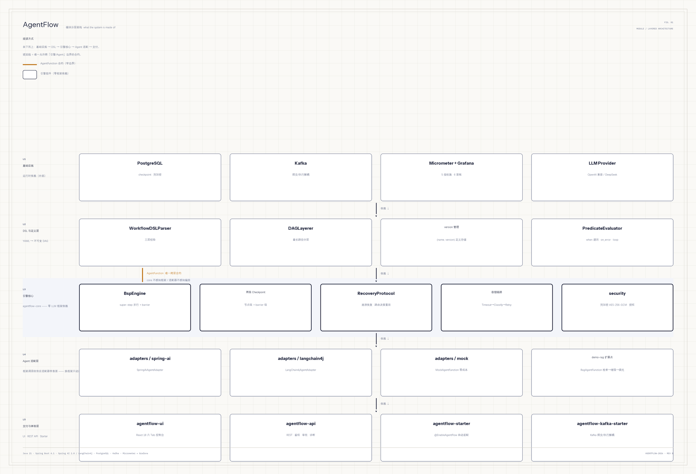
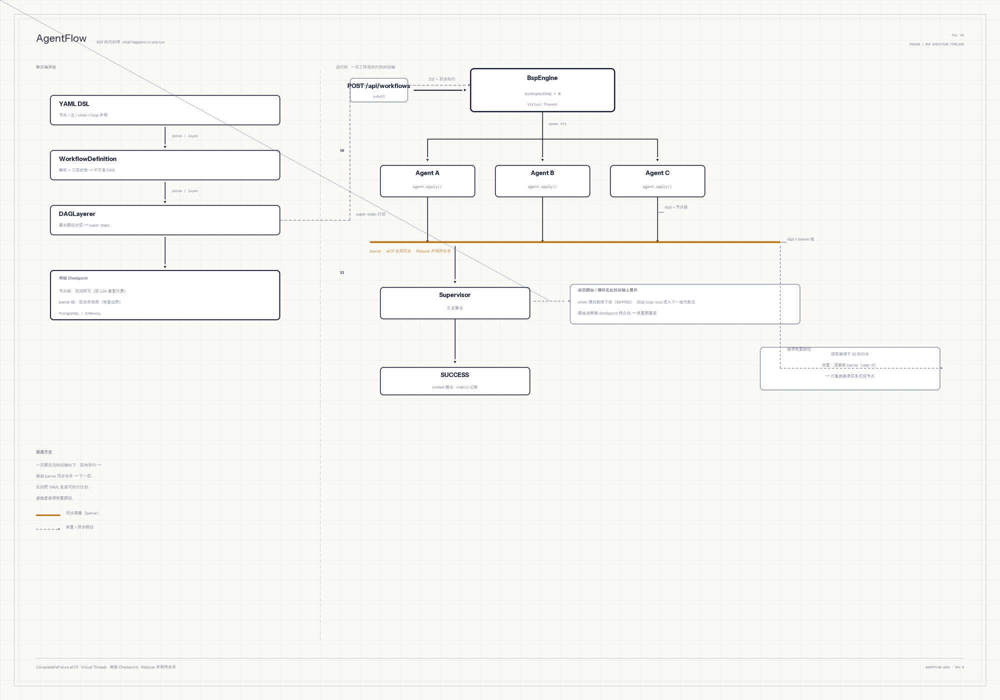

# AgentFlow

[](../../actions/workflows/ci.yml)
[](LICENSE)


**Java 原生轻量级 Multi-Agent 编排引擎**——YAML DSL 声明工作流，BSP（Bulk Synchronous Parallel）执行模型驱动，两级 Checkpoint 崩溃恢复，多 Agent 像微服务一样协作。

**能力演进主线**：静态 DAG → 条件路由（`when` 谓词 + `on_error` 兜底）→ 迭代收敛（有界循环/回边）→ Kafka 提交/执行解耦 → Human-in-the-Loop 审批 + RAG 扩展点。每一步演进都以「checkpoint 路由决策重放买回确定性」为不变量。

[English README](README.en.md) ｜ [架构文档](docs/design/) ｜ [用户指南](docs/USER_GUIDE.md) ｜ [排障手册](docs/TROUBLESHOOTING.md)

## 架构

**系统由什么组成**（模块分层，[大图](docs/design/agentflow-layers.png)）：



自下而上：基础设施（PostgreSQL / Kafka / Grafana / LLM Provider）→ DSL 解析与分层 → 引擎核心（BSP 执行 / 两级 Checkpoint / 恢复协议 / 容错链路 / 列加密）→ Agent 适配层（Spring AI / LangChain4j / Mock / RAG，经 `AgentFunction` 唯一合约接入，引擎零框架依赖）→ 交付层（REST API / React UI / Spring Boot Starter）。

**执行时发生什么**（BSP 时间轴，[大图](docs/design/agentflow-execution.png)）：



一个 super-step 内节点以 Virtual Threads 并行、互不可见（只读快照），barrier（琥珀线）处 `allOf` 全局同步后按声明序确定性合并 channel，两级 checkpoint 分别在节点完成时与 barrier 后落库——崩溃后只重跑崩溃层未完成节点，不重复计费。

## 快速开始（5 分钟，mock 模式，零 LLM 成本）

```bash
# 前置条件：JDK 21 + Maven 3.9+
git clone https://github.com/Yusheng727/AgentFlow.git
cd AgentFlow

# 1. 首次构建：安装引擎模块到本地仓库（后续改 demo 可跳过）
mvn -B -ntp install -DskipTests

# 2. 跑通供应商风险评估 Demo（mock 模式，零 LLM API 调用）
mvn -B -ntp -pl demo-supplier-risk spring-boot:run
```

输出（节选）：

```
=== 供应商风险评估结果 ===
{"riskLevel":"LOW","confidence":0.85,"evidence":["财务健康","合规1次违规","声誉良好"],"recommendation":"可合作，建议持续监控环保合规"}
```

**发生了什么？** 3 个专家 Agent（财务/合规/声誉）在 super-step 0 并行分析 → barrier 同步 → super-step 1 的 Supervisor 汇总评级。`MockAgentFunction` 从 YAML `mock_response` 读预设响应，验证 BSP 拓扑与 `${channel}` SpEL 引用，不发任何 LLM 请求。

**带 Web UI 跑**（六 Tab 控制台：看板/提交/定义/审批中心/轨迹/诊断，后端不可达时自动降级 mock 数据）：

```bash
mvn -B -ntp -pl demo-api spring-boot:run     # mock-only REST server（:8080，零 LLM/零 DB）
cd agentflow-ui && npm install && npm run dev  # http://localhost:5173（Vite proxy → :8080）
```

**试一下 Human-in-the-Loop**（demo-api 已注册审批门 Agent，提交含 `agent: approval` 节点的工作流即触发全链路：暂停 → `AWAITING_APPROVAL` → 审批 → 续跑）：

```bash
# 1. 提交带审批门的工作流 → 引擎暂停在 AWAITING_APPROVAL
curl -X POST localhost:8080/api/workflows \
  -H 'X-API-Key: demo-key-1234567890abcdef' -H 'Content-Type: application/json' \
  -d '{"workflowName":"hitl-demo","version":"1.0","inputs":{},
       "yamlContent":"agentflow: {version: \"1.0\"}\nnodes:\n  - {id: gate, agent: approval, prompt_template: \"付款审批\"}\n  - {id: after, agent: mock, mock_response: \"done\"}\nedges:\n  - {from: gate, to: after}\n"}'

# 2. 查待批（或直接用 UI 审批中心 Tab）
curl -s localhost:8080/api/approvals/pending -H 'X-API-Key: demo-key-1234567890abcdef'

# 3. 批准 → 引擎从审批层续跑至 SUCCESS
curl -X POST localhost:8080/api/workflows/<wfId>/approvals/<approvalId> \
  -H 'X-API-Key: demo-key-1234567890abcdef' -H 'Content-Type: application/json' \
  -d '{"decision":"APPROVE"}'
```

## 接入：三步用上引擎

**1. 加 Starter 依赖**（本地构建时 `mvn install` 后可引用）：

```xml
<dependency>
    <groupId>com.agentflow</groupId>
    <artifactId>agentflow-starter</artifactId>
    <version>1.0.0-SNAPSHOT</version>
</dependency>
```

**2. 写工作流 YAML**（`src/main/resources/workflows/my-first-workflow.yml`）：

```yaml
agentflow:
  version: "1.0"

nodes:
  - id: greet
    agent: greeter
    prompt_template: "你好 ${name}"
    mock_response: "你好 世界"
```

条件路由、迭代收敛、人工审批门也都在 DSL 层声明：

```yaml
edges:
  - { from: check, to: fast_track, when: "output.score > 0.8" }  # 条件边（首条命中，其余下游标 SKIPPED）
  - { from: critique, to: draft, when: "output.needs_revision", loop: true, max_iterations: 3 }  # 有界回边
nodes:
  - { id: pay_gate, agent: approval }   # 审批门：引擎暂停 → AWAITING_APPROVAL → 人工决策后续跑
```

**3. 跑起来**：

```java
@SpringBootApplication
@EnableAgentFlow
public class MyApp {
    public static void main(String[] args) {
        SpringApplication.run(MyApp.class, args);
    }

    @Bean
    String run(WorkflowDSLParser parser, BspEngine engine,
               @Qualifier("mockAgentResolver") Function<String, AgentFunction> resolver,
               CheckpointManager cp) throws Exception {
        var def = parser.parse(new ClassPathResource("workflows/my-first-workflow.yml").getInputStream());
        var result = engine.execute(def, Map.of("greeter", resolver.apply("greeter")),
                Map.of("name", "World"), cp, new ChannelReducer(), "wf-1");
        System.out.println(result.getValue("greet"));
        return "done";
    }
}
```

## 核心特性

**编排能力**

- **YAML DSL**：声明式工作流定义，SNAKE_CASE 命名，三层校验（Jackson 类型 → 语义 → DAG 完整性），`on_error` 与回边均纳入环校验
- **BSP 执行**：Virtual Threads 并行 + `CompletableFuture.allOf` barrier + 只读快照 + Reducer 声明序确定性合并——免锁并发，同输入同输出
- **条件路由**：边级 `when` 谓词（SpEL，hardened 求值上下文，禁 `T()`）+ `on_error: goto` 失败兜底；静态图仍预分层，每层只跑「可达」节点
- **迭代收敛**：回边 `loop: true` + `max_iterations` 有界循环；分层豁免回边 + 外层迭代轮次，checkpoint 按轮次持久化，恢复期重放路由决策

**可靠性**

- **两级 Checkpoint**：节点级（完成即写，防 LLM 重复计费）+ barrier 级（层合并快照，恢复边界），PostgreSQL / InMemory 双实现，写入幂等 + 限流
- **Recovery Protocol**：从最新 barrier 的下一步定位崩溃层，重放已认可输出、仅重跑未完成节点；动态路由/循环下崩溃，恢复期用「已走边」BFS 重算可达集——不复活 SKIPPED、不重复计费
- **容错链路**：Timeout → ErrorClassifier（Transient/Fatal）→ Retry（指数退避，仅 transient）→ ErrorHandler 三层，组合预算封顶

**人机协同（HITL）**

- **审批全链路**：节点抛 `ApprovalRequiredException` → 引擎在 barrier 暂停（兄弟输出快照落库，恢复时兄弟不重跑）→ `AWAITING_APPROVAL` → REST/UI 批准或拒绝 → 从审批层续跑，支持多级审批链；审批人身份由服务端从凭证推导，防伪造
- **审批中心 Web UI**：跨工作流待批聚合 + 看板「待审批」独立列；决策写操作无 mock fallback（写不假成功）

**安全**

- **鉴权与授权**：API Key（SHA-256 hash 存储）+ 所有权校验防 IDOR + per-caller 工具授权（config ∪ DB 运行时授权，grant/revoke 仅 admin）+ 提交前守卫（节点数/预估成本超限 422 拦截）
- **列级静态加密**：5 处 JSONB 敏感列统一走 `ColumnEncryptor` 边界——AES-256-GCM、`AESGCM:` 自描述前缀、legacy 明文兼容读、生产装配 `fromEnvStrict()` **fail-closed**（缺 key 拒绝启动）
- **凭证纪律**：LLM API key 只从环境变量读，禁止入 yml/代码；prompt/trace 默认脱敏（API key/手机号/身份证）

**可移植与扩展**

- **双框架适配器**：Spring AI 与 LangChain4j 各一个窄表面适配器——所有框架调用收敛在适配器内，第二适配器模块依赖清单不含第一框架（构建级可替换实证）；引擎/DSL/上游零改动
- **RAG 扩展点**：`demo-rag` 展示 `agent: rag` 节点「检索→增强→委托」，引擎直跑零改动（`RagEngineZeroChangeTest`）——扩展点靠契约成立，不靠改引擎
- **Mock LLM**：零成本本地调试，`${channel}` 占位符验证上下文传递，InMemory checkpoint

**生产化**

- **Kafka 异步分发**：提交与执行解耦（`agentflow.kafka.enabled` opt-in），消费者 `tryClaim` 原子幂等 + 终态跳过，at-least-once 投递下防双跑双计费
- **可观测**：Micrometer 5 指标族 + Grafana 6 面板（docker-compose profile 一键起 Prometheus + Grafana）+ ExecutionTrace 记每 token/耗时/路由决策
- **版本管理**：定义按 `(name, version)` 落库，执行中实例按旧 DAG 跑完，版本冲突检测 WARN 不阻断

## 运行模式

| 模式 | 配置 | Checkpoint | 适用 |
|:---|:---|:---|:---|
| **零基础设施（mock）** | `agentflow.mock.enabled=true`（默认） | InMemory（进程内） | 本地调试、开发验证 |
| **生产部署** | `agentflow.mock.enabled=false` + PG DataSource | PostgreSQL（持久化 + 列加密） | 生产环境 |
| **Kafka 异步分发** | `agentflow.kafka.enabled=true` | PostgreSQL | 提交/执行解耦，消费端幂等 |

## 生产部署清单

1. **配置 DataSource**（PostgreSQL）：`spring.datasource.url=jdbc:postgresql://...`（Flyway 迁移自动执行 V1–V8）
2. **配 LLM API Key**（环境变量，禁止入 yml）：`export SPRING_AI_OPENAI_API_KEY=sk-xxx`
3. **设加密 key（fail-closed，缺它拒绝启动）**：`export AGENTFLOW_ENCRYPTION_KEY=<base64(32B)>`——敏感列静态加密，写入即密文；存量明文行兼容读
4. **设 API Key 与 admin key**：`export AGENTFLOW_API_API_KEYS=<key>` + `export AGENTFLOW_ADMIN_API_KEYS=<admin-key>`（审批跨工作流视图 / 工具授权管理）
5. **关 mock 模式**：`agentflow.mock.enabled=false`
6. **（可选）Kafka 分发**：`agentflow.kafka.enabled=true` + `spring.kafka.bootstrap-servers=...`
7. **启动**：`docker compose --profile production up`

## FAQ

**Q: mock 模式和真实模式的区别？**

Mock 用 `MockAgentFunction`（YAML `mock_response` 预设响应），零 LLM 成本，InMemory checkpoint（重启丢失）。真实模式用 `SpringAiAgentAdapter` / `LangChain4jAgentAdapter` 调 LLM，PostgreSQL checkpoint（崩溃可恢复 + 列加密）。

**Q: BSP 是并行模型，怎么做条件分支和循环？**

条件分支用「可达性剪枝」而非放弃 BSP：静态图仍预分层，每层只跑可达节点，被切断的下游标 SKIPPED。循环用「分层豁免回边 + 外层迭代轮次」表达，checkpoint 按轮次持久化路由决策，恢复期重放。两条路都保住「barrier 同步 + 确定性合并」不变量。

**Q: 加密后存量明文数据怎么办？**

`AESGCM:` 前缀自描述——解密器见非前缀值原样返回，存量明文行升级后照常读。加密对新增写入生效（fail-closed 生产装配），不回填存量。key 轮换记 Deferred。

**Q: 怎么加新的 Agent？**

在 `NodeRegistry` 上注册 `AgentFunction`（引擎唯一合约——不感知框架）：

```java
@Bean
AgentFunction myAgent() {
    return input -> AgentOutput.of("hello");
}

@Bean
NodeRegistry registry(Map<String, AgentFunction> agents) {
    return new NodeRegistry(agents);
}
```

**Q: 怎么 debug？**

- Mock 模式零成本跑通全链路（`DryRunEngine` 还可不调引擎做拓扑/SpEL 干跑）
- `ExecutionTrace` 记录每步 token/耗时/路由决策（`GET /api/workflows/{id}/trace`），诊断 API 对 trace 做 5 类异常分析
- Grafana 面板看执行趋势 / Agent P99 / token 成本（`docker compose --profile observability up`）

**Q: 为什么不用现成的编排框架？**

AgentFlow 是从零实现的学习/展示型项目——目标不是填补生态空白（LangGraph4j / Spring AI Alibaba 已存在），而是把 BSP 引擎、两级 checkpoint、确定性恢复这些分布式系统问题的完整决策链做对做完。设计取舍见 [developer-notes/01-implementation-rationale](docs/developer-notes/01-implementation-rationale.md)。

## 仓库结构

```
AgentFlow/
├── agentflow-core/               # BSP 引擎 / DSL / Checkpoint / 容错 / 列加密（零框架依赖）
├── agentflow-adapters/spring-ai/ # SpringAiAgentAdapter + Mock LLM
├── agentflow-adapters/langchain4j/ # 第二适配器（构建级可替换实证）
├── agentflow-api/                # REST 端点 / 鉴权 / 审批 / 诊断 / 提交守卫
├── agentflow-kafka-starter/      # Kafka 提交/执行解耦（属性门控）
├── agentflow-starter/            # @EnableAgentFlow / AutoConfiguration
├── agentflow-ui/                 # React 18 六 Tab（看板/提交/定义/审批中心/轨迹/诊断）
├── demo-supplier-risk/           # 供应商风险评估（3 并行 → 汇总）
├── demo-contract-review/         # 合同审核串行链（上下文逐级传递）
├── demo-investment-analysis/    # 投资分析双层 fork-join
├── demo-conditional/             # 条件路由 + on_error 兜底
├── demo-loop/                    # 反思循环（draft → critique 回边 → finalize）
├── demo-rag/                     # RAG 检索增强（引擎零改动证明）
├── demo-api/                     # 可启动 REST server + UI 后端
├── docs/
│   ├── design/                   # 架构图（分层 + BSP 时序）与渲染脚本
│   ├── developer-notes/          # 实现取舍 / 踩坑记录 / review 发现
│   ├── business/                 # 业务流程文档（11 条流程）
│   ├── plans/agentflow/          # 设计决策件（KTD-1~9）
│   ├── USER_GUIDE.md / TROUBLESHOOTING.md / GRAFANA.md / ROADMAP.md
│   └── CONTRIBUTING 指引见根目录 CONTRIBUTING.md
└── docker-compose.yml            # mock / production / distributed / observability profiles
```

## 构建

```bash
mvn verify                          # 全量（622 Java 测试 + JaCoCo 80% 门禁 + 集成测试）
mvn -pl agentflow-core test         # 只跑 core 测试
cd agentflow-ui && npm test         # UI Vitest（34 例）
cd agentflow-ui && npm run build    # tsc strict 构建
```

## 技术栈

Java 21（Virtual Threads）/ Spring Boot 4.1 / Spring AI 2.0 / LangChain4j / PostgreSQL + Flyway / Kafka / Micrometer + Grafana / React 18 + Vite + TypeScript / Maven 多模块（13 模块）

## License

[MIT](LICENSE)
