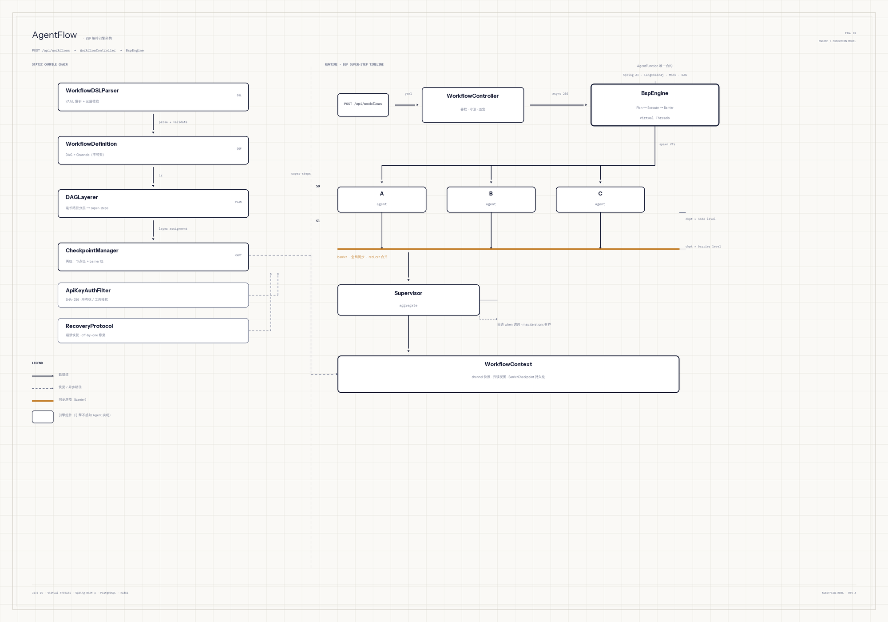

# AgentFlow — Java 原生轻量级 Multi-Agent 编排引擎

YAML DSL 声明工作流，BSP（Bulk Synchronous Parallel）执行模型驱动，多 Agent 微服务式协作。
**零基础设施 Mock 模式，5 分钟跑通第一个工作流。**

**能力演进主线**：静态 DAG → 条件路由（`when` 谓词 + `on_error` 兜底）→ 迭代收敛（有界循环/回边）→ Kafka 提交/执行解耦。每一步演进都以「checkpoint 重放买回确定性」为不变量。

## 架构



*左侧：静态编译链（YAML → 解析校验 → 不可变定义 → 最长路径分层 → 两级 Checkpoint）；右侧：BSP 运行时时间轴（super-step 0 三节点并行 → 同步屏障 → super-step 1 聚合），琥珀色即 barrier 语义。引擎不感知 Agent 实现：`AgentFunction` 是唯一合约，Spring AI / LangChain4j / Mock / RAG 委托都是它的实现。执行模型变化（条件路由、迭代循环）不改 Agent 层，Agent 层扩展（RAG、新框架适配器）不改引擎。*

## 快速开始（5 分钟，mock 模式，零 LLM 成本）

```bash
# 前置条件：JDK 21 + Maven 3.9+
git clone https://github.com/Yusheng727/AgentFlow.git
cd AgentFlow

# Mock 模式：一键跑通供应商风险评估 Demo
mvn -pl demo-supplier-risk spring-boot:run \
  -Dspring-boot.run.arguments="--agentflow.mock.enabled=true"
```

输出：

```
=== 供应商风险评估结果 ===
{"riskLevel":"LOW","confidence":0.85,"evidence":["财务健康","合规1次违规","声誉良好"],"recommendation":"可合作，建议持续监控环保合规"}
```

**发生了什么？** 3 个专家 Agent（财务/合规/声誉）并行分析 → Supervisor 汇总评级。BSP 引擎驱动，MockAgentFunction 从 YAML `mock_response` 读预设响应，零 LLM API 调用。

**带 Web UI 跑**（看板 + 提交 + 执行轨迹 + 诊断 + 审批中心，后端不可达时自动降级 mock 数据）：

```bash
mvn -pl demo-api spring-boot:run     # mock-only demo server（:8080，零 LLM/零 DB）
cd agentflow-ui && npm install && npm run dev   # http://localhost:5173（Vite proxy → :8080）
```

**试一下 Human-in-the-Loop**（demo-api 已注册审批门 Agent，提交含 `agent: approval` 节点的工作流即触发全链路）：

```bash
# 1. 提交带审批门的工作流 → 引擎暂停在 AWAITING_APPROVAL
curl -X POST localhost:8080/api/workflows \
  -H 'X-API-Key: demo-key-1234567890abcdef' -H 'Content-Type: application/json' \
  -d '{"workflowName":"hitl-demo","version":"1.0","inputs":{},
       "yamlContent":"agentflow: {version: \"1.0\"}\nnodes:\n  - {id: gate, agent: approval, prompt_template: \"付款审批\"}\n  - {id: after, agent: mock, mock_response: \"done\"}\nedges:\n  - {from: gate, to: after}\n"}'

# 2. 查待批（或直接用 UI 审批中心 Tab）
curl -s localhost:8080/api/approvals/pending -H 'X-API-Key: demo-key-1234567890abcdef'

# 3. 批准 → 引擎从审批层续跑至 SUCCESS
curl -X POST localhost:8080/api/workflows/<wfId>/approvals/<approvalId> \
  -H 'X-API-Key: demo-key-1234567890abcdef' -H 'Content-Type: application/json' \
  -d '{"decision":"APPROVE"}'
```

## Tutorial：三步接入

### 1. 加 Starter 依赖

```xml
<dependency>
    <groupId>com.agentflow</groupId>
    <artifactId>agentflow-starter</artifactId>
    <version>1.0.0</version>
</dependency>
```

### 2. 写工作流 YAML

`src/main/resources/workflows/my-first-workflow.yml`：

```yaml
agentflow:
  version: "1.0"

nodes:
  - id: greet
    agent: greeter
    prompt_template: "你好 ${name}"
    mock_response: "你好 世界"
```

条件路由、迭代收敛、人工审批门也都在 DSL 层声明：

```yaml
edges:
  - { from: check, to: fast_track, when: "output.score > 0.8" }  # 条件边（首条命中）
  - { from: critique, to: draft, when: "output.needs_revision", loop: true, max_iterations: 3 }  # 有界回边
nodes:
  - { id: pay_gate, agent: approval }   # 审批门：引擎暂停 → AWAITING_APPROVAL → 人工决策后续跑
```

### 3. 跑起来

```java
@SpringBootApplication
@EnableAgentFlow
public class MyApp {
    public static void main(String[] args) {
        SpringApplication.run(MyApp.class, args);
    }

    @Bean
    String run(WorkflowDSLParser parser, BspEngine engine,
               @Qualifier("mockAgentResolver") Function<String, AgentFunction> resolver,
               CheckpointManager cp) throws Exception {
        var def = parser.parse(new ClassPathResource("workflows/my-first-workflow.yml").getInputStream());
        var result = engine.execute(def, Map.of("greeter", resolver.apply("greeter")),
                Map.of("name", "World"), cp, new ChannelReducer(), "wf-1");
        System.out.println(result.getValue("greet"));
        return "done";
    }
}
```

## 接入模式

| 模式 | 配置 | Checkpoint | 适用 |
|:---|:---|:---|:---|
| **零基础设施（mock）** | `agentflow.mock.enabled=true` | InMemory（进程内） | 本地调试、开发验证 |
| **生产部署** | `agentflow.mock.enabled=false` + PG DataSource | PostgreSQL（持久化 + 列加密） | 生产环境 |
| **Kafka 异步分发** | `agentflow.kafka.enabled=true` | PostgreSQL | 提交/执行解耦，消费者幂等（终态跳过防重复计费） |

## 核心特性

**编排能力**

- **YAML DSL**：声明式工作流定义，SNAKE_CASE 命名，Jackson 解析，三层校验
- **BSP 执行**：Virtual Threads 并行 + CompletableFuture.allOf barrier + 只读快照 + Reducer 确定性合并
- **条件路由**：边级 `when` 谓词（SpEL，hardened 求值上下文）+ `on_error: goto` 兜底；静态图仍预分层，每层只跑「可达」节点，被切断的下游标 SKIPPED
- **迭代收敛**：回边 `loop: true` + `max_iterations` 有界循环；BSP 语义保留——分层豁免回边 + barrier 不变，checkpoint 按轮次重放买回确定性

**可靠性**

- **两级 Checkpoint**：节点级（防 LLM 重复计费）+ barrier 级（崩溃恢复），PostgreSQL / InMemory 双实现
- **Recovery Protocol**：off-by-one 修复（查崩溃层本身），replayOutputs 重放未进 barrier 的输出，stray COMPLETED 防护；恢复期用「已走边」BFS 重算可达集——动态路由/循环下崩溃，恢复不复活 SKIPPED、不重复计费
- **容错**：Timeout → ErrorClassifier（Transient/Fatal）→ Retry（指数退避 1s→2s→4s）→ ErrorHandler 三层链路

**人机协同（HITL）**

- **审批全链路**：节点抛 `ApprovalRequiredException` → 引擎暂停（兄弟输出快照落库防重跑）→ `AWAITING_APPROVAL` → REST/Web UI 批准或拒绝 → 从审批层续跑，支持多级审批链
- **审批中心 Web UI**：React 第 6 Tab 跨工作流待批聚合 + 看板「待审批」独立列；决策写操作**无 mock fallback**（写不假成功），可见域按创建者/admin 门控

**安全**

- **鉴权与授权**：ApiKeyAuthFilter（SHA-256）+ IDOR 防护 + per-caller 工具授权（config ∪ DB 运行时授权，admin 管理 API）+ 凭证只从 env 读
- **列级静态加密（系统性方案）**：5 处 JSONB 敏感列（节点输出 / channel / 审批载荷×2 / 路由决策 / 工作流定义）统一走 `ColumnEncryptor` 边界——AES-256-GCM、`AESGCM:` 自描述前缀、legacy 明文兼容读、存量行不回填；生产装配 `fromEnvStrict()` **fail-closed**（缺 key 拒绝启动，checkpoint 与定义存储双 strict，杜绝「加密了一半」）

**可移植与扩展**

- **双框架适配器**：Spring AI 与 LangChain4j 各一个窄表面适配器——所有框架调用收敛在适配器内，框架升级只碰适配器（依赖面互不交叉，构建级可替换实证）
- **RAG Agent 扩展点**：`demo-rag` 展示 `agent: rag` 节点「检索→增强→委托」，引擎层零改动（`RagEngineZeroChangeTest` 证明扩展点成立）
- **Mock LLM**：零成本本地调试，`${channel}` 占位符验证上下文传递

**生产化**

- **Kafka 异步分发**：提交与执行解耦（producer/consumer 同应用单 JVM 语义起步），消费者 `tryClaim` 原子幂等 + 终态跳过，防重复投递双跑双计费
- **可观测**：Micrometer 5 指标族 + Grafana 6 面板（docker-compose profile 一键起 Prometheus + Grafana 自动装配）+ ExecutionTrace 每 token/耗时/路由决策
- **版本管理**：定义按 `(name, version)` 落库，执行中实例按旧 DAG 跑完，版本冲突检测 WARN 不阻断

## 生产部署清单

1. **配置 DataSource**（PostgreSQL）：`spring.datasource.url=jdbc:postgresql://...`
2. **配 LLM API Key**（环境变量，禁止入 yml）：`export SPRING_AI_OPENAI_API_KEY=sk-xxx`
3. **设加密 key（fail-closed，缺它拒绝启动）**：`export AGENTFLOW_ENCRYPTION_KEY=<base64(32B)>`——敏感列静态加密，写入即密文；存量明文行兼容读
4. **设 API Key 与 admin key**：`export AGENTFLOW_API_API_KEYS=<key>`（注意宽松绑定双前缀）+ `export AGENTFLOW_ADMIN_API_KEYS=<admin-key>`（审批跨工作流视图 / 工具授权管理）
5. **关 mock 模式**：`agentflow.mock.enabled=false`
6. **（可选）Kafka 分发**：`agentflow.kafka.enabled=true` + `spring.kafka.bootstrap-servers=...`
7. **启动**：`docker compose --profile production up`

## FAQ

**Q: mock 模式和真实模式的区别？**

Mock 模式用 `MockAgentFunction`（从 YAML `mock_response` 读），零 LLM 成本，InMemory checkpoint（重启丢失）。真实模式用 `SpringAiAgentAdapter`（ChatClient 调 LLM）或 `LangChain4jAgentAdapter`，PostgreSQL checkpoint（崩溃可恢复 + 列加密）。

**Q: BSP 是并行模型，怎么做条件分支和循环？**

条件分支用「可达性剪枝」而非放弃 BSP：静态图仍预分层，每层只跑可达节点。循环用「分层豁免回边 + 外层迭代轮次」表达，checkpoint 按轮次持久化路由决策，恢复期重放。两条路都保住「barrier 同步 + 确定性合并」不变量。

**Q: 加密后存量明文数据怎么办？**

`AESGCM:` 前缀自描述——解密器见非前缀值原样返回，存量明文行升级后照常读。加密对**新增写入**生效（fail-closed 生产装配），不回填存量。key 轮换（多版本 key 体系）记 Deferred。

**Q: 怎么加新的 Agent？**

在 `NodeRegistry` 上注册 `AgentFunction` Bean：

```java
@Bean
AgentFunction myAgent() {
    return input -> AgentOutput.of("hello");
}

@Bean
NodeRegistry registry(Map<String, AgentFunction> agents) {
    return new NodeRegistry(agents);
}
```

**Q: 为什么从零复现（不用 LangGraph4j/Spring AI Alibaba）？**

AgentFlow 定位是简历项目——展示后端工程深度（BSP 引擎从零实现、两级 checkpoint、多 agent code review），不填补生态空白。见我 [developer-notes](./docs/developer-notes/01-implementation-rationale.md)。

**Q: 怎么 debug？**

- Mock 模式零成本跑通全链路
- 加 `spring.ai.openai.api-key` 切换到真实 Agent 调 LLM
- `ExecutionTrace` 记录每步 token/耗时/状态，诊断 API 对 trace 做 5 类异常分析

## 仓库结构

```
AgentFlow/
├── agentflow-core/               # BSP 引擎 / DSL / Checkpoint / 容错 / 安全 / 版本管理
├── agentflow-adapters/spring-ai/ # Spring AI 适配器 / Mock LLM
├── agentflow-adapters/langchain4j/ # LangChain4j 第二适配器（可移植性实证）
├── agentflow-api/                # REST 端点 / 鉴权 / 审批 / 诊断
├── agentflow-kafka-starter/      # Kafka 提交/执行解耦（属性门控）
├── agentflow-starter/            # @EnableAgentFlow / AutoConfiguration
├── agentflow-ui/                 # React 18 六 Tab（看板/提交/定义/审批中心/轨迹/诊断）
├── demo-supplier-risk/           # 供应商风险评估（3 并行 → 汇总）
├── demo-conditional/             # 条件路由 + on_error 兜底
├── demo-loop/                    # 反思循环（draft → critique 回边 → finalize）
├── demo-rag/                     # RAG 检索增强（KTD-6 引擎零改动证明）
├── demo-api/                     # 可启动 REST server + UI 后端
├── docker-compose.yml            # mock / production / distributed / observability profiles
└── docs/
    ├── plans/agentflow/          # 计划文档（8 分片）
    ├── developer-notes/          # 开发笔记（面试弹药 + 实现决策 + review 记录）
    └── TROUBLESHOOTING.md
```

## 技术栈

Java 21（Virtual Threads）/ Spring Boot 4.1 / Spring AI 2.0 / LangChain4j / PostgreSQL / Flyway / Kafka / Micrometer + Grafana / React 18 + Vite + TypeScript / Jackson 3 / Maven 多模块（14 模块）

## 构建

```bash
mvn verify                          # 全量测试（570+）+ JaCoCo 80% 门禁
mvn -pl agentflow-core test         # 只跑 core 测试
cd agentflow-ui && npm test         # UI Vitest（34 例）
cd agentflow-ui && npm run build    # tsc strict 构建
```
