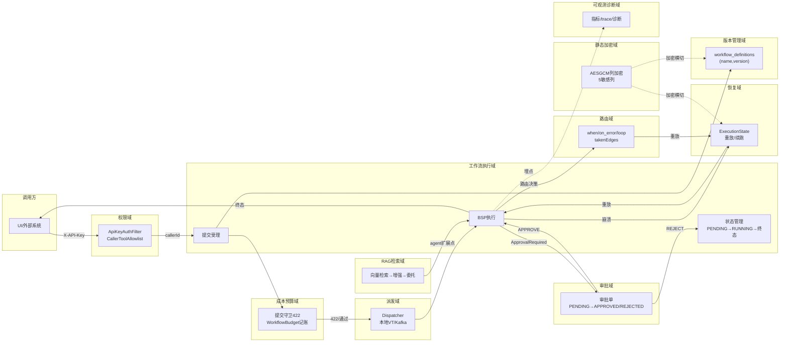

# 领域地图

> 更新时间：2026-08-26（补 7 个支撑域，共 11 域全覆盖）

## 核心业务域

### 工作流执行域（核心）
- 子域：提交受理、BSP 执行、状态管理、检查点持久化
- 关键实体：WorkflowDefinition、WorkflowExecutionRecord（workflow_executions）、NodeOutputStore（workflow_node_outputs）、BarrierCheckpoint（workflow_checkpoints）、WorkflowStatus（PENDING/RUNNING/AWAITING_APPROVAL/SUCCESS/FAILED）
- 服务/模块归属：agentflow-core（BspEngine/RecoveryProtocol/CheckpointManager）、agentflow-api（WorkflowController/WorkflowExecutionService）
- 上游：调用方（UI/外部系统） ｜ 下游：审批域、恢复域、可观测域
- 文档：flows/workflow-lifecycle.md

### 人工审批域（HITL）
- 子域：审批暂停、审批单管理、决策恢复、审批中心聚合
- 关键实体：ApprovalRequest（workflow_approvals：PENDING/APPROVED/REJECTED）、ApprovalDecision（APPROVE/REJECT）、contextSnapshot（暂停点快照）
- 服务/模块归属：agentflow-core（ApprovalGateAgent/审批 SPI）、agentflow-api（ApprovalController/ApprovalCenterController）、agentflow-ui（审批中心 Tab）
- 上游：工作流执行域（审批门节点触发） ｜ 下游：工作流执行域（续跑终态）
- 文档：flows/hitl-approval.md

### 崩溃恢复域
- 子域：崩溃定位、输出重放、可达集重算、手动重试
- 关键实体：ExecutionState（nextSuperStep/completedNodeIds/replayOutputs/round）、routing_decisions（已走边）、NodeStatus（IN_PROGRESS/COMPLETED/FAILED）
- 服务/模块归属：agentflow-core（RecoveryProtocol/BspEngine.recoverAndExecute）
- 上游：工作流执行域（崩溃/abort） ｜ 下游：工作流执行域（续跑终态）
- 文档：flows/crash-recovery-retry.md

### 动态路由域（v2）
- 子域：条件分支（when）、错误兜底（on_error）、循环回边（loop）
- 关键实体：EdgeDefinition（when/loop/max_iterations）、takenEdges（已走边）、SKIPPED/FALLBACK 衍生态、round（迭代轮次）
- 服务/模块归属：agentflow-core（PredicateEvaluator/SemanticValidator/BspEngine 路由）
- 上游：工作流执行域 ｜ 下游：崩溃恢复域（路由决策重放）
- 文档：flows/dynamic-routing-and-loops.md

### 派发域（执行解耦）
- 子域：本地虚拟线程派发、Kafka 异步分发、消费幂等
- 关键实体：WorkflowDispatchRequest、Topic `agentflow.workflow.executions`、tryClaim（原子认领）
- 服务/模块归属：agentflow-api（Dispatcher 抽象）、agentflow-kafka-starter
- 上游：工作流执行域（提交） ｜ 下游：工作流执行域（run 语义）
- 文档：flows/kafka-async-dispatch.md（+ workflow-lifecycle.md 幂等面）

### 权限域（准入与授权）
- 子域：API Key 鉴权、工具授权判定（config ∪ DB）、授权管理（admin-only）、所有权校验
- 关键实体：callerId（Key 哈希）、caller_tool_grants、AdminApiKeys、tool 通配 `*`
- 服务/模块归属：agentflow-api/security
- 上游：全部 HTTP 入口 ｜ 下游：工作流执行域（提交拦截）、审批域（admin 复用）
- 文档：flows/tool-authorization.md

### 版本管理域
- 子域：定义快照存取、冲突检测
- 关键实体：workflow_definitions（(name, version) 主键）、VersionConflict
- 服务/模块归属：agentflow-core/version
- 上游：工作流执行域（提交记录） ｜ 下游：执行/恢复/retry（按版本取定义）
- 文档：flows/workflow-versioning.md

### 成本预算域
- 子域：提交守卫（硬拦截）、运行记账（软告警）、单价表
- 关键实体：WorkflowBudget（edge-triggered）、WorkflowSubmissionGuard、CostCalculator
- 服务/模块归属：api/security + core/observability
- 上游：提交（守卫）、执行（记账） ｜ 下游：可观测域（指标）
- 文档：flows/cost-budget-control.md

### 可观测诊断域
- 子域：指标族、trace 穿线、异常诊断、干跑
- 关键实体：AgentFlowMetrics（6 指标族）、ExecutionTrace/NodeTrace、ExecutionTraceRegistry、DiagnosisReport
- 服务/模块归属：core/observability + core/debug + api（Controller/Service）
- 上游：全部执行路径（埋点） ｜ 下游：Grafana、UI 轨迹/诊断 Tab
- 文档：flows/observability-diagnosis.md

### 静态加密域（横切）
- 子域：列加密器、密文格式、装配纪律
- 关键实体：ColumnEncryptor 家族、`AESGCM:iv:ct` 密文、AGENTFLOW_ENCRYPTION_KEY、5 处敏感列
- 服务/模块归属：core/security + starter（双 strict 装配）
- 上游：checkpoint/定义/审批全部写路径 ｜ 下游：读路径（解密+legacy 兼容）
- 文档：flows/column-encryption.md

### RAG 检索域（demo）
- 子域：向量检索、prompt 增强、委托执行
- 关键实体：InMemoryVectorStore、RagAgentFunction、NodeRegistry 扩展点
- 服务/模块归属：demo-rag
- 上游：工作流执行域（agent: rag 解析） ｜ 下游：LLM 适配器（delegate）
- 文档：flows/rag-retrieval.md

## 未明确归属的模块

| 模块 | 观察到的行为 | 疑似归属 | 待确认 |
|---|---|---|---|
| agentflow-ui（React 5+1 Tab） | 看板/提交/定义/轨迹/诊断/审批中心 | 各业务域的展示层 | 否（展示层，非业务规则载体） |
| demo-* 6 个演示模块 | 端到端演示拓扑（串行/fork-join/条件/循环/RAG） | 工作流执行域的消费者 | 否（rag 单列见 RAG 检索域） |
| com.agentflow.prompt（SpEL/谓词） | prompt 模板解析 + when 谓词求值（沙箱） | 工作流执行域/路由域共用件 | 否（已随路由文档覆盖） |

## 领域关系图

