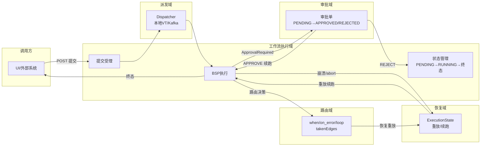

# 领域地图

## 核心业务域

### 工作流执行域（核心）
- 子域：提交受理、BSP 执行、状态管理、检查点持久化
- 关键实体：WorkflowDefinition、WorkflowExecutionRecord（workflow_executions）、NodeOutputStore（workflow_node_outputs）、BarrierCheckpoint（workflow_checkpoints）、WorkflowStatus（PENDING/RUNNING/AWAITING_APPROVAL/SUCCESS/FAILED）
- 服务/模块归属：agentflow-core（BspEngine/RecoveryProtocol/CheckpointManager）、agentflow-api（WorkflowController/WorkflowExecutionService）
- 上游：调用方（UI/外部系统） ｜ 下游：审批域、恢复域、可观测域
- 文档：flows/workflow-lifecycle.md

### 人工审批域（HITL）
- 子域：审批暂停、审批单管理、决策恢复、审批中心聚合
- 关键实体：ApprovalRequest（workflow_approvals：PENDING/APPROVED/REJECTED）、ApprovalDecision（APPROVE/REJECT）、contextSnapshot（暂停点快照）
- 服务/模块归属：agentflow-core（ApprovalGateAgent/审批 SPI）、agentflow-api（ApprovalController/ApprovalCenterController）、agentflow-ui（审批中心 Tab）
- 上游：工作流执行域（审批门节点触发） ｜ 下游：工作流执行域（续跑终态）
- 文档：flows/hitl-approval.md

### 崩溃恢复域
- 子域：崩溃定位、输出重放、可达集重算、手动重试
- 关键实体：ExecutionState（nextSuperStep/completedNodeIds/replayOutputs/round）、routing_decisions（已走边）、NodeStatus（IN_PROGRESS/COMPLETED/FAILED）
- 服务/模块归属：agentflow-core（RecoveryProtocol/BspEngine.recoverAndExecute）
- 上游：工作流执行域（崩溃/abort） ｜ 下游：工作流执行域（续跑终态）
- 文档：flows/crash-recovery-retry.md

### 动态路由域（v2）
- 子域：条件分支（when）、错误兜底（on_error）、循环回边（loop）
- 关键实体：EdgeDefinition（when/loop/max_iterations）、takenEdges（已走边）、SKIPPED/FALLBACK 衍生态、round（迭代轮次）
- 服务/模块归属：agentflow-core（PredicateEvaluator/SemanticValidator/BspEngine 路由）
- 上游：工作流执行域 ｜ 下游：崩溃恢复域（路由决策重放）
- 文档：flows/dynamic-routing-and-loops.md

### 派发域（执行解耦）
- 子域：本地虚拟线程派发、Kafka 异步分发、消费幂等
- 关键实体：WorkflowDispatchRequest、Topic `agentflow.workflow.executions`、tryClaim（原子认领）
- 服务/模块归属：agentflow-api（Dispatcher 抽象）、agentflow-kafka-starter
- 上游：工作流执行域（提交） ｜ 下游：工作流执行域（run 语义）
- 文档：flows/workflow-lifecycle.md（幂等面）＋候选（独立文档待排期）

## 未明确归属的模块

| 模块 | 观察到的行为 | 疑似归属 | 待确认 |
|---|---|---|---|
| agentflow-ui（React 5+1 Tab） | 看板/提交/定义/轨迹/诊断/审批中心 | 各业务域的展示层 | 否（展示层，非业务规则载体） |
| demo-* 6 个演示模块 | 端到端演示拓扑（串行/fork-join/条件/循环/RAG） | 工作流执行域的消费者 | 否 |
| com.agentflow.security（列加密） | 5 处 JSONB 敏感列 AES-256-GCM 静态加密 | 横切安全（存储层） | 是（独立业务能力候选，未文档化） |
| com.agentflow.version（版本管理） | 定义按 (name, version) 存储、冲突检测 | 工作流执行域子域 | 是（影响恢复/retry 语义，未独立文档化） |
| com.agentflow.observability | 5 类指标 + trace + 预算记账 | 可观测支撑域 | 否（支撑性，候选低优先级） |

## 领域关系图

