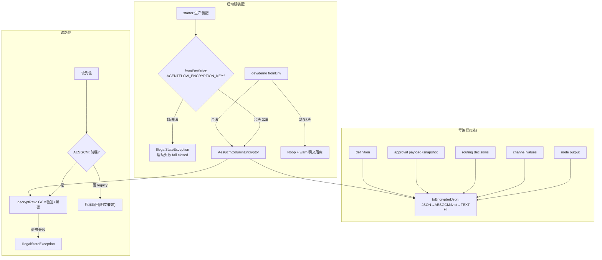

# 敏感数据列加密（静态加密 R22）

> 生成时间：2026-08-26 ｜ 代码版本：main@2a37d6b ｜ 可信度概览：已确认 15 条 / 合理推断 1 条 / 待确认 1 条

## 1. 业务目标

checkpoint 存储里躺着业务敏感数据：LLM 的完整输出（node output）、channel 全局上下文（barrier 快照）、路由决策、工作流定义（prompt 业务话术）、审批载荷与上下文快照。数据库文件/备份/快照泄露时，这些明文即业务泄露。本能力对**5 处敏感列**做应用层 AES-256-GCM 静态加密——密文落库、边界加解密（存前 encrypt/读后 decrypt），DB 层零改动感知。

扩列判据（工程口径，代码佐证）：**列内含业务敏感数据**——node output（LLM 输出全文）、channel values（上下文）、approval payload/snapshot（待审载荷+暂停点快照）、routing decisions（含输出推断的路由）、workflow definition（prompt 话术）。

生产纪律：**fail-closed**——生产装配缺 key 直接启动失败，拒绝明文落库；开发宽松（Noop + warn 不阻塞）。

## 2. 范围与边界

- 包含：加密器家族（ColumnEncryptor/Noop/AesGcm/工厂）、密文格式与 legacy 兼容、5 处敏感列读写路径、双 strict 装配（checkpoint+定义存储）、key 来源纪律、损坏行容错
- 不包含：审批域对损坏行的消费语义（见 [hitl-approval.md](hitl-approval.md) R15）、key 轮换（Deferred，见待确认）
- 上游流程：工作流执行/审批/路由/版本管理（所有 checkpoint 写入方）
- 下游流程：崩溃恢复（解密读）、审批中心（解密读+容错）
- 涉及服务/模块：agentflow-core/security（加密器家族）、agentflow-core/engine/checkpoint（PostgresCheckpointManager）、agentflow-core/version（PostgresWorkflowDefinitionStore）、agentflow-starter（生产装配）

## 3. 触发方式

| 类型 | 触发点 | 调用方/来源 | 证据 |
|---|---|---|---|
| 运行时事件 | 5 个写路径的 toEncryptedJson | PostgresCheckpointManager（4 处）+ PostgresWorkflowDefinitionStore（1 处） | CodeGraph: toEncryptedJson 恰 5 生产调用点 |
| 运行时事件 | 对应读路径 decryptRaw | 同上类 | PostgresCheckpointManager#approvalRowMapper 等 |
| 启动期 | starter 装配 fromEnvStrict() ×2 | AgentFlowAutoConfiguration | AgentFlowAutoConfiguration.java:102/114 |

## 4. 前置条件与输入

| 条件/输入 | 说明 | 校验位置 | 证据 |
|---|---|---|---|
| AGENTFLOW_ENCRYPTION_KEY | base64(32B) AES-256 key，只从 env 读（禁硬编码/yml） | ColumnEncryptors#build | ColumnEncryptors.java:22/40-59 |
| key 长度恰 32 字节 | 解码后非 32B → IllegalArgumentException | AesGcmColumnEncryptor 构造器 | AesGcmColumnEncryptor.java:44-46 |
| 列型 TEXT | 密文非合法 JSON（V7/V8 迁移 JSONB→TEXT） | Flyway | V7:42-43 + V8:7-8 |

## 5. 主流程

1. **启动装配（生产 fail-closed）**。
   - starter：PostgresCheckpointManager(dataSource, fromEnvStrict()) + PostgresWorkflowDefinitionStore(dataSource, fromEnvStrict())——**双 strict 杜绝「checkpoint 加密了、定义还明文」**。缺/非法 key → IllegalStateException 启动失败（错误消息含 export 指引）。
   - 证据：AgentFlowAutoConfiguration.java:100-114。

2. **开发宽松模式**。
   - fromEnv()（dev/demo）：缺/非法 key → NoopColumnEncryptor + warn（明文落库不阻塞开发）。
   - 证据：ColumnEncryptors#build:41-49。

3. **写路径（5 处 toEncryptedJson）**。
   - saveNodeOutput（node output）、saveBarrier（channel values）、saveRoutingDecisions（routing decisions）、saveApprovalRequest（payload+snapshot 两列）、PostgresWorkflowDefinitionStore.save（definition）——对象序列化为 JSON 后 encrypt 为 `AESGCM:<iv>:<ct>` 字符串落 TEXT 列。
   - 证据：CodeGraph `callers toEncryptedJson` 5 点 + PostgresCheckpointManager:157/189/217/321。

4. **读路径（decryptRaw + 前缀识别）**。
   - 读列值 → `AESGCM:` 前缀 → 解密；无前缀 → **legacy 明文行原样返回**（升级前落库的行不 break——KTD-E1 渐进迁移）。解密失败（篡改/key 不匹配）→ IllegalStateException（GCM 认证标签校验）。
   - 证据：AesGcmColumnEncryptor#decrypt:66-86。

5. **密文格式与安全属性**。
   - `AESGCM:<ivBase64>:<ctBase64>`；12B 随机 IV 每 encrypt 重生成（同明文两次密文不同）；GCM 128-bit 认证标签（篡改可检测）；SecretKeySpec 显式派生（杜绝工厂间派生漂移）。
   - 证据：AesGcmColumnEncryptor:18-29 注释。

6. **路由决策写路径去 JSONB cast**。
   - V8 迁移后 INSERT 去 `?::jsonb`（密文非合法 JSON 不能 cast）——列型 TEXT 直存。
   - 证据：CLAUDE.md R22-U1 记录。

7. **损坏行容错（消费侧）**。
   - 审批中心聚合：单工作流待批行解密损坏（key 轮换后）→ 跳过该工作流记 warn，端点部分可用（见 hitl-approval.md R15）。
   - 证据：ApprovalCenterController:76-84。

## 6. 流程图

## 7. 关键业务规则

| 编号 | 规则 | 触发条件 | 处理结果 | 影响范围 | 证据 | 可信度 |
|---|---|---|---|---|---|---|
| R1 | 生产 fail-closed：缺/非法 key 启动失败 | starter 双 strict 装配 | 拒绝明文落库（错误消息含 export 指引） | 生产纪律 | AgentFlowAutoConfiguration:102/114 + ColumnEncryptors#build | 已确认 |
| R2 | 双 strict：checkpoint 与定义存储同时强制 | starter 装配 | 无「半吊子加密」状态 | 完整性 | :107 注释 | 已确认 |
| R3 | dev 宽松：Noop + warn 不阻塞 | fromEnv 缺 key | 开发体验优先（明文落库有 warn 可查） | 开发体验 | ColumnEncryptors:47-48 | 已确认 |
| R4 | key 只从 env 读 | 任何装配路径 | 禁硬编码/yml（对齐 CredentialManager 纪律） | 密钥卫生 | ColumnEncryptors:9 注释 | 已确认 |
| R5 | 密文自描述前缀 + legacy 明文兼容 | decrypt 无前缀值 | 原样返回——升级窗口期新旧行共存不 break | 迁移安全 | AesGcmColumnEncryptor:67-70 | 已确认 |
| R6 | GCM 认证：篡改可检测 | 解密 | 异常（不静默返回错数据） | 完整性 | decrypt:83-85 | 已确认 |
| R7 | 每 encrypt 新随机 IV | 加密 | 同明文密文不同（防模式分析） | 密码学 | encrypt:53-54 | 已确认 |
| R8 | key 32B 强校验 | 构造 | 非 32B 拒绝（防弱 key/错格式静默） | 密钥卫生 | 构造器:44-46 | 已确认 |
| R9 | 扩列判据=列内业务敏感数据 | 5 处列的选择 | node output/channel/payload+snapshot/routing/definition（其余列如 status/timestamp 不加密） | 范围 | CLAUDE.md R22 扩列口径 + CodeGraph 5 写点 | 已确认 |
| R10 | 边界加解密（DB 零感知） | 存取路径 | manager 内 encrypt/decrypt，SQL 与列型不涉密码学 | 架构 | PostgresCheckpointManager 读写下加密 | 已确认 |
| R11 | H2 测试走读路径 + 真 PG 验密文 | 测试策略 | H2 不支持 PG 的 upsert/加密写路径组合——写路径密文证据归真 PG IT | 测试边界 | CLAUDE.md R22-U1 记录 | 已确认 |
| R12 | 损坏行消费容错（聚合端点） | key 轮换后旧行解密失败 | 跳过+warn 部分可用（防单坏行弄瞎聚合） | 可用性 | ApprovalCenterController:76-84 | 已确认 |
| R13 | PG store 无加密器构造补 warn | 直接 new 未注入加密器 | 提示可能明文落库 | 防呆 | CLAUDE.md R22-U6 ⑦ | 已确认 |
| R14 | 列型必须 TEXT（密文非合法 JSON） | V7/V8 迁移 | JSONB→TEXT USING ::text 显式转换 | schema | V7:42-43 + V8:7-8 | 已确认 |
| R15 | 写路径 always-on 测试（不依赖 PG） | FakeJdbc+AesGcm 测试 | 写路径加密有无 PG 都可回归 | 测试 | CLAUDE.md R22-U6 ⑤ | 已确认 |
| R16 | InMemory 实现不加密 | 内存 checkpoint | 数据不落盘，加密无意义（进程内存即边界） | 边界 | InMemoryCheckpointManager 无加密器字段 | 合理推断（按架构推断；内存态另有进程边界保护语义） |

## 8. 状态与生命周期

无状态机；列值有两种**形态**（非状态流转）：

| 形态 | 产生时机 | 消费行为 | 证据 |
|---|---|---|---|
| 明文（legacy） | 加密启用前/Noop 模式落库 | decrypt 无前缀原样返回 | R5 |
| `AESGCM:iv:ct` 密文 | 加密器启用后写入 | 前缀识别 → GCM 验签解密 | R6 |

（无 mermaid 状态图——形态是值属性非状态机。）

## 9. 数据变更与一致性

| 数据对象 | 操作 | 关键字段 | 事务/一致性策略 | 证据 |
|---|---|---|---|---|
| workflow_node_outputs.output | 写加密/读解密 | TEXT 密文 | 边界转换；COMPLETED 不可覆盖语义不变（密文行同样不覆盖） | PostgresCheckpointManager:157 |
| workflow_checkpoints.channel_values | 同上 | TEXT 密文 | 同上 | :189 |
| workflow_routing_decisions.decisions | 同上（INSERT 去 ::jsonb） | TEXT 密文 | 同上 | :217 + V8 |
| workflow_approvals.request_payload/context_snapshot | 同上（两列） | TEXT 密文 | 同上 | :321 + V7 |
| workflow_definitions.definition | 同上 | TEXT 密文 | 同上 | PostgresWorkflowDefinitionStore:69 + V8 |

一致性注：加密不改变唯一约束/幂等语义（约束在 workflow/round/step/node 维度，密文只是 value 形态）。

## 10. 异常、重试与补偿

| 场景 | 触发条件 | 系统行为 | 重试/补偿/人工处理 | 证据 | 可信度 |
|---|---|---|---|---|---|
| 生产缺 key | starter 启动 | 启动失败（fail-closed） | export key 重启 | build:42-46 | 已确认 |
| 解密失败（篡改/key 不匹配） | 读路径 | IllegalStateException 上抛（消费端按场景容错或 500） | 核查 key；聚合端点已容错 | decrypt:83-85 | 已确认 |
| key 轮换 | 换 key 后旧行 | 旧行解密失败——无轮换机制（Deferred） | 见待确认 Q | CLAUDE.md Residual「key 轮换」 | 已确认 |
| 密文格式非法（缺 iv/ct 段） | 手工改库 | IllegalArgumentException 格式错误 | 数据修复 | decrypt:71-75 | 已确认 |
| Noop→加密切换 | dev 切生产 | 新行密文、旧行明文共存（前缀识别兼容） | 渐进；可选重写迁移 | R5 机制 | 已确认 |

## 11. 权限、幂等与并发控制

- 权限/数据权限：key 是全局单钥（非 per-tenant）；DB 访问者拿不到 key 就拿不到明文（威胁模型=存储泄露）。
- 幂等键/防重逻辑：加密不影响幂等键（业务维度唯一约束）；同明文重复加密产生不同密文（IV 随机）——**按密文判重会失效**，幂等全部在业务键层（已确认，约束都在 id/round/step 列）。
- 并发控制策略：Cipher 非线程安全——每次 encrypt/decrypt 新建 Cipher 实例（局部变量）；SecureRandom 线程安全。已确认（AesGcmColumnEncryptor 局部 Cipher）。
- 可能的竞态风险：无（边界转换无共享可变态）。
- 租户/组织维度隔离：无 per-tenant key（单部署单钥）。

## 12. 外部依赖与契约

| 依赖系统/组件 | 调用目的 | 请求/事件 | 成功处理 | 失败处理 | 证据 |
|---|---|---|---|---|---|
| JCE（AES/GCM/NoPadding） | 加解密 | SecretKeySpec 32B | 密文/明文 | 篡改异常 | AesGcmColumnEncryptor |
| 环境变量体系 | key 注入 | AGENTFLOW_ENCRYPTION_KEY | 启动 | fail-closed | ColumnEncryptors |
| Flyway | 列型迁移 | V7/V8 | TEXT 就位 | 迁移失败阻断启动 | 迁移文件 |

## 13. 代码证据索引

| # | 证据 | 类型 | 支持的结论 |
|---|---|---|---|
| E1 | agentflow-core/src/main/java/com/agentflow/security/ColumnEncryptors.java | 源码 | 工厂双模式 + env 纪律（R1/R3/R4/R8 前置） |
| E2 | agentflow-core/src/main/java/com/agentflow/security/AesGcmColumnEncryptor.java | 源码 | 密文格式 + IV + GCM + legacy 兼容（R5-R7） |
| E3 | agentflow-core/src/main/java/com/agentflow/security/NoopColumnEncryptor.java | 源码 | 宽松模式实现（R3） |
| E4 | agentflow-starter/src/main/java/com/agentflow/starter/AgentFlowAutoConfiguration.java:100-114 | 源码 | 双 strict 生产装配（R1/R2） |
| E5 | CodeGraph: `callers toEncryptedJson` → 恰 5 生产写点（PostgresCheckpointManager×4 + PostgresWorkflowDefinitionStore×1） | CodeGraph | 扩列范围闭环（R9） |
| E6 | agentflow-core/src/main/resources/db/migration/V7__hitl_approval_and_encryption.sql:40-43 | DDL | checkpoint 两列 TEXT 化（R14） |
| E7 | agentflow-core/src/main/resources/db/migration/V8__r22_encrypt_routing_and_definitions.sql | DDL | routing/definition 列 TEXT 化 + 显式 USING（R14） |
| E8 | agentflow-api/src/main/java/com/agentflow/api/ApprovalCenterController.java:76-84 | 源码 | 损坏行容错（R12） |
| E9 | agentflow-core/src/test/java/com/agentflow/engine/checkpoint/PostgresCheckpointManagerEncryptionTest.java + PostgresCheckpointManagerIT（routingDecisionsCiphertextOnRealPostgres） | 测试 | 真 PG 密文证据：AESGCM: 前缀不含明文 + 解密还原（B 级） |
| E10 | agentflow-core/src/test/java/com/agentflow/security/ColumnEncryptorsTest + AesGcmColumnEncryptorTest | 测试 | 工厂分支 + 密码学属性（R1/R5-R8 B 级） |
| E11 | agentflow-starter/src/test/.../StarterAssemblyTest（生产缺 key fail-closed 两例） | 测试 | 双 strict 装配（R1/R2 B 级） |
| E12 | CLAUDE.md R22 U6 ⑤（写路径 always-on 测试 FakeJdbc+AesGcm） | 文档/测试 | R15 |

## 14. 待业务确认的问题

1. **问题**：key 轮换策略——当前单钥无轮换机制（换 key 即旧行全部不可解，聚合端点跳过、恢复路径损坏）。是否需要双钥并行解密（old+new）或信封加密？
   - 为什么代码不足以确认：代码只有单钥；轮换是安全运维制度决策（轮换周期、应急流程），且实现成本需权衡。
   - 建议向谁确认：安全负责人/架构师。
   - 建议核查的资料或日志：合规要求（是否有定期轮换 mandate）；数据保留期与重写迁移的成本估算。
