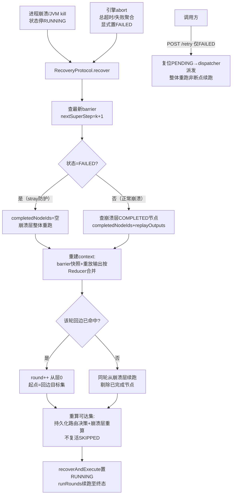
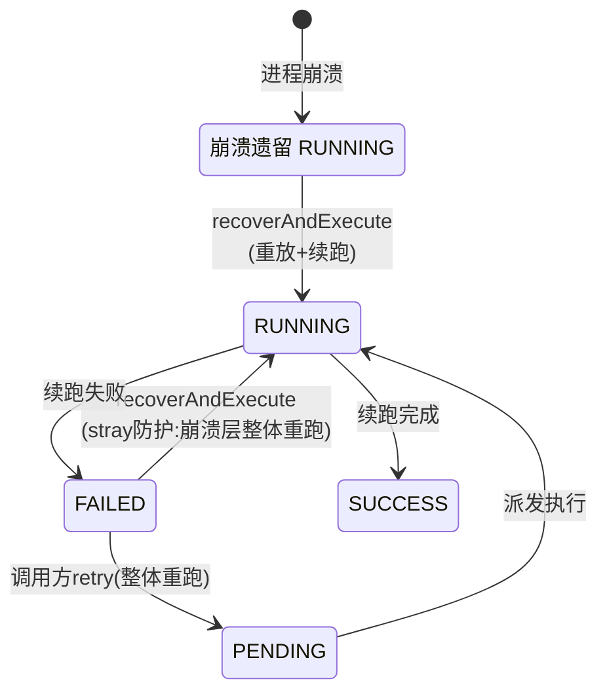

# 崩溃恢复与重试

> 生成时间：2026-08-25 ｜ 代码版本：main@2a37d6b ｜ 可信度概览：已确认 20 条 / 合理推断 1 条 / 待确认 1 条

> **变更记录**
> - 更新时间：2026-08-25
> - 关联 Commit/PR：2a37d6b（CodeGraph 索引 v2 精化，无代码变更）
> - 本次修改的业务影响：无（取证精度升级——① `recoverAndExecute` 全部 9 个调用方经 CodeGraph 证实**均为测试**（BspEngineRecoveryTest / RecoveryConditionalTest / RecoveryLoopTest + 2 个 demo 演示测试），生产代码零调用，Q2 从「未发现调用」升级为「图上可证」；② stray 防护/循环恢复/不复活 SKIPPED 均有专属测试锁定，多条结论补 B 级交叉验证；③ `updateStatus` 生产写入点 8 处全数枚举确认）
> - 是否新增待确认问题：否

## 1. 业务目标

长耗时多节点工作流执行中进程崩溃/超时中止后，**从断点续跑而不必从头开始**：已完成节点不重跑（防 LLM 重复计费）、channel 状态精确恢复到崩溃前、运行时路由决策不丢失。业务价值：把「几十分钟 + 几十次 LLM 调用」的沉没成本保住，崩溃后秒级续跑。

两条恢复路径严格分离：**崩溃恢复**（RecoveryProtocol + recoverAndExecute，处理进程崩溃/超时中止）与**审批恢复**（approveAndResume，处理人工审批暂停，见 [hitl-approval.md](hitl-approval.md)）；另有**调用方手动重试**（retry 端点，整体重跑失败工作流）。

## 2. 范围与边界

- 包含：两级 checkpoint 落盘策略、崩溃点定位（off-by-one 修复）、已完成节点跳过 + 输出重放、stray 记录防护、路由决策重放与可达集重算、循环轮次恢复、retry 端点语义
- 不包含：审批暂停恢复（见 hitl-approval.md）、提交主链路（见 [workflow-lifecycle.md](workflow-lifecycle.md)）、动态路由运行时机制（见 [dynamic-routing-and-loops.md](dynamic-routing-and-loops.md)）
- 上游流程：工作流生命周期（RUNNING 中崩溃 → FAILED/PENDING）
- 下游流程：工作流终态、诊断
- 涉及服务/模块：agentflow-core（RecoveryProtocol、ExecutionState、BspEngine.recoverAndExecute、CheckpointManager 两级写入）、agentflow-api（retry 端点）

## 3. 触发方式

| 类型 | 触发点 | 调用方/来源 | 证据 |
|---|---|---|---|
| 故障事件 | 进程崩溃（JVM kill / OOM / 部署重启）——workflow_executions 停在 RUNNING 无终态 | 外部 | RecoveryProtocol.java#recover（崩溃语义注释） |
| 故障事件 | 工作流总超时/节点失败聚合 → 引擎显式 abort（置 FAILED） | BspEngine | BspEngine.java:249-264（abort 显式 updateStatus(FAILED)） |
| API | `POST /api/workflows/{id}/retry`（仅 FAILED） | 调用方 | WorkflowController.java#retry |
| 程序入口 | `BspEngine.recoverAndExecute(recovery, def, ...)` | 上层服务（demo/运维） | BspEngine.java#recoverAndExecute:411 |

注：v1 未内置「定时扫描 RUNNING 孤儿自动恢复」的调度器；recoverAndExecute 是引擎暴露的恢复入口，何时调用由上层决定。**已确认（CodeGraph 图上可证：`callers recoverAndExecute` 共 9 处，全部为测试——BspEngineRecoveryTest 3 / RecoveryConditionalTest 2 / RecoveryLoopTest 4 中 3 + demo 演示测试 2，生产 main 代码零调用）**。

## 4. 前置条件与输入

| 条件/输入 | 说明 | 校验位置 | 证据 |
|---|---|---|---|
| checkpoint 数据存在 | workflow_checkpoints（barrier 级）+ workflow_node_outputs（节点级）有该 workflowId 记录（或从零开始） | RecoveryProtocol#recover | RecoveryProtocol.java:69-89 |
| 工作流非 AWAITING_APPROVAL | 审批暂停拒绝崩溃恢复（防跳过等待中的审批） | recoverAndExecute 前置检查 | BspEngine.java:452-455 |
| 工作流定义可取 | 按 (name, version) 从定义存储取（retry/recover 均不读 classpath） | WorkflowVersionManager#loadDefinition | WorkflowController.java:202-206 注释 |
| retry 仅限 FAILED | 非 FAILED → 400 | WorkflowController#retry:312-318 | WorkflowController.java:314 |

## 5. 主流程

1. **两级 checkpoint 持续落盘（执行期，恢复的资本）**。
   - 节点级：每个节点完成当下立即 saveNodeOutput（barrier 前），COMPLETED 状态不可覆盖；barrier 级：每个成功 super-step 合并完 channel 后 saveBarrier，失败层不写。
   - 数据变化：workflow_node_outputs 逐节点插入；workflow_checkpoints 逐层插入（(workflow, round, step) 唯一）。
   - 证据：BspEngine#runSuperStep:792 → BspEngine#runStep:881-882 → CheckpointManager.java 接口注释:19-29。

2. **路由决策先于 barrier 落盘**。
   - 每 barrier 后 saveRoutingDecisions（累计已走边列表，latest wins 覆盖）——保证崩溃窗口内路由不丢，恢复期重算 SKIPPED。
   - 证据：BspEngine#runStep:880-882（顺序：路由→barrier）。

3. **崩溃定位（RecoveryProtocol.recover）**。
   - 查最新 barrier checkpoint：有 → nextSuperStep = latest.superStep + 1（**查询崩溃层本身**，off-by-one 修复：查 nextSuperStep 而非 nextSuperStep-1，防已完成节点重复计费）；无 barrier → 从 round 0、step 0、空 channel 开始。
   - 证据：RecoveryProtocol.java:68-89 + 104-106 注释。

4. **stray 记录防护（FAILED 状态鉴别）**。
   - 查工作流状态：FAILED（引擎显式 abort，如总超时）→ 崩溃层可能含超时后在飞 VT 写出的孤立 COMPLETED（未经 barrier 合并）→ **忽略整个崩溃层的 COMPLETED，整体重跑**（宁可重复计费，不要错误结果）；非 FAILED（正常崩溃）→ 崩溃层 COMPLETED 是合法崩溃前完成。
   - 证据：RecoveryProtocol.java:91-101 + BspEngine.java:256-263（abort 时显式标 FAILED 的写入点）。

5. **构建 ExecutionState（跳过集 + 重放输出）**。
   - 崩溃层 status=COMPLETED 且 output 非空的节点进 completedNodeIds（跳过不重跑）+ replayOutputs（输出收集，恢复 channel）。
   - 证据：RecoveryProtocol.java:103-128 → ExecutionState.java。

6. **引擎恢复续跑（recoverAndExecute）**。
   - 用 barrier channelSnapshot 重建 WorkflowContext；**replayOutputs 按 Reducer 合并重放进 context**（崩溃层已完成节点的 channelWrites 未进上一 barrier，不重放则下游读到陈旧/null 值）；从 nextSuperStep 起跑（崩溃层剔除已完成节点）。
   - 数据变化：状态置 RUNNING；续跑节点继续落 checkpoint。
   - 证据：BspEngine.java#recoverAndExecute:433-448 → runRounds。

7. **循环轮次恢复（round 维度）**。
   - 恢复时查当前 round 的路由决策：该轮回边已命中 → 该轮实质完成，round++ 从层 0 续跑、新轮起点 = 回边目标集合（不从 layer-0 源 BFS，防复活已完成上游）；未命中 → 同轮从崩溃层续跑。
   - 证据：BspEngine.java:457-494（hasLoopDecision/backedgeTargets + mid-round/final-barrier 修复注释）。

8. **可达集重算（动态路由恢复）**。
   - takenEdges = 持久化路由决策 + 崩溃层已完成节点路由重算（inputs 不可得传空，重算失败记 warn 跳过）；从源 BFS 重算可达集：纯 fan-out 节点走全部出边、路由节点仅走已走边、on_error 按已走边——**不复活 SKIPPED 节点**。
   - 证据：BspEngine.java:474-495 → computeReachable:1061-1089。

9. **调用方手动 retry（整体重跑路径）**。
   - 仅 FAILED；复位 PENDING（Kafka 终态跳过防护）→ dispatcher 派发 → run() 从定义起跑（非断点续跑；节点级 COMPLETED 是否跳过取决于引擎路径——run() 走 execute() 从层 0 全量执行）。已确认（WorkflowExecutionService#run → engine.execute 无恢复参数）。
   - 证据：WorkflowController#retry:320-328 → WorkflowExecutionService#run。

## 6. 流程图

## 7. 关键业务规则

| 编号 | 规则 | 触发条件 | 处理结果 | 影响范围 | 证据 | 可信度 |
|---|---|---|---|---|---|---|
| R1 | 节点完成当下立即持久化（防中途崩溃重复计费） | 每节点 Success | saveNodeOutput（barrier 前） | 全部执行 | BspEngine#runSuperStep:792 + CheckpointManager 注释:19-21 | 已确认 |
| R2 | 仅成功 super-step 写 barrier；失败层不写 | barrier 合并 | 失败层无 barrier 记录，恢复时该层重跑 | 一致性 | CheckpointManager 注释:23-24 + BspEngine#applyBarrier:955-957 | 已确认 |
| R3 | 恢复定位查崩溃层本身（nextSuperStep），非前一 layer | recover | 已完成节点跳过（off-by-one 修复，防 LLM 重复计费） | 恢复正确性 | RecoveryProtocol.java:104-106 注释 | 已确认 |
| R4 | COMPLETED 不可覆盖 | 节点级 upsert | InMemory 保留旧 COMPLETED；Postgres upsert 同语义 | checkpoint 完整性 | InMemoryCheckpointManager.java:69 + NodeOutputStore.java:35 | 已确认 |
| R5 | FAILED 状态 → 崩溃层整体重跑（stray 防护） | abort 后恢复 | 忽略崩溃层全部 COMPLETED（宁重复计费不错误结果） | 超时/abort 场景 | RecoveryProtocol.java:91-101 | 已确认 |
| R6 | 崩溃层已完成节点输出必须重放进 context | 正常崩溃恢复 | replayOutputs 按 Reducer 合并（否则下游读陈旧/null channel） | 恢复正确性 | RecoveryProtocol.java:108-121 + BspEngine#applyReplayOutput | 已确认 |
| R7 | AWAITING_APPROVAL 拒绝崩溃恢复 | 恢复入口状态检查 | IllegalStateException（审批暂停走 approveAndResume） | 两条路径隔离 | BspEngine#recoverAndExecute:452-455 | 已确认 |
| R8 | 恢复不复活 SKIPPED 节点 | 可达集重算 | 只按已走边 BFS，未走分支不进 active | 路由工作流 | BspEngine#computeReachable:1061-1089 + CLAUDE.md U7 记录 | 已确认 |
| R9 | 恢复期路由重算失败（如谓词依赖 inputs）不致命 | 重算抛 FatalException | 记 warn 跳过该节点决策（inputs 未持久化，传空） | 已知限制 | BspEngine#recoverAndExecute:483-485 | 已确认 |
| R10 | mid-round 崩溃：回边已命中即进入下一轮 | 该轮回边在路由决策中 | round++ 从层 0 续跑（丢 pending 迭代修复） | 循环工作流 | BspEngine#recoverAndExecute:462-468 注释 | 已确认 |
| R11 | final-barrier 后崩溃不整体重跑 | 无回边命中且 crashLayer ≥ 层数 | 零层收尾 SUCCESS（防已收敛 DAG 双计费重跑） | 循环工作流 | BspEngine#recoverAndExecute:469-471 注释 | 已确认 |
| R12 | 新轮起点 = 回边目标（非 layer-0 源） | 轮次转换恢复 | 防复活已完成轮内上游节点（backedge-target 修复） | 循环工作流 | BspEngine#recoverAndExecute:488-492 注释 | 已确认 |
| R13 | retry 仅 FAILED + 复位 PENDING 先行 | 调用方 retry | Kafka 终态跳过不吞 retry；本地语义不变 | 失败工作流 | WorkflowController#retry:320-328 | 已确认 |
| R14 | retry 是整体重跑（非断点续跑） | retry 派发走 run()→execute | 从层 0 全量执行（不含恢复参数） | 失败工作流 | WorkflowExecutionService#run:73 | 已确认 |
| R15 | 恢复路径同样注册 trace/预算 | recoverAndExecute | 与 execute 对齐（否则 trace/指标分裂） | 可观测 | BspEngine#recoverAndExecute:422-427 | 已确认 |
| R16 | 节点级 checkpoint 写失败降级不崩溃 | DB 抖动 | warn + 主结果保留（恢复时可能重跑该节点） | 容错 | BspEngine#runSuperStep:790-796 | 已确认 |

## 8. 状态与生命周期

工作流状态在恢复场景的流转（复用 workflow-lifecycle.md 状态机，此处列恢复特有边）：

| 当前状态 | 触发动作/事件 | 下一个状态 | 前置条件 | 副作用 | 证据 |
|---|---|---|---|---|---|
| RUNNING（崩溃遗留） | recoverAndExecute | RUNNING（重置）→ SUCCESS/FAILED | checkpoint 数据在、非 AWAITING_APPROVAL | 重放输出进 context、续跑节点落 checkpoint | BspEngine#recoverAndExecute:504-516 |
| FAILED（abort） | recoverAndExecute | RUNNING（崩溃层整体重跑）→ 终态 | stray 防护激活 | 崩溃层 COMPLETED 忽略 | RecoveryProtocol:91-101 |
| FAILED | 调用方 retry | PENDING →（派发后）RUNNING | 仅创建者 | 无断点语义，全量重跑 | WorkflowController#retry |
| 任意轮次中崩溃 | 恢复轮次转换检测 | round+1（或同轮崩溃层续跑） | 该轮回边已命中与否 | round 维度 checkpoint 定位 | BspEngine#recoverAndExecute:457-471 |

NodeStatus（workflow_node_outputs.status）：

| 当前状态 | 触发动作/事件 | 下一个状态 | 前置条件 | 副作用 | 证据 |
|---|---|---|---|---|---|
| （无记录） | 节点开始后完成 | COMPLETED | 执行成功 | output + tokens + completedAt 落盘 | NodeOutputStore.java:61 |
| IN_PROGRESS | （崩溃残留，无完成写入） | 恢复时视为未完成 → 重跑 | — | 不在 findCompletedNodes 结果 | NodeOutputStore.java:49 + CheckpointManager 注释:79-81 |
| FAILED | retry 后节点重跑成功 | COMPLETED | 重跑成功 | FAILED 可升级 COMPLETED | NodeStatus.java:7-8 注释 |
| COMPLETED | 任何后续写 | COMPLETED（不可覆盖） | — | 保留旧记录 | InMemoryCheckpointManager.java:69 |

## 9. 数据变更与一致性

| 数据对象 | 操作 | 关键字段 | 事务/一致性策略 | 证据 |
|---|---|---|---|---|
| workflow_node_outputs | 节点完成即插入/更新 | round、super_step、node_id、status、output | COMPLETED 不可覆盖；(workflow, round, step, node) 唯一约束 | BspEngine#runSuperStep + V1/V5 迁移 |
| workflow_checkpoints | 成功层 barrier 插入 | round、super_step、channel_values | 仅成功层写；崩溃恢复的快照来源 | BspEngine#runStep:882 |
| workflow_routing_decisions | 每 barrier 覆盖写累计列表 | decisions | latest wins；先于 barrier 落盘 | BspEngine#runStep:881 + V4 迁移注释 |
| workflow_executions.status | 恢复置 RUNNING / abort 显式 FAILED | status | abort 的 FAILED 是 stray 防护信号（不可省略） | BspEngine:260 + RecoveryProtocol:92-93 |
| context（内存） | 重建 = barrier 快照 + 重放合并 | channel→值 | Reducer 语义合并（与执行期一致），不回写 DB | BspEngine#applyReplayOutput |

## 10. 异常、重试与补偿

| 场景 | 触发条件 | 系统行为 | 重试/补偿/人工处理 | 证据 | 可信度 |
|---|---|---|---|---|---|
| 从未 barrier 即崩溃 | 第一层就崩 | 从 round 0/step 0/空 channel 全量开始 | — | RecoveryProtocol.java:83-88 | 已确认 |
| abort 时状态写失败 | updateStatus(FAILED) 抛异常 | warn best-effort（不掩盖原 abort 异常）→ stray 防护可能失效（依赖人工核对） | 人工核查状态一致性 | BspEngine.java:259-263 | 已确认 |
| 恢复期路由重算失败 | 谓词求值异常（如缺 inputs 键） | warn 跳过该节点决策 | 可接受：可达集可能偏保守 | BspEngine:483-485 | 已确认 |
| 崩溃层含 IN_PROGRESS 记录 | 节点写到一半崩溃 | 不在 COMPLETED 查询结果 → 重跑 | — | CheckpointManager 注释:79-81 | 已确认 |
| Kafka 消费执行异常 | run() 抛非引擎异常 | 消费者兜底标 FAILED（防孤儿 PENDING） | 重放/人工 | KafkaWorkflowConsumer:69-72 | 已确认 |
| 定义缺失（恢复/retry） | 版本存储查无 | loadDefinitionWithRetry 3 次退避后抛 | 人工核查定义存储 | WorkflowExecutionService#loadDefinitionWithRetry | 已确认 |

## 11. 权限、幂等与并发控制

- 权限/数据权限：retry 仅创建者（ownership 403）；恢复入口（recoverAndExecute）无独立权限层，属引擎内部 API。已确认。
- 幂等键/防重逻辑：节点级 (workflow, round, step, node) 唯一 + COMPLETED 不可覆盖；barrier 唯一约束；Kafka tryClaim 原子认领。已确认。
- 并发控制策略：Postgres 写入 Semaphore(20) 限流（KTD-3 v4.3）；恢复期重放为单线程顺序合并（声明序确定）。已确认。
- 可能的竞态风险：崩溃恢复与 retry 并发（先 FAILED → retry 复位 PENDING → 恢复也启动）——两条入口可同时推进同一工作流。仍为合理推断（CodeGraph 确认恢复无生产调用方，故该竞态当前实际不可达；未来接入恢复编排时需评估）。
- 租户/组织维度隔离：不适用（恢复按 workflowId，无租户维度）。

## 12. 外部依赖与契约

| 依赖系统/组件 | 调用目的 | 请求/事件 | 成功处理 | 失败处理 | 证据 |
|---|---|---|---|---|---|
| PostgreSQL（生产）/InMemory（开发） | checkpoint 存取 | SQL | 恢复数据完整 | 写失败降级 warn（R16） | PostgresCheckpointManager/InMemoryCheckpointManager |
| 工作流定义存储（WorkflowVersionManager） | 恢复取定义 | (name, version) 查询 | 旧 DAG 执行 | 重试 3 次后失败 | WorkflowExecutionService#loadDefinitionWithRetry |
| Kafka（可选） | retry 消息投递 | Topic 同生命周期 | tryClaim 后执行 | 终态跳过 | WorkflowController#retry + KafkaWorkflowConsumer |

## 13. 代码证据索引

| # | 证据 | 类型 | 支持的结论 |
|---|---|---|---|
| E1 | agentflow-core/src/main/java/com/agentflow/engine/checkpoint/RecoveryProtocol.java#recover | 源码 | 崩溃定位（nextSuperStep）+ stray 防护 + 跳过集/重放输出构建（R3/R5/R6） |
| E2 | agentflow-core/src/main/java/com/agentflow/engine/checkpoint/ExecutionState.java | 源码 | 恢复结果契约（round 维度 + completedNodeIds + replayOutputs） |
| E3 | agentflow-core/src/main/java/com/agentflow/engine/BspEngine.java#recoverAndExecute | 源码 | 恢复续跑主体：重放/轮次转换/可达集重算/trace 对齐（R7-R12/R15） |
| E4 | agentflow-core/src/main/java/com/agentflow/engine/BspEngine.java#applyReplayOutput | 源码 | 重放输出按 Reducer 合并（R6） |
| E5 | agentflow-core/src/main/java/com/agentflow/engine/BspEngine.java#computeReachable | 源码 | BFS 可达集重算（不复活 SKIPPED，R8） |
| E6 | agentflow-core/src/main/java/com/agentflow/engine/BspEngine.java:249-264 | 源码 | abort 显式置 FAILED（stray 防护信号） |
| E7 | agentflow-core/src/main/java/com/agentflow/engine/BspEngine.java#runStep:880-882 | 源码 | 路由先于 barrier 落盘 |
| E8 | agentflow-core/src/main/java/com/agentflow/engine/checkpoint/CheckpointManager.java | 源码 | 两级写入契约 + findCompletedNodes 语义（R1/R2） |
| E9 | agentflow-core/src/main/java/com/agentflow/engine/checkpoint/InMemoryCheckpointManager.java:69 | 源码 | COMPLETED 不可覆盖（R4） |
| E10 | agentflow-core/src/main/java/com/agentflow/engine/checkpoint/NodeOutputStore.java | 源码 | 节点状态工厂（inProgress/completed/failed） |
| E11 | agentflow-api/src/main/java/com/agentflow/api/WorkflowController.java#retry | 源码 | retry 门控 + PENDING 复位（R13） |
| E12 | agentflow-api/src/main/java/com/agentflow/api/WorkflowExecutionService.java#run | 源码 | retry 派发走全量 execute（R14） |
| E13 | agentflow-core/src/main/java/com/agentflow/engine/checkpoint/NodeStatus.java | 源码 | 节点三态 + FAILED 可升级语义 |
| E14 | agentflow-core/src/main/resources/db/migration/V5__loop_round.sql | DDL | round 维度唯一约束（循环恢复定位） |
| E15 | agentflow-kafka-starter/src/main/java/com/agentflow/kafka/KafkaWorkflowConsumer.java:69-72 | 源码 | 消费异常兜底 FAILED |
| E16 | CodeGraph: `callers recoverAndExecute` → 9 处全为测试（BspEngineRecoveryTest / RecoveryConditionalTest / RecoveryLoopTest + demo×2），生产零调用 | CodeGraph | Q2 图上可证；恢复入口无生产编排 |
| E17 | CodeGraph: `callers updateStatus` (27 处) → 生产写入点 8 处枚举：WorkflowController.retry / WorkflowExecutionService.run / BspEngine.execute / recoverAndExecute / approveAndResume / applyBarrier / KafkaWorkflowConsumer.onMessage + 接口 default | CodeGraph | 状态机全部写入点闭环（skill 红线「状态字段找全部写入点」达成） |
| E18 | agentflow-core/src/test/java/com/agentflow/engine/checkpoint/RecoveryProtocolTest.java（abortedWorkflowIgnoresStrayCompleted:104 / runningWorkflowTreatsCompletedAsLegitimate:122） | 测试 | stray 防护正反两面断言（R5 B 级交叉验证） |
| E19 | agentflow-core/src/test/java/com/agentflow/engine/RecoveryConditionalTest.java（recoveryDoesNotReviveSkippedNode:67 / recoveryReplaysOnErrorPath:97） | 测试 | 不复活 SKIPPED + on_error 重放（R8 B 级交叉验证） |
| E20 | agentflow-core/src/test/java/com/agentflow/engine/checkpoint/RecoveryLoopTest.java（recoveryResumesFromRoundBoundary / recoveryThenContinuesIterating / midRoundCrashEntersNextRound:113 / finalBarrierCrashDoesNotReRun:141） | 测试 | 循环恢复四断言（R10/R11/R12 B 级交叉验证） |
| E21 | agentflow-core/src/test/java/com/agentflow/engine/BspEngineRecoveryTest.java（recoverReplaysCrashLayerOutput:52 / abortedWorkflowRerunsCrashLayer:106 / recoveryCompletesToSuccess:137） | 测试 | 重放/整体重跑/续跑三断言（R5/R6 B 级交叉验证） |

## 14. 待业务确认的问题

1. **问题**：RUNNING 孤儿（崩溃遗留）是否有自动检测/自动恢复的运维预期（定时扫描 + 自动 recoverAndExecute），还是仅人工触发？
   - 为什么代码不足以确认：引擎提供 recoverAndExecute 入口但仓库内未发现调用它的调度器/启动钩子；「谁在什么时机调用恢复」是部署编排决策，代码无法回答。
   - 建议向谁确认：架构师/运维。
   - 建议核查的资料或日志：部署脚本、运维手册、是否存在外部恢复编排器。
