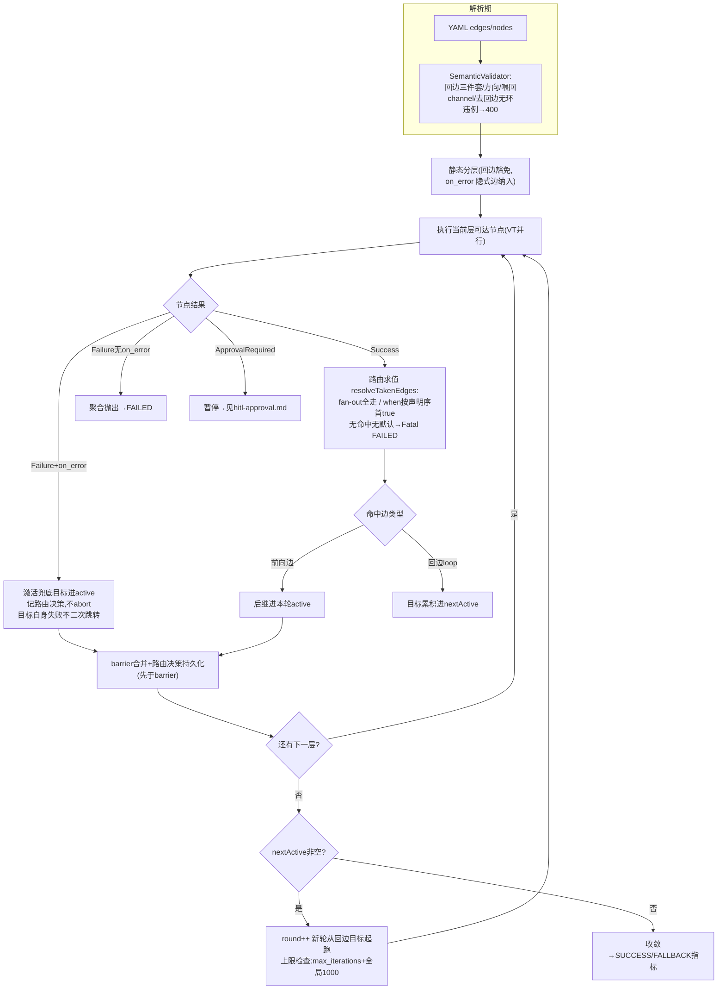
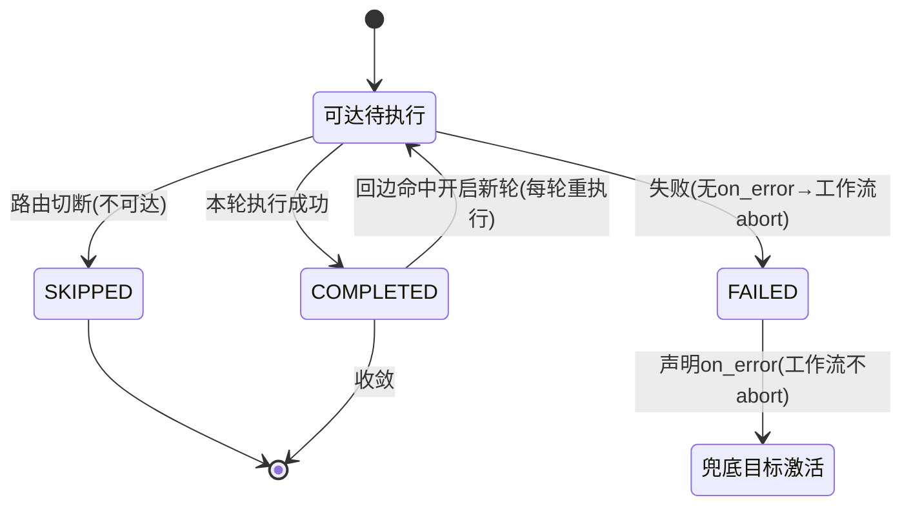

# 动态路由与循环（条件分支、错误兜底、回边迭代）

> 生成时间：2026-08-25 ｜ 代码版本：main@2a37d6b ｜ 可信度概览：已确认 20 条 / 合理推断 0 条 / 待确认 1 条

> **变更记录**
> - 更新时间：2026-08-25
> - 关联 Commit/PR：2a37d6b（CodeGraph 索引 v2 精化，无代码变更）
> - 本次修改的业务影响：无（取证精度升级——路由/兜底/循环三类语义的 18 个专属测试断言逐一经 CodeGraph 定位补 B 级交叉验证（BspEngineConditionalTest 7 / BspEngineOnErrorTest 4 / BspEngineLoopTest 7）；「同层双激活同一后继仅执行一次」从合理推断升级已确认，依据 active Set 语义 + `joinRunsWhenBranchSkipped` 联合证据）
> - 是否新增待确认问题：否

## 1. 业务目标

v1 只能跑静态 DAG（所有节点全跑）。v2 让工作流按**运行时数据**决定走向：风控结论是「高风险」才进人工复核分支、审批不通过自动走降级路径、草稿质量不达标就打回重写（迭代收敛）。三类能力：① 条件分支（when 谓词路由）② 错误兜底（on_error 失败跳转）③ 循环回边（有界迭代）。

设计取舍（业务语言）：保留 BSP「按层并行 + barrier 同步」的执行效率，代价是被路由切断的下游标记 SKIPPED（不执行）、环上节点每轮重复执行；确定性由「checkpoint 持久化路由决策 + 恢复期重放」买回。

## 2. 范围与边界

- 包含：DSL 声明（when/loop/max_iterations/on_error）、解析期校验（有界性/方向/喂回 channel）、运行时路由求值与可达性剪枝、SKIPPED/FALLBACK 终态、循环轮次推进与迭代上限、恢复期路由重放（衔接 [crash-recovery-retry.md](crash-recovery-retry.md)）
- 不包含：提交/执行主链路（见 [workflow-lifecycle.md](workflow-lifecycle.md)）、审批暂停（见 [hitl-approval.md](hitl-approval.md)）
- 上游流程：工作流生命周期（RUNNING 执行中）
- 下游流程：崩溃恢复（路由决策重放）、可观测（SKIPPED/路由决策进 trace）
- 涉及服务/模块：agentflow-core（dsl 校验、PredicateEvaluator、BspEngine 路由/轮次、checkpoint 路由决策）

## 3. 触发方式

| 类型 | 触发点 | 调用方/来源 | 证据 |
|---|---|---|---|
| 配置（DSL） | edges 声明 `when`（SpEL 布尔谓词） | 工作流定义者 | agentflow-core/.../dsl/EdgeDefinition.java:18 |
| 配置（DSL） | edges 声明 `loop: true` + `when` + `max_iterations`（回边三件套） | 工作流定义者 | EdgeDefinition.java:8-16 注释 |
| 配置（DSL） | nodes 声明 `on_error: 兜底节点id`（失败兜底跳转） | 工作流定义者 | SemanticValidator.java:83-86（校验存在性） |
| 运行时事件 | 每个成功节点完成后求值出边谓词 | BspEngine#updateReachability | BspEngine.java:1002-1022 |
| 运行时事件 | 声明 on_error 的节点终态失败 | BspEngine#applyBarrier | BspEngine.java:910-918 |

## 4. 前置条件与输入

| 条件/输入 | 说明 | 校验位置 | 证据 |
|---|---|---|---|
| 谓词是合法 SpEL 布尔表达式 | 求值错误/非 boolean → Fatal（只有求值为 false 才「不命中」） | PredicateEvaluator#evaluate | PredicateEvaluator.java:59-72 |
| 路由节点（有 when 边）最多一条默认边 | 多条无 when 边 → 解析拒绝 | SemanticValidator:87-91 | SemanticValidator.java:88-90 |
| 回边三件套齐全 | loop 边必须带 when + 正数 max_iterations，否则解析拒绝（有界性） | SemanticValidator:94-111 | SemanticValidator.java:96-110 |
| 回边源节点必须有退出边 | 全 loop 出边 → 解析拒绝（否则运行时恒命中到上限） | SemanticValidator:105-110 | SemanticValidator.java:107-111 |
| 回边方向合法 | 回边目标须为源节点静态图祖先（真环），前向误标拒绝 | SemanticValidator#validateBackedgeDirection | SemanticValidator.java:117-118 |
| 喂回 channel 声明为 OVERWRITE | 回边端点 channel 非 OVERWRITE → 拒绝（跨轮累积污染喂回值） | SemanticValidator#validateFeedBackChannel | SemanticValidator.java:119-120 |
| 静态图去回边后无环 | on_error 隐式边也参与环校验（回边豁免） | SemanticValidator#checkAcyclic | SemanticValidator.java:122-123 |

## 5. 主流程

1. **解析期：有界性与合法性校验**。
   - 上述 7 条规则在提交时（SemanticValidator.validate）全部强制；违例 → 400 INVALID_YAML，不进入执行。
   - 证据：SemanticValidator.java:72-123。

2. **分层：静态图预分层，回边豁免**。
   - DAGLayerer 对「去掉回边的静态图」分层（回边目标已在更早层，不重复分层）；on_error 作为隐式边纳入分层——cleanup 节点正确分到触发节点之后，不误拒。
   - 证据：SemanticValidator.java:122-123 注释 + WorkflowDefinition#allEdges（CLAUDE.md v2 U3 记录）。

3. **运行时：节点成功 → 路由求值**。
   - 每个成功节点求值出边：无 when 边（纯 fan-out）→ 所有出边都走（v1 语义）；有 when 边 → **按声明序取第一条 true**，全不中走唯一默认边，无命中且无默认边 → Fatal「无分支命中」工作流 FAILED。
   - 谓词根对象：`output.<field>`（structuredOutput 优先 + content 降级）、`context.<channel>`（上游节点输出）、`inputs.<key>`（工作流入参）。
   - 数据变化：命中边追加进 takenEdges（内存累计）+ trace 记路由决策。
   - 证据：BspEngine#resolveTakenEdges:1108-1136 → PredicateEvaluator#evaluate → BspEngine#updateReachability:1002-1022。

4. **可达性剪枝（SKIPPED）**。
   - 每层只跑「可达」节点（active 集合）；被路由切断的本层节点标 SKIPPED（trace 记录 + 不执行）。
   - 证据：BspEngine#runStep:858-863 → markSkippedNodes:1092-1101。

5. **on_error 兜底（失败跳转）**。
   - barrier 扫描：声明 on_error 的节点**终态失败** → 不 abort，激活兜底目标（进 active）、记路由决策；on_error 目标自身失败**不二次跳转**（走致命失败）；无 on_error 的失败照旧聚合 abort。on_error 已激活的节点正常下游标 SKIPPED。
   - 证据：BspEngine#applyBarrier:910-918 + runStep:877（onErrorTargets 加入 active）。

6. **循环：回边命中 → 下一轮**。
   - 回边命中时目标不进本轮 active，而是累积进 nextActive；本轮全部层跑完（barrier 同步）后 nextActive 非空 → round++ 开启下一轮（回边目标作为新轮起点重新前向传播）；环上节点每轮重复执行（checkpoint 带 round 维度）。nextActive 空 → 收敛结束。
   - 证据：BspEngine#runRounds:343-374 + updateReachability:1010-1011（loop 分派）。

7. **迭代上限双保险**。
   - per-loop `max_iterations`（DSL 声明）+ 引擎级 MAX_TOTAL_ROUNDS=1000 硬上界；超限 → Fatal「迭代超限」工作流 FAILED（纵深防御，防未声明上界/逻辑 bug 死循环）。
   - 证据：BspEngine#checkIterationCap:377-386 + MAX_TOTAL_ROUNDS:78。

8. **路由决策持久化（恢复资本）**。
   - 每 barrier 后 saveRoutingDecisions（round 维度，累计已走边 latest-wins 覆盖）；**只存已走边不存 SKIPPED 态**——恢复期用「源 + 已走边」BFS 重算可达集（KTD-5 单一真相源）。
   - 证据：BspEngine#runStep:881 + V4 迁移注释 + CheckpointManager#saveRoutingDecisions 注释:171-174。

9. **恢复期路由重放**（衔接崩溃恢复文档）。
   - takenEdges = 持久化决策 + 崩溃层已完成节点路由重算；纯 fan-out 节点总走、路由节点按已走边、on_error 按已走边；轮次转换检测（回边命中即入下一轮）。
   - 证据：BspEngine#recoverAndExecute:457-495（详见 crash-recovery-retry.md 主流程 7/8）。

10. **终态与可观测**。
    - 工作流正常收敛 → SUCCESS；经 on_error 兜底完成 → 指标记 STATUS_FALLBACK（trace markCompletedViaOnError）；trace 含路由决策、SKIPPED 节点、节点轮次（recordNodeRound）。
    - 证据：BspEngine#execute:239-247 + AgentFlowMetrics.STATUS_FALLBACK。

## 6. 流程图

## 7. 关键业务规则

| 编号 | 规则 | 触发条件 | 处理结果 | 影响范围 | 证据 | 可信度 |
|---|---|---|---|---|---|---|
| R1 | 路由按声明序首 true 命中 | 节点有 when 出边 | 第一条求值 true 的边生效；否则唯一默认边 | 分支确定性 | BspEngine#resolveTakenEdges:1127-1133 | 已确认 |
| R2 | 无分支命中且无默认边 → Fatal | when 全 false 且无默认边 | 工作流 FAILED（「无分支命中」可诊断） | 路由完备性 | BspEngine#resolveTakenEdges:1135 | 已确认 |
| R3 | 谓词求值错误 ≠ 不命中 | SpEL 解析/求值异常、非 boolean、引用缺失键 | FatalException → FAILED（「谓词错误可诊断」，不静默走默认） | 可诊断性 | PredicateEvaluator.java:23-26、63-72 | 已确认 |
| R4 | 谓词沙箱：禁 T()/反射/方法调用 | 任意 when 表达式 | SimpleEvaluationContext hardened（复用 prompt 解析器安全基线） | 安全 | PredicateEvaluator.java:52-57 | 已确认 |
| R5 | 被切断下游标 SKIPPED（不执行） | 本层节点不在可达集 | trace 记 SKIPPED + agent 名；不消耗执行 | 成本 | BspEngine#markSkippedNodes:1092-1101 | 已确认 |
| R6 | on_error 逆转「任一失败即 abort」 | 声明 on_error 的节点终态失败 | 跳兜底目标、不 abort、正常下游 SKIPPED | 容错拓扑 | BspEngine#applyBarrier:910-918 | 已确认 |
| R7 | on_error 目标自身失败不二次跳转 | 兜底节点也失败 | 走致命失败（防级联兜底循环） | 容错拓扑 | BspEngine#applyBarrier:913-914（onErrorActivated 判断） | 已确认 |
| R8 | 回边三件套强制（when+上限+方向） | 提交含 loop 边的定义 | 违例解析拒绝（有界性前置） | 循环安全 | SemanticValidator.java:94-118 | 已确认 |
| R9 | 回边源必须有退出边 | 全 loop 出边 | 解析拒绝（防恒命中到上限） | 循环安全 | SemanticValidator.java:105-110 | 已确认 |
| R10 | 喂回 channel 必须 OVERWRITE | 回边端点 channel 声明 CONCAT/MAX 等 | 解析拒绝（防跨轮累积污染喂回值） | 数据正确性 | SemanticValidator.java:119-120 | 已确认 |
| R11 | 回边命中 → 目标进下一轮（非本轮） | loop 边命中 | nextActive 累积；本轮 barrier 完才开新轮（BSP 语义保留） | 执行模型 | BspEngine#updateReachability:1010-1011 + runRounds | 已确认 |
| R12 | 迭代上限双保险 | round 递增 | per-loop max_iterations + 全局 1000，超限 Fatal FAILED | 循环安全 | BspEngine#checkIterationCap:377-386 | 已确认 |
| R13 | 路由决策只存已走边（不存 SKIPPED 态） | 每 barrier 持久化 | 恢复期 BFS 重算可达集，不复活 SKIPPED（单一真相源） | 恢复正确性 | CheckpointManager 注释:171-174 + V4 迁移注释 | 已确认 |
| R14 | 路由决策先于 barrier 落盘 | 每 barrier | 崩溃窗口内路由不丢（恢复不丢下游） | 恢复正确性 | BspEngine#runStep:880-882 顺序 | 已确认 |
| R15 | on_error 隐式边参与环校验与分层 | 静态图构建 | cleanup 节点正确分层（不误拒不漏层） | 拓扑正确性 | SemanticValidator.java:122-123 注释 | 已确认 |
| R16 | 兜底完成记 FALLBACK 终态（区别 SUCCESS） | 工作流经 on_error 收敛 | 指标 status=fallback + trace 标记 | 可观测 | BspEngine#execute:245-246 + AgentFlowMetrics.STATUS_FALLBACK | 已确认 |
| R17 | 恢复期路由重算 inputs 传空 | 路由重算节点谓词引用 inputs | 谓词依赖 inputs 时可能求值失败 → warn 跳过（原入参未持久化，已知限制） | 恢复限制 | BspEngine#recoverAndExecute:479-485 | 已确认 |
| R18 | 跨轮同 nodeId 的 trace 按轮次区分 | 循环执行 | recordNodeRound 记录节点所属轮次 | 可观测 | BspEngine#recordNodeRounds:749-756 | 已确认 |
| R19 | 无回边工作流行为与 v1 一致 | 定义不含 loop 边 | 首轮 nextActive 恒空单轮收敛（向后兼容） | 兼容性 | BspEngine#runRounds:350-351 注释 | 已确认 |

## 8. 状态与生命周期

路由场景下节点级衍生状态（非 NodeStatus 枚举，trace 可观测态）：

| 状态 | 触发动作/事件 | 下一状态 | 前置条件 | 副作用 | 证据 |
|---|---|---|---|---|---|
| SKIPPED | 本层执行时不在可达集 | 终态（本工作流） | 路由切断 | trace 记录；不执行不落 node_outputs | markSkippedNodes |
| （可达）COMPLETED | 本层执行成功 | 终态（本轮） | — | node_outputs 落盘 | runSuperStep |
| （回边目标）下轮重跑 | 回边命中 + 新轮开启 | IN_PROGRESS→COMPLETED | round++ | round 维度 checkpoint 新行 | runRounds + V5 迁移 |

工作流终态衍生：on_error 兜底收敛 → 指标 STATUS_FALLBACK（status 字段仍 SUCCESS，fallback 是指标/trace 维度的区分）。已确认（BspEngine#execute:245-246：updateStatus(SUCCESS) 与 recordWorkflowOutcome(FALLBACK) 并存）。

## 9. 数据变更与一致性

| 数据对象 | 操作 | 关键字段 | 事务/一致性策略 | 证据 |
|---|---|---|---|---|
| workflow_routing_decisions | 每 barrier 覆盖写（round 维度） | round、decisions（from->to 数组） | latest wins；先于 barrier 落盘；恢复期重放源 | BspEngine#runStep:881 + V4 迁移 |
| workflow_node_outputs | 循环节点每轮新行 | round | (workflow, round, step, node) 唯一——同节点跨轮多行并存 | V5__loop_round.sql |
| workflow_checkpoints | 每轮每层 barrier | round、super_step | 轮次维度定位崩溃点 | BspEngine#runStep:882 + V5 迁移 |
| ExecutionTrace（内存） | 路由决策/SKIPPED/轮次记录 | from→to、skipped、round | 仅供查询/诊断，不参与恢复（恢复靠 routing_decisions 表） | recordRouting/markSkippedNodes/recordNodeRounds |

## 10. 异常、重试与补偿

| 场景 | 触发条件 | 系统行为 | 重试/补偿/人工处理 | 证据 | 可信度 |
|---|---|---|---|---|---|
| 无分支命中 | when 全 false 无默认边 | Fatal → FAILED（消息含节点 id） | 修正谓词/补默认边 | BspEngine#resolveTakenEdges:1135 | 已确认 |
| 谓词求值失败 | SpEL 异常/非 boolean/缺键 | Fatal → FAILED（表达式内容在异常消息） | 修正表达式或输出字段 | PredicateEvaluator#evaluate | 已确认 |
| 迭代超限 | round 达 max_iterations 或 1000 | Fatal → FAILED（诊断可识别「迭代超限」） | 调大上限或修退出条件 | BspEngine#checkIterationCap + describeFailure 注释 | 已确认 |
| 兜底节点也失败 | on_error 目标失败 | 致命失败 abort（不无限兜底） | 人工处理 | BspEngine#applyBarrier:913-918 | 已确认 |
| 恢复期路由重算失败 | 谓词引用 inputs（不可得） | warn 跳过该节点决策 | 可接受偏保守；长期需持久化 inputs | BspEngine#recoverAndExecute:483-485 | 已确认 |
| 同层路由 + 审批并存 | 层内既有路由又有审批请求 | 审批优先暂停（恢复后路由补记） | 见 hitl-approval.md R13 | BspEngine#applyBarrier + approveAndResume:678-685 | 已确认 |

## 11. 权限、幂等与并发控制

- 权限/数据权限：不适用（引擎内机制；提交侧工具授权/守卫见 workflow-lifecycle.md）。
- 幂等键/防重逻辑：路由决策持久化幂等（同 round 覆盖）；恢复期重放以持久化决策为准，不重复计费（不复活 SKIPPED/已完成，`recoveryDoesNotReviveSkippedNode` 断言锁定）。
- 并发控制策略：同层并行节点各自求值自己的出边（互不干扰）；回边目标统一在 barrier 后进 nextActive（无双写竞争）；channel 合并按声明序 Reducer 确定。
- 可能的竞态风险：同层两个路由节点都激活同一后继——后继在本层只执行一次（active 是集合 + barrier 同步；`joinRunsWhenBranchSkipped` 验证被剪枝分支的 join 节点单次执行）。升级为已确认。
- 租户/组织维度隔离：不适用。

## 12. 外部依赖与契约

| 依赖系统/组件 | 调用目的 | 请求/事件 | 成功处理 | 失败处理 | 证据 |
|---|---|---|---|---|---|
| SpEL（Spring Expression） | when 谓词求值 | 表达式字符串 + 根对象 | boolean 路由决策 | Fatal（沙箱内错误） | PredicateEvaluator |
| checkpoint 存储 | 路由决策持久化/重放 | decisions 数组 | 恢复可达集重算 | 写失败随 barrier 语义（R14 顺序） | V4 迁移 + CheckpointManager |
| ExecutionTrace | SKIPPED/路由/轮次可观测 | 内存记录 | UI/诊断查询 | — | markSkippedNodes 等 |

## 13. 代码证据索引

| # | 证据 | 类型 | 支持的结论 |
|---|---|---|---|
| E1 | agentflow-core/src/main/java/com/agentflow/dsl/EdgeDefinition.java | 源码 | DSL：when/loop/max_iterations 字段与回边示例 |
| E2 | agentflow-core/src/main/java/com/agentflow/dsl/SemanticValidator.java#validate:72-123 | 源码 | 解析期 7 条校验（R8/R9/R10/R15 前置） |
| E3 | agentflow-core/src/main/java/com/agentflow/prompt/PredicateEvaluator.java#evaluate | 源码 | 谓词求值：首 true、错误即 Fatal、沙箱（R1/R3/R4） |
| E4 | agentflow-core/src/main/java/com/agentflow/engine/BspEngine.java#resolveTakenEdges | 源码 | 路由决策：声明序/默认边/无命中 Fatal（R1/R2） |
| E5 | agentflow-core/src/main/java/com/agentflow/engine/BspEngine.java#updateReachability | 源码 | 成功节点路由 + 回边分派 nextActive（R11） |
| E6 | agentflow-core/src/main/java/com/agentflow/engine/BspEngine.java#runRounds | 源码 | 外层轮次循环骨架 + 收敛判定 + 上限检查（R12/R19） |
| E7 | agentflow-core/src/main/java/com/agentflow/engine/BspEngine.java#checkIterationCap | 源码 | 双保险上限（R12） |
| E8 | agentflow-core/src/main/java/com/agentflow/engine/BspEngine.java#applyBarrier:894-962 | 源码 | on_error 兜底语义（R6/R7）+ 路由/barrier 落盘顺序注释（R14） |
| E9 | agentflow-core/src/main/java/com/agentflow/engine/BspEngine.java#markSkippedNodes | 源码 | SKIPPED 标记（R5） |
| E10 | agentflow-core/src/main/java/com/agentflow/engine/BspEngine.java#computeReachable | 源码 | 恢复期 BFS 可达集（R13） |
| E11 | agentflow-core/src/main/java/com/agentflow/engine/BspEngine.java#execute:239-247 | 源码 | FALLBACK 终态指标（R16） |
| E12 | agentflow-core/src/main/java/com/agentflow/engine/checkpoint/CheckpointManager.java#saveRoutingDecisions | 源码 | 路由决策 SPI 契约 + 单一真相源注释（R13） |
| E13 | agentflow-core/src/main/resources/db/migration/V4__routing_decisions.sql | DDL | 路由决策表结构（latest wins 注释） |
| E14 | agentflow-core/src/main/resources/db/migration/V5__loop_round.sql | DDL | round 维度唯一约束（循环节点多行并存） |
| E15 | agentflow-core/src/main/java/com/agentflow/engine/BspEngine.java#recoverAndExecute:457-495 | 源码 | 恢复期路由重放/轮次转换/可达集重算（R17 + 恢复衔接） |
| E16 | agentflow-core/src/main/java/com/agentflow/engine/BspEngine.java#recordNodeRounds | 源码 | 跨轮节点 trace 区分（R18） |
| E17 | agentflow-core/src/test/java/com/agentflow/engine/BspEngineConditionalTest.java（twoWayBranch:45 / joinRunsWhenBranchSkipped:67 / noMatchFails:90 / staticFanOutUnchanged:111 / defaultEdgeTakenWhenNoWhenMatches:129 / contextReferenceRouting:149 / inputsReferenceRouting:168） | 测试 | 条件路由 7 断言（R1/R2/R5/R19 B 级交叉验证） |
| E18 | agentflow-core/src/test/java/com/agentflow/engine/BspEngineOnErrorTest.java（onErrorFallback:49 / conditionalAndOnErrorMutuallyExclusive:68 / onErrorTargetFailureIsFatal:96 / noOnErrorNodeFailsStillAborts:114） | 测试 | on_error 兜底 4 断言（R6/R7 B 级交叉验证） |
| E19 | agentflow-core/src/test/java/com/agentflow/engine/BspEngineLoopTest.java（reflectionLoopConverges:71 / iterationCapFails:89 / feedbackVisible:105 / staticRegression:126 / noExecutableNodeTerminates:144 / nodeObservesRound:153 / traceDistinguishesRounds:169） | 测试 | 循环 7 断言（R11/R12/R18/R19 B 级交叉验证） |
| E20 | CodeGraph: `callers updateStatus` → applyBarrier/recoverAndExecute/approveAndResume 亦写状态（与路由暂停/恢复语义交叉确认） | CodeGraph | 状态写入点全量枚举（8 处生产写入点见 crash-recovery-retry.md E17） |

## 14. 待业务确认的问题

1. **问题**：on_error 兜底完成的执行在业务上应视为「成功」还是「降级成功」——当前 status=SUCCESS 但指标记 fallback，是否存在下游系统按 status 判定而误读的场景？
   - 为什么代码不足以确认：status 枚举无 FALLBACK 值（trace/指标维度区分）；是否需要业务级区分取决于下游消费方式，代码无法回答。
   - 建议向谁确认：产品/架构师。
   - 建议核查的资料或日志：下游对 GET /status 的消费逻辑；UI 看板对 fallback 的展示需求。
