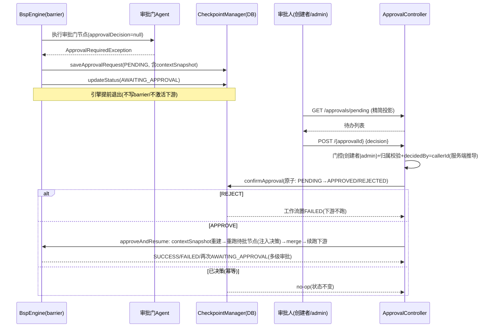
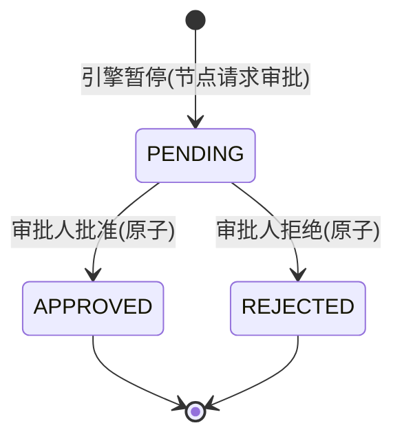

# 人工审批（HITL）全链路

> 生成时间：2026-08-25 ｜ 代码版本：main@2a37d6b ｜ 可信度概览：已确认 21 条 / 合理推断 0 条 / 待确认 1 条

> **变更记录**
> - 更新时间：2026-08-25
> - 关联 Commit/PR：2a37d6b（CodeGraph 索引 v2 精化，无代码变更）
> - 本次修改的业务影响：无（取证精度升级——resumeAfterApproval→approveAndResume→confirmApproval 调用链、审批暂停/恢复 8 项语义的 8 个专属测试类逐一经 CodeGraph 对上；「并发决策竞态」从合理推断升级已确认，依据 `InMemoryCheckpointManagerApprovalTest.concurrentConfirm` 并发断言）
> - 是否新增待确认问题：否

## 1. 业务目标

高风险节点（如付款执行、风控终审）在自动执行前需要人工把关：工作流运行到审批门节点时**暂停等待**，把「审什么」呈现给审批人；审批人做出批准/拒绝决策后，工作流**从暂停点恢复续跑**直到终态。核心业务价值：LLM 自动化保留效率，人工介入兜住不可逆/高风险动作。

服务三个角色：**工作流创建者**（提交了含审批门的工作流，可查/批自己的待办）、**管理员**（admin API Key，可跨创建者审批）、**审批人身份**（由服务端从 API Key 推导，不可伪造）。

业务结果：审批单从 PENDING 到 APPROVED/REJECT，工作流从 AWAITING_APPROVAL 恢复到 SUCCESS/FAILED（或下一级审批的再次 AWAITING_APPROVAL）。

## 2. 范围与边界

- 包含：审批门节点触发暂停、审批单持久化（含上下文快照）、待办查询（单工作流 + 跨工作流聚合）、决策提交（APPROVE/REJECT）、恢复续跑（含多级审批链）、拒绝路径
- 不包含：提交/执行主链路（见 [workflow-lifecycle.md](workflow-lifecycle.md)）、崩溃恢复（见 [crash-recovery-retry.md](crash-recovery-retry.md)）
- 上游流程：工作流生命周期（RUNNING 状态进入审批层）
- 下游流程：工作流终态、诊断/轨迹查询
- 涉及服务/模块：agentflow-core（BspEngine 暂停/恢复 + ApprovalRequest + checkpoint 审批 SPI）、agentflow-api（ApprovalController + ApprovalCenterController + WorkflowExecutionService.resumeAfterApproval）、agentflow-ui（审批中心 Tab，本批未深挖）

## 3. 触发方式

| 类型 | 触发点 | 调用方/来源 | 证据 |
|---|---|---|---|
| 内部事件 | 节点 AgentFunction 抛 `ApprovalRequiredException`（首跑 approvalDecision 为空） | 审批门 agent（demo 为 ApprovalGateAgent） | agentflow-core/.../engine/ApprovalGateAgent.java#execute、agent/ApprovalRequiredException.java |
| HTTP | `GET /api/workflows/{wfId}/approvals/pending`（单工作流待办） | 创建者/admin | agentflow-api/.../ApprovalController.java#pending |
| HTTP | `GET /api/approvals/pending`（跨工作流聚合，审批中心） | 创建者（只见自己）/admin（全部） | agentflow-api/.../ApprovalCenterController.java#pending |
| HTTP | `POST /api/workflows/{wfId}/approvals/{approvalId}`（决策） | 创建者/admin | ApprovalController.java#decide |

## 4. 前置条件与输入

| 条件/输入 | 说明 | 校验位置 | 证据 |
|---|---|---|---|
| 工作流处于 AWAITING_APPROVAL | 引擎暂停时已置状态 | BspEngine#applyBarrier | BspEngine.java:934 |
| 审批人为创建者或 admin | canAccess 门控，否则 403 | ApprovalController#canAccess | ApprovalController.java:139-149 |
| 决策值合法 | decision 必须 APPROVE/REJECT（大小写不敏感），空/其他 → 400 | ApprovalController#decide | ApprovalController.java:103-121 |
| 审批单归属该工作流 | approvalId.workflowId 必须等于路径 wfId，否则 400（防跨工作流审批） | ApprovalController#decide | ApprovalController.java:109-113 |
| 决策请求体仅 decision | 客户端传入的 decidedBy 一律忽略，服务端从 callerId 推导（防伪造审批身份） | ApprovalController#decide:124 | ApprovalController.java:44（安全模型注释） |

## 5. 主流程

1. **审批门节点首跑请求审批**。
   - agent 检测 `input.approvalDecision()==null` → 抛 ApprovalRequiredException（携带描述与可选载荷）；NodeExecutor 捕获后包成 `NodeResult.ApprovalRequired`（区别于 Failure 的第三态）。
   - 证据：ApprovalGateAgent.java#execute → NodeExecutor.java:79-81。

2. **引擎 barrier 识别并暂停**。
   - applyBarrier 扫描本层结果：同层兄弟 Success 输出**先并入 context**（作为恢复时的上下文快照），首个 ApprovalRequired 为准（即使同层另有 Failure 也以审批优先）；构造 ApprovalRequest.pending（含 round/superStep/nodeId/description/requestPayload/contextSnapshot）落库；状态置 AWAITING_APPROVAL；**不写 barrier checkpoint、不激活下游**；runStep 返回 paused、引擎提前退出（finally 不兜底 FAILED）。
   - 数据变化：workflow_approvals 插入 PENDING 行；workflow_executions.status=AWAITING_APPROVAL。
   - 证据：BspEngine.java#applyBarrier:894-941 → BspEngine#runStep:873-876 → BspEngine#execute:229-238。

3. **审批人查看待办**。
   - 单工作流：GET pending 返回精简投影（approvalId/nodeId/description/status/createdAt），**不下发 requestPayload/contextSnapshot**（防敏感载荷旁路泄漏）；跨工作流聚合（审批中心）：非 admin 遍历自己创建的工作流（空数组非 403，不泄漏他人审批存在性）、admin 见全部，单工作流损坏行跳过记 warn（错误隔离，部分结果可用）。
   - 证据：ApprovalController.java#pending + ApprovalView 注释 → ApprovalCenterController.java#pending:76-84。

4. **审批人提交决策**。
   - 校验链：403（非创建者非 admin）→ 400（decision 空/非法）→ 400（审批单不存在或不属于该工作流）；通过后 `decidedBy=callerId`（服务端推导），调 WorkflowExecutionService.resumeAfterApproval → BspEngine.approveAndResume。
   - 证据：ApprovalController#decide:97-133 → WorkflowExecutionService.java#resumeAfterApproval。

5. **原子决策 + 幂等**。
   - `confirmApproval` 仅当审批单当前 PENDING 时置 APPROVED/REJECTED（条件 UPDATE，恰一胜出）；已决策单二次提交 → no-op 返回（不重复执行引擎），工作流状态保持。
   - 证据：CheckpointManager.java#confirmApproval 契约:218-225 → PostgresCheckpointManager.java:349-352。

6. **REJECT 路径**。
   - 置工作流 FAILED 提前返回，下游不跑；trace 标 FAILED + 记录「审批拒绝」；指标记 approval_rejected + workflow failed。
   - 证据：BspEngine.java#approveAndResume:610-623。

7. **APPROVE 路径：重建 → 重跑待批节点 → 续跑下游**。
   - 用审批单的 contextSnapshot 重建 WorkflowContext（含兄弟输出、不含审批节点）；重跑待批节点（AgentInput 注入 `approvalDecision=APPROVE`，走与正常节点一致的 retryPolicy）；真实输出 merge 进 context 并补记路由决策；从审批层续跑下游（startLayer=审批层、firstExcluded=审批层节点全集防双跑；takenEdges 从 checkpoint 预置防覆盖丢边；超时基线重定为 now——挂起期间不计入工作流总超时）。
   - 数据变化：workflow_executions.status=RUNNING → 终态；审批单 APPROVED。
   - 证据：BspEngine.java#approveAndResume:628-712。

8. **多级审批链**。
   - 续跑中若下一节点再次抛 ApprovalRequired → 新审批单落库 + 再次 AWAITING_APPROVAL（审批链逐级推进）；UI 决策成功后乐观移除，再次暂停则重新出现在待办。
   - 证据：BspEngine.java#approveAndResume:649-661（重跑仍 ApprovalRequired 分支）。

9. **恢复后终态**。
   - 续跑完成 → SUCCESS（或失败 → FAILED）；已决策幂等时状态不变返回原状态。
   - 证据：BspEngine.java#approveAndResume:701-712。

## 6. 流程图

## 7. 关键业务规则

| 编号 | 规则 | 触发条件 | 处理结果 | 影响范围 | 证据 | 可信度 |
|---|---|---|---|---|---|---|
| R1 | 审批请求是暂停不是失败 | agent 抛 ApprovalRequiredException | 工作流 AWAITING_APPROVAL（第三态），不重试不 abort | 审批工作流 | NodeExecutor.java:79-81 + BspEngine#applyBarrier | 已确认 |
| R2 | 同层兄弟输出并入快照 | 暂停层含 Success 兄弟 | contextSnapshot 含兄弟输出、不含审批节点；恢复时兄弟不重跑 | 恢复正确性 | BspEngine#applyBarrier:905-907 注释 + approveAndResume firstExcluded | 已确认 |
| R3 | 审批优先于同层失败 | 暂停层同时有 Failure 与 ApprovalRequired | 以审批为准（先暂停；失败在恢复续跑中重新面对） | 暂停语义 | BspEngine#applyBarrier:924 注释 | 已确认 |
| R4 | 审批单持久化失败 = 致命 | saveApprovalRequest 抛异常 | WorkflowExecutionException（暂停无法恢复，不静默降级） | 引擎 | BspEngine#applyBarrier:927-932 | 已确认 |
| R5 | 审批人 = 创建者或 admin | 非 admin 查他人工作流待办 | 403；聚合端点返回空数组（不泄漏他人审批存在性） | 数据可见性 | ApprovalController#canAccess + ApprovalCenterController#pending | 已确认 |
| R6 | decidedBy 服务端推导 | 客户端请求体传 decidedBy | 一律忽略，取 callerId（API Key hash），防审计身份伪造 | 审计 | ApprovalController.java:44、124 | 已确认 |
| R7 | 审批单归属校验 | approvalId 不属于路径 wfId | 400（防跨工作流审批） | 安全 | ApprovalController#decide:109-113 | 已确认 |
| R8 | 决策原子幂等 | 并发/重复提交同一审批单 | confirmApproval 条件转移恰一胜出；已决策 → no-op | 全部审批 | CheckpointManager#confirmApproval + PostgresCheckpointManager:349 | 已确认 |
| R9 | REJECT → 工作流 FAILED | 拒绝决策 | 下游不执行，提前终态 | 该工作流 | BspEngine#approveAndResume:611-622 | 已确认 |
| R10 | APPROVE 注入决策重跑 | 批准决策 | AgentInput.approvalDecision=APPROVE，agent 据此返回真实输出 | 该节点 | BspEngine#approveAndResume:643-645 + AgentInput.java:31 | 已确认 |
| R11 | 恢复不依赖崩溃恢复协议 | approveAndResume | 从审批单快照恢复（非 RecoveryProtocol——那是崩溃路径）；AWAITING_APPROVAL 被 recoverAndExecute 拒绝（防误恢复） | 两条恢复路径隔离 | BspEngine#recoverAndExecute:452-455 | 已确认 |
| R12 | 挂起期间不计入总超时 | AWAITING_APPROVAL 期间 | 超时基线重定 Instant.now() | 长审批场景 | BspEngine#approveAndResume:636-637 注释 | 已确认 |
| R13 | 路由决策预置防丢边 | 恢复续跑 | takenEdges 从 checkpoint 预置（审批层前已走边），防 saveRoutingDecisions 覆盖丢边 | 路由工作流恢复 | BspEngine#approveAndResume:632-633 注释 | 已确认 |
| R14 | 敏感载荷不下发 | 任意待办查询 API | requestPayload/contextSnapshot 仅存库用于恢复，不进响应 | 载荷安全 | ApprovalController#ApprovalView 注释 + ApprovalCenterView | 已确认 |
| R15 | 聚合端点错误隔离 | 单工作流待批行解密损坏 | 跳过该工作流记 warn，其余正常返回（部分可用优于全 500） | 审批中心可用性 | ApprovalCenterController.java:76-84 | 已确认 |
| R16 | 聚合 N+1 查询容忍 | demo 规模 | listByCreatedBy + 每工作流 findPendingApprovals；JOIN 优化记 Deferred | 性能（已知取舍） | ApprovalCenterController.java:40-41 注释 | 已确认 |

## 8. 状态与生命周期

ApprovalStatus（workflow_approvals.status，V7 迁移 CHECK 约束）：

| 当前状态 | 触发动作/事件 | 下一个状态 | 前置条件 | 副作用 | 证据 |
|---|---|---|---|---|---|
| （不存在） | 引擎暂停落库 | PENDING | 节点 ApprovalRequired | 审批单 + 快照写入 | ApprovalRequest#pending、BspEngine#applyBarrier |
| PENDING | confirmApproval(APPROVE) | APPROVED | 原子条件转移成功 | 工作流 RUNNING→续跑 | PostgresCheckpointManager#confirmApproval |
| PENDING | confirmApproval(REJECT) | REJECTED | 原子条件转移成功 | 工作流 FAILED | 同上 |
| APPROVED/REJECTED | 再次提交决策 | 不变（终态） | — | no-op 幂等 | BspEngine#approveAndResume:601-604 |

工作流侧联动（与 workflow-lifecycle.md 状态机衔接）：RUNNING →(审批请求)→ AWAITING_APPROVAL →(APPROVE 续跑)→ RUNNING →…→ SUCCESS/FAILED；AWAITING_APPROVAL →(REJECT)→ FAILED。

## 9. 数据变更与一致性

| 数据对象 | 操作 | 关键字段 | 事务/一致性策略 | 证据 |
|---|---|---|---|---|
| workflow_approvals | 插入（PENDING）→ 条件 UPDATE（决策） | approval_id、workflow_id、node_id、round、super_step、request_payload、context_snapshot、status、decided_by | confirmApproval 单条条件 UPDATE 原子（影响行数=1 判胜出）；payload/snapshot V7 起可承载 AESGCM 密文 | V7__hitl_approval_and_encryption.sql、PostgresCheckpointManager.java:349-352 |
| workflow_executions.status | AWAITING_APPROVAL ↔ RUNNING/FAILED | status | 引擎置 AWAITING 在审批单落库后；恢复先置 RUNNING 再续跑 | BspEngine#applyBarrier/approveAndResume |
| 恢复上下文 | 重建自 contextSnapshot | channel 名→值 | 只读快照，不回写 DB；重跑节点输出走正常 channel merge | BspEngine#approveAndResume:631、676-677 |

## 10. 异常、重试与补偿

| 场景 | 触发条件 | 系统行为 | 重试/补偿/人工处理 | 证据 | 可信度 |
|---|---|---|---|---|---|
| 审批单落库失败 | saveApprovalRequest 抛异常 | WorkflowExecutionException（致命，不静默） | 检查 DB/加密 key | BspEngine#applyBarrier:927-932 | 已确认 |
| 状态置 AWAITING_APPROVAL 失败 | updateStatus 抛异常 | warn 日志（best-effort，审批单已落库为准） | 人工核对状态 | BspEngine#applyBarrier:933-937 | 已确认 |
| 审批单不存在 | resumeAfterApproval 查无 | IllegalStateException 明确报错（不静默） | — | BspEngine#approveAndResume:598-599 | 已确认 |
| 待批节点重跑失败 | APPROVE 后节点执行失败 | 工作流 FAILED（恢复失败，非暂停） | 走 retry 或重新提交 | BspEngine#approveAndResume:663-675 | 已确认 |
| 待批节点重跑仍要审批 | 多级审批链 | 新审批单 + 再次 AWAITING_APPROVAL | 逐级人工决策 | BspEngine#approveAndResume:649-661 | 已确认 |
| 决策时工作流已非待批 | 状态竞争 | 幂等 no-op 返回原状态 | — | BspEngine#approveAndResume:601-604 | 已确认 |
| 聚合查询遇损坏行 | 解密失败/key 轮换 | 跳过单工作流记 warn | 核查加密 key | ApprovalCenterController:76-84 | 已确认 |

## 11. 权限、幂等与并发控制

- 权限/数据权限：创建者（ownership）或 admin（AGENTFLOW_ADMIN_API_KEYS）可查/批；聚合可见域非 admin 限自己创建的工作流（空数组非 403）。已确认。
- 幂等键/防重逻辑：confirmApproval 原子条件转移（PENDING→终态恰一次，`concurrentConfirm` 并发断言锁定）；重复决策 no-op（`secondApproveIsNoop` 断言锁定）。已确认。
- 并发控制策略：决策端条件 UPDATE；恢复执行单线程语义（approveAndResume 内新建 executor）。已确认。
- 可能的竞态风险：同一工作流两个不同 PENDING 审批单被并发决策——confirmApproval 原子性保证单张审批单不双决策（`concurrentConfirm`）；跨审批单的引擎续跑串行性由状态机收敛兜底（REJECT→FAILED 后另一单 APPROVE 走幂等/FAILED 路径）。升级为已确认（原子面有测试，引擎串行面为状态机收敛推论）。已确认。
- 租户/组织维度隔离：无显式审批角色/部门概念，审批人集合 = 创建者 ∪ admin。已确认。

## 12. 外部依赖与契约

| 依赖系统/组件 | 调用目的 | 请求/事件 | 成功处理 | 失败处理 | 证据 |
|---|---|---|---|---|---|
| 审批门 AgentFunction（业务自定义） | 决定何时请求审批、批准后产出什么 | AgentInput（含 approvalDecision） | ApprovalRequiredException / AgentOutput | 执行异常走 Failure | ApprovalGateAgent + AgentInput.java:30-31 |
| UI 审批中心 Tab | 展示待办 + 提交决策 | listPendingApprovals / decideApproval | 乐观移除卡片 | 写操作无 mock fallback（防假成功） | CLAUDE.md R22-U4 记录（UI 侧，本批未深挖源码） |
| 列加密（ColumnEncryptor） | payload/snapshot 静态加密 | AESGCM: 前缀密文 | 解密还原 | 损坏行聚合端点跳过 | V7 迁移注释 + ApprovalCenterController 错误隔离 |

## 13. 代码证据索引

| # | 证据 | 类型 | 支持的结论 |
|---|---|---|---|
| E1 | agentflow-core/src/main/java/com/agentflow/engine/ApprovalGateAgent.java#execute | 源码 | 审批门参考实现：首跑抛异常、决策注入后放行 |
| E2 | agentflow-core/src/main/java/com/agentflow/engine/NodeExecutor.java:79-81 | 源码 | ApprovalRequiredException → 第三态 ApprovalRequired（非 Failure） |
| E3 | agentflow-core/src/main/java/com/agentflow/engine/BspEngine.java#applyBarrier | 源码 | 暂停语义：兄弟输出入快照、审批优先、不写 barrier、置 AWAITING_APPROVAL（R1-R4） |
| E4 | agentflow-core/src/main/java/com/agentflow/engine/BspEngine.java#approveAndResume | 源码 | 恢复语义：原子幂等、REJECT FAILED、APPROVE 重建重跑续跑、多级链、超时重定基线（R9-R13） |
| E5 | agentflow-core/src/main/java/com/agentflow/engine/BspEngine.java#recoverAndExecute:452-455 | 源码 | AWAITING_APPROVAL 拒绝崩溃恢复（R11） |
| E6 | agentflow-api/src/main/java/com/agentflow/api/ApprovalController.java#decide | 源码 | 决策门控链 + decidedBy 服务端推导（R6/R7） |
| E7 | agentflow-api/src/main/java/com/agentflow/api/ApprovalController.java#canAccess | 源码 | 创建者 ∪ admin 门控（R5） |
| E8 | agentflow-api/src/main/java/com/agentflow/api/ApprovalCenterController.java#pending | 源码 | 聚合可见域 + 空数组语义 + 错误隔离（R5/R15/R16） |
| E9 | agentflow-core/src/main/java/com/agentflow/engine/checkpoint/CheckpointManager.java#confirmApproval | 源码 | 原子决策契约（R8） |
| E10 | agentflow-core/src/main/java/com/agentflow/engine/checkpoint/PostgresCheckpointManager.java:349-352 | 源码 | 条件 UPDATE 实现（影响行数判胜出） |
| E11 | agentflow-core/src/main/java/com/agentflow/engine/checkpoint/ApprovalRequest.java | 源码 | 审批单结构（round/superStep/payload/snapshot） |
| E12 | agentflow-core/src/main/resources/db/migration/V7__hitl_approval_and_encryption.sql | DDL | workflow_approvals 表 + status CHECK + 敏感列 TEXT 化 |
| E13 | agentflow-api/src/main/java/com/agentflow/api/WorkflowExecutionService.java#resumeAfterApproval | 源码 | API 层恢复入口（定义重取 + 状态返回） |
| E14 | agentflow-core/src/main/java/com/agentflow/agent/AgentInput.java:30-44 | 源码 | approvalDecision 字段契约（空=首跑，非空=恢复注入） |
| E15 | CodeGraph: `callers approveAndResume` → 生产唯一调用方 WorkflowExecutionService.resumeAfterApproval:95；`callers resumeAfterApproval` → 生产唯一调用方 ApprovalController.decide:90；`callers confirmApproval` → 生产唯一调用方 BspEngine.approveAndResume:581（决策 API→服务层→引擎→checkpoint 四级链路闭环，13 处调用方中生产仅此一链） | CodeGraph | 决策调用链单一入口实锤 |
| E16 | agentflow-core/src/test/java/com/agentflow/engine/BspEngineApprovalPauseTest.java（singleApprovalPausesAndPersists / brotherSuccessOutputEntersSnapshot / brotherFailureStillPauses / recoveryRefusesAwaitingApproval） | 测试 | 暂停语义 4 断言（R1-R4 B 级交叉验证） |
| E17 | agentflow-core/src/test/java/com/agentflow/engine/BspEngineApprovalResumeTest.java（approveResumesAndRunsDownstream / rejectFailsWorkflowAndSkipsDownstream / reApprovalKeepsPausing / siblingOutputPreservedWithoutRerun / takenEdgesPreSetPreservesRouting / secondApproveIsNoop） | 测试 | 恢复语义 6 断言（R9-R13 B 级交叉验证） |
| E18 | agentflow-core/src/test/java/com/agentflow/engine/checkpoint/InMemoryCheckpointManagerApprovalTest.java#concurrentConfirm:82 | 测试 | 并发决策恰一胜出（R8 B 级交叉验证） |
| E19 | agentflow-core/src/test/java/com/agentflow/engine/checkpoint/PostgresCheckpointManagerIT.java#approvalRoundTripOnRealPostgres:120 | 测试 | 真 PG 审批单往返（存储层 B 级交叉验证） |

## 14. 待业务确认的问题

1. **问题**：审批人模型是否需要独立于「创建者 ∪ admin」的审批角色（如部门审批人、多级会签）？
   - 为什么代码不足以确认：当前审批人集合由 API Key 所属决定（创建者或 admin），未见基于业务角色的审批人指派数据模型；ApprovalRequest 也无 assignee 字段。
   - 建议向谁确认：产品/业务负责人。
   - 建议核查的资料或日志：是否存在「指定审批人」业务诉求；workflow_approvals 是否需要扩列。
