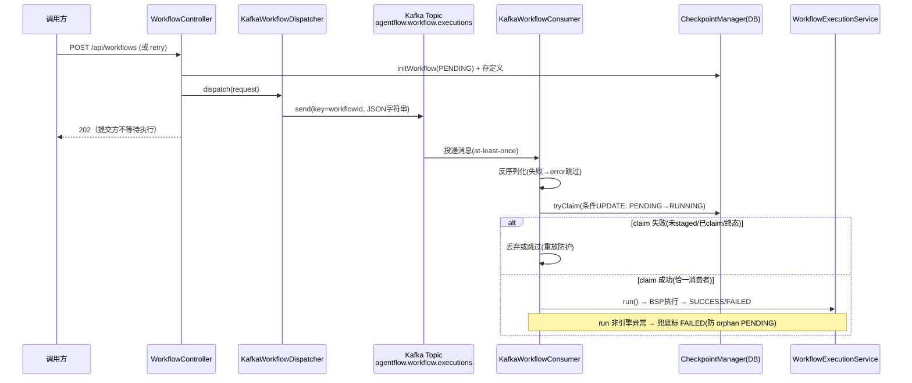

# Kafka 异步分发（提交/执行解耦）

> 生成时间：2026-08-26 ｜ 代码版本：main@2a37d6b ｜ 可信度概览：已确认 16 条 / 合理推断 1 条 / 待确认 1 条

## 1. 业务目标

v1 的「提交后在同一进程内起虚拟线程执行」在单机演示够用，但提交与执行耦合：执行方重启/扩容时在途任务丢失、提交方与执行方必须同 JVM。v1.1 用 Kafka 把两者解开——提交方只负责「落库 + 发消息」，执行方（消费者）拉取消息执行。业务价值：执行侧可独立重启/水平扩展（消费组），提交吞吐不受执行耗时影响，at-least-once 投递 + 幂等消费保证不丢不重跑。

约束（当前形态）：**单 JVM 语义**——生产者与消费者在同一应用内装配（`agentflow.kafka.enabled=true` 同时激活两端），真跨节点 read-after-write 延后。

## 2. 范围与边界

- 包含：装配门控、生产端（dispatch→Topic）、wire 格式（JSON 字符串 + 专用 ObjectMapper）、消费端（监听/认领/执行/兜底）、消费幂等与原子认领、offset 策略、E2E 验证场景
- 不包含：提交流程本体（见 [workflow-lifecycle.md](workflow-lifecycle.md)——本文档是其「派发域」的深挖）、执行语义（WorkflowExecutionService.run，见生命周期）
- 上游流程：工作流生命周期（submit/retry 的 dispatch 调用点）
- 下游流程：BSP 执行 → 终态
- 涉及服务/模块：agentflow-kafka-starter（4 类）、agentflow-api（Dispatcher 抽象）

## 3. 触发方式

| 类型 | 触发点 | 调用方/来源 | 证据 |
|---|---|---|---|
| 配置装配 | `agentflow.kafka.enabled=true` + WorkflowExecutionService bean 存在 | 部署配置 | kafka/KafkaAgentFlowAutoConfiguration.java:46-47 |
| 内部调用 | WorkflowController.submit/retry → dispatcher.dispatch | 提交/重试链路 | CodeGraph: dispatch 生产恰两处（submit:152/retry:298） |
| MQ 消费 | Topic `agentflow.workflow.executions` @KafkaListener | Kafka broker 投递 | KafkaWorkflowConsumer.java:40 |

## 4. 前置条件与输入

| 条件/输入 | 说明 | 校验位置 | 证据 |
|---|---|---|---|
| agentflow.kafka.enabled=true | 属性门控（对齐 agentflow.real.enabled 模式，防 classpath 静默换路径） | @ConditionalOnProperty | KafkaAgentFlowAutoConfiguration.java:46 |
| WorkflowExecutionService bean 存在 | @ConditionalOnBean（依赖 api 模块执行语义已装配） | 同上 | KafkaAgentFlowAutoConfiguration.java:47 |
| Kafka broker 可达 | `spring.kafka.bootstrap-servers`（默认 localhost:9092） | producer/consumer factory | KafkaAgentFlowAutoConfiguration.java:54/74 |
| 工作流已 staged（initWorkflow 落库） | 消费端 tryClaim 需 PENDING 行 | tryClaim 条件 UPDATE | PostgresCheckpointManager#TRY_CLAIM_SQL |

## 5. 主流程

1. **装配（启动期）**。
   - 门控通过时注册 5 个 bean：agentflow 前缀的 producerFactory/template/consumerFactory/listenerContainerFactory + KafkaWorkflowDispatcher（覆盖默认本地 Dispatcher）+ KafkaWorkflowConsumer + 专用 ObjectMapper。未启用时零 bean——WorkflowController 回落 LocalVirtualThreadDispatcher。
   - 证据：KafkaAgentFlowAutoConfiguration.java:51-127。

2. **生产端：dispatch → Topic**。
   - WorkflowDispatchRequest → WorkflowExecutionMessage（workflowId/workflowName/version/inputs）→ 项目 ObjectMapper 序列化为 JSON 字符串 → `kafkaTemplate.send(TOPIC, workflowId, json)`（**key=workflowId**，同工作流消息进同分区保序）。
   - 数据变化：Topic 一条消息。
   - 证据：KafkaWorkflowDispatcher#dispatch:33-41。

3. **wire 格式（String 承载 JSON）**。
   - StringSerializer/Deserializer + starter 自持 Jackson 2 ObjectMapper（注册 JavaTimeModule + 禁用 WRITE_DATES_AS_TIMESTAMPS——java.time inputs 序列化为 ISO 字符串而非数组）。不依赖容器 ObjectMapper（Boot 4.1 容器是 Jackson 3，类型不同注入会启动失败）。
   - 证据：KafkaAgentFlowAutoConfiguration#agentflowKafkaObjectMapper:118-127 注释。

4. **消费端：监听 → 反序列化 → 原子认领 → 执行**。
   - @KafkaListener 收 String payload → 反序列化失败记 error 跳过（重放会重投）→ `tryClaim(workflowId)`：仅 PENDING→RUNNING 条件 UPDATE 成功才执行（未 staged 丢弃 + error 日志防 ledger 污染；RUNNING/终态跳过防并发/重放双跑）→ executionService.run 执行。
   - 证据：KafkaWorkflowConsumer#onMessage:42-67。

5. **消费端兜底**。
   - run() 抛出的非引擎异常（如定义缺失）→ 兜底 updateStatus(FAILED)（防 orphan PENDING——消息已 ack 但状态停在 PENDING）。
   - 证据：KafkaWorkflowConsumer:68-72。

6. **offset 策略（earliest 默认）**。
   - `auto.offset.reset` 默认 earliest：新消费组无已提交 offset 时从分区头起读——「订阅前已 produce」的提交不静默丢（latest 会从末端起读，工作流永 PENDING 无兜底）。幂等消费使 earliest 只是把旧消息重扫跳过，无双计费——任务队列语义下 strictly safer。
   - 证据：KafkaAgentFlowAutoConfiguration.java:74 + 113-116 注释（reliability review P1）。

7. **消费组**。
   - `spring.kafka.consumer.group-id` 默认 `agentflow-workers`——同组多实例分摊分区（水平扩展点）。
   - 证据：KafkaAgentFlowAutoConfiguration.java:73。

## 6. 流程图

## 7. 关键业务规则

| 编号 | 规则 | 触发条件 | 处理结果 | 影响范围 | 证据 | 可信度 |
|---|---|---|---|---|---|---|
| R1 | 属性门控装配：不 enabled 零 bean | agentflow.kafka.enabled 缺省 false | 提交走本地 VT，行为与 v1 完全一致 | 向后兼容 | @ConditionalOnProperty + WorkflowController#defaultDispatcher | 已确认 |
| R2 | wire = String 承载 JSON（非 JsonSerializer） | 所有消息 | 序列化细节 starter 自持（Kafka 4.x Json 序列化器已废弃） | 兼容性 | KafkaAgentFlowAutoConfiguration 类注释 KTD-D | 已确认 |
| R3 | 消息 key=workflowId | 每次发送 | 同工作流消息同分区保序（retry 复位后重投不乱序） | 顺序性 | KafkaWorkflowDispatcher#dispatch:37 | 已确认 |
| R4 | 原子认领：仅 PENDING→RUNNING 恰一执行 | 并发消费/重放 | 条件 UPDATE 影响行数判定；败者跳过 | 防双跑双计费 | TRY_CLAIM_SQL + onMessage:54 + tryClaimConcurrentExactlyOneWins 测试 | 已确认 |
| R5 | 未 staged 任意 id 丢弃 | 消息的 workflowId 无 initWorkflow 记录 | error 日志 + 丢弃（防伪造消息污染 ledger + 越信任边界成本放大） | 安全 | KafkaWorkflowConsumer:56-59 | 已确认 |
| R6 | 终态跳过 | 重放消息遇 SUCCESS/FAILED | 不重跑（claim 失败路径） | 幂等 | onMessage + KafkaDispatchE2eIT#replayDoesNotReRun | 已确认 |
| R7 | 非引擎异常兜底 FAILED | run() 抛定义缺失等 | 防消息已 ack 但状态永 PENDING | 防 orphan | KafkaWorkflowConsumer:68-72 | 已确认 |
| R8 | auto.offset.reset 默认 earliest | 新消费组 | 订阅前消息不丢；幂等使重扫安全 | 不丢任务 | KafkaAgentFlowAutoConfiguration:74/113-116 | 已确认 |
| R9 | ObjectMapper 专用 bean（Jackson 2 + JavaTimeModule + ISO 日期） | wire 序列化 | java.time inputs 往返正确；与容器 Jackson 3 隔离 | 数据正确性 | agentflowKafkaObjectMapper:118-127 | 已确认 |
| R10 | 消费组默认 agentflow-workers | 装配 | 同组扩容分摊分区（水平扩展位） | 扩展性 | :73 | 已确认 |
| R11 | submit/retry 双路径统一走 dispatcher | 提交与重试 | 消除「submit 走 Kafka / retry 走本地」漂移 | 一致性 | CodeGraph: dispatch 生产恰两处 + WorkflowController#retry 注释 KTD-B | 已确认 |
| R12 | retry 先复位 PENDING 再派发 | Kafka 模式 retry | 否则终态跳过吞掉 retry（复位→claim 成功） | retry 有效性 | WorkflowController#retry:320-328 + retryResetsToPendingBeforeDispatch 测试 | 已确认 |
| R13 | bean 名 agentflow 前缀避撞 | 装配 | 不与 spring-boot KafkaAutoConfiguration 默认 bean 冲突 | 装配稳定性 | @ConditionalOnMissingBean(name=...) 系列 | 已确认 |
| R14 | 反序列化失败跳过不重试 | 非法 payload | error 日志（at-least-once 下重放会重投同一坏消息，重试无意义） | 坏消息隔离 | KafkaWorkflowConsumer:44-49 | 已确认 |
| R15 | 单 JVM 语义（生产者消费者同应用） | 当前形态 | 真跨节点 read-after-write（定义存储可见性窗口）延后 | 已知边界 | WorkflowExecutionService#loadDefinitionWithRetry 注释（3 次退避为跨节点留容忍窗口） | 已确认 |
| R16 | 定义缺失重试窗口：3 次 × 1s 退避 | run() 取定义 | 消费时序与定义写入时序的竞态容忍 | 跨节点预备 | loadDefinitionWithRetry | 已确认 |

## 8. 状态与生命周期

无独立状态机——工作流状态机（PENDING→RUNNING→终态）复用；本流程额外约束：Kafka 模式下 PENDING→RUNNING **只能经 tryClaim**（区别于本地模式 run() 直接置 RUNNING）。

| 当前状态 | 触发动作/事件 | 下一个状态 | 前置条件 | 副作用 | 证据 |
|---|---|---|---|---|---|
| PENDING | 消费者 tryClaim 成功 | RUNNING | 条件 UPDATE 命中恰一 | 认领失败者不执行 | TRY_CLAIM_SQL |
| PENDING | 消息反序列化失败 | PENDING（不变） | 坏消息跳过 | 需人工排查消息源 | KafkaWorkflowConsumer:44-49 |
| RUNNING | run 完成/异常 | SUCCESS/FAILED | — | 兜底 FAILED 防 orphan | onMessage + run |

（工作流全状态机见 workflow-lifecycle.md 第 8 节，此处不重复。）

## 9. 数据变更与一致性

| 数据对象 | 操作 | 关键字段 | 事务/一致性策略 | 证据 |
|---|---|---|---|---|
| Topic agentflow.workflow.executions | 生产消息 | key=workflowId、value=JSON | at-least-once；消费端幂等（claim+终态跳过） | KafkaWorkflowDispatcher/Consumer |
| workflow_executions.status | tryClaim 条件 UPDATE | status | 单条 SQL 原子（无 check-then-act 窗口） | TRY_CLAIM_SQL |
| （无本地事务） | — | — | 提交侧「initWorkflow + 发消息」非事务性——发消息失败则 PENDING 悬空（由 earliest + 人工重试兜底） | WorkflowController#submit 顺序 | 

注：提交侧 DB 写入与 Kafka 发送之间无 outbox/事务保证（发消息异常时工作流停 PENDING）。合理推断——按代码顺序与异常路径推断，未发现 outbox 模式。

## 10. 异常、重试与补偿

| 场景 | 触发条件 | 系统行为 | 重试/补偿/人工处理 | 证据 | 可信度 |
|---|---|---|---|---|---|
| 序列化失败 | mapper.writeValueAsString 抛 | IllegalStateException（提交 500，不落半消息） | 排查 inputs 类型 | KafkaWorkflowDispatcher:38-40 | 已确认 |
| 反序列化失败 | payload 非法 | error + 跳过 | 重放重投同一坏消息——需治理消息源 | KafkaWorkflowConsumer:44-49 | 已确认 |
| 定义缺失 | loadDefinition 3 次退避仍空 | 异常 → 兜底 FAILED | 人工核查定义存储 | loadDefinitionWithRetry + onMessage 兜底 | 已确认 |
| broker 不可达 | send 失败 | 提交 500（kafkaTemplate 同步 send 异常上抛） | 运维恢复 broker；PENDING 悬空可人工 retry | KafkaWorkflowDispatcher#dispatch | 合理推断（按同步 send 异常传播推断；KafkaTemplate 默认 future 但 send 后未 get——实际失败可能延后到 future，见待确认 Q） |
| 消费者执行中崩溃 | run 中途 JVM 死 | 状态停 RUNNING（无终态） | 崩溃恢复路径（见 crash-recovery-retry.md；或 offset 未提交→重投→终态跳过 RUNNING 不跳——见待确认） | 状态机 + R6 语义 | 合理推断 |

## 11. 权限、幂等与并发控制

- 权限/数据权限：提交/重试入口继承 API 鉴权 + ownership；消费端无独立鉴权（信任边界=broker 访问权 + R5 未 staged 丢弃）。已确认。
- 幂等键/防重逻辑：tryClaim 原子（R4）+ 终态跳过（R6）+ 消息 key 保序（R3）。已确认。
- 并发控制策略：同组多消费者分区分摊；同 workflowId 恰一认领。已确认。
- 可能的竞态风险：本地模式（无 Kafka）与 Kafka 模式混跑两个应用指向同一 DB——两套 dispatcher 都可能执行同一 PENDING（本地无 claim）。当前单 JVM 装配下不可达。合理推断。
- 租户/组织维度隔离：不适用（消息无租户维度，workflowId 全局）。

## 12. 外部依赖与契约

| 依赖系统/组件 | 调用目的 | 请求/事件 | 成功处理 | 失败处理 | 证据 |
|---|---|---|---|---|---|
| Kafka broker（apache/kafka:3.9.2，KRaft） | 消息投递/消费 | Topic + 消费组 | 解耦执行 | 发送异常提交 500/消费跳过 | docker-compose.yml distributed profile + CLAUDE.md 档 A 记录 |
| WorkflowExecutionService（api 模块） | 统一执行语义 | run(workflowId...) | 终态 | 兜底 FAILED | @ConditionalOnBean + onMessage |

## 13. 代码证据索引

| # | 证据 | 类型 | 支持的结论 |
|---|---|---|---|
| E1 | agentflow-kafka-starter/src/main/java/com/agentflow/kafka/KafkaAgentFlowAutoConfiguration.java | 源码 | 装配门控 + 5 bean + offset 默认 + 专用 mapper（R1/R8/R9/R10/R13） |
| E2 | agentflow-kafka-starter/src/main/java/com/agentflow/kafka/KafkaWorkflowDispatcher.java#dispatch | 源码 | Topic 名 + key=workflowId + String JSON（R2/R3） |
| E3 | agentflow-kafka-starter/src/main/java/com/agentflow/kafka/KafkaWorkflowConsumer.java#onMessage | 源码 | 认领/丢弃/兜底全链（R4-R7/R14） |
| E4 | agentflow-kafka-starter/src/main/java/com/agentflow/kafka/WorkflowExecutionMessage.java | 源码 | wire 消息结构（4 字段） |
| E5 | agentflow-api/src/main/java/com/agentflow/api/WorkflowDispatcher.java | 源码 | 派发抽象 + 本地回落语义 |
| E6 | CodeGraph: `callers dispatch` → 生产恰两处 submit:152/retry:298 | CodeGraph | 双路径统一（R11） |
| E7 | agentflow-kafka-starter/src/test/java/com/agentflow/kafka/KafkaDispatchE2eIT.java（dispatchThenExecutesToSuccess:112 / replayDoesNotReRun:133 / twoWorkflowsSequentially:157） | 测试 | 真 Kafka E2E 三场景（R4/R6 B 级交叉验证） |
| E8 | agentflow-kafka-starter/src/test/java/com/agentflow/kafka/KafkaWorkflowDispatcherTest.java#dispatchSerializesAndSends:28 | 测试 | 序列化与发送契约（R2/R3 B 级） |
| E9 | agentflow-kafka-starter/src/test/java/com/agentflow/kafka/KafkaCompatContextLoadTest.java | 测试 | 无 broker 冒烟 + mapper 往返（null version/中文/java.time） |
| E10 | agentflow-kafka-starter/src/test/java/com/agentflow/kafka/KafkaWorkflowConsumerTest.java#terminalSkipsRun:55 | 测试 | 终态跳过（R6 B 级） |

## 14. 待业务确认的问题

1. **问题**：KafkaTemplate.send 默认异步（返回 future 未阻塞）——发送失败（broker 不可达/分区满）时提交已返回 202、工作流停 PENDING 悬空，生产是否需要同步确认或 outbox？
   - 为什么代码不足以确认：代码未对 send 返回的 future 做 get/回调；失败暴露时点取决于 KafkaProducer 内部重试与 future 完成时机，业务上「接受 202 后静默丢」还是「要求强确认」是可靠性预算决策。
   - 建议向谁确认：架构师/运维。
   - 建议核查的资料或日志：生产 broker 可用性 SLA；提交失败率的业务容忍度；是否引入 outbox 模式的规划。
