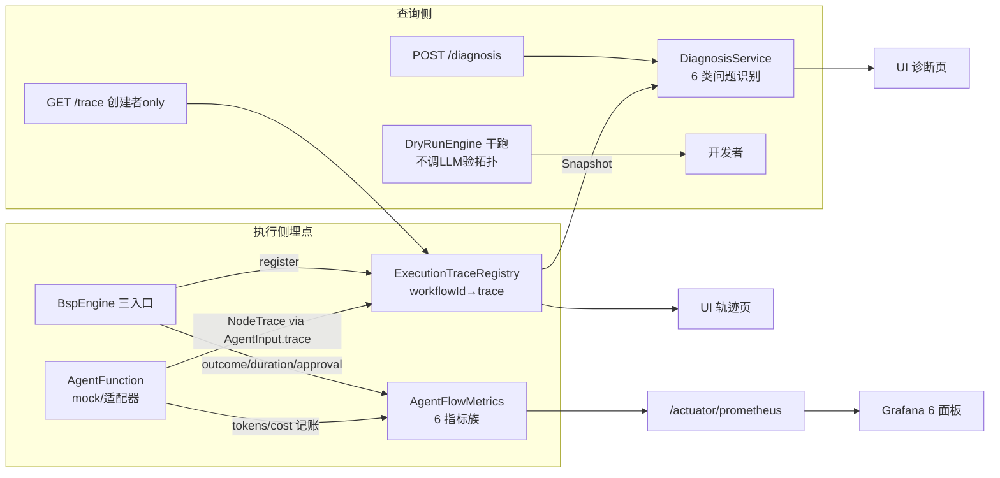
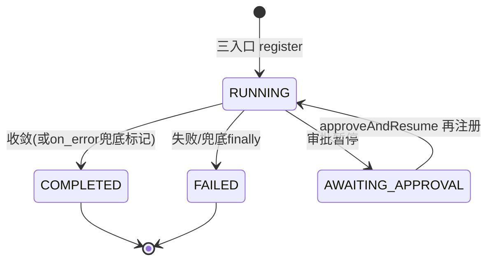

# 可观测与诊断（指标、轨迹、异常诊断、干跑）

> 生成时间：2026-08-26 ｜ 代码版本：main@2a37d6b ｜ 可信度概览：已确认 15 条 / 合理推断 1 条 / 待确认 1 条

## 1. 业务目标

多 Agent 工作流是黑盒风险区（哪个节点慢了、烧了多少 token、为什么失败、循环为什么不收敛）。本能力提供四个互补视图：① **指标**（Micrometer 6 指标族 → Prometheus/Grafana：执行趋势/节点分位耗时/token 与成本/预算超限/审批事件）② **执行轨迹**（trace：每节点状态/耗时/token/错误 + 路由决策/SKIPPED/轮次）③ **诊断报告**（对 trace 自动分析 6 类常见问题 + 修复建议）④ **干跑**（不调 LLM 验证拓扑与预期输入输出）。

服务的角色：**开发者**（调试工作流）、**运维**（Grafana 监控告警）、**调用方**（查自己的 trace）。

## 2. 范围与边界

- 包含：AgentFlowMetrics 6 指标族、trace 穿线（引擎→AgentInput→适配器写 NodeTrace）、TraceRegistry + trace 端点（IDOR 防护）、DiagnosisService 6 类问题识别 + diagnosis 端点、DryRunEngine
- 不包含：成本/预算语义（见 [cost-budget-control.md](cost-budget-control.md)）、Grafana 部署运维（docs/GRAFANA.md）
- 上游流程：工作流执行（引擎埋点）
- 下游流程：Grafana 面板、UI 轨迹/诊断 Tab
- 涉及服务/模块：agentflow-core/observability（Metrics/Trace/Registry）、agentflow-core/debug（DryRunEngine）、agentflow-api（TraceController/DiagnosisController/DiagnosisService）

## 3. 触发方式

| 类型 | 触发点 | 调用方/来源 | 证据 |
|---|---|---|---|
| HTTP | `GET /api/workflows/{id}/trace`（仅创建者） | UI 轨迹页/调用方 | api/TraceController.java:58 |
| HTTP | `POST /api/diagnosis`（trace 快照入参分析） | UI 诊断页 | api/DiagnosisController.java:37 |
| 运行时事件 | 引擎埋点：工作流终态/节点耗时/审批事件 | BspEngine | BspEngine#recordWorkflowOutcome/recordNodeDuration |
| 运行时事件 | 适配器/mock 写 NodeTrace + 记账指标 | AgentFunction 实现 | AgentInput.trace() 穿线 |
| 程序入口 | DryRunEngine.dryRun(def, inputs) | 开发者（CodeGraph：生产零调用——见 Q） | debug/DryRunEngine.java#dryRun |
| 定时抓取 | Prometheus 抓 /actuator/prometheus | Prometheus | deploy/prometheus/prometheus.yml |

## 4. 前置条件与输入

| 条件/输入 | 说明 | 校验位置 | 证据 |
|---|---|---|---|
| trace 查询需创建者 | ownership 403 | TraceController#getTrace | TraceController.java:61-66 |
| trace 已注册 | workflowId 在 Registry（引擎 execute/recover/approve 入口注册） | snapshot null → 404 | TraceController.java:67-70 |
| diagnosis 需合法 trace 快照 | POST body 为 ExecutionTrace.Snapshot JSON | NodeTrace @JsonCreator 反序列化 | DiagnosisController + CLAUDE.md #11 记录 |
| 指标需要 meterRegistry | demo-api 装配 micrometer-registry-prometheus | starter/装配层 | CLAUDE.md 2026-08-07 记录 |

## 5. 主流程

1. **trace 注册与穿线（执行开始）**。
   - execute/recoverAndExecute/approveAndResume 三入口均 `traceRegistry.register(workflowId)` 创建 ExecutionTrace；trace 对象经 AgentInput 第 9 字段穿到每个节点；MockAgentFunction 与两适配器从 input.trace() 写 NodeTrace（状态/耗时/token/error/skipped/routingDecision）。traceRegistry=null 全链 no-op（向后兼容）。
   - 证据：BspEngine.java:209/424/606 + AgentInput.trace()。

2. **引擎埋点（工作流级）**。
   - 终态记 `agentflow.workflow.executed{status=success|failed|fallback}`（outcomeRecorded 防漏记防双记 + finally 兜底；paused/AWAITING_APPROVAL 不记终态）；审批事件记 `agentflow.workflow.approval.event{status=pending|approved|rejected}`。
   - 证据：BspEngine#execute:218-277 + AgentFlowMetrics 常量:40-56。

3. **引擎埋点（节点级）**。
   - 每节点完成（含重试）记 `agentflow.node.duration{agent}` nanos——publishPercentileHistogram 开 `_bucket` 序列供 Grafana histogram_quantile 算 P50/P95/P99。
   - 证据：BspEngine#runSuperStep finally:802-807 + recordNodeDuration:98。

4. **trace 端点（查询）**。
   - GET /trace：创建者校验 → Registry 取 Snapshot（workflow 状态 + NodeTrace 列表 + 总 token + routingDecision/skipped/round 维度）→ 404（未注册空 body）/200。
   - 证据：TraceController#getTrace:58-72。

5. **诊断分析（6 类问题）**。
   - POST /diagnosis：DiagnosisService.analyze(Snapshot) 识别——① 迭代超限（workflowError 含「迭代超限」→ 建议调大 max_iterations 或查回边 when）② 连续超时（FAILED+error 含 timeout → 建议延长 TimeoutPolicy/查 LLM 连通）③ Token 异常（>3× 均值且 >100 → 查 prompt 长度/模型参数）④ SpEL 解析失败（error 含 SpEL）⑤ Channel 缺失（error 含 channel/null）⑥ 节点重复（同 nodeId 多次；maxRound>0 的合法循环迭代豁免）。输出 findings（类型/节点/描述/建议）。
   - 证据：DiagnosisService#diagnose:39-65 + 各 find* 方法。

6. **干跑（DryRunEngine）**。
   - 复用 DAGLayerer 分层 + 内置 DryRunMockAgentFunction（不调 LLM、core 自持无 adapter 依赖）；串行模拟 BSP 逐层推进，输出每节点预期输入 channels + 预期输出——开发者验证拓扑/channel 引用正确性。
   - 证据：DryRunEngine#dryRun:43-75。

7. **指标暴露与面板**。
   - demo-api micrometer-registry-prometheus → /actuator/prometheus；Prometheus 抓 host.docker.internal:8080；Grafana 自动装配 datasource + dashboard（6 面板含失败率——PromQL status 标签小写对齐）。
   - 证据：CLAUDE.md 档 A 部署记录 + deploy/grafana/provisioning/。

## 6. 流程图

## 7. 关键业务规则

| 编号 | 规则 | 触发条件 | 处理结果 | 影响范围 | 证据 | 可信度 |
|---|---|---|---|---|---|---|
| R1 | trace 仅创建者可查 | 非创建者 GET /trace | 403（与 status/retry 同防线防 IDOR） | 数据可见性 | TraceController:61-66 | 已确认 |
| R2 | 未注册 workflowId → 404 非 200 空对象 | 查询无 trace 的 id | 404 + 空 body（避免误判） | API 契约 | TraceController:67-70 注释 | 已确认 |
| R3 | 三执行入口都注册 trace | execute/recover/approve | 恢复/审批续跑的 trace 不与 checkpoint 状态分裂（4 reviewer 确认的 P0 修复） | 一致性 | BspEngine:422-424 注释 | 已确认 |
| R4 | 终态指标恰一次 + finally 兜底 | 正常/异常路径 | outcomeRecorded 防双记；finally 若仍未记则记 FAILED；paused 不记终态 | 指标准确性 | execute:218-277 | 已确认 |
| R5 | AWAITING_APPROVAL 是 trace 合法中间态 | 审批暂停 | trace 标 AWAITING_APPROVAL（不误标 FAILED） | HITL 一致性 | execute:231-237 | 已确认 |
| R6 | 节点耗时含重试（提交到终结） | 每节点 | finally 记 duration（成败都记） | P95 准确性 | runSuperStep:782/802-807 | 已确认 |
| R7 | histogram bucket 开启 | node.duration 注册 | percentileHistogram=true 供分位查询 | Grafana | recordNodeDuration + CLAUDE.md U4 记录 | 已确认 |
| R8 | 失败率 PromQL status 小写 | 面板查询 | `status="failed"`（非 FAILED）——大写匹配 0 条的面板空 bug 已修 | 面板正确性 | CLAUDE.md 2026-08-14 修复② | 已确认 |
| R9 | 诊断重复节点豁免合法循环 | maxRound > 0 | 跨轮重复执行是迭代非 bug，跳过该项检测 | 降噪 | DiagnosisService:62 + findDuplicateNodes | 已确认 |
| R10 | 迭代超限诊断给定向建议 | workflowError 含「迭代超限」 | 建议调大 max_iterations 或查回边 when | 可运维性 | diagnose:49-53 | 已确认 |
| R11 | Token 异常阈值：>3× 均值且 >100 | 成功节点 token 分析 | 提示查 prompt/模型参数（绝对下限防小基数误报） | 降噪 | findTokenAnomalies:81-96 | 已确认 |
| R12 | 干跑零 LLM 依赖 | DryRunEngine | core 自持 mock（无 core→adapter 反向依赖） | 架构 | DryRunEngine 类注释:19-21 | 已确认 |
| R13 | trace 穿线 null 安全 | 未注入 Registry | 全链 no-op（旧构造器兼容） | 向后兼容 | BspEngine 注释:87-89 | 已确认 |
| R14 | mock 模式 trace 同样完整 | mock 执行 | MockAgentFunction 也写 NodeTrace（OQ-3 决议扩展） | 演示完整性 | CLAUDE.md U7 记录 | 已确认 |
| R15 | Registry 是进程内存（不持久化） | 重启 | 重启后 trace 查询 404；checkpoint 状态仍在（两套数据源独立） | 已知边界 | ExecutionTraceRegistry ConcurrentHashMap + 未见持久化 | 已确认 |
| R16 | diagnosis 接受调用方提交的 trace 快照 | POST body | 服务端不校验快照真实性（信任创建者输入，用于离线分析） | 安全边界 | DiagnosisController 无鉴权快照校验 | 合理推断（按 API 形态推断；诊断只读分析无副作用，风险低） |

## 8. 状态与生命周期

ExecutionTrace 状态（内存对象，非持久状态机）：

| 当前状态 | 触发动作/事件 | 下一个状态 | 前置条件 | 副作用 | 证据 |
|---|---|---|---|---|---|
| （无） | 三入口 register | RUNNING | workflowId | Registry 挂载 | BspEngine:209 |
| RUNNING | 工作流收敛 | COMPLETED（或 via-on-error 标记） | 无暂停 | — | execute:239-243 |
| RUNNING | 失败 abort | FAILED + recordWorkflowError | — | — | execute:249-253 |
| RUNNING | 审批暂停 | AWAITING_APPROVAL | — | — | execute:234-236 |
| RUNNING | 其他 RuntimeException（finally 兜底） | FAILED | trace 仍 RUNNING 时 | 防永留 RUNNING 误导诊断 | execute:266-271 |

## 9. 数据变更与一致性

| 数据对象 | 操作 | 关键字段 | 事务/一致性策略 | 证据 |
|---|---|---|---|---|
| ExecutionTraceRegistry | register/snapshot | workflowId→trace | ConcurrentHashMap 进程内存；与 checkpoint 独立（重启丢 trace 不丢状态） | ExecutionTraceRegistry |
| Micrometer 指标 | counter/timer 写 | status/agent/model 标签 | 单调增；outcomeRecorded 引擎侧防双记 | AgentFlowMetrics |
| ExecutionTrace.Snapshot | 只读序列化 | nodes/routingDecisions/skipped/round | 查询时深拷贝快照（读写隔离） | TraceController |

## 10. 异常、重试与补偿

| 场景 | 触发条件 | 系统行为 | 重试/补偿/人工处理 | 证据 | 可信度 |
|---|---|---|---|---|---|
| trace 未注册 | 查询无记录 id | 404（重启后历史工作流 trace 不可查） | 以 checkpoint 状态为准 | TraceController:67-70 | 已确认 |
| CUSTOM reducer 异常致 trace 悬置 | 非 WorkflowExecutionException 路径 | finally 兜底标 FAILED（correctness #1 修复） | — | execute:266-271 | 已确认 |
| 诊断输入反序列化失败 | 快照畸形 | 400（@JsonCreator 后真实 trace 可反序列化，#11 修复） | 调用方修正 | CLAUDE.md #11 记录 | 已确认 |
| 指标 registry 缺失 | metrics=null 构造 | 全 no-op（不崩溃） | 装配层保证生产注入 | recordWorkflowOutcome | 已确认 |
| 面板全空 | PromQL 大小写不匹配 | 已修（status 小写） | — | CLAUDE.md 2026-08-14 ② | 已确认 |

## 11. 权限、幂等与并发控制

- 权限/数据权限：trace 创建者 only（403）；diagnosis POST 的输入快照由调用方自备（离线分析定位）。
- 幂等键/防重逻辑：终态指标恰一次（outcomeRecorded）；trace 终态一次性转移。
- 并发控制策略：Registry ConcurrentHashMap；NodeTrace 写入来自并行 VT（每节点写自己的 trace 条目，天然无竞争）。
- 可能的竞态风险：恢复续跑与旧 trace 并存——再 register 覆盖同 workflowId 的 trace（新执行轨迹替换旧的）。合理推断（register 语义按 map put）。
- 租户/组织维度隔离：以创建者为可见边界（同工作流生命周期）。

## 12. 外部依赖与契约

| 依赖系统/组件 | 调用目的 | 请求/事件 | 成功处理 | 失败处理 | 证据 |
|---|---|---|---|---|---|
| Micrometer + Prometheus registry | 指标暴露 | /actuator/prometheus | Grafana 抓取 | registry null no-op | demo-api 装配 |
| Grafana（11.1.0） | 6 面板可视化 | dashboard JSON 自动装配 | 执行趋势/分位/token/成本/预算/失败率 | — | deploy/grafana + agentflow-dashboard.json |
| UI（轨迹/诊断 Tab） | 展示 | GET trace / POST diagnosis | PipelineView 按 super-step 分组（NodeTrace.step） | mock fallback（读路径） | CLAUDE.md U1/U2 + #10 记录 |

## 13. 代码证据索引

| # | 证据 | 类型 | 支持的结论 |
|---|---|---|---|
| E1 | agentflow-core/src/main/java/com/agentflow/observability/AgentFlowMetrics.java（常量:40-56 + recordBudget:188） | 源码 | 6 指标族 + 记账单一真相源（R4/R7 前提） |
| E2 | agentflow-core/src/main/java/com/agentflow/engine/BspEngine.java:209/218-277 | 源码 | trace 注册三入口 + 终态指标恰一次 + paused 语义（R3/R4/R5） |
| E3 | agentflow-api/src/main/java/com/agentflow/api/TraceController.java#getTrace | 源码 | IDOR 防护 + 404 语义（R1/R2） |
| E4 | agentflow-api/src/main/java/com/agentflow/api/DiagnosisService.java#diagnose | 源码 | 6 类问题识别（R9/R10/R11） |
| E5 | agentflow-api/src/main/java/com/agentflow/api/DiagnosisController.java:37 | 源码 | diagnosis 端点（CodeGraph: diagnose 生产唯一调用点） |
| E6 | agentflow-core/src/main/java/com/agentflow/debug/DryRunEngine.java#dryRun | 源码 | 干跑零 LLM + 拓扑验证（R12） |
| E7 | CodeGraph: `callers dryRun` → 4 处全为 DryRunTest | CodeGraph | 干跑生产零调用（Q 证据） |
| E8 | agentflow-core/src/main/java/com/agentflow/observability/ExecutionTraceRegistry.java | 源码 | 进程内存 Registry（R15） |
| E9 | agentflow-api/src/test/java/com/agentflow/api/DiagnosisServiceTest.java（6 断言逐一对应 6 类问题 + cleanWorkflowNoFindings:85） | 测试 | 诊断覆盖（R9-R11 B 级交叉验证） |
| E10 | agentflow-core/src/test/java/com/agentflow/debug/DryRunTest.java（4 断言：serial/withoutMockResponse/parallel/mixed） | 测试 | 干跑拓扑（R12 B 级） |
| E11 | agentflow-starter/src/test/java/com/agentflow/starter/GrafanaDashboardMetricAlignmentTest.java | 测试 | 指标名防漂移门禁 |
| E12 | CLAUDE.md 2026-08-14 修复②（GRAFANA.md PromQL 小写） | 文档 | R8 |

## 14. 待业务确认的问题

1. **问题**：DryRunEngine 与 diagnosis 已建但生产入口缺失——dryRun 零生产调用（CodeGraph 证实 4 处全测试），diagnosis 仅接受调用方自备快照。是否需要补「服务端按 workflowId 直接诊断」「干跑端点/CLI」？
   - 为什么代码不足以确认：能力存在但未接线（同 recoverAndExecute 模式）；是否补入口属产品范围决策。
   - 建议向谁确认：产品/架构师。
   - 建议核查的资料或日志：UI 诊断 Tab 的数据来源（当前由前端组快照）；开发者的工作流调试工作流。
