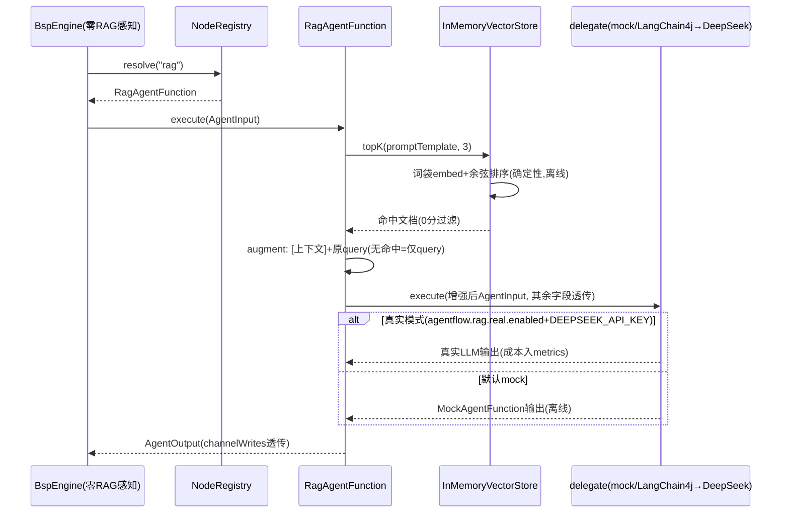

# RAG 检索增强（向量检索扩展点）

> 生成时间：2026-08-26 ｜ 代码版本：main@2a37d6b ｜ 可信度概览：已确认 12 条 / 合理推断 1 条 / 待确认 1 条

## 1. 业务目标

演示并验证一个架构主张：**AgentFlow 引擎对 Agent 的实现形态零假设**——检索增强（RAG）这样的复合 Agent 能力不需要引擎任何改动，只要实现 AgentFunction 扩展点即可接入。业务上 RAG 让节点回答问题时先检索私有知识库（如产品文档、内部制度），把命中内容拼进 prompt 再交给 LLM——LLM 的回答有据可依。

demo 采用**确定性离线设计**（词袋 embedder + 余弦相似度 + 内存库）：`mvn verify` 无外部服务依赖恒绿；真实 LLM 经 env 门控可选接入（DeepSeek），mock 与真实双证扩展点成立。

## 2. 范围与边界

- 包含：RagAgentFunction「检索→增强→委托」链、InMemoryVectorStore（确定性词袋 embedder + 余弦 top-k）、demo 装配（mock 默认 + 真实 LLM 条件门控）、引擎零改动证明
- 不包含：真实向量数据库接入（pgvector 等——demo 定位内存实现）、嵌入模型（离线词袋替代）、工作流如何引用 rag agent（见生命周期 DSL 提交）
- 上游流程：工作流生命周期（YAML 节点 `agent: rag` 经 NodeRegistry 解析）
- 下游流程：LLM 适配器（delegate 真实路径）
- 涉及服务/模块：demo-rag（4 类）

## 3. 触发方式

| 类型 | 触发点 | 调用方/来源 | 证据 |
|---|---|---|---|
| 配置装配 | NodeRegistry 注册 `rag` → RagAgentFunction | demo 启动 | demo-rag/.../RagDemoConfig.java:62-67 |
| 运行时事件 | 工作流节点 `agent: rag` 执行 | BspEngine → registry 解析 | RagDemoConfig#ragNodeRegistry |
| 配置门控 | `agentflow.rag.real.enabled=true` + env DEEPSEEK_API_KEY → 真实 LLM delegate | 部署配置 | RagDemoConfig:51-56 |

## 4. 前置条件与输入

| 条件/输入 | 说明 | 校验位置 | 证据 |
|---|---|---|---|
| 知识库非空 | 启动装配 3 篇内置文档 | ragVectorStore bean | RagDemoConfig:34-40 |
| query 非空 | promptTemplate 作为 query | topK 空防御 | InMemoryVectorStore#topK:49-51 |
| 真实模式需凭证 | enabled=true 但缺 DEEPSEEK_API_KEY → 启动失败（不静默回落） | realDelegate | RagDemoConfig:71-76 |
| topK ≥ 0 | Math.max(0, k) 防御 | topK | InMemoryVectorStore:53 |

## 5. 主流程

1. **装配：rag agent 注册**。
   - demo 启动注册 `rag` → RagAgentFunction(vectorStore, delegate)；**其他 agent 名回落 mock fallback**（NodeRegistry 构造传入 mock resolver）。delegate 默认 MockAgentFunction（零密钥离线）；真实模式经门控换 LangChain4jAgentAdapter（OpenAI 兼容 → DeepSeek，注入 metrics/model）。
   - 证据：RagDemoConfig#ragAgent:47-58 + ragNodeRegistry:61-67。

2. **节点执行：检索**。
   - promptTemplate 作为 query → vectorStore.topK(query, 3)：query 词袋与各 doc 词袋余弦相似度降序、过滤 0 分、取前 k。
   - 证据：RagAgentFunction#execute:49-51 → InMemoryVectorStore#topK:48-60。

3. **增强（augment）**。
   - 命中文档拼为「检索到的相关文档：- ... 基于上述上下文（仅作参考）回答问题：+ 用户原 query」；无命中 → 仅原 query（不硬造上下文）。
   - 证据：RagAgentFunction#augment:64-72。

4. **委托执行**。
   - 构造新 AgentInput（**替换 promptTemplate 为增强后 prompt**，其余字段透传：context/inputs/tools/outputSchema/mockResponse/trace/budget/round/approvalDecision）→ delegate.execute；委托异常原样透传（不吞）；AgentOutput（含 channelWrites）直接返回。
   - 证据：RagAgentFunction#execute:53-58。

5. **确定性 embedder**。
   - 词袋：小写 + 按空白/标点切 token + 去空白——纯确定性（同文本同向量），无外部嵌入服务。
   - 证据：InMemoryVectorStore#tokenSet:70-75。

6. **引擎零改动证明**。
   - RagEngineZeroChangeTest 用 BspEngine 直跑 `agent: rag` 工作流，引擎代码无任何 RAG 感知——扩展点=AgentFunction 接口（KTD-6 实证）。
   - 证据：CLAUDE.md U8 记录 + demo-rag 测试。

7. **真实 LLM 路径（可选）**。
   - enabled=true + key → OpenAiChatModel(baseUrl=api.deepseek.com, model=deepseek-chat) → LangChain4jAgentAdapter 委托；RagRealLlmIT（Failsafe，key 门控）端到端断言真实输出非空 + metrics.totalCost()>0。**缺 key 启动失败**（禁止静默回落 mock 假装真实）。
   - 证据：RagDemoConfig#realDelegate:70-87 + CLAUDE.md RAG 真实模型记录。

## 6. 流程图

## 7. 关键业务规则

| 编号 | 规则 | 触发条件 | 处理结果 | 影响范围 | 证据 | 可信度 |
|---|---|---|---|---|---|---|
| R1 | 引擎零改动：RAG 纯 AgentFunction 实现 | 节点 agent: rag | BspEngine 无 RAG 分支——扩展点成立（KTD-6） | 架构主张 | RagEngineZeroChangeTest + demo 无 core 改动 | 已确认 |
| R2 | 检索确定性：同 query 同结果 | 词袋+余弦 | 离线可测（verify 恒绿无外部依赖） | 测试性 | InMemoryVectorStore 注释 + topKOrdersBySimilarityDeterministically | 已确认 |
| R3 | 0 相似度过滤 | 余弦=0（无重叠词） | 不进结果（宁缺毋滥） | 检索质量 | topK:56 filter | 已确认 |
| R4 | 无命中不硬造上下文 | 全部 0 分 | 仅原 query 传 delegate（不拼接空上下文误导 LLM） | 降级语义 | augment:66-67 | 已确认 |
| R5 | 增强只换 prompt，其余全透传 | delegate 调用 | context/inputs/tools/schema/trace/budget/round/approvalDecision 原样（委托方无感知差异） | 组合性 | execute:54-57 | 已确认 |
| R6 | 委托异常透传不吞 | delegate 抛 | AgentExecutionException 上抛（走引擎 Failure/审批路径原语义） | 错误路径 | 类注释:24 + 无 try-catch | 已确认 |
| R7 | 真实模式 fail-fast：缺 key 启动失败 | enabled=true 无 DEEPSEEK_API_KEY | IllegalStateException（不静默回落 mock 假装真实） | 诚实性 | realDelegate:71-76 | 已确认 |
| R8 | 凭证只从 env | 真实装配 | 禁硬编码（对齐 CredentialManager 纪律） | 密钥卫生 | realDelegate:70 注释 | 已确认 |
| R9 | 其他 agent 名 mock fallback | registry 解析非 rag 名 | demo 拓扑里混合 agent 可用（无需全部真实） | 演示灵活性 | ragNodeRegistry:64 | 已确认 |
| R10 | 空库/空 query 防御 | topK 边界 | 返回空列表（不抛异常） | 健壮性 | topK:49-51 + emptyStoreOrQueryReturnsEmpty | 已确认 |
| R11 | topK 上限防御 | k 负数 | Math.max(0,k)——空结果非异常 | 健壮性 | topK:53 + kLargerThanMatchesOrZero | 已确认 |
| R12 | 真实路径成本入账 | 真实 delegate | adapter 注入 metrics/model——RAG 节点 token/成本可见 | 可观测 | realDelegate:82-84 | 已确认 |
| R13 | 内存库进程内共享 | 多节点同 agent | 同一 workflow 内多 rag 节点检索同一库（无会话隔离） | 语义边界 | 单例 bean | 合理推断（按单例装配推断；demo 场景无隔离需求） |
| R14 | 知识库静态内置 | 启动 | 3 篇文档编译期固定——无动态写入路径（demo 定位） | 范围 | ragVectorStore 硬编码 add | 已确认 |

## 8. 状态与生命周期

无状态机（RagAgentFunction 无状态；vectorStore 只增不减）。生命周期即文档生命周期：

| 当前状态 | 触发动作/事件 | 下一个状态 | 前置条件 | 副作用 | 证据 |
|---|---|---|---|---|---|
| （无文档） | 启动装配 add | 已入库（预计算词袋） | text 非空 | id 自增 | InMemoryVectorStore#add:35-42 |
| 已入库 | （无删除路径） | 保持 | — | 检索可用 | （无 remove 方法） |

（无 mermaid 状态图——无状态流转。）

## 9. 数据变更与一致性

| 数据对象 | 操作 | 关键字段 | 事务/一致性策略 | 证据 |
|---|---|---|---|---|
| InMemoryVectorStore.docs | 启动 add | id/text/tokens | 单线程装配写入；执行期只读（线程安全） | InMemoryVectorStore |
| （无持久化） | — | — | 库重启重建（demo 语义） | 无 DB 依赖 |

## 10. 异常、重试与补偿

| 场景 | 触发条件 | 系统行为 | 重试/补偿/人工处理 | 证据 | 可信度 |
|---|---|---|---|---|---|
| 委托执行失败 | delegate 抛 | 异常透传 → 引擎 Failure/重试语义接管 | 走 U4 容错 | RagAgentFunction 无 catch | 已确认 |
| 真实模式缺 key | 启动 | 启动失败（明确指引 export） | 配 key 或关开关 | realDelegate:72-76 | 已确认 |
| 检索零命中 | query 与库无重叠 | 仅原 query 委托（降级不失败） | — | augment | 已确认 |
| 空 query | promptTemplate null/空 | topK 空列表 → 仅原 query 委托 | — | topK:49-51 | 已确认 |

## 11. 权限、幂等与并发控制

- 权限/数据权限：不适用（demo 内无授权概念；工作流提交侧授权见 tool-authorization.md）。
- 幂等键/防重逻辑：检索纯只读无副作用；委托幂等性由 delegate 语义决定。
- 并发控制策略：vectorStore 执行期只读（装配期写完）；RagAgentFunction 无状态可并行复用。
- 可能的竞态风险：无（只读检索）。
- 租户/组织维度隔离：无（单库全局共享——demo 定位）。

## 12. 外部依赖与契约

| 依赖系统/组件 | 调用目的 | 请求/事件 | 成功处理 | 失败处理 | 证据 |
|---|---|---|---|---|---|
| MockAgentFunction（默认） | 离线委托 | AgentInput | 确定性 mock 输出 | MissingMockResponse Fatal | adapters/mock |
| LangChain4jAgentAdapter + DeepSeek（可选） | 真实 LLM | OpenAI 兼容 ChatRequest | 真实输出+成本记账 | 适配器异常分类 | realDelegate + RagRealLlmIT |
| AgentFlowMetrics | 真实路径记账 | recordTokens/recordBudget | Grafana 可见 | metrics null no-op | realDelegate:82-84 |

## 13. 代码证据索引

| # | 证据 | 类型 | 支持的结论 |
|---|---|---|---|
| E1 | demo-rag/src/main/java/com/agentflow/demo/rag/RagAgentFunction.java#execute | 源码 | 检索→增强→委托链 + 全字段透传（R4/R5/R6） |
| E2 | demo-rag/src/main/java/com/agentflow/demo/rag/InMemoryVectorStore.java#topK | 源码 | 确定性检索 + 过滤 + 防御（R2/R3/R10/R11） |
| E3 | demo-rag/src/main/java/com/agentflow/demo/rag/RagDemoConfig.java | 源码 | 装配双模式 + fail-fast + mock fallback（R1/R7/R8/R9） |
| E4 | CodeGraph: `callers topK` → 生产唯一 RagAgentFunction.execute:48 | CodeGraph | 检索单一消费点 |
| E5 | demo-rag/src/test/java/com/agentflow/demo/rag/RagEngineZeroChangeTest.java | 测试 | 引擎零改动证明（R1 B 级） |
| E6 | demo-rag/src/test/java/com/agentflow/demo/rag/InMemoryVectorStoreTest.java（topKOrdersBySimilarityDeterministically:18 / emptyStoreOrQueryReturnsEmpty:40 / kLargerThanMatchesOrZero:52 / noOverlapReturnsEmpty:64） | 测试 | 检索语义 4 断言（R2/R3/R10/R11 B 级） |
| E7 | demo-rag/src/test/java/com/agentflow/demo/rag/RagRealLlmIT.java（Failsafe，key 门控） | 测试 | 真实端到端 + totalCost>0（R12 B 级） |
| E8 | CLAUDE.md U8（KTD-6）+ RAG 真实模型记录 | 文档 | R1/R7 决议背景 |

## 14. 待业务确认的问题

1. **问题**：RAG 是否需要从 demo 升级为核心能力（真实向量库 pgvector/嵌入模型/动态知识库写入/多租户库隔离）？
   - 为什么代码不足以确认：当前 demo 定位（内存库/静态文档/单库）是有意的最小验证实现；升级与否取决于产品是否把 RAG 列为 AgentFlow 卖点。
   - 建议向谁确认：产品/架构师。
   - 建议核查的资料或日志：产品叙事中 RAG 的权重；是否有真实知识库接入需求。
