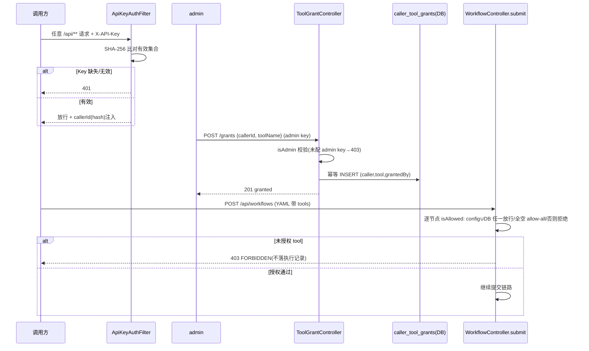

# 工具授权与 API 准入（权限域）

> 生成时间：2026-08-26 ｜ 代码版本：main@2a37d6b ｜ 可信度概览：已确认 17 条 / 合理推断 1 条 / 待确认 1 条

## 1. 业务目标

多调用方共享一个 AgentFlow 部署时，控制「谁能调 API、谁能让 LLM 用哪些工具、谁是管理员」三件事：① 每个 API Key 标识一个调用方（身份=Key 哈希，不明文落库）② 高危工具（如金融数据库查询、风险计算器）只有被授权的调用方才能在工作流里使用 ③ 授权的发放/回收只允许管理员操作（防调用方自授特权）。业务价值：LLM 工具是真实世界动作的代理（查库、算钱），授权边界就是业务安全边界。

三个角色：**普通调用方**（可提交工作流、读自己的授权）、**管理员**（admin API Key，可发放/回收任何人的工具授权、查任何人的授权、跨创建者审批）、**未认证方**（401）。

## 2. 范围与边界

- 包含：API Key 鉴权过滤器、callerId 身份模型、工具授权判定（config ∪ DB）、授权管理 API（admin 门控）、DB 授权存储、admin 身份单一真相源
- 不包含：工作流提交链路里的授权拦截时机（见 [workflow-lifecycle.md](workflow-lifecycle.md) 第 4 节）、审批域的 admin 复用（见 [hitl-approval.md](hitl-approval.md)）
- 上游流程：调用方持 Key 发起任意 /api/** 请求
- 下游流程：工作流生命周期（授权通过才能提交）
- 涉及服务/模块：agentflow-api/security（ApiKeyAuthFilter/CallerToolAllowlist/ToolGrantController/ToolGrantRepository×2/AdminApiKeys/WorkflowOwnershipChecker）

## 3. 触发方式

| 类型 | 触发点 | 调用方/来源 | 证据 |
|---|---|---|---|
| HTTP 过滤器 | 所有 `/api/**` 请求进入 ApiKeyAuthFilter | 任意调用方 | api/security/ApiKeyAuthFilter.java#doFilterInternal |
| HTTP | `GET /api/tools/grants`（读授权：自己；admin 可查任意 caller） | 调用方/admin | api/security/ToolGrantController.java:53 |
| HTTP | `POST /api/tools/grants`（发放授权，admin-only） | admin | ToolGrantController.java:67 |
| HTTP | `DELETE /api/tools/grants/{callerId}/{toolName}`（回收授权，admin-only） | admin | ToolGrantController.java:81 |
| 内部调用 | 提交时 `isAllowed(callerId, tool)` 逐节点校验 | WorkflowController.submit | WorkflowController.java:176-188（CodeGraph：isAllowed 生产唯一调用点 submit:152） |

## 4. 前置条件与输入

| 条件/输入 | 说明 | 校验位置 | 证据 |
|---|---|---|---|
| X-API-Key header | 缺失/无效 → 401；有效 → callerId（SHA-256 hash）注入 request attribute | ApiKeyAuthFilter#doFilterInternal | ApiKeyAuthFilter.java:77-94 |
| 有效 Key 集合非空 | 空 → 所有请求 401（启动时 warn 日志） | ApiKeyAuthFilter 构造器 | ApiKeyAuthFilter.java:60-62 |
| grant 请求体 callerId+toolName | 任一缺失/空白 → 400 | ToolGrantController#grant:69-71 | ToolGrantController.java |
| admin 身份 | `agentflow.admin.api-keys`（env `AGENTFLOW_ADMIN_API_KEYS`，逗号分隔）哈希比对；未配置 → 变更端点全 403（安全默认） | AdminApiKeys.from/isAdmin | AdminApiKeys.java + ToolGrantController.java:45-47 |

## 5. 主流程

1. **请求鉴权（每个 /api/** 请求）**。
   - ApiKeyAuthFilter 校验 X-API-Key：缺失 → 401；SHA-256 hash 不在有效集合 → 401；通过 → hash 写入 `callerId` attribute 下传。
   - 证据：ApiKeyAuthFilter.java#doFilterInternal → 各 Controller。

2. **工具授权判定（提交时强制）**。
   - 提交工作流时遍历 YAML 全部节点的 tools，逐个 `isAllowed(callerId, tool)`；判定语义：config 与 DB **全空 → 全局允许**（v1 兼容）；任一启用则 **config ∪ DB 任一放行**；两处都没有 → 403 FORBIDDEN（提示具体 tool 名，不落执行记录）。
   - 证据：WorkflowController.java:176-188 → CallerToolAllowlist#isAllowed:70-88。

3. **admin 发放授权**。
   - POST /grants：admin 校验（403 兜底）→ `repository.grant(callerId, toolName, grantedBy=admin hash)` 幂等 INSERT（存在即零行）→ 201；`grantedBy` 记录操作者审计。
   - 数据变化：caller_tool_grants 插入 (caller_id, tool_name, granted_by)。
   - 证据：ToolGrantController#grant:67-79 → JdbcToolGrantRepository#GRANT_SQL（WHERE NOT EXISTS 幂等）。

4. **通配授权**。
   - `tool_name='*'` 行授予该 caller 全部工具（config 侧 allowlist 同样支持 `*`）；DB 查询 `tool_name = ? OR tool_name = '*'`。
   - 证据：JdbcToolGrantRepository.java:68-70（IS_GRANTED_SQL）+ CallerToolAllowlist#hasTool:115-117。

5. **admin 回收授权**。
   - DELETE /grants/{callerId}/{toolName}：admin-only → 物理删除行 → 204。回收即时生效于下次提交（运行中工作流不追溯）。
   - 证据：ToolGrantController#revoke:81-91 → REVOKE_SQL。

6. **授权读取**。
   - GET /grants 无参数 = 读自己的授权（普通权限即可）；`?caller=<id>` = admin 查任意人（非 admin 403）。返回按 tool_name 排序（LinkedHashSet 保序）。
   - 证据：ToolGrantController#listGrants:53-65 → FIND_TOOLS_SQL（ORDER BY）。

7. **admin 身份解析（单一真相源）**。
   - AdminApiKeys 解析 CSV → SHA-256 哈希集合；三个 Controller（Approval/ApprovalCenter/ToolGrant）共用，防各端 env 解析漂移。
   - 证据：AdminApiKeys.java 类注释（review #6 收敛三处重复）。

## 6. 流程图

## 7. 关键业务规则

| 编号 | 规则 | 触发条件 | 处理结果 | 影响范围 | 证据 | 可信度 |
|---|---|---|---|---|---|---|
| R1 | 身份=Key 哈希：明文 Key 不落库不传播 | 每次鉴权 | callerId = SHA-256(X-API-Key) | 全域 | ApiKeyAuthFilter#sha256 + CALLER_ID_ATTR | 已确认 |
| R2 | 授权判定 = config ∪ DB；**双空才 allow-all** | 提交时逐 tool 校验 | 任一源有记录即强制（存在即 enforce）；两处都没有 → 403 | 提交准入 | CallerToolAllowlist#isAllowed:70-88 | 已确认 |
| R3 | DB 有记录即启用 DB 侧校验 | totalGrantCount > 0 | least-surprise：插一行即收紧 | 授权语义 | CallerToolAllowlist:73、repoEnabled 判断 | 已确认 |
| R4 | 通配 `*` = 该 caller 全部工具 | config 或 DB 行含 * | hasTool/IS_GRANTED_SQL 双侧支持 | 高危授权 | CallerToolAllowlist#hasTool + JdbcToolGrantRepository:69-70 | 已确认 |
| R5 | 变更操作 admin-only；未配 admin key → 全 403 | grant/revoke 请求 | 安全默认（宁可全拒不可开闸） | 授权管理 | ToolGrantController#grant:73-75 + 构造器 warn | 已确认 |
| R6 | 防「自授特权」：普通 caller 只能读自己 | GET /grants 普通调用方 | 返回自己授权集；查他人 caller 参数需 admin | 权限边界 | ToolGrantController#listGrants:56-64 | 已确认 |
| R7 | grant 幂等 | 重复 grant 同一 (caller,tool) | WHERE NOT EXISTS 零行插入（PG/H2 兼容，无副作用） | 管理操作 | JdbcToolGrantRepository#GRANT_SQL:72-75 | 已确认 |
| R8 | grantedBy 审计留痕 | 每次 grant | 记录 admin 的 caller hash | 审计 | V6 迁移 granted_by 列 + ToolGrantController:76 | 已确认 |
| R9 | 回收即时生效于下次提交 | revoke 后新提交 | 运行中工作流不追溯（已过校验的不中断） | 授权时效 | ToolGrantController#revoke（提交时校验时点语义） | 合理推断（未发现运行中撤销机制；按提交时点校验推断） |
| R10 | 授权拒绝不产生执行记录 | 403 FORBIDDEN | 提交链路在 initWorkflow 之前拦截 | 成本防泄漏 | WorkflowController.java:176-188 顺序 | 已确认 |
| R11 | admin 身份三 Controller 共用单一解析 | Approval/ApprovalCenter/ToolGrant | AdminApiKeys.from 同一 CSV 语义 | 一致性 | AdminApiKeys.java（review #6 收敛） | 已确认 |
| R12 | DB 授权主键 (caller_id, tool_name) | 表结构 | 唯一性数据库兜底（幂等 INSERT 的前提） | 数据完整性 | V6__tool_grants.sql:10 | 已确认 |

## 8. 状态与生命周期

工具授权无显式状态机（行存在=授权，删除=失效）。生命周期即行生命周期：

| 当前状态 | 触发动作/事件 | 下一个状态 | 前置条件 | 副作用 | 证据 |
|---|---|---|---|---|---|
| （无行） | admin POST grant | 已授权（行存在） | admin 门控 + 参数合法 | 幂等插入 + granted_by 审计 | ToolGrantController#grant |
| 已授权 | admin DELETE revoke | 失效（行删除） | admin 门控 | 下次提交起拒绝 | ToolGrantController#revoke |
| 已授权 | （无变更） | 保持 | — | 提交时 isAllowed 放行 | CallerToolAllowlist |

（无 mermaid 状态图——授权是存在性判定非状态流转。）

## 9. 数据变更与一致性

| 数据对象 | 操作 | 关键字段 | 事务/一致性策略 | 证据 |
|---|---|---|---|---|
| caller_tool_grants | 幂等 INSERT / DELETE / SELECT | caller_id(64)、tool_name(128)、granted_by、created_at | 主键 (caller_id, tool_name) 唯一；WHERE NOT EXISTS 兼容 PG/H2 | V6 迁移 + JdbcToolGrantRepository SQL 常量 |
| workflow_executions.created_by | 提交时写入 callerId | created_by | 与 caller_id 同源（Key 哈希），所有权/授权同一身份体系 | V2 迁移 + initWorkflow |
| request attribute callerId | 每请求注入 | callerId | 请求作用域，不持久化 | ApiKeyAuthFilter#CALLER_ID_ATTR |

## 10. 异常、重试与补偿

| 场景 | 触发条件 | 系统行为 | 重试/补偿/人工处理 | 证据 | 可信度 |
|---|---|---|---|---|---|
| Key 缺失/无效 | 任意 /api/** 无有效 X-API-Key | 401（区分「缺 header」与「无效 Key」两种消息） | 调用方核对 Key | ApiKeyAuthFilter:77-90 | 已确认 |
| 有效 Key 集合为空 | 配置缺失 | 全部 401 + 启动 warn | 配置 `agentflow.api.api-keys` | ApiKeyAuthFilter:60-62 | 已确认 |
| grant 参数缺失 | callerId/toolName 空 | 400 提示参数缺失 | 补参重发 | ToolGrantController:69-71 | 已确认 |
| 非 admin 尝试变更 | 无 admin key 或不是 admin | 403（含提示需 AGENTFLOW_ADMIN_API_KEY） | 找管理员 | ToolGrantController:73-75 | 已确认 |
| 授权 DB 不可用 | JDBC 异常 | isAllowed 抛异常上抛 → 提交 500（fail-fast，不静默放行） | 运维恢复 DB | JdbcToolGrantRepository（无 catch 包裹） | 合理推断（代码未见降级分支，按异常传播路径推断） |
| 提交时未授权 tool | isAllowed false | 403 + 具体工具名 + 掩码 caller | 申请授权后重提 | WorkflowController:181-183 | 已确认 |

## 11. 权限、幂等与并发控制

- 权限/数据权限：三层——认证（401）→ 资源所有权（ownership 403，另见生命周期文档）→ 管理操作 admin 门控（403）。已确认。
- 幂等键/防重逻辑：grant 主键唯一 + WHERE NOT EXISTS（重复 grant 无副作用）；revoke 天然幂等（删不存在的行零影响）。已确认。
- 并发控制策略：授权读路径无锁（单行 SELECT）；config allowlist 深拷贝不可变（构造后只读）。已确认。
- 可能的竞态风险：revoke 与并发提交竞争——提交校验时点在 revoke 前则放行（时点语义，非快照隔离）；影响可控（单次提交）。合理推断。
- 租户/组织维度隔离：无租户概念；身份粒度 = API Key；admin 是全局角色非 per-tenant。已确认。

## 12. 外部依赖与契约

| 依赖系统/组件 | 调用目的 | 请求/事件 | 成功处理 | 失败处理 | 证据 |
|---|---|---|---|---|---|
| PostgreSQL / H2 | caller_tool_grants 读写 | SQL（V6 迁移） | 授权生效 | 异常上抛 fail-fast | JdbcToolGrantRepository |
| Spring 配置体系 | `agentflow.api.api-keys`（注意宽松绑定 env 是 `AGENTFLOW_API_API_KEYS`）+ `agentflow.admin.api-keys` | 启动期配置 | 集合非空 | 空集合 401/403 安全默认 | ApiKeyAuthFilter + AdminApiKeys + CLAUDE.md env 名坑记录 |

## 13. 代码证据索引

| # | 证据 | 类型 | 支持的结论 |
|---|---|---|---|
| E1 | agentflow-api/src/main/java/com/agentflow/api/security/ApiKeyAuthFilter.java#doFilterInternal | 源码 | 401 两种分支 + callerId 注入（R1） |
| E2 | agentflow-api/src/main/java/com/agentflow/api/security/CallerToolAllowlist.java#isAllowed | 源码 | config ∪ DB 判定 + 双空 allow-all（R2/R3） |
| E3 | agentflow-api/src/main/java/com/agentflow/api/security/ToolGrantController.java | 源码 | admin 门控 + 自授防护 + 审计（R5/R6/R8） |
| E4 | agentflow-api/src/main/java/com/agentflow/api/security/JdbcToolGrantRepository.java | 源码 | 幂等 INSERT + 通配 SQL + 排序读取（R4/R7） |
| E5 | agentflow-api/src/main/java/com/agentflow/api/security/AdminApiKeys.java | 源码 | admin 单一真相源（R11） |
| E6 | agentflow-core/src/main/resources/db/migration/V6__tool_grants.sql | DDL | 表结构 + 主键 + 审计列（R8/R12） |
| E7 | CodeGraph: `callers isAllowed` → 生产唯一调用点 WorkflowController.submit:152 | CodeGraph | 授权强制点唯一（R10 前提） |
| E8 | agentflow-api/src/test/java/com/agentflow/api/security/CallerToolAllowlistTest.java（10 断言：authorized/unauthorized/unknownCaller/wildcard/emptyAllowlist/nullAllowlist/repoGrantsExtendConfig/configStillWorksAndMerges/repoEmptyStillAllowsAll/repoEnabledDeniesUnknown） | 测试 | 判定语义全覆盖（R2/R3/R4 B 级交叉验证） |
| E9 | agentflow-api/src/test/java/com/agentflow/api/security/ToolGrantControllerTest.java | 测试 | admin 门控 + 读写路径（R5/R6 B 级交叉验证） |
| E10 | agentflow-api/src/test/java/com/agentflow/api/security/ToolGrantRepositoryTest.java | 测试 | SQL 语义 H2 兼容表验证（R7 B 级交叉验证） |

## 14. 待业务确认的问题

1. **问题**：授权回收对「已提交但未执行完」的工作流是否需要追溯撤销（当前时点语义=已过校验不中断）？
   - 为什么代码不足以确认：提交时点校验后无运行中撤销机制；是否需要中止在途工作流属业务风险偏好决策。
   - 建议向谁确认：产品/安全负责人。
   - 建议核查的资料或日志：高危工具（金融查询类）的合规要求；是否存在「授权撤销需立即止血」场景。
