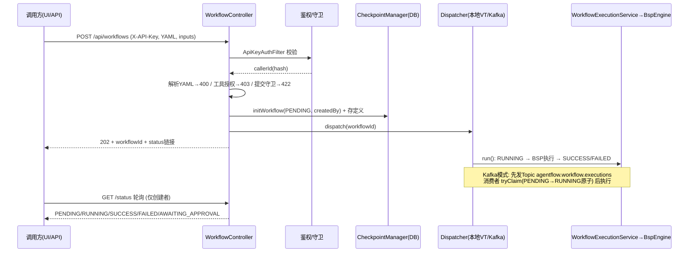
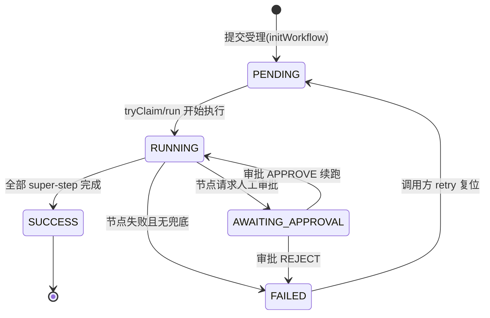

# 工作流生命周期（提交到终态）

> 生成时间：2026-08-25 ｜ 代码版本：main@2a37d6b ｜ 可信度概览：已确认 23 条 / 合理推断 1 条 / 待确认 1 条

> **变更记录**
> - 更新时间：2026-08-25
> - 关联 Commit/PR：2a37d6b（CodeGraph 索引 v2 精化，无代码变更）
> - 本次修改的业务影响：无（取证精度升级——13 条 REST 路由、8 处状态写入点、tryClaim/dispatch 调用链经 CodeGraph 图谱复核，全部与源码一致；Kafka retry 复位与认领并发安全从「合理推断」升级「已确认」，依据 `CheckpointManagerTest.tryClaimConcurrentExactlyOneWins` 并发断言 + `WorkflowControllerTest.retryResetsToPendingBeforeDispatch` + `KafkaDispatchE2eIT.replayDoesNotReRun` 三重 B 级证据）
> - 是否新增待确认问题：否

## 1. 业务目标

业务方（人或上游系统）用 YAML 声明一个多 Agent 协作任务（如供应商风险评估、合同审核），提交给 AgentFlow 引擎异步执行，并在任意时刻查询执行进度与最终结果。引擎保证：提交即返回受理凭证（不阻塞等待长耗时 LLM 调用）、执行过程断点可恢复、每个节点结果可追溯。

服务的角色：**工作流提交者**（持有 API Key 的调用方，只见自己的工作流）与 **管理员**（持有 admin API Key，可管理工具授权与查看全部审批）。

业务结果：一次工作流执行实例从受理（PENDING）到达终态（SUCCESS / FAILED / AWAITING_APPROVAL 待人工决策）。

## 2. 范围与边界

- 包含：提交校验（YAML 解析、工具授权、提交守卫）、受理落库、异步派发（本地 VT / Kafka）、BSP 引擎执行到终态、状态查询、失败重试入口
- 不包含：人工审批决策与恢复续跑（见 [hitl-approval.md](hitl-approval.md)）、崩溃后自动恢复协议（见 [crash-recovery-retry.md](crash-recovery-retry.md)）、运行时条件路由细节（见 [dynamic-routing-and-loops.md](dynamic-routing-and-loops.md)）
- 上游流程：调用方准备 YAML 定义 + 业务入参（inputs）
- 下游流程：HITL 审批（AWAITING_APPROVAL 分支）、崩溃恢复（FAILED 分支）、诊断/轨迹查询（终态后）
- 涉及服务/模块：agentflow-api（REST 入口 + 派发）、agentflow-core（BspEngine 引擎 + checkpoint）、agentflow-kafka-starter（可选异步分发）、agentflow-version（定义版本管理）

## 3. 触发方式

| 类型 | 触发点 | 调用方/来源 | 证据 |
|---|---|---|---|
| HTTP | `POST /api/workflows`（提交） | UI SubmitForm / 外部调用方 | agentflow-api/src/main/java/com/agentflow/api/WorkflowController.java#submit |
| HTTP | `GET /api/workflows/{id}/status`（状态轮询） | UI 看板 / 调用方 | WorkflowController.java#getStatus |
| HTTP | `POST /api/workflows/{id}/retry`（失败重试） | UI / 调用方 | WorkflowController.java#retry |
| HTTP | `GET /api/workflows`（创建者的实例列表） | UI 看板 | WorkflowController.java#list |
| MQ（可选装配） | Topic `agentflow.workflow.executions`（提交消息投递 → 消费者执行） | KafkaWorkflowDispatcher（生产者）→ KafkaWorkflowConsumer（消费者） | agentflow-kafka-starter/.../KafkaWorkflowDispatcher.java#TOPIC、KafkaWorkflowConsumer.java#onMessage |

## 4. 前置条件与输入

| 条件/输入 | 说明 | 校验位置 | 证据 |
|---|---|---|---|
| X-API-Key 请求头 | 有效 API Key（SHA-256 hash 比对集合），缺失/无效 → 401 | ApiKeyAuthFilter#doFilterInternal | agentflow-api/.../security/ApiKeyAuthFilter.java |
| workflowName + yamlContent + inputs | 请求体三要素；yamlContent 必须可解析 | WorkflowController#submit | WorkflowController.java#SubmitRequest |
| YAML 三层校验通过 | 结构/语义/DAG 完整性（节点 id 唯一、无自环、无环等） | WorkflowDSLParser + SemanticValidator | agentflow-core/.../dsl/SemanticValidator.java#validate |
| nodes 非空 | 可解析但缺 nodes 段 → 400 INVALID_YAML | WorkflowController#submit（1.5 兜底） | WorkflowController.java:170 |
| 节点 tools 均已授权 | 调用方对 YAML 中每个 tool 有授权（config ∪ DB，全空才 allow-all），未授权 → 403 | CallerToolAllowlist#isAllowed | WorkflowController.java:176-188、agentflow-api/.../security/CallerToolAllowlist.java |
| 提交守卫通过 | 节点数 ≤ maxNodes（默认 500）、预估成本 ≤ maxCostUsd（配置了才启用）→ 否则 422 SUBMISSION_LIMIT | WorkflowSubmissionGuard#check | agentflow-api/.../security/WorkflowSubmissionGuard.java#check |

## 5. 主流程

1. **鉴权与身份提取**。
   - ApiKeyAuthFilter 校验 X-API-Key，通过后把 Key 的 SHA-256 hash 写入 request attribute `callerId`。
   - 相关对象：API Key 集合（配置 `agentflow.api.api-keys`）。
   - 数据变化：无（request attribute）。
   - 证据：ApiKeyAuthFilter.java#doFilterInternal → WorkflowController.java#submit。

2. **YAML 解析与校验（同步）**。
   - 解析失败 → 400 INVALID_YAML；nodes 缺失 → 400。
   - 相关对象：WorkflowDefinition（含 nodes/edges/channels/agentflow 元数据）。
   - 数据变化：无持久化（纯内存对象）。
   - 证据：WorkflowController.java#submit 步骤 1/1.5 → SemanticValidator.java#validate。

3. **工具级授权检查**。
   - 遍历所有节点 tools，任一未授权 → 403 FORBIDDEN（不产生执行记录）。
   - 数据变化：无。
   - 证据：WorkflowController.java:176-188 → CallerToolAllowlist#isAllowed。

4. **提交守卫（预防性拦截）**。
   - 节点数超上限或预估成本超预算 → 422（不 initWorkflow、不产生执行记录）。
   - 证据：WorkflowController.java:191-195 → WorkflowSubmissionGuard#check。

5. **受理落库（staging）**。
   - 生成 UUID workflowId，`initWorkflow` 写入 workflow_executions 表（status=PENDING，含 created_by=callerId、workflow_name、version）；同时 `recordWorkflowDefinition` 把解析后的定义按 (name, version) 存入定义存储（恢复/retry 不再从 classpath 读）。
   - 数据变化：workflow_executions 插入一行 PENDING；workflow_definitions 插入定义。
   - 证据：WorkflowController.java:198-206 → PostgresCheckpointManager.java#initWorkflow → WorkflowVersionManager.java#recordWorkflowDefinition。

6. **异步派发**。
   - 提交方线程调 `dispatcher.dispatch(...)` 后立即返回 202 + workflowId + status 链接。默认 LocalVirtualThreadDispatcher（本进程虚拟线程立即开始执行）；配置 `agentflow.kafka.enabled=true` 时换 KafkaWorkflowDispatcher（消息发 Topic，消费者拉取执行）。
   - 数据变化：Kafka 模式下写入 Topic `agentflow.workflow.executions`（key=workflowId）。
   - 证据：WorkflowController.java:210-217 → LocalVirtualThreadDispatcher.java#dispatch / KafkaWorkflowDispatcher.java#dispatch。

7. **执行（WorkflowExecutionService.run）**。
   - 定义按 (name, version) 从版本存储重取（缺失重试 3 次、每次退避 1s，仍缺失 → 异常不进 RUNNING）；置 RUNNING → BspEngine.execute 按 super-step 分层执行（每层并行跑节点、barrier 合并 channel、两级 checkpoint 落盘）→ 无暂停则置 SUCCESS，异常则置 FAILED。
   - 引擎若因审批暂停（状态已被引擎置 AWAITING_APPROVAL），run() 不误标 SUCCESS。
   - 数据变化：workflow_executions.status 流转；node_outputs / checkpoints / routing_decisions 持续写入。
   - 证据：WorkflowExecutionService.java#run → BspEngine.java#execute。

8. **状态查询与看板**。
   - 调用方轮询 GET /status（仅创建者，非创建者 403 防 IDOR）；GET /api/workflows 返回创建者的实例列表（看板数据源）。
   - 证据：WorkflowController.java#getStatus/list → WorkflowOwnershipChecker#requireOwnership → CheckpointManager#listByCreatedBy。

9. **失败重试入口**。
   - 仅 FAILED 可重试（其他状态 → 400）；先把状态复位 PENDING（Kafka 模式防终态跳过吞掉 retry），再走与 submit 相同的 dispatcher 派发重跑。
   - 证据：WorkflowController.java#retry → dispatcher.dispatch。

## 6. 流程图

## 7. 关键业务规则

| 编号 | 规则 | 触发条件 | 处理结果 | 影响范围 | 证据 | 可信度 |
|---|---|---|---|---|---|---|
| R1 | 提交即受理、异步执行 | POST 提交合法 | 立即 202，不等待 LLM 执行完成 | 全部工作流 | WorkflowController.java#submit 注释（避免 30-120s+ 阻塞） | 已确认 |
| R2 | 提交前预防性拦截：节点数上界（默认 500） | nodes.size() > maxNodes | 422 SUBMISSION_LIMIT，不产生执行记录 | 提交方 | WorkflowSubmissionGuard.java#check、DEFAULT_MAX_NODES | 已确认 |
| R3 | 提交前成本上界拦截 | model+maxCostUsd 已配置且估算成本超限 | 422（估算：prompt 长度/4 字符/token + 每节点基准 500 in/500 out） | 提交方 | WorkflowSubmissionGuard.java#estimateCost | 已确认 |
| R4 | 工具级授权：未授权 tool 提交 → 403 | YAML 节点引用调用方未授权的 tool | 拒绝提交，不落执行记录 | 提交方 | WorkflowController.java:176-188 + CallerToolAllowlist | 已确认 |
| R5 | 数据可见性：仅创建者可查/重试自己的工作流 | status/trace/retry 请求非创建者发起 | 403（防 IDOR） | 全部实例 | WorkflowOwnershipChecker#requireOwnership | 已确认 |
| R6 | 仅 FAILED 可重试 | retry 请求时状态非 FAILED | 400，提示当前状态 | 失败实例 | WorkflowController.java#retry:314 | 已确认 |
| R7 | retry 先复位 PENDING 再派发 | retry 通过校验 | Kafka 消费者不会因「终态跳过」吞掉 retry | 失败实例 | WorkflowController.java#retry:320-328 注释 | 已确认 |
| R8 | Kafka 消费幂等：终态跳过 | 消费者收到已 SUCCESS/FAILED 的消息 | 跳过不重跑（防重复计费）；未 staged 任意 id 丢弃 | Kafka 模式 | KafkaWorkflowConsumer#onMessage + CheckpointManager#tryClaim 注释 | 已确认 |
| R9 | Kafka 原子认领：仅 PENDING→RUNNING 恰一消费者执行 | 并发重复投递同一 workflowId | 条件 UPDATE 原子转移，败者跳过 | Kafka 模式 | PostgresCheckpointManager.java#TRY_CLAIM_SQL、InMemoryCheckpointManager#tryClaim | 已确认 |
| R10 | 提交与重试共用统一执行语义 | submit/retry | 都经 dispatcher → WorkflowExecutionService.run（本地/Kafka 无双路径漂移） | 全部 | WorkflowController.java#retry 注释（KTD-B） | 已确认 |
| R11 | 定义按 (name, version) 提交时存储、执行时重取 | submit 落定义 / run 取定义 | 版本 bump 后旧实例仍按旧 DAG 执行 | 版本管理 | WorkflowController.java:202-206 + WorkflowExecutionService#loadDefinitionWithRetry | 已确认 |
| R12 | 定义缺失重试 3 次仍取不到 → 不进 RUNNING | 版本存储查无定义 | 抛异常（PENDING 保持），防孤儿 RUNNING | 执行侧 | WorkflowExecutionService.java:103-115 | 已确认 |
| R13 | 审批暂停不误标成功 | 引擎置 AWAITING_APPROVAL | run() 提前 return 不写 SUCCESS | HITL 工作流 | WorkflowExecutionService.java:74-78 | 已确认 |

## 8. 状态与生命周期

WorkflowStatus（agentflow-core/.../engine/checkpoint/WorkflowStatus.java，V7 迁移扩展 AWAITING_APPROVAL）：

| 当前状态 | 触发动作/事件 | 下一个状态 | 前置条件 | 副作用 | 证据 |
|---|---|---|---|---|---|
| （不存在） | initWorkflow（提交受理） | PENDING | 提交校验全通过 | workflow_executions 插入行 | PostgresCheckpointManager#initWorkflow |
| PENDING | 消费者/本地线程开始执行 run() | RUNNING | 定义可加载 | 无（本地模式直接置；Kafka 由 tryClaim 原子转移） | WorkflowExecutionService#run、PostgresCheckpointManager#TRY_CLAIM_SQL |
| RUNNING | 引擎正常跑完全部 super-step | SUCCESS | 无暂停无异常 | node_outputs/checkpoints/routing_decisions 落盘、指标记录 | WorkflowExecutionService.java:79 |
| RUNNING | 引擎任一节点失败聚合抛出 | FAILED | 无 on_error 兜底可用 | 失败层不写 barrier checkpoint | BspEngine.java:249-264、applyBarrier |
| RUNNING | 引擎遇审批请求 | AWAITING_APPROVAL | 节点抛 ApprovalRequiredException | 审批单 + 上下文快照落库 | BspEngine#applyBarrier（approval 分支） |
| AWAITING_APPROVAL | 审批 APPROVE 续跑完成 / REJECT | SUCCESS / FAILED | 见 hitl-approval.md | — | BspEngine#approveAndResume |
| FAILED | 调用方 POST retry | PENDING | 仅创建者 | 复位后重新派发 | WorkflowController#retry:324 |

## 9. 数据变更与一致性

| 数据对象 | 操作 | 关键字段 | 事务/一致性策略 | 证据 |
|---|---|---|---|---|
| workflow_executions | 插入（PENDING）+ 状态更新 | id、workflow_name、workflow_version、status、created_by | initWorkflow 用 `ON CONFLICT DO NOTHING` 幂等；tryClaim 条件 UPDATE 原子 | PostgresCheckpointManager.java#initWorkflow/TRY_CLAIM_SQL |
| workflow_definitions | 插入 (name, version) 定义 | definition JSONB（V8 起密文 TEXT） | 提交时记录；执行时重取（对称） | WorkflowVersionManager#recordWorkflowDefinition、V3/V8 迁移 |
| workflow_node_outputs | 每节点完成即写 | round、super_step、node_id、output、status | 节点级 checkpoint（防 LLM 重复计费）；COMPLETED 不可覆盖 | BspEngine#runSuperStep:792、NodeOutputStore |
| workflow_checkpoints | 每 barrier 写 | round、super_step、channel_values | 仅成功层写；(workflow, round, step) 唯一约束 | BspEngine#runStep:882、V1/V5 迁移 |
| workflow_routing_decisions | 每 barrier 后覆盖写累计列表 | decisions（from->to 数组） | 路由先于 barrier 落盘（崩溃窗口不丢） | BspEngine#runStep:881、V4 迁移 |
| Kafka Topic | 生产执行消息 | key=workflowId | String 承载 JSON；at-least-once + 消费端幂等 | KafkaWorkflowDispatcher#dispatch |

## 10. 异常、重试与补偿

| 场景 | 触发条件 | 系统行为 | 重试/补偿/人工处理 | 证据 | 可信度 |
|---|---|---|---|---|---|
| YAML 非法 | 解析/校验失败 | 400 INVALID_YAML（同步返回） | 调用方修正后重提 | WorkflowController.java:164-173 | 已确认 |
| 工具未授权 | allowlist 拒绝 | 403（提示具体 tool 名） | 找管理员 grant（见权限流程，本批未文档化） | WorkflowController.java:181-183 | 已确认 |
| 提交超限 | 守卫拒绝 | 422（原因安全可外露） | 调小 DAG 或申请预算 | WorkflowSubmissionGuard#check | 已确认 |
| 定义缺失 | 版本存储查无（重试 3 次退避 1s） | 异常抛出，PENDING 不进 RUNNING | 人工核查定义存储；Kafka 模式消费者兜底标 FAILED（防孤儿 PENDING） | WorkflowExecutionService#loadDefinitionWithRetry + KafkaWorkflowConsumer:69-72 | 已确认 |
| 引擎执行异常 | 节点失败聚合/其他 RuntimeException | FAILED + 指标记录；trace 标 FAILED | 调用方可 retry；或崩溃恢复（另文档） | WorkflowExecutionService#run:80-83 | 已确认 |
| Kafka 消息反序列化失败 | payload 非法 JSON | 记 error 跳过（不重试） | 重放会重投，人工排查消息源 | KafkaWorkflowConsumer:44-49 | 已确认 |
| 节点级 checkpoint 写失败 | DB 抖动等 | 降级 warn 不崩溃工作流；恢复时该节点可能重跑（重复计费风险由恢复协议兜底） | — | BspEngine#runSuperStep:790-796 | 已确认 |
| 节点超时 | Future.get 超时（默认 120s，节点可配） | cancel(true) 中断 VT + 适配器级 HTTP abort → Failure | 由 U4 重试策略处理（transient 重试） | NodeExecutor#execute/cancelNode | 已确认 |

## 11. 权限、幂等与并发控制

- 权限/数据权限：双层——ApiKeyAuthFilter（401）+ WorkflowOwnershipChecker（403 防 IDOR，callerId=API Key SHA-256 hash 与 created_by 比对）；列表接口按创建者过滤。已确认（ApiKeyAuthFilter.java、WorkflowOwnershipChecker.java、WorkflowController#list）。
- 幂等键/防重逻辑：Kafka 消费 `tryClaim`（条件 UPDATE，PENDING→RUNNING 恰一胜出；CodeGraph 证实生产调用方唯一 = KafkaWorkflowConsumer.onMessage，并发恰一胜出有 `CheckpointManagerTest.tryClaimConcurrentExactlyOneWins` 断言锁定）；initWorkflow `ON CONFLICT DO NOTHING`；审批决策原子转移（另文档）。已确认。
- 并发控制策略：同 super-step 节点并行（Virtual Threads）+ CompletableFuture.allOf barrier；channel 并发写按节点声明序 Reducer 确定性合并；Postgres 写入 Semaphore(20) 限流。已确认（BspEngine#runSuperStep、PostgresCheckpointManager）。
- 可能的竞态风险：Kafka retry 复位 PENDING 与消费者并发认领——已由三重证据闭环：`retryResetsToPendingBeforeDispatch`（复位先行断言）+ `tryClaimConcurrentExactlyOneWins`（认领原子性）+ `KafkaDispatchE2eIT.replayDoesNotReRun`（真 Kafka 重放不重跑）。升级为已确认。
- 租户/组织维度隔离：无独立租户概念，以「创建者 API Key hash」为数据可见性边界。已确认。

## 12. 外部依赖与契约

| 依赖系统/组件 | 调用目的 | 请求/事件 | 成功处理 | 失败处理 | 证据 |
|---|---|---|---|---|---|
| LLM Provider（Spring AI / LangChain4j 适配器 → DeepSeek 等） | 节点执行 | ChatRequest（prompt + tools + schema） | AgentOutput 写 channel | 异常映射 Transient/Fatal → 重试或失败 | AgentFunction 契约（agentflow-core/.../agent/）、NodeExecutor |
| PostgreSQL（生产） | checkpoint/执行记录/定义/审批持久化 | SQL（Flyway V1–V8 迁移） | 落盘 | 节点级降级 warn；生命周期写失败按场景处理 | PostgresCheckpointManager |
| Kafka（可选，`agentflow.kafka.enabled`） | 提交/执行解耦 | Topic `agentflow.workflow.executions`（JSON 字符串，key=workflowId） | 消费者执行 | 反序列化失败跳过；执行异常标 FAILED | KafkaWorkflowDispatcher/Consumer |

## 13. 代码证据索引

| # | 证据 | 类型 | 支持的结论 |
|---|---|---|---|
| E1 | agentflow-api/src/main/java/com/agentflow/api/WorkflowController.java#submit | 源码 | 提交主链路：解析→授权→守卫→落库→派发→202 |
| E2 | agentflow-api/src/main/java/com/agentflow/api/security/WorkflowSubmissionGuard.java#check | 源码 | 节点数/成本上界 422 拦截（R2/R3） |
| E3 | agentflow-api/src/main/java/com/agentflow/api/security/ApiKeyAuthFilter.java#doFilterInternal | 源码 | X-API-Key 鉴权 401 + callerId 注入 |
| E4 | agentflow-api/src/main/java/com/agentflow/api/security/WorkflowOwnershipChecker.java#requireOwnership | 源码 | 创建者所有权 403 防 IDOR（R5） |
| E5 | agentflow-api/src/main/java/com/agentflow/api/WorkflowController.java#retry | 源码 | 仅 FAILED 可重试 + PENDING 复位（R6/R7） |
| E6 | agentflow-api/src/main/java/com/agentflow/api/WorkflowExecutionService.java#run | 源码 | RUNNING→SUCCESS/FAILED 收敛 + 审批不误标（R13） |
| E7 | agentflow-api/src/main/java/com/agentflow/api/WorkflowExecutionService.java#loadDefinitionWithRetry | 源码 | 定义重取 3 次退避（R12） |
| E8 | agentflow-kafka-starter/src/main/java/com/agentflow/kafka/KafkaWorkflowConsumer.java#onMessage | 源码 | tryClaim 幂等 + 未 staged 丢弃 + 兜底 FAILED（R8） |
| E9 | agentflow-core/src/main/java/com/agentflow/engine/checkpoint/PostgresCheckpointManager.java#TRY_CLAIM_SQL | 源码 | 原子认领条件 UPDATE（R9） |
| E10 | agentflow-kafka-starter/src/main/java/com/agentflow/kafka/KafkaWorkflowDispatcher.java#TOPIC | 源码 | Topic 名 `agentflow.workflow.executions` |
| E11 | agentflow-api/src/main/java/com/agentflow/api/LocalVirtualThreadDispatcher.java#dispatch | 源码 | 默认本地 VT 派发等价 v1 行为 |
| E12 | agentflow-core/src/main/java/com/agentflow/engine/BspEngine.java#execute | 源码 | BSP 执行 + 状态流转 + 指标/trace 记录 |
| E13 | agentflow-core/src/main/java/com/agentflow/engine/NodeExecutor.java#execute | 源码 | 节点超时（默认 120s）+ cancel + ApprovalRequired 三态识别 |
| E14 | agentflow-core/src/main/java/com/agentflow/engine/checkpoint/WorkflowStatus.java | 源码 | 五状态枚举（含 AWAITING_APPROVAL） |
| E15 | agentflow-core/src/main/resources/db/migration/V7__hitl_approval_and_encryption.sql | DDL | status CHECK 扩列 + 审批表 |
| E16 | agentflow-core/src/main/java/com/agentflow/engine/checkpoint/CheckpointManager.java | 源码 | 两级 checkpoint SPI + tryClaim/审批 default 方法契约 |
| E17 | CodeGraph: `callers tryClaim` → 生产唯一调用方 KafkaWorkflowConsumer.onMessage:40；`callers dispatch` → 生产恰两处 WorkflowController.submit:152 / retry:298（submit/retry 对称实锤） | CodeGraph | R9/R10 调用链闭环 |
| E18 | agentflow-core/src/test/java/com/agentflow/engine/checkpoint/CheckpointManagerTest.java#tryClaimConcurrentExactlyOneWins:217 | 测试 | 认领并发恰一胜出断言（R9 B 级交叉验证） |
| E19 | agentflow-api/src/test/java/com/agentflow/api/WorkflowControllerTest.java#retryResetsToPendingBeforeDispatch:259 | 测试 | retry 复位先行断言（R7 B 级交叉验证） |
| E20 | agentflow-kafka-starter/src/test/java/com/agentflow/kafka/KafkaDispatchE2eIT.java#replayDoesNotReRun:133 | 测试 | 真 Kafka 重放不重跑（R8 B 级交叉验证） |

## 14. 待业务确认的问题

1. **问题**：Kafka 模式下 `auto.offset.reset=earliest`（默认）对新消费组的历史消息回放——生产环境是否需要限定消费组或改 latest？
   - 为什么代码不足以确认：装配面默认 earliest（任务队列语义），但生产 offset 策略属运维决策，代码中未发现环境差异化配置。
   - 建议向谁确认：运维/架构师。
   - 建议核查的资料或日志：KafkaAgentFlowAutoConfiguration 装配 + 生产消费组 offset 管理策略。
