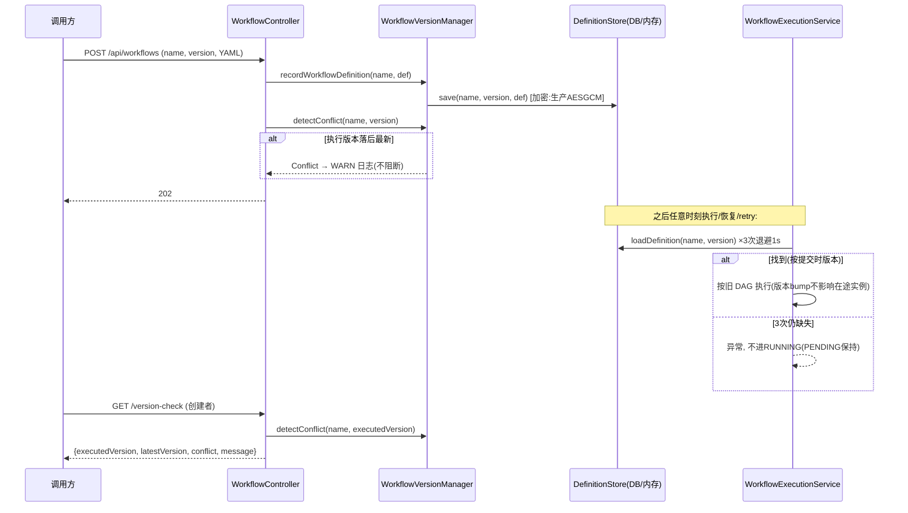

# 工作流版本管理（定义持久化与版本冲突）

> 生成时间：2026-08-26 ｜ 代码版本：main@2a37d6b ｜ 可信度概览：已确认 13 条 / 合理推断 1 条 / 待确认 1 条

## 1. 业务目标

工作流 YAML 定义会演进（加节点、改 prompt、bump 版本号）。没有版本管理时，「恢复/重试一个上周提交的实例」只能从 classpath 读定义——读到的已是新版，旧实例会按没见过的 DAG 继续跑，语义漂移。本能力把「定义」变成带版本的数据：提交时快照存库，执行/恢复/重试时**按 (工作流名, 版本) 精确取回**——版本 bump 后旧实例仍按旧 DAG 执行到结束；同时提供冲突检测（执行版本落后于最新定义版本时 WARN 提示，不阻断）。

## 2. 范围与边界

- 包含：定义存储（InMemory/Postgres）、提交时记录、执行时重取（含瞬时重试）、版本冲突检测端点、加密存储
- 不包含：提交流程本体（见 [workflow-lifecycle.md](workflow-lifecycle.md)）、执行/恢复细节（见 [crash-recovery-retry.md](crash-recovery-retry.md)）、DSL 解析校验
- 上游流程：工作流生命周期（submit 调 recordWorkflowDefinition）
- 下游流程：执行/恢复/retry（loadDefinition 消费）
- 涉及服务/模块：agentflow-core/version（Manager/Detector/Store×2）、agentflow-api（version-check 端点）

## 3. 触发方式

| 类型 | 触发点 | 调用方/来源 | 证据 |
|---|---|---|---|
| 内部调用 | submit → recordWorkflowDefinition（每次提交快照） | WorkflowController.submit:204 | CodeGraph: recordWorkflowDefinition 生产唯一调用点 |
| 内部调用 | run/resumeAfterApproval → loadDefinition（执行前重取，3 次退避） | WorkflowExecutionService | WorkflowExecutionService#loadDefinitionWithRetry |
| HTTP | `GET /api/workflows/{id}/version-check`（仅创建者） | 调用方 | WorkflowController.java:242 |
| 内部调用 | submit → detectConflict（提交时记 WARN） | WorkflowController.submit:205-206 | WorkflowController.java:205 |

## 4. 前置条件与输入

| 条件/输入 | 说明 | 校验位置 | 证据 |
|---|---|---|---|
| 定义已解析通过 | submit 链路前置（YAML 三层校验） | SemanticValidator | workflow-lifecycle.md 第 4 节 |
| workflowName + version 定位键 | (name, version) 二元组；version 缺失默认 "1.0" | store.save/find | WorkflowVersionManager#recordWorkflowDefinition + WorkflowController:255-256 |
| version-check 需创建者 | ownership 403 | requireOwnership | WorkflowController:247-252 |

## 5. 主流程

1. **提交时记录快照**。
   - submit 在 initWorkflow 后调 `recordWorkflowDefinition(name, def)` → store.save(name, def.version(), def)——按 (name, version) 存入 workflow_definitions 表（Postgres）或内存 Map（InMemory，demo 用）。
   - 数据变化：workflow_definitions 插入/覆盖 (name, version) 行。
   - 证据：WorkflowController.java:202-206 → WorkflowVersionManager#recordWorkflowDefinition:32-34。

2. **提交时冲突检测（WARN）**。
   - detectConflict 比较「本次提交版本」与「该 name 最新定义版本」；不同则记 WARN 日志（不阻断提交）。同一版本重复提交覆盖存储（latest 定义刷新）。
   - 证据：WorkflowController.java:205-206 → VersionConflictDetector#detect:24-36。

3. **执行时重取（不再读 classpath）**。
   - run/resumeAfterApproval 开头 loadDefinition(name, version)：3 次尝试、间隔 1s 退避（为跨节点部署的消费时序竞态留窗口）；仍缺失 → 抛 IllegalStateException，**不置 RUNNING**（PENDING 保持）。
   - 证据：WorkflowExecutionService#loadDefinitionWithRetry:103-115。

4. **恢复/retry 用旧版本定义**。
   - 崩溃恢复与 retry 从 checkpoint 的 findWorkflowName/findVersion 定位定义——版本 bump 后旧实例按旧 DAG 续跑（R14 语义核心）。
   - 证据：WorkflowController#retry:326-327 + CLAUDE.md U8 记录。

5. **冲突检查端点**。
   - GET /version-check（创建者 only）：读执行记录的 name/version → detectConflict → 返回 {executedVersion, latestVersion, conflict, message}。**语义=提示不阻断**——已运行实例按各自版本执行到结束。
   - 证据：WorkflowController#versionCheck:242-267。

6. **定义加密存储（生产）**。
   - starter 装配 PostgresWorkflowDefinitionStore 注入 `ColumnEncryptors.fromEnvStrict()`——definition 列存 AESGCM 密文（V8 迁移 JSONB→TEXT）；缺 key 启动即失败（fail-closed，杜绝「checkpoint 加密了、定义还明文」）。
   - 证据：AgentFlowAutoConfiguration.java:113-114 + V8 迁移。

## 6. 流程图

## 7. 关键业务规则

| 编号 | 规则 | 触发条件 | 处理结果 | 影响范围 | 证据 | 可信度 |
|---|---|---|---|---|---|---|
| R1 | 定义按 (name, version) 提交时快照存库 | 每次合法提交 | 后续执行不再依赖 classpath/调用方重传 | 一致性根基 | WorkflowController:202-206 + WorkflowVersionManager | 已确认 |
| R2 | 版本 bump 后旧实例按旧 DAG 执行到终态 | 恢复/retry 遇定义已 bump | 按 checkpoint 记录的 (name, version) 取旧定义 | 在途实例稳定性 | retry:326-327 + VersionTest#storeKeepsPerVersionDefinitionsForRecovery | 已确认 |
| R3 | 冲突检测 WARN 不阻断 | 执行版本 ≠ 最新定义版本 | 日志 WARN + 端点提示；执行照旧 | 升级策略 | VersionConflictDetector:34-35 消息措辞 + versionCheck 注释 | 已确认 |
| R4 | 同 (name, version) 重复提交覆盖存储 | 再次提交同版本定义 | latest 定义刷新（upsert 语义） | 幂等提交 | PostgresWorkflowDefinitionStore#save（CodeGraph: save:69 toEncryptedJson 写点） | 已确认 |
| R5 | 定义缺失不进 RUNNING | loadDefinition 3 次×1s 退避仍空 | 异常抛出，PENDING 保持（Kafka 消费者兜底 FAILED） | 无孤儿 RUNNING | loadDefinitionWithRetry:103-115 | 已确认 |
| R6 | 退避窗口为跨节点竞态预留 | 消费时序早于定义写入可见 | 3s 总容忍（单 JVM 内同步可见，恒命中） | 分布式预备 | loadDefinitionWithRetry 注释 | 已确认 |
| R7 | version-check 仅创建者可查 | 非创建者 | 403 | 数据可见性 | versionCheck:247-252 | 已确认 |
| R8 | 执行记录版本缺失兜底 "1.0" | findVersion 空/blank | 按 "1.0" 查定义（U5 早期实例兼容） | 向后兼容 | WorkflowController:255-256 / retry:327 | 已确认 |
| R9 | 生产定义存储强制加密 | starter 装配 | fromEnvStrict——缺 key 启动失败；definition 列 AESGCM 密文 | 安全 | AgentFlowAutoConfiguration:113-114 + V8 迁移 | 已确认 |
| R10 | InMemory 存储重启丢失 | demo/开发装配 | 定义存内存 Map——重启后在途实例 loadDefinition 失败 | 已知限制（demo 定位） | InMemoryWorkflowDefinitionStore（demo-api ApiConfig 注册） | 已确认 |
| R11 | findWorkflowName/findVersion 是恢复定位键 | 恢复/retry | CheckpointManager 提供（InMemory+Postgres 均实现） | 恢复闭环 | CheckpointManager 接口:157-168 | 已确认 |
| R12 | 冲突消息明确「按已运行版本继续执行到结束」 | 冲突发生 | 消息内嵌策略说明（运维/调用方可读） | 可运维性 | VersionConflictDetector:34-35 | 已确认 |
| R13 | 提交时同版本重提交也触发冲突检测比较 | 同版本重复提交 | latest==executed → 无冲突（empty） | 语义一致性 | detect:30-32 equals 比较 | 已确认 |

## 8. 状态与生命周期

定义无状态机（(name, version) 行的存在性 + latest 指针语义）。相关生命周期是**执行实例视角的版本关系**：

| 场景 | 触发 | 行为 | 证据 |
|---|---|---|---|
| 在途实例 + 定义 bump | 恢复/retry | 按旧版本定义续跑；version-check 报 conflict=true | R2/R3 |
| 在途实例 + 同版本重提交 | 恢复/retry | 按覆盖后的定义（同版本同键）| R4 |
| 新提交 | submit | 以请求（或定义）版本为准快照 | WorkflowController:199 |

（无 mermaid 状态图——无状态流转。）

## 9. 数据变更与一致性

| 数据对象 | 操作 | 关键字段 | 事务/一致性策略 | 证据 |
|---|---|---|---|---|
| workflow_definitions | upsert (name, version) | definition（V8 起密文 TEXT）、updated_at | 主键 (workflow_name, version)；latest 查询按 updated_at 倒序 | V3/V8 迁移 + PostgresWorkflowDefinitionStore |
| workflow_executions | 记录 name/version | workflow_name、workflow_version | initWorkflow 时写入；恢复定位用 | PostgresCheckpointManager#initWorkflow |

## 10. 异常、重试与补偿

| 场景 | 触发条件 | 系统行为 | 重试/补偿/人工处理 | 证据 | 可信度 |
|---|---|---|---|---|---|
| 定义缺失（瞬时） | 消费时序竞态 | 3 次退避重试 | 自动恢复 | loadDefinitionWithRetry | 已确认 |
| 定义缺失（永久） | InMemory 重启/表被清 | 异常 + PENDING 保持；Kafka 兜底 FAILED | 人工重新提交或恢复定义存储 | 同上 + KafkaWorkflowConsumer | 已确认 |
| 冲突告警 | 版本落后 | WARN 日志（不干预执行） | 调用方决策是否放弃重跑 | VersionConflictDetector | 已确认 |
| 生产缺加密 key | starter 启动 | IllegalStateException fail-closed | 配置 AGENTFLOW_ENCRYPTION_KEY 重启 | AgentFlowAutoConfiguration:113-114 | 已确认 |

## 11. 权限、幂等与并发控制

- 权限/数据权限：version-check 仅创建者（403）；定义存储无 per-caller 隔离（同部署共享定义库——多调用方可提交同名工作流，后者覆盖前者同版本行）。合理推断（未见 caller 维度键；按 (name, version) 全局键推断——多人协作语义待业务确认，见 Q）。
- 幂等键/防重逻辑：(name, version) 主键 upsert。
- 并发控制策略：同版本并发提交 last-write-wins。
- 可能的竞态风险：两调用方并发提交同名同版本不同 YAML——最终存储只留一份（覆盖）；在途实例取到哪份取决于时序。合理推断。
- 租户/组织维度隔离：无——name 全局命名空间。

## 12. 外部依赖与契约

| 依赖系统/组件 | 调用目的 | 请求/事件 | 成功处理 | 失败处理 | 证据 |
|---|---|---|---|---|---|
| CheckpointManager | 执行记录的 name/version 定位 | findWorkflowName/findVersion | 恢复闭环 | empty → "1.0" 兜底 | 接口 default 方法 |
| ColumnEncryptor（生产） | definition 列加解密 | AESGCM: 前缀 | 密文存储 | 缺 key 启动失败 | fromEnvStrict + V8 |

## 13. 代码证据索引

| # | 证据 | 类型 | 支持的结论 |
|---|---|---|---|
| E1 | agentflow-core/src/main/java/com/agentflow/version/WorkflowVersionManager.java | 源码 | 三入口门面（record/load/detect，R1） |
| E2 | agentflow-core/src/main/java/com/agentflow/version/VersionConflictDetector.java#detect | 源码 | 冲突语义 WARN 不阻断 + 消息措辞（R3/R12） |
| E3 | agentflow-core/src/main/java/com/agentflow/version/PostgresWorkflowDefinitionStore.java#save | 源码 | upsert + 加密写点（R4/R9；CodeGraph: toEncryptedJson 5 生产写点之一） |
| E4 | agentflow-api/src/main/java/com/agentflow/api/WorkflowController.java#versionCheck:242-267 | 源码 | 冲突端点 + 创建者门控 + 1.0 兜底（R7/R8） |
| E5 | agentflow-api/src/main/java/com/agentflow/api/WorkflowExecutionService.java#loadDefinitionWithRetry | 源码 | 3 次退避 + 不进 RUNNING（R5/R6） |
| E6 | agentflow-starter/src/main/java/com/agentflow/starter/AgentFlowAutoConfiguration.java:107-114 | 源码 | 生产双 strict（checkpoint + 定义存储都强制加密，R9） |
| E7 | agentflow-core/src/main/resources/db/migration/V3__workflow_definitions.sql + V8 | DDL | 表结构 + JSONB→TEXT 加密化 |
| E8 | CodeGraph: `callers recordWorkflowDefinition` → 生产唯一 submit:152 | CodeGraph | 记录点唯一（R1 闭环） |
| E9 | agentflow-core/src/test/java/com/agentflow/version/VersionTest.java（storeKeepsPerVersionDefinitionsForRecovery:50 / managerDetectConflict:91） | 测试 | 旧版本保留 + 冲突检测（R2/R3 B 级交叉验证） |
| E10 | agentflow-api/src/test/java/com/agentflow/api/WorkflowExecutionServiceTest.java（definitionTransientMissingRetriesAndSucceeds:92 / definitionPermanentMissingThrowsWithoutStatusChange:106） | 测试 | 瞬时/永久缺失两分支（R5 B 级交叉验证） |

## 14. 待业务确认的问题

1. **问题**：定义库是全局命名空间——多调用方提交同名工作流时互相覆盖（同版本 last-write-wins）。协作语义是「共享库」还是需要 per-caller 命名空间？
   - 为什么代码不足以确认：(name, version) 是全局主键，无 createdBy 维度；单人 demo 语义自洽，多人协作是否冲突属产品决策。
   - 建议向谁确认：产品/架构师。
   - 建议核查的资料或日志：目标用户是个人开发者还是团队共享部署；同名工作流的业务预期。
