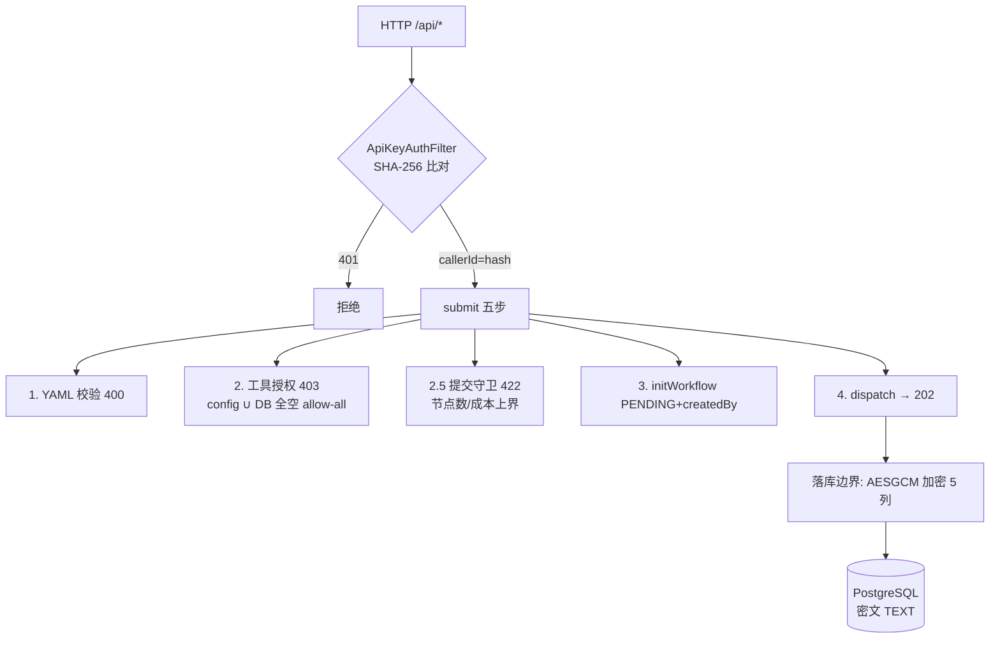

# API 安全体系全链路（鉴权/所有权/工具授权/提交守卫/列加密）

> 分析时间：2026-08-25 ｜ target：main@2a37d6b27e5d50687c656adbeedd2b92c0fdee92 ｜ 模式：deep-dive
> 取证方式：api/security 包 8 类全量精读 + WorkflowController submit 五步流水线 + R21/R22 git 交付史 + live 验证记录
> 分析范围：认证（API Key hash）、授权（ownership/admin/工具三层）、预防（提交守卫）、静态（R22 列加密）；未覆盖：网络层（TLS/网关）

## 1. 功能目标

多租户 API 的五层防御：认证（谁在调）→ 所有权（谁能看这个工作流）→ 工具授权（谁能用敏感工具）→ 提交守卫（防失控提交）→ 列加密（库被拖也不泄密）[需求已确认]（R21/R22 需求条目）。

## 2. 入口与触发方式

| 类型 | 触发点 | 覆盖范围 | 证据 |
|---|---|---|---|
| 认证 | `ApiKeyAuthFilter`（OncePerRequestFilter，/api/* 前缀） | 全部 13 条路由 | `agentflow-api/src/main/java/com/agentflow/api/security/ApiKeyAuthFilter.java#L40` |
| 所有权 | `WorkflowOwnershipChecker.requireOwnership` | status/trace/diagnosis/retry/version-check/审批 | `agentflow-api/src/main/java/com/agentflow/api/security/WorkflowOwnershipChecker.java` |
| 工具授权 | submit 时 `toolAllowlist.isAllowed(caller, tool)` 逐节点校验 | POST /workflows | `agentflow-api/src/main/java/com/agentflow/api/WorkflowController.java#L176-L188` |
| 提交守卫 | submit 时 `submissionGuard.check(def)` | POST /workflows | 同上 #L190-L195 |
| 列加密 | store 读写边界 `toEncryptedJson/decryptRaw` | 5 处敏感列 | `agentflow-core/src/main/java/com/agentflow/engine/checkpoint/PostgresCheckpointManager.java#L524-L531` |

## 3. 调用链（submit 五步流水线 + 认证前置）

```
HTTP /api/* → ApiKeyAuthFilter:
  X-API-Key header → SHA-256 hash → 命中 validKeyHashes → request.attr callerId=hash
  （callerId 即 hash——系统内不存明文 key）
→ WorkflowController#submit:
  1.  YAML 解析 + 语义校验（400 INVALID_YAML；nodes 空也 400——防 NPE 500）
  2.  工具授权：每节点 tools 逐个 isAllowed（403 FORBIDDEN）
      = config 静态 ∪ ToolGrantRepository DB 动态；两源全空 → allow-all（v1 兼容）
  2.5 提交守卫：节点数 > maxNodes(默认500) 或 预估成本 > maxCostUsd → 422 SUBMISSION_LIMIT
      成本估算：prompt 长度/4 + 每节点基准 500in/500out × 单价表
  3.  initWorkflow(PENDING, createdBy=callerId) → 3.5 recordWorkflowDefinition（版本管理）
  4.  dispatcher.dispatch → 202
→ 读端点（status/trace/...）：requireOwnership(workflowId, callerId)
  = findCreatedBy == callerId；否则 403（admin 另走 AdminApiKeys.isAdmin）
→ 工具管理 /api/tools/grants：GET 自读；POST/DELETE admin-only（防自授特权）
→ 落库边界（PG store）：明文 → toEncryptedJson（AESGCM: 前缀）→ TEXT 列
```

## 4. 核心类/方法职责

| 类/方法 | 职责 | 关键逻辑 | 证据 |
|---|---|---|---|
| `ApiKeyAuthFilter` | 认证 | SHA-256 hash 比对（内存存 hash 集，不存明文）；callerId=hash 供下游 | `agentflow-api/src/main/java/com/agentflow/api/security/ApiKeyAuthFilter.java` |
| `WorkflowOwnershipChecker` | 防 IDOR | findCreatedBy 比对 + callerIdFrom(request attr) | `agentflow-api/src/main/java/com/agentflow/api/security/WorkflowOwnershipChecker.java` |
| `CallerToolAllowlist` | 工具授权 union 语义 | config ∪ DB；任一放行；全空 allow-all（v1 兼容——渐进收紧） | `agentflow-api/src/main/java/com/agentflow/api/security/CallerToolAllowlist.java#L63-L84` |
| `ToolGrantController` | 授权管理 | GET 自读/admin 查任意；POST/DELETE admin-only（env AGENTFLOW_ADMIN_API_KEYS） | `agentflow-api/src/main/java/com/agentflow/api/security/ToolGrantController.java` |
| `WorkflowSubmissionGuard` | 预防性拦截 | 4 chars/token 估算 + 单价表折算；任一 null 禁用对应检查（reprised 语义） | `agentflow-api/src/main/java/com/agentflow/api/security/WorkflowSubmissionGuard.java` |
| `ColumnEncryptors.fromEnvStrict` | 生产 fail-closed | 缺 AGENTFLOW_ENCRYPTION_KEY 抛异常拒启动 | `agentflow-core/src/main/java/com/agentflow/security/ColumnEncryptors.java` |
| `AesGcmColumnEncryptor` | AES-256-GCM | 12B 随机 IV + 128-bit tag；`AESGCM:` 前缀自描述；legacy 明文原样返回 | `agentflow-core/src/main/java/com/agentflow/security/AesGcmColumnEncryptor.java` |

## 5. 数据模型与数据变化

| 表/对象 | 安全语义 | 证据 |
|---|---|---|
| workflow_executions.created_by | 所有权锚点（callerId hash） | V2 迁移 |
| caller_tool_grants（V6） | per-caller 工具动态授权 | `agentflow-api/src/main/java/com/agentflow/api/security/JdbcToolGrantRepository.java` |
| 5 处敏感列（channel_values/output/payload+snapshot/decisions/definition） | JSONB→TEXT + AESGCM 密文 | V7/V8 迁移 |
| AdminApiKeys | admin 身份第二通道（env 注入，收敛三处 hashKeys 单一真相源——U6 修复） | `agentflow-api/src/main/java/com/agentflow/api/security/AdminApiKeys.java` |

## 6. 同步与异步链路

全部安全检查在同步段（filter + submit 流水线 1-2.5 步），异步执行（dispatch 之后）不再做安全判定——**安全检查全部前移到副作用发生前** [代码已确认]（guard 注释「拒绝后不 initWorkflow，不产生执行记录」）。

## 7. 异常处理

| 场景 | 行为 | 证据 |
|---|---|---|
| 无/错 API Key | 401（filter 层，不进 controller） | ApiKeyAuthFilter |
| 非本人工作流 | 403（单资源）；空数组（聚合列表——不泄漏存在性） | 两 controller 对比 |
| 未授权工具 | 403 FORBIDDEN + 明示工具名 | submit 2 步 |
| 超提交上界 | 422 SUBMISSION_LIMIT | submit 2.5 步 |
| 生产缺加密 key | 启动失败（fail-closed） | fromEnvStrict |
| 密文损坏/轮换错 key | 聚合端点跳过该 wf（部分可用） | ApprovalCenterController |
| 审批单归属不符 | 400 APPROVAL_NOT_FOUND（不暴露他工作流审批存在性） | ApprovalController#L110-L113 |

## 8. 幂等、并发、事务

- key 只以 SHA-256 hash 形态驻留内存/DB——拖库拿不到可用凭证 [代码已确认]。
- 工具授权 grant/revoke 幂等（ON CONFLICT / 条件 DELETE）[代码已确认]。
- **已知边界**：API Key 认证无轮换/吊销机制（静态集合）；callerId 是 key hash（同一 key 两系统实例共享 hash——无租户隔离）[待确认]（open-questions Q13）。

## 9. Mermaid 流程图



## 10. 关键代码证据索引

| # | 证据 | 类型 | 支持的结论 |
|---|---|---|---|
| 1 | `agentflow-api/src/main/java/com/agentflow/api/security/ApiKeyAuthFilter.java` | 源码 | hash 认证 + callerId 注入 |
| 2 | `agentflow-api/src/main/java/com/agentflow/api/WorkflowController.java#L152-L218` | 源码 | submit 五步流水线 |
| 3 | `agentflow-api/src/main/java/com/agentflow/api/security/CallerToolAllowlist.java#L63-L84` | 源码 | union 语义 + allow-all 兼容 |
| 4 | `agentflow-core/src/main/java/com/agentflow/security/ColumnEncryptors.java` | 源码 | 宽严双工厂 |
| 5 | `agentflow-core/src/main/resources/db/migration/V7__hitl_approval_and_encryption.sql` + V8 | 迁移 | 列型 JSONB→TEXT 承载密文 |
| 6 | commit `45fd218`/`605bd3a`/`e1a2464` | git | R22 三段加密交付 |
| 7 | CLAUDE.md R21 live 验证记录（admin grant → 202/403） | 历史 | 工具授权实跑证据 |

## 11. 我的实现理解

这套安全体系的教学价值在于**每层防的东西不同，且都能说出攻击场景**：认证防匿名（401）；所有权防横向越权（IDOR——枚举 workflow_id 读他人 trace）；工具授权防纵向提权（持普通 key 者借工作流外泄财务 DB——授权在提交时强制而非运行时信任）；提交守卫防资源滥用（无界 VT/烧成本——防的是「合法用户犯错」和「被盗 key 作恶」）；列加密防拖库（最后防线）。五层是**纵深**关系：任何一层被绕过，下一层仍然成立。

最值得讲的两个取舍：① 工具授权的「全空 allow-all」——安全默认（deny-all）会破坏 v1 兼容让所有既有用户 403，选择渐进收紧并在 javadoc 明示，这是**安全的迁移成本意识**；② 加密的「宽严双工厂」——dev 明文可接受（安全不阻塞开发）、生产 fail-closed（拒绝静默降级），同一个加密器两种装配姿势，比全局一刀切聪明。

## 12. 我还需要确认的问题

（已同步 open-questions.md）
- Q13：API Key 无轮换/吊销（静态集合）——v1.1/v2 是否计划（JWT/短期 token）[待确认]。
