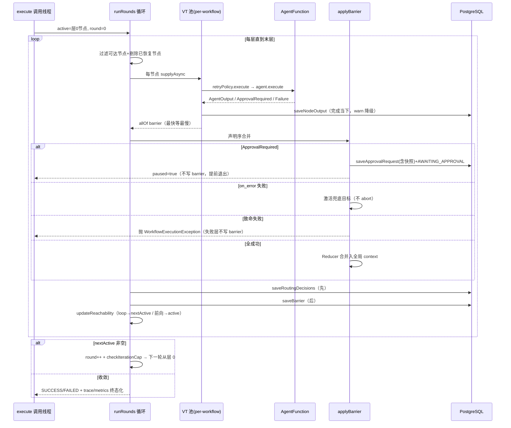

# BspEngine 执行循环全链路（BSP 从提交到终态）

> 分析时间：2026-08-25 ｜ target：main@2a37d6b27e5d50687c656adbeedd2b92c0fdee92 ｜ 模式：deep-dive
> 取证方式：BspEngine.java（1,158 行）全量精读 + NodeExecutor/RetryPolicy/WorkflowContext/SuperStep/ChannelReducer/DAGraph 逐类精读 + CodeGraph callers 逐跳验证
> 分析范围：execute → runRounds → runStep → runSuperStep → applyBarrier → updateReachability 全链；暂停/恢复/迭代轮次交织；未覆盖：UI 侧对 trace 的渲染细节

## 1. 功能目标

把一份 YAML 声明的 DAG 工作流，按 BSP（Bulk Synchronous Parallel）模型确定性执行完：同层并行、层间同步、失败按策略重试、崩溃可恢复、审批可暂停续跑 [需求已确认]（`docs/plans/agentflow/03-key-technical-decisions.md` KTD-1「BSP + 最长路径分层」）。

产品动机：多 Agent 协作的执行语义可预测（谁和谁并行、何时看到谁的输出、失败在哪一层）是编排引擎的核心承诺 [代码已确认]（BspEngine javadoc 循环定义「Plan→Execute→Barrier→Checkpoint」）。

## 2. 入口与触发方式

| 类型 | 触发点 | 调用方/来源 | 证据 |
|---|---|---|---|
| 主入口 | `BspEngine#execute`（4 个公开重载，最终汇到 private resolver 形式 :192） | WorkflowExecutionService#run（本地 VT / Kafka 消费 / retry 三路） | CodeGraph: BspEngine 95 callers [代码已确认] |
| 崩溃恢复 | `BspEngine#recoverAndExecute` :411 | 测试 + 演示（生产恢复入口在 demo 未接定时器） | CodeGraph callers [代码已确认] |
| 审批恢复 | `BspEngine#approveAndResume` :581 | WorkflowExecutionService#resumeAfterApproval ← ApprovalController#decide | CodeGraph: 9 测试锁定 [代码已确认] |

## 3. 调用链

```
execute(def, resolver, inputs, cp, reducer, workflowId)         ← 唯一实现点
  ├─ DAGraph(def)                        # 邻接表（successors/predecessors/node）
  ├─ layerer.computeSuperSteps(def)      # 最长路径分层 → List<List<String>>
  ├─ traceRegistry.register(workflowId)  # 可空横切（null=no-op）
  ├─ budgetFrom(def)                     # agentflow.budget_tokens/cost → WorkflowBudget（可空）
  ├─ runRounds(...)                      # ← 三入口共享的轮次循环骨架
  │    └─ for 每层 i:
  │         runStep(step, active, nextActive, ...)
  │           ├─ timeoutPolicy.isWorkflowExceeded → abort 检查（层间）
  │           ├─ active::contains 过滤 → 只跑可达节点（v2 剪枝）
  │           ├─ crashLayer 再剔除 excludedNodeIds（恢复期已重放输出的节点）
  │           ├─ markSkippedNodes(trace,...)      # 不可达 → SKIPPED（可观测）
  │           ├─ context.readOnlySnapshot()       # 快照给本层（BSP 互不可见）
  │           ├─ runSuperStep(stepToRun, ...)
  │           │    └─ 每节点 CompletableFuture.supplyAsync(VT):
  │           │         retryPolicy.execute(nodeExecutor, node, input)   # null=直调
  │           │           NodeExecutor#execute:
  │           │             agentResolver.apply(node.agent())
  │           │             executor.submit(() -> agent.execute(input))  # 二级 VT
  │           │             future.get(timeout)  # 节点级超时（默认 120s）
  │           │             超时/中断 → cancelNode: future.cancel(true) + agent.cancel(input)
  │           │           ApprovalRequiredException → NodeResult.ApprovalRequired（非失败）
  │           │         成功当下 → cp.saveNodeOutput（节点级 checkpoint，warn 降级不崩溃）
  │           │         finally → metrics.recordNodeDuration（含重试全程）
  │           │    allOf(remaining).get() 或 .join()   # barrier：最快等最慢
  │           ├─ applyBarrier(step, results, ...)      # 单线程串行合并
  │           │    ├─ Success → applyOutput（channelWrites 或 content→channel=节点id，按 Reducer merge）
  │           │    ├─ ApprovalRequired（首个）→ 暂停优先：saveApprovalRequest(含 contextSnapshot 快照)
  │           │    │     + updateStatus(AWAITING_APPROVAL) + 记 pending 指标 → return paused
  │           │    ├─ Failure+on_error 且未级联 → onErrorTargets 激活（记录隐式路由边）
  │           │    └─ 其余 Failure → 聚合；先 errorHandler.handle 补偿 → 抛 WorkflowExecutionException
  │           │         （失败层不写 barrier——KTD-3）
  │           ├─ updateReachability(results,...)       # 路由：
  │           │    resolveTakenEdges: fan-out 全走 / when 按声明序取首个 true / 无命中无默认边→Fatal
  │           │    loop 边 → nextActive（下一轮）；前向边 → active（本轮）
  │           ├─ cp.saveRoutingDecisions(workflowId, round, step, takenEdges)  # 先落盘
  │           └─ cp.saveBarrier(workflowId, round, step, context)              # 后落盘（崩溃窗口不丢路由）
  │    本轮结束: nextActive 非空 → round++ → checkIterationCap → active=nextActive 继续迭代
  ├─ 正常终态: trace COMPLETED (+markCompletedViaOnError) → recordWorkflowOutcome(success|fallback)
  ├─ catch WorkflowExecutionException: trace FAILED + updateStatus(FAILED)（ADV-2 stray 防护的写侧）
  └─ finally: trace 仍 RUNNING → FAILED（兜底）；!outcomeRecorded && !paused → FAILED 指标；shutdownNow
```

## 4. 核心类/方法职责

| 类/方法 | 职责 | 关键逻辑 | 证据 |
|---|---|---|---|
| `BspEngine#execute` :192 | 主入口（4 重收敛） | Map/NodeRegistry 形式都委托 resolver 形式——单一实现点 | `agentflow-core/src/main/java/com/agentflow/engine/BspEngine.java#L192` |
| `BspEngine#runRounds` :343 | 轮次循环骨架（三入口共享） | startRound/startLayer/firstExcluded 只在首轮生效；每轮从层 0（或 startLayer）遍历；nextActive 空=收敛 | `agentflow-core/src/main/java/com/agentflow/engine/BspEngine.java#L343-L374`；CodeGraph: 恰 3 callers |
| `BspEngine#runStep` :847 | 单层编排：过滤→执行→barrier→路由→落盘 | 崩溃窗口顺序：路由决策先于 barrier 落盘（review P1） | `agentflow-core/src/main/java/com/agentflow/engine/BspEngine.java#L847-L884` |
| `BspEngine#runSuperStep` :771 | 并行提交 + allOf barrier + 超时 | lambda catch-all 保 no-throw 不变量（allOf 不 exceptional）；节点耗时含重试全程 | `agentflow-core/src/main/java/com/agentflow/engine/BspEngine.java#L771-L840` |
| `BspEngine#applyBarrier` :894 | 声明序合并 + 三态分发（Success/Approval/Failure→on_error 或聚合） | 审批优先于失败聚合；失败层不写 barrier | `agentflow-core/src/main/java/com/agentflow/engine/BspEngine.java#L894-L962` |
| `BspEngine#resolveTakenEdges` :1108 | 路由决策（fan-out/when/默认边） | when 按声明序首个 true；无命中且默认边≠1 → FatalException | `agentflow-core/src/main/java/com/agentflow/engine/BspEngine.java#L1108-L1136` |
| `BspEngine#computeReachable` :1061 | 恢复期 BFS 重算可达集 | fan-out 节点全走 / 路由节点按 takenEdges / on_error 已走则按路由处理 | `agentflow-core/src/main/java/com/agentflow/engine/BspEngine.java#L1061-L1089` |
| `NodeExecutor#execute` | 单节点：resolver→二级 VT→get(timeout)→cancel | ApprovalRequiredException 解包转 NodeResult.ApprovalRequired（暂停非失败）；resolver 异常/null agent 也是 Failure（no-throw） | `agentflow-core/src/main/java/com/agentflow/engine/NodeExecutor.java#L47-L88` |
| `NodeExecutor#parseTimeout` | "120s"/"2m"/"500ms"/"1h"/裸数字→秒 | 非法/零/负 → 默认 120s（防 Future.get 抛 IAE 崩溃） | `agentflow-core/src/main/java/com/agentflow/engine/NodeExecutor.java#L107-L136` |
| `RetryPolicy#execute` | attempt 循环（包 NodeExecutor 外层） | Success/ApprovalRequired 即返；Failure 按 classifier.isTransient 决定退避重试（1s×2^(n-1)，纳秒精度支持 1.5 倍率）；fatal 立断 | `agentflow-core/src/main/java/com/agentflow/engine/fault/RetryPolicy.java#L64-L89` |
| `WorkflowContext#readOnlySnapshot` | `Map.copyOf(values)` 不可变快照 | 节点 put 抛 UnsupportedOperationException；全局写只在 barrier 单线程发生（免锁） | `agentflow-core/src/main/java/com/agentflow/engine/WorkflowContext.java#L84-L86` + 类 javadoc |
| `SuperStep` | record(index, nodeIds) | nodeIds 保声明序——barrier 合并确定性的根基 | `agentflow-core/src/main/java/com/agentflow/engine/SuperStep.java` javadoc |

## 5. 数据模型与数据变化

| 数据对象 | 操作 | 关键字段 | 事务/一致性 | 证据 |
|---|---|---|---|---|
| WorkflowContext | barrier 单线程 put；节点只读快照 | `Map<String, ChannelValue>`（value+version） | 免锁：写只在 barrier 串行段 | `agentflow-core/src/main/java/com/agentflow/engine/WorkflowContext.java` |
| workflow_node_outputs | 节点完成当下 INSERT ... ON CONFLICT DO UPDATE WHERE status<>'COMPLETED' | (workflow_id, round, super_step, node_id) 唯一 | COMPLETED 终态不可覆盖 | `agentflow-core/src/main/java/com/agentflow/engine/checkpoint/PostgresCheckpointManager.java#L158-L182` |
| workflow_checkpoints | barrier 后 INSERT ... ON CONFLICT DO NOTHING | (workflow_id, round, super_step) 唯一 | 幂等重放不产生重复行 | 同上 #L190-L210 |
| workflow_routing_decisions | 每层 saveRoutingDecisions upsert（主键 (workflow_id, round)，super_step 随最新更新） | decisions=已走边 JSON（或密文） | 路由先于 barrier 落盘 | 同上 #L218-L236 |
| workflow_approvals | 暂停时 INSERT PENDING | context_snapshot 含兄弟输出 | 决策时 PENDING→终态条件 UPDATE（幂等） | 同上 #L349-L352 + UPDATE_APPROVAL_SQL |
| workflow_executions | PENDING→RUNNING→SUCCESS/FAILED/AWAITING_APPROVAL | tryClaim 条件 UPDATE | 原子条件转移 | 同上 TRY_CLAIM_SQL |

## 6. 同步与异步链路

- **同步边界**：execute 调用线程阻塞到全工作流终态（runRounds 循环内逐层等待 allOf）[代码已确认]。
- **异步边界 1（dispatch）**：HTTP submit 返回 202 后 LocalVirtualThreadDispatcher 在 VT 上调 execute——用户不等待 [代码已确认]（`agentflow-api/src/main/java/com/agentflow/api/LocalVirtualThreadDispatcher.java`）。
- **异步边界 2（Kafka）**：submit → producer.send ~~ MQ: agentflow-workflow-dispatch ~~> @KafkaListener onMessage → tryClaim → run [代码已确认]（`agentflow-kafka-starter/src/main/java/com/agentflow/kafka/KafkaWorkflowConsumer.java`）。
- **异步边界 3（节点执行）**：每节点 supplyAsync 提交到 per-workflow VT executor；NodeExecutor 内部再 submit 一层（future.get(timeout) 挂钟超时）[代码已确认]。
- **cancel 传播链**：`future.cancel(true)`（NodeExecutor，FutureTask 真中断 VT）→ LC4j 适配器工具循环每轮检查 `Thread.currentThread().isInterrupted()` 提前停（REL-1 防多开付费轮）→ SafeToolExecutor 恢复被吞的中断标志 [代码已确认]（`agentflow-adapters/langchain4j/src/main/java/com/agentflow/adapters/langchain4j/LangChain4jAgentAdapter.java#L262` + SafeToolExecutor）。

## 7. 异常处理

| 场景 | 系统行为 | 重试/补偿 | 证据 |
|---|---|---|---|
| 节点抛异常 | catch-all → NodeResult.Failure（兄弟节点不受影响，allOf 不 exceptional） | RetryPolicy 按 transient 退避重试 ≤3 | `agentflow-core/src/main/java/com/agentflow/engine/BspEngine.java#L799-L801` |
| 节点超时 | future.get 超时 → cancelNode（cancel(true)+agent.cancel）→ Failure | TimeoutException 是 transient → 可重试 | `agentflow-core/src/main/java/com/agentflow/engine/NodeExecutor.java#L72-L74` |
| barrier 聚合失败 | errorHandler.handle 补偿（best-effort，吞 secondary）→ 抛 WorkflowExecutionException → abort | 失败层不写 barrier；Recovery 整层重跑 | `agentflow-core/src/main/java/com/agentflow/engine/BspEngine.java#L943-L957` |
| 工作流总超时 | 层间 isWorkflowExceeded → abort（不推进下游） | 无（终态 FAILED） | `agentflow-core/src/main/java/com/agentflow/engine/BspEngine.java#L853-L856` |
| saveNodeOutput 落库失败 | warn 降级，主结果保留（不崩溃工作流） | Recovery 可能重跑该节点（LLM 重复计费风险显式接受） | `agentflow-core/src/main/java/com/agentflow/engine/BspEngine.java#L791-L796` |
| 路由无分支命中 | FatalException → 工作流 FAILED（不静默 false） | 无 | `agentflow-core/src/main/java/com/agentflow/engine/BspEngine.java#L1135` |
| 迭代超限 | checkIterationCap 抛「迭代超限」（per-loop 或全局 1000） | 无（终态） | `agentflow-core/src/main/java/com/agentflow/engine/BspEngine.java#L377-L386` |
| 审批请求 | NodeResult.ApprovalRequired → 暂停（不重试不失败） | approveAndResume 注入决策重跑 | `agentflow-core/src/main/java/com/agentflow/engine/fault/RetryPolicy.java#L76-L78`（审批透传不重试） |
| CUSTOM reducer 抛异常 | 不在 WorkflowExecutionException catch 内 → finally 兜底 trace FAILED | outcomeRecorded 防漏记 | `agentflow-core/src/main/java/com/agentflow/engine/BspEngine.java#L265-L275` |

## 8. 幂等、并发、事务

- **幂等**：saveNodeOutput `ON CONFLICT ... WHERE status<>'COMPLETED'`（终态不可覆盖）；saveBarrier `DO NOTHING`；审批决策条件 UPDATE；tryClaim 条件 UPDATE——全部 DB 层原子幂等 [代码已确认]。
- **并发**：层内 VT 并行（per-workflow executor，finally shutdownNow）；checkpoint 写 Semaphore(20) 限流防连接池耗尽；全局 context 免锁（写只在 barrier 单线程段）；ChannelValue 带版本号 [代码已确认]。
- **事务边界**：**无跨表事务**——节点输出、路由决策、barrier 逐条独立写入，靠「路由先于 barrier 落盘 + COMPLETED 不可覆盖 + Recovery 的 nextSuperStep 定位」组合出等价一致性（崩溃窗口分析见 checkpoint walkthrough）[代码已确认]。跨节点全量事务未采用，推测因 LLM 调用分钟级耗时下长事务不可行 [合理推断]（支撑：saveNodeOutput 注释「完成当下即持久化」+ KTD-3 两级 checkpoint 设计）。

## 9. Mermaid 流程图



## 10. 关键代码证据索引

| # | 证据 | 类型 | 支持的结论 |
|---|---|---|---|
| 1 | `agentflow-core/src/main/java/com/agentflow/engine/BspEngine.java#L192-L278` | 源码 | execute 主流程 + paused/outcomeRecorded/finally 三态收尾 |
| 2 | `agentflow-core/src/main/java/com/agentflow/engine/BspEngine.java#L343-L374` | 源码 | runRounds 轮次循环 + 收敛/上限判定 |
| 3 | `agentflow-core/src/main/java/com/agentflow/engine/BspEngine.java#L771-L840` | 源码 | runSuperStep 并行提交 + catch-all + allOf 超时语义 |
| 4 | `agentflow-core/src/main/java/com/agentflow/engine/BspEngine.java#L847-L884` | 源码 | runStep 六段顺序（过滤→SKIPPED→快照→执行→barrier→双落盘） |
| 5 | `agentflow-core/src/main/java/com/agentflow/engine/BspEngine.java#L894-L962` | 源码 | applyBarrier 三态分发 + 审批优先 + 失败层不写 barrier |
| 6 | `agentflow-core/src/main/java/com/agentflow/engine/BspEngine.java#L1108-L1136` | 源码 | resolveTakenEdges fan-out/when/默认边/Fatal |
| 7 | `agentflow-core/src/main/java/com/agentflow/engine/NodeExecutor.java#L47-L101` | 源码 | 节点级超时 + cancel 传播 + ApprovalRequired 转译 |
| 8 | `agentflow-core/src/main/java/com/agentflow/engine/fault/RetryPolicy.java#L64-L108` | 源码 | attempt 循环 + 审批透传 + 可中断退避 |
| 9 | `agentflow-core/src/main/java/com/agentflow/engine/WorkflowContext.java#L11-L16` | 源码 | 快照互不可见 + 免锁边界声明 |
| 10 | `agentflow-core/src/main/java/com/agentflow/engine/SuperStep.java` | 源码 | nodeIds 声明序 = 合并确定性根基 |
| 11 | CodeGraph callers "runRounds" | 图索引 | 三入口共享骨架（恰 3 callers） |
| 12 | commit `e29c4cc` | git | runRounds 抽取动机（消除复制漂移 P0） |

## 11. 我的实现理解

我最初以为 BSP 引擎的核心是「并行执行」，读完才发现**核心是 barrier 的串行化纪律**：并行段（runSuperStep）只做提交与等待，所有语义决策（合并、路由、暂停、落盘顺序）都收敛在单线程段（runStep/applyBarrier）。这让"确定性"不需要锁——全局 context 只有一个写者，节点只读快照连可见性竞态都消掉了。代价是 barrier 天然串行瓶颈，但 BSP 模型本来就是拿吞吐换可预测性（[合理推断]：这也是为什么项目宣称的卖点是"工程深度"而非性能）。

最妙的三个细节：① **路由决策先于 barrier 落盘**——崩溃窗口内恢复时能重算可达集，这个写入顺序是 review P1 修出来的，单看代码只是一个先后调用，理解它需要推演崩溃时序；② **lambda catch-all 保 no-throw**——allOf 的 exceptional 完成会丢兄弟节点结果，一个 catch-all 把异常传播模型从「future 管道」拉回「结果列表」；③ **paused 标志穿透三层**（runStep 返回 boolean → runRounds 短路 → execute 不记 FAILED）——一个布尔值替代了异常控制流，让"暂停"这个非异常语义不被 catch/finally 误伤。

绕的地方：NodeExecutor 里 executor.submit 再 future.get 的双层异步——单看冗余，实际是为了让「挂钟超时」和「VT 中断」解耦（直接在当前 VT 跑就无法 cancel 别的线程）。这个设计把 Spring AI 同步阻塞 client 的不可取消问题转化成了可中断的 Future。

## 12. 我还需要确认的问题

（已同步 open-questions.md）
- Q6：execute 的 4 个重载都保留公开是否存在调用方迁移负担（95 callers 中还有多少用 Map 形式）[待确认]。
- Q7：recoverAndExecute 生产触发路径（当前只有测试/演示调用，是否有计划接定时扫描 RUNNING 超时工作流）[待确认]。
