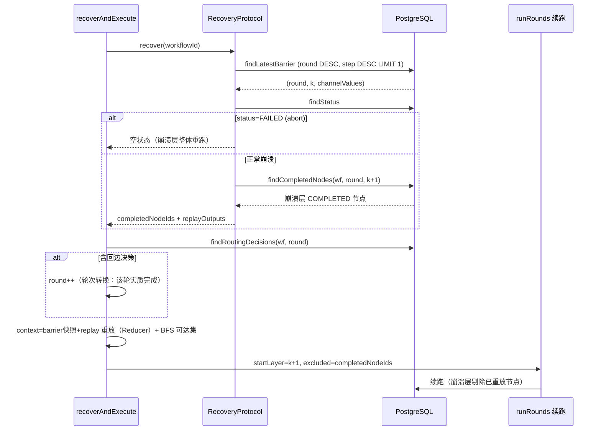

# Checkpoint/Recovery 协议（崩溃恢复 + 路由重放 + 审批恢复）

> 分析时间：2026-08-25 ｜ target：main@2a37d6b27e5d50687c656adbeedd2b92c0fdee92 ｜ 模式：deep-dive
> 取证方式：RecoveryProtocol/PostgresCheckpointManager 全量精读 + V1–V8 迁移逐份读 + BspEngine 恢复路径（recoverAndExecute/approveAndResume）+ git 历史三段交付交叉
> 分析范围：两级 checkpoint 写入语义、崩溃定位算法、stray 防护、路由决策重放、round 维度恢复、审批恢复；未覆盖：InMemoryCheckpointManager 细节（语义对齐 PG 版）、H2 测试策略

## 1. 功能目标

让长时-running（分钟级 LLM 调用）的工作流在进程崩溃/超时 abort 后能**不重复计费地续跑**，在审批暂停后能**从暂停点恢复**——两个恢复路径各自独立又共享 runRounds 骨架 [需求已确认]（KTD-3「两级 Checkpoint + Recovery」：节点级防 LLM 重复计费 + barrier 级防 super-step 重算）。

## 2. 入口与触发方式

| 类型 | 触发点 | 调用方/来源 | 证据 |
|---|---|---|---|
| 崩溃恢复 | `BspEngine#recoverAndExecute` :411 | 显式调用（生产触发路径未接线——见 open-questions Q7） | CodeGraph: callers 全在测试 [代码已确认] |
| 审批恢复 | `BspEngine#approveAndResume` :581 | ApprovalController#decide → WorkflowExecutionService#resumeAfterApproval | CodeGraph 3 callers [代码已确认] |
| 恢复探测 | `RecoveryProtocol#recover` | recoverAndExecute 第一步 | `agentflow-core/src/main/java/com/agentflow/engine/checkpoint/RecoveryProtocol.java#L65` |

## 3. 调用链

**崩溃恢复** [代码已确认]：

```
recoverAndExecute(recovery, def, resolver, reducer, workflowId)
  ├─ RecoveryProtocol#recover(workflowId)
  │    ├─ findLatestBarrier → (round, superStep=k, channelValues)   # 最新已完成层
  │    │    nextSuperStep = k+1；无 barrier → (0, 0, {})
  │    ├─ findStatus == FAILED?                                     # stray 防护（ADV-2）
  │    │    是 → return ExecutionState(空 completed/空 replay)       # abort 崩溃层整体重跑
  │    └─ findCompletedNodes(wf, round, nextSuperStep)               # 查崩溃层本身（off-by-one 修复）
  │         → completedNodeIds（跳过）+ replayOutputs（重放）
  ├─ AWAITING_APPROVAL 防御：throw IllegalStateException             # 审批态拒绝崩溃恢复
  ├─ new WorkflowContext(channelSnapshot)                            # barrier 快照重建
  ├─ for replayOutputs: applyReplayOutput（走 Reducer 合并进 context）# ADV-1 核心
  ├─ findRoutingDecisions(wf, round) → takenEdges
  │    hasLoopDecision? → round++ / crashLayerStep=0                 # 轮次转换检测
  │    否则 → backedgeTargets(takenEdges) 重建 nextActive 语义
  ├─ computeReachable(sources, dag, def, takenEdges)                 # BFS 重算可达集
  │    + rebuildOnErrorActivated(def, takenEdges)                    # 级联守卫重建
  └─ runRounds(allSteps, active, ..., round, crashLayerStep, completedNodeIds=excluded, ...)
       # 首轮 startLayer=崩溃层、剔除已重放节点；后续轮从层 0
```

**审批恢复** [代码已确认]：

```
approveAndResume(def, resolver, reducer, cp, workflowId, approvalId, decision, decidedBy)
  ├─ findApprovalById(approvalId) → 无则 IllegalStateException
  ├─ confirmApproval: UPDATE ... WHERE status='PENDING' → false=已决策幂等 no-op 返回
  ├─ REJECT → updateStatus(FAILED) + 指标 + trace FAILED → return（下游不跑）
  └─ APPROVE:
       ├─ new WorkflowContext(req.contextSnapshot())          # 暂停时存的快照（含兄弟输出）
       ├─ takenEdges = cp.findRoutingDecisions(wf, req.round()) # 预置防覆盖丢边（review P2）
       ├─ 重跑待批节点：注入 approvalDecision=APPROVE（多级审批链可再抛 ApprovalRequired）
       │    成功 → applyOutput merge 进 context
       ├─ 补记审批节点路由决策（暂停期未走 updateReachability）
       └─ runRounds(首轮 startLayer=req.superStep()=审批层,
                    firstExcluded=审批层节点全集,  # 兄弟不重跑（输出在快照）、审批节点已重跑
                    超时基线重定 Instant.now())   # 暂停等待不计入总超时
```

## 4. 核心类/方法职责

| 类/方法 | 职责 | 关键逻辑 | 证据 |
|---|---|---|---|
| `RecoveryProtocol#recover` | 五步恢复算法（类 javadoc 编号列出） | off-by-one 修复：查 nextSuperStep（崩溃层本身）而非 k-1（已 barrier 层）——后者会重复执行崩溃层已完成节点 | `agentflow-core/src/main/java/com/agentflow/engine/checkpoint/RecoveryProtocol.java#L21-L41` javadoc |
| `RecoveryProtocol` stray 防护 | FAILED 态 → 崩溃层整体重跑 | 宁可 LLM 重复计费（软约束）不换错误结果（正确性硬约束）——注释原文 | 同上 #L91-L101 |
| `PostgresCheckpointManager#saveNodeOutput` | 节点级 checkpoint | Semaphore(20) + ON CONFLICT DO UPDATE WHERE status<>'COMPLETED'（COMPLETED 终态不可覆盖） | `agentflow-core/src/main/java/com/agentflow/engine/checkpoint/PostgresCheckpointManager.java#L158-L182` |
| `PostgresCheckpointManager#saveRoutingDecisions` | upsert 每轮累计已走边 | 主键 (workflow_id, round)，super_step 随最新层更新 | 同上 #L218-L236 |
| `PostgresCheckpointManager#confirmApproval` | 审批决策原子转移 | `UPDATE ... WHERE approval_id=? AND status='PENDING'` 影响行数判幂等 | 同上 #L349-L352 |
| `BspEngine#recoverAndExecute` | 恢复续跑编排 | 轮次转换检测 + 双 active 重建 + excluded 剔除 | `agentflow-core/src/main/java/com/agentflow/engine/BspEngine.java#L411-L553` |
| `BspEngine#applyReplayOutput` | 重放输出进 context | 与 applyOutput 同走 Reducer——恢复语义=正常 barrier 合并语义 | 同上 #L759-L769 |
| `BspEngine#computeReachable` | BFS 可达集 | fan-out 全走/路由按已走边/on_error 已走则剪正常边 | 同上 #L1061-L1089 |
| `BspEngine#backedgeTargets` | 恢复期 nextActive 复刻 | 新轮起点=回边目标（非 layer-0 源），防复活已完成上游 | 同上 #L325-L336 |

## 5. 数据模型与数据变化

**表演进史（V1→V8 每次加一个恢复维度）** [代码已确认]（`agentflow-core/src/main/resources/db/migration/`）：

| 迁移 | 加的恢复维度 | 唯一约束变化 |
|---|---|---|
| V1 | 基础：executions(PENDING/RUNNING/SUCCESS/FAILED) + node_outputs + checkpoints | (wf, step, node) / (wf, step) |
| V2 | created_by（所有权恢复——防 IDOR） | — |
| V3 | workflow_definitions（定义版本恢复——retry 用旧 DAG） | (name, version) |
| V4 | workflow_routing_decisions（路由决策恢复——重算可达集） | — |
| V5 | round 列 + 三表唯一约束加 round（迭代轮次恢复） | (wf, round, step, node) 等 |
| V6 | caller_tool_grants（工具授权恢复） | — |
| V7 | workflow_approvals + checkpoint 敏感列 JSONB→TEXT（审批恢复 + 加密先决） | approval_id PK |
| V8 | routing_decisions/definitions 也 JSONB→TEXT（R22 扩列加密） | 列型变化 |

**崩溃窗口一致性分析**（无跨表事务下，靠写入顺序组合出等价效果）[代码已确认]：
- 窗口 A（节点完成、层未 barrier 崩溃）：node_outputs 有 COMPLETED 行但无 barrier 行 → Recovery 查崩溃层 COMPLETED → 跳过+重放——不重复计费且 channel 状态完整（ADV-1）。
- 窗口 B（路由已落盘、barrier 未落盘崩溃）：findLatestBarrier 返回 k-1，但路由决策已含第 k 层的边 → 恢复从 k 层起跑且可达集正确（先路由后 barrier 的写入顺序保证）。
- 窗口 C（超时 abort 后在飞 VT 写出 stray COMPLETED）：状态=FAILED → 整层重跑（宁重复计费不读孤立输出）。
- 窗口 D（同层多节点部分完成崩溃）：COMPLETED 的跳过+重放，未完成的正常跑——粒度到单节点。

## 6. 同步与异步链路

- 崩溃恢复是**同步重建 + 同步续跑**（recoverAndExecute 阻塞到终态），无消息参与 [代码已确认]。
- 审批恢复经 HTTP 同步触发（decide 等待 approveAndResume 完成）[代码已确认]——长工作流续跑会占住 HTTP 线程，[合理推断] demo 规模可接受（支撑：ApprovalController 无异步派发代码）。
- Kafka 模式的 retry 恢复：HTTP retry 复位 PENDING → dispatcher 派发 → consumer tryClaim 原子抢占 → run [代码已确认]（`agentflow-api/src/main/java/com/agentflow/api/WorkflowController.java#L322`）。

## 7. 异常处理

| 场景 | 系统行为 | 重试/补偿 | 证据 |
|---|---|---|---|
| 恢复 AWAITING_APPROVAL 工作流 | IllegalStateException 拒绝（防跳过审批破坏暂停语义） | 引导用 approveAndResume | `agentflow-core/src/main/java/com/agentflow/engine/BspEngine.java#L452-L455` |
| 审批单不存在 | IllegalStateException（不静默） | 无 | 同上 #L598-L599 |
| 重复决策同一审批单 | confirmApproval false → 幂等 no-op 返回快照 context | 无 | 同上 #L601-L604 |
| 重跑待批节点再抛 ApprovalRequired | 再次 AWAITING_APPROVAL（多级审批链） | 保持暂停态 | 同上 #L649 附近 + 9 测试锁定 |
| 恢复期定义缺失 | WorkflowExecutionService 定义重取 3×1s 后 FAILED | 短暂重试 | `agentflow-api/src/main/java/com/agentflow/api/WorkflowExecutionService.java#L25-L26` |
| saveApprovalRequest 落库失败 | 视为致命（暂停无法恢复）→ 抛异常 | 无——审批单是恢复的唯一凭证 | `agentflow-core/src/main/java/com/agentflow/engine/BspEngine.java#L927-L932` |

## 8. 幂等、并发、事务

- **幂等四件套**：tryClaim（PENDING→RUNNING 条件 UPDATE）；confirmApproval（PENDING→终态条件 UPDATE）；saveNodeOutput（COMPLETED 不可覆盖）；saveBarrier（DO NOTHING）[代码已确认]。
- **并发**：Semaphore(20) 写限流；恢复入口本身无并发保护（两个线程同时 recoverAndExecute 同一 workflow 会双跑）[代码已确认]——生产靠 Kafka tryClaim 或单入口纪律规避；未发现恢复端 tryClaim，列为待确认 Q8 [待确认]。
- **事务**：逐条独立写（无 @Transactional/跨表事务），一致性由写入顺序+约束组合（见第 5 节窗口分析）[代码已确认]。

## 9. Mermaid 流程图



## 10. 关键代码证据索引

| # | 证据 | 类型 | 支持的结论 |
|---|---|---|---|
| 1 | `agentflow-core/src/main/java/com/agentflow/engine/checkpoint/RecoveryProtocol.java#L21-L129` | 源码 | 五步算法 + off-by-one + stray 防护全量 |
| 2 | `agentflow-core/src/main/java/com/agentflow/engine/BspEngine.java#L411-L553` | 源码 | 恢复续跑 + 轮次转换 + 审批态防御 |
| 3 | `agentflow-core/src/main/java/com/agentflow/engine/BspEngine.java#L555-L736` | 源码 | approveAndResume 全量（幂等/REJECT/重跑/续跑） |
| 4 | `agentflow-core/src/main/resources/db/migration/V1__checkpoint_schema.sql` | 迁移 | 三表基础 schema + 唯一约束语义 |
| 5 | `agentflow-core/src/main/resources/db/migration/V5__loop_round.sql` | 迁移 | round 维度加入（三表约束重构） |
| 6 | `agentflow-core/src/main/java/com/agentflow/engine/checkpoint/PostgresCheckpointManager.java#L152-L236` | 源码 | 三类写入的幂等 SQL |
| 7 | commit `4866249` | git | 持久化路由决策 + 恢复期 BFS（v2 路由三段交付之二） |
| 8 | commit `0cebcb5` | git | 恢复 round 维度（轮次转换检测） |
| 9 | commit `e29c4cc` | git | 恢复与 execute 共享 runRounds（P1） |
| 10 | commit `15537dc` ce-code-review | git | 2 P1 修复：mid-round 崩溃丢 pending 迭代 + final-barrier 后双计费 |

## 11. 我的实现理解

这个模块教会我**"恢复"不是把状态存下来，而是把状态算回来**。checkpoint 只存三样最小事实（node output、barrier 快照、已走边），可达集、onError 集、下一轮起点全部在恢复期**重算**（BFS/rebuild/backedgeTargets）。对比「把 SKIPPED 状态也存下来」的直觉方案：存的状态越多，崩溃窗口内状态间不一致的概率越大；只存事实、重算派生态，事实之间彼此独立落盘，天然容错。这与事件溯源的思想同构——routing decisions 就是"事件"，可达集是"投影"。

第二个领悟是 **off-by-one 修复的深刻性**：`findCompletedNodes(nextSuperStep)` 查的是"崩溃层本身"而非"最后完成层"。一字之差，语义完全不同——前者是「这一层里哪些节点已经跑完」（跳过它们），后者会把整层当已完成（跳过整个崩溃层，丢工作）。这类 bug 测试很难抓（要精确构造"层内部分完成"的崩溃状态），是 code review 抓出来的。

第三个是 **两条恢复路径的互斥防御**：recoverAndExecute 对 AWAITING_APPROVAL 抛异常、approveAndResume 也不处理崩溃态——「崩溃恢复」和「审批恢复」在状态机上是两个不连通的岛屿，用显式异常防误渡。这比一个"万能恢复入口"带 if-else 分支要清晰得多。

## 12. 我还需要确认的问题

（已同步 open-questions.md）
- Q8：恢复入口无 tryClaim——并发 recoverAndExecute 同一 workflow 会双跑，生产预期如何防（调用纪律 or 待补）[待确认]。
- Q9：replayOutputs 与 completedNodeIds「同序同源」的约定靠注释维持（无类型级绑定），演化中如何防漂移 [待确认]。
