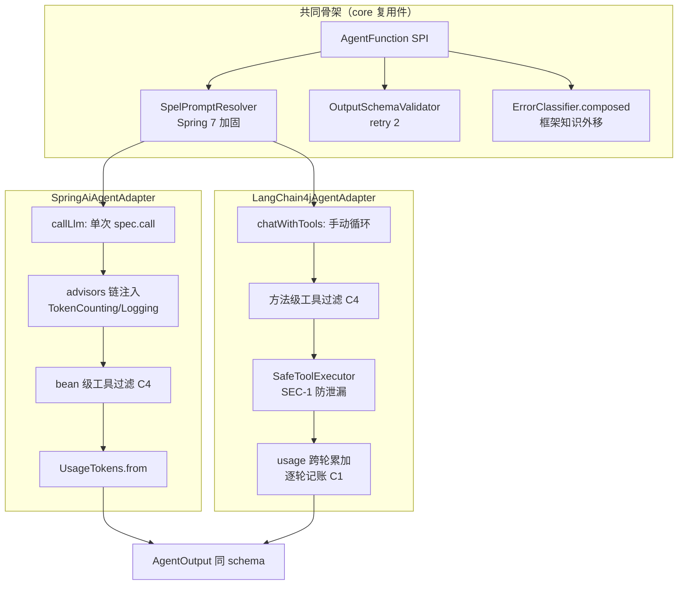

# 双适配器对比（SpringAiAgentAdapter vs LangChain4jAgentAdapter）

> 分析时间：2026-08-25 ｜ target：main@2a37d6b27e5d50687c656adbeedd2b92c0fdee92 ｜ 模式：deep-dive
> 取证方式：两适配器全量精读（Spring 319 行 / LC4j ~560 行）+ core 复用件（SpelPromptResolver/OutputSchemaValidator/ErrorClassifier）+ KTD-7 决议 + git 演进史（B1/B2/B3/C1-C4 修复链）
> 分析范围：同一 SPI 的两种框架实现差异面——工具循环、异常映射、usage 提取、cancel、记账、安全边界；未覆盖：两框架内部实现

## 1. 功能目标

用两个独立适配器实现同一个 `AgentFunction` 窄接口，证明 KTD-7「所有框架调用收敛在适配器窄表面、框架可替换」不是口号而是构建级事实 [需求已确认]（KTD-7：*2.0→2.1 迁移只碰适配器*）。LC4j 适配器的存在本身就是可移植性验证交付物 [历史已确认]（commit `9d09e6e` 前 LC4j 模块交付记录）。

## 2. 入口与触发方式

| 类型 | 触发点 | 调用方/来源 | 证据 |
|---|---|---|---|
| 引擎调用 | `AgentFunction#execute(AgentInput)` | NodeExecutor#execute（经 RetryPolicy 包裹） | `agentflow-core/src/main/java/com/agentflow/engine/NodeExecutor.java#L61` |
| Spring 装配 | demo-api ApiConfig（mock fallback 主路径） | NodeRegistry 注册 | `demo-api/src/main/java/com/agentflow/demo/api/ApiConfig.java` |
| LC4j 装配 | realDeepSeekAdapter（`agentflow.real.enabled` + DEEPSEEK_API_KEY 门控） | NodeRegistry.register(agentflow.real.agent) | 同上 #realDeepSeekAdapter |

## 3. 调用链（两适配器并排对比）

**共同骨架**（两适配器逐行同构）[代码已确认]：
```
execute(input)
  ├─ trace 优先级：构造器注入 trace > input.trace()（OQ-3 决议）
  ├─ ① SpEL 解析（core SpelPromptResolver——单一真相源）
  │     失败 → FatalException（不重试）
  ├─ ② LLM 调用（若有 output_schema 且注入了 schemaValidator → validateWithRetry 带反馈重试 ≤2）
  ├─ ③ AgentOutput(content, Map.of() channelWrites, structuredOutput, metadata{tokens})
  └─ 异常：FatalException 原样抛（终态化 trace）；RuntimeException → mapException
```

**② 的分叉**——这是两个适配器唯一的本质差异 [代码已确认]：

| 维度 | SpringAiAgentAdapter#callLlm | LangChain4jAgentAdapter#chatWithTools |
|---|---|---|
| 调用形态 | `spec.call().chatResponse()` **一次调用**（mutable deque 坑规避） | `chatModel.chat(request)` **手动循环 ≤5 轮** |
| 工具循环 | 框架内置（ChatClient 自动驱动工具回调） | 适配器自建：`hasToolExecutionRequests` → executeTool 回填 → 再 chat |
| 工具过滤粒度 | **bean 级**（spec.tools 按对象注册，无法方法级过滤——C4 注释明言框架限制） | **方法级**（collectTools 时按 spec.name() 过滤注册） |
| usage 提取 | `UsageTokens.from(chatResponse)`（advisor 链外取） | `response.tokenUsage()` 逐轮累加（跨工具轮计费） |
| 记账时点 | callLlm 末尾一次 recordBudgetSpend | **每轮** metricAndBudget（C1 review 修复：重试/失败轮也计） |
| 中断检查 | 无（同步阻塞） | **每轮检查 isInterrupted**（REL-1：取消后不再开付费轮） |
| 工具轮耗尽 | N/A（框架处理） | FatalException「工具链未完成」（不当成功返回——ADV-1） |
| 工具异常 | 框架处理 | SafeToolExecutor：真实 cause 只进日志，模型只见泛化 error（SEC-1） |
| cancel() | warn + 委托 NodeExecutor cancel(true) | 同左（两框架同处境：无公共 HTTP abort 钩子） |

## 4. 核心类/方法职责

| 类/方法 | 职责 | 关键逻辑 | 证据 |
|---|---|---|---|
| `SpringAiAgentAdapter#callLlm` :221 | 单次调用 + advisors/tools 注入 + 预算记账 | 只调一次 chatResponse()（deque 坑）；bean 级工具过滤 | `agentflow-adapters/spring-ai/src/main/java/com/agentflow/adapters/springai/SpringAiAgentAdapter.java#L221-L241` |
| `SpringAiAgentAdapter#cancel` :292 | best-effort 记 warn | 曾尝试 inFlight nodeId→Thread 表，因单例并发覆盖 race 放弃（注释记录了放弃理由） | 同上 #L277-L299 |
| `LangChain4jAgentAdapter#chatWithTools` :248 | 手动工具循环 | 轮首中断检查；usage 跨轮累加；轮耗尽抛 Fatal | `agentflow-adapters/langchain4j/src/main/java/com/agentflow/adapters/langchain4j/LangChain4jAgentAdapter.java#L248-L298` |
| `LangChain4jAgentAdapter#collectToolMethods` :370 | 全层级 @Tool 扫描 | 逐层 getDeclaredMethods（保非 public）+ 签名去重（类优先于接口）——B3 修复 | 同上 #L364-L398 |
| `SafeToolExecutor#execute` :421 | 反射安全执行 | 不包装 DefaultToolExecutor（其吞异常返回原始消息，外部拦不到——B1 反编译确认）；中断标志恢复（防 defeat REL-1）；coerce 委托 convertValue（C1 修手写分支三缺陷） | 同上 #L400-L487 |
| `ErrorClassifier#composed` | 组合分类器（core） | 框架知识外移：Spring 前缀 org.springframework.web.client. 由 Spring 适配器注入 | `agentflow-core/src/main/java/com/agentflow/engine/fault/ErrorClassifier.java` + Spring 适配器 SPRING_CLASSIFIER 字段 |
| `SpelPromptResolver` | 两适配器共用（core） | Spring 7 加固写法 forPropertyAccessors(DataBinding, MapAccessor) | `agentflow-core/src/main/java/com/agentflow/prompt/SpelPromptResolver.java` |
| `OutputSchemaValidator` | 两适配器共用（core） | MAX_SCHEMA_RETRIES=2 带反馈重试 | `agentflow-core/src/main/java/com/agentflow/prompt/OutputSchemaValidator.java#L46-L47` |

## 5. 数据模型与数据变化

两适配器产出**相同 schema 的 AgentOutput**（KTD-7 "相同 DSL 相同结果"对价）[代码已确认]：`AgentOutput(content, channelWrites=Map.of(), structuredOutput, metadata{promptTokens/completionTokens/totalTokens})`。差异只在 metadata 的 token 来源（advisor 提取 vs 手动累加）。

## 6. 同步与异步链路

两适配器都是**同步阻塞**调用（ChatClient.call / ChatModel.chat 无异步 API）；异步与超时全由 NodeExecutor 的二级 VT + future.get(timeout) 外部施加 [代码已确认]。

## 7. 异常处理

| 场景 | Spring 适配器 | LC4j 适配器 | 证据 |
|---|---|---|---|
| SpEL 失败 | FatalException（同构） | 同 | 两文件 execute ①段 |
| 框架网络异常 | SPRING_CLASSIFIER 前缀判定 transient | RetriableException 注入（LC4j 网络/限流/超时） | `agentflow-core/src/main/java/com/agentflow/engine/fault/ErrorClassifier.java` B2/M2 注释 |
| schema 校验耗尽 | FatalException 原样抛（NodeTrace 终态化） | 同 + 回调里 FatalException 包 RuntimeException 再解包（Function 不能抛检查型） | LC4j #callForSchema :225-L234 |
| 工具异常 | 框架处理 | 泛化 error 给模型 + 真实 cause 进日志 | SafeToolExecutor |
| 工具轮耗尽 | N/A | FatalException（防截断静默成功） | chatWithTools :L286-L292 |
| null 工具返回 | N/A | "null" 哨兵字符串（防 null-text 回放 provider 崩溃） | executeTool :L320-L322 |

## 8. 幂等、并发、事务

- 两适配器均**无状态**（fields 全 final、无共享可变）——单例并发安全；LlmResult record 避免共享可变字段（VT 安全，两文件同款注释）[代码已确认]。
- 记账防双计：Spring 只 recordBudget（token counter 交 TokenCountingAdvisor）；LC4j 手动 recordTokens+recordBudget——**两边互补不重叠**，C1 修复注释明言此分工 [代码已确认]。

## 9. Mermaid 流程图



## 10. 关键代码证据索引

| # | 证据 | 类型 | 支持的结论 |
|---|---|---|---|
| 1 | `agentflow-adapters/langchain4j/pom.xml` | 构建 | LC4j 依赖面仅 core+langchain4j（无 Spring AI）——可替换性构建级证明 |
| 2 | `agentflow-adapters/spring-ai/src/main/java/com/agentflow/adapters/springai/SpringAiAgentAdapter.java#L209-L211` | 源码 | mutable deque 坑与单次调用决策 |
| 3 | 同上 #L277-L299 | 源码 | cancel 放弃 inFlight 表的 race 论证 |
| 4 | `agentflow-adapters/langchain4j/src/main/java/com/agentflow/adapters/langchain4j/LangChain4jAgentAdapter.java#L258-L298` | 源码 | 工具循环 + 中断检查 + 逐轮记账 + 轮耗尽 Fatal |
| 5 | 同上 #L400-L437 | 源码 | SafeToolExecutor 三重防御（不包装 DefaultToolExecutor 的理由/中断恢复/SEC-1） |
| 6 | 同上 #L364-L398 | 源码 | collectToolMethods 全层级扫描 + 签名去重（B3） |
| 7 | `agentflow-core/src/main/java/com/agentflow/engine/fault/ErrorClassifier.java#L31-L38` | 源码 | 框架知识外移（composed 注入模式） |
| 8 | commit `18978e8` | git | B2+M2：框架异常知识移出 core |
| 9 | commit `8157e4a` | git | C1 复审 4 修复（逐轮记账/coerce 统一/重名去重/中断恢复） |
| 10 | CodeGraph query "AgentFunction" | 图索引 | 6 实现全集、两适配器并列 |

## 11. 我的实现理解

对比读这两个适配器让我理解了**"窄表面"的真实含义不是接口小，而是框架知识被限制在单文件内**。两适配器各自持有：自己框架的异常前缀、usage 提取方式、工具注册粒度、deque 坑、cancel 处境——这些知识在 core 里一个都找不到。所以"换框架"的完整成本 = 重写一个 ~300 行的类 + pom 依赖，引擎/DSL/持久化/测试基建零改动。demo-rag 的 RagAgentFunction（第 5 个实现，非 LLM 框架也实现了同接口）把这个论点推到了极致：接口窄到「输入 AgentInput 输出 AgentOutput」连 RAG 检索增强都能装进去。

最有教育意义的是 **B1 的反编译取证**：作者发现 LC4j 的 DefaultToolExecutor 在工具抛异常时"捕获 InvocationTargetException 并返回原始异常消息字符串（不抛出）"——这意味着任何外层 try-catch 都拦不到，必须自己写 SafeToolExecutor 在反射层拦截。这个案例告诉我：**封装库的异常语义必须读源码验证，javadoc 不可信**。

其次是对称性修复的价值：C1 review 发现 LC4j 逐轮记账而 Spring 只在成功路径记末次（预算低估 ≤3x），修复让两边语义对齐（"每个真实付费调用都进预算"）。两实现并行最容易漂移的不是代码而是**语义**——这也是为什么需要 KTD-7 "相同 DSL 相同结果"作为对价条款。

## 12. 我还需要确认的问题

（已同步 open-questions.md）
- Q10：Spring 适配器为何不补齐与 LC4j 对称的「逐轮」中断检查（ChatClient 内置循环无法插入检查点，是否有框架 issue 跟踪）[待确认]。
