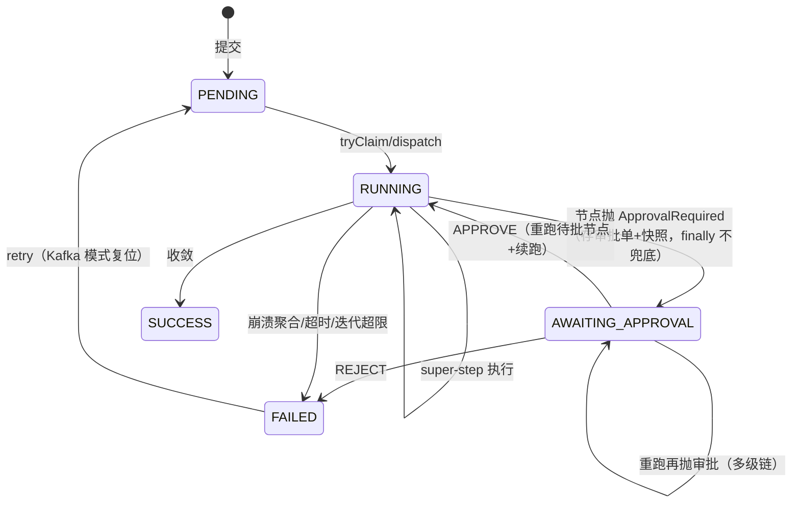

# HITL 审批全链路（暂停 → 人工决策 → 恢复 → UI 闭环）

> 分析时间：2026-08-25 ｜ target：main@2a37d6b27e5d50687c656adbeedd2b92c0fdee92 ｜ 模式：deep-dive
> 取证方式：ApprovalController/ApprovalCenterController/WorkflowExecutionService 全量精读 + BspEngine 暂停/恢复路径 + UI ApprovalCenter.tsx + git U1-U6 交付史
> 分析范围：引擎暂停（applyBarrier）→ 审批单落库 → REST 决策（鉴权/防伪造）→ approveAndResume → UI 审批中心；未覆盖：UI 组件渲染细节

## 1. 功能目标

让工作流在敏感节点（如高风险操作前）暂停等待人工批准，批准后从暂停点续跑、拒绝则终态失败——且暂停期间的执行状态可完整恢复 [需求已确认]（02-requirements R20 HITL 相关条目 + CLAUDE.md HITL U1-U6 交付记录）。

## 2. 入口与触发方式

| 类型 | 触发点 | 调用方/来源 | 证据 |
|---|---|---|---|
| 引擎暂停 | 节点抛 `ApprovalRequiredException` → NodeExecutor 转译 `NodeResult.ApprovalRequired` | Agent 侧主动抛（如 demo-api ApprovalGateAgent） | `agentflow-core/src/main/java/com/agentflow/engine/NodeExecutor.java#L79-L81` |
| 单工作流待批查询 | `GET /api/workflows/{id}/approvals/pending` | UI / 审批人 | `agentflow-api/src/main/java/com/agentflow/api/ApprovalController.java#L72` |
| 跨工作流聚合 | `GET /api/approvals/pending` | UI 审批中心 Tab | `agentflow-api/src/main/java/com/agentflow/api/ApprovalCenterController.java#L62` |
| 决策 | `POST /api/workflows/{wfId}/approvals/{approvalId}` | UI 审批中心 APPROVE/REJECT 按钮 | `agentflow-api/src/main/java/com/agentflow/api/ApprovalController.java#L90` |

## 3. 调用链

**暂停链** [代码已确认]：
```
agent.execute(input) 抛 ApprovalRequiredException(description, payload)
  → NodeExecutor：ExecutionException 解包 cause instanceof → NodeResult.ApprovalRequired（非 Failure）
  → RetryPolicy：ApprovalRequired 即返（不重试、透传）           # :L76-L78
  → runSuperStep：正常返回（与 Success/Failure 同列结果列表）
  → applyBarrier：
     同层 Success 先并入 context（快照含兄弟输出）
     首个 ApprovalRequired 优先于 Failure 聚合
     → cp.saveApprovalRequest(PENDING + contextSnapshot=flattenContext(context))
       失败=致命（审批单是恢复唯一凭证）
     → cp.updateStatus(AWAITING_APPROVAL)（best-effort warn）
     → metrics.recordApprovalEvent(pending)
     → return paused=true（不写 barrier、不激活下游、不落路由）
  → runStep 返回 true → runRounds 短路 → execute：
     trace.markCompleted(AWAITING_APPROVAL)（合法中间态）
     不记 success/failed 指标、finally 不兜底（paused 标志）
  → WorkflowExecutionService.run：execute 返回后查 status==AWAITING_APPROVAL → 不标 SUCCESS
```

**恢复链** [代码已确认]：
```
UI 审批中心 POST decide {decision}
  → ApprovalController#decide：
     canAccess（ownership.requireOwnership 失败 → adminKeys.isAdmin 兜底）
     归属校验（approval.workflowId == path workflowId，防跨工作流）
     decidedBy = callerId（服务端推导，忽略请求体）          # 防伪造 P1
  → WorkflowExecutionService#resumeAfterApproval → 定义重取（3×1s）
  → BspEngine#approveAndResume（见 checkpoint walkthrough 第 3 节）
  → REJECT: FAILED 终态；APPROVE: 重跑待批节点（注入 approvalDecision）→ runRounds 从审批层续跑
  → UI 乐观移除该审批卡（decideApproval 无 mock fallback——写操作防假成功）
```

## 4. 核心类/方法职责

| 类/方法 | 职责 | 关键逻辑 | 证据 |
|---|---|---|---|
| `NodeResult.ApprovalRequired` | 第三种节点结果形态 | 与 Success/Failure 并列——「暂停」是一等语义非失败 | `agentflow-core/src/main/java/com/agentflow/engine/NodeResult.java` |
| `BspEngine#applyBarrier` 暂停分支 | 审批优先 + 快照落库 | 兄弟 Success 已入 context → 快照恢复后不重跑兄弟 | `agentflow-core/src/main/java/com/agentflow/engine/BspEngine.java#L905-L941` |
| `ApprovalController#decide` | 决策端点 | 归属校验 + decidedBy 服务端推导 + 大小写宽容 valueOf | `agentflow-api/src/main/java/com/agentflow/api/ApprovalController.java#L90-L134` |
| `ApprovalController.ApprovalView` | 精简投影 | **不下发** requestPayload/contextSnapshot（防敏感载荷旁路泄漏 review P2） | 同上 #L161-L171 |
| `ApprovalCenterController#pending` | 跨工作流聚合 | 非 admin=listByCreatedBy(caller)（空数组不泄漏存在性）；per-wf 错误隔离（单 corrupt 行不 500 整端点，review P1） | `agentflow-api/src/main/java/com/agentflow/api/ApprovalCenterController.java#L62-L88` |
| `WorkflowExecutionService#run` U4 分支 | 暂停后不误标 SUCCESS | execute 返回后查 status==AWAITING_APPROVAL → return | `agentflow-api/src/main/java/com/agentflow/api/WorkflowExecutionService.java#L74-L78` |
| UI `decideApproval` | 写操作纪律 | 无 withMockFallback 包裹（与读端点对比） | `agentflow-ui/src/lib/api.ts` |

## 5. 数据模型与数据变化

| 数据对象 | 操作 | 关键字段 | 一致性 | 证据 |
|---|---|---|---|---|
| workflow_approvals | 暂停 INSERT PENDING；决策条件 UPDATE | context_snapshot（含兄弟输出，加密列）、round、super_step | confirmApproval PENDING→终态原子转移（幂等） | `agentflow-core/src/main/java/com/agentflow/engine/checkpoint/PostgresCheckpointManager.java#L349-L352` |
| workflow_executions 状态机 | RUNNING→AWAITING_APPROVAL→RUNNING(隐式)→SUCCESS/FAILED | paused 期不写 barrier | 恢复与崩溃恢复互斥防御 | V7 迁移 + BspEngine :L452 |
| UI 看板状态 | awaiting_approval 独立第四列 | 原 `as WorkflowStatusUi` 静默丢状态是修过的真 bug | — | CLAUDE.md R22 U4 记录 [历史已确认] |

## 6. 同步与异步链路

- 暂停：执行线程内同步完成（saveApprovalRequest 同步写）[代码已确认]。
- 决策：HTTP 同步调 approveAndResume，阻塞到续跑终态 [代码已确认]——续跑时长=审批层到末层的全部 LLM 调用，[合理推断] demo 规模接受、生产需异步化（支撑：无异步派发代码）。
- UI 轮询：审批中心 Tab 拉取 /approvals/pending 刷新 [代码已确认]。

## 7. 异常处理

| 场景 | 系统行为 | 证据 |
|---|---|---|
| saveApprovalRequest 落库失败 | 致命抛出（暂停无法恢复，不静默降级） | `agentflow-core/src/main/java/com/agentflow/engine/BspEngine.java#L927-L932` |
| 恢复误用 recoverAndExecute | IllegalStateException 拒绝 | 同上 #L452-L455 |
| 重复决策 | confirmApproval false → 幂等 no-op | 同上 #L601-L604 |
| 重跑再抛审批请求 | 再 AWAITING_APPROVAL（多级审批链） | 9 测试锁定 |
| 非 owner 非 admin 访问 | 403（单工作流）/空数组（聚合——不泄漏存在性） | 两 controller 对比 |
| 单工作流行解密损坏 | 聚合端点跳过记 warn（不 500） | ApprovalCenterController :L76-L84 |

## 8. 幂等、并发、事务

- 幂等：confirmApproval 条件 UPDATE（二次决策 no-op）[代码已确认]。
- 并发：两个审批人同时决策同一单 → DB 条件 UPDATE 恰一胜出，败者拿 false 走幂等返回 [代码已确认]。
- **重放不双计费**：审批节点重跑时注入 approvalDecision，ApprovalGateAgent 见决策直接返回不再抛——重跑是受控单节点 [代码已确认]（approveAndResume javadoc 语义列表）。

## 9. Mermaid 流程图



## 10. 关键代码证据索引

| # | 证据 | 类型 | 支持的结论 |
|---|---|---|---|
| 1 | `agentflow-core/src/main/java/com/agentflow/engine/BspEngine.java#L905-L941` | 源码 | 暂停分支全量（兄弟入 context/审批优先/审批单落库/不写 barrier） |
| 2 | `agentflow-core/src/main/java/com/agentflow/engine/BspEngine.java#L219-L237` | 源码 | paused 标志三层穿透 + AWAITING_APPROVAL trace |
| 3 | `agentflow-api/src/main/java/com/agentflow/api/ApprovalController.java#L39-L46` | 源码 | 安全模型 javadoc（所有权/decidedBy 推导/归属校验） |
| 4 | `agentflow-api/src/main/java/com/agentflow/api/ApprovalCenterController.java#L30-L41` | 源码 | 可见域语义（空数组非 403）+ N+1 Deferred 注 |
| 5 | `agentflow-api/src/main/java/com/agentflow/api/WorkflowExecutionService.java#L62-L84` | 源码 | run 的 U4 分支（不误标 SUCCESS） |
| 6 | `agentflow-ui/src/lib/api.ts` | 源码 | decideApproval 无 mock fallback + listPendingApprovals 5xx 不降级 |
| 7 | `agentflow-core/src/main/resources/db/migration/V7__hitl_approval_and_encryption.sql` | 迁移 | workflow_approvals 表 + TEXT 列型 |
| 8 | commit `59a0f13`/`238db1d` | git | U4 暂停 / U5 恢复交付 |

## 11. 我的实现理解

HITL 的设计核心是**「暂停买回」**：与崩溃恢复（checkpoint 重放买回确定性）、动态路由（路由决策重放买回可达性）同一思想家族——把"不可重来的副作用"（LLM 计费/已走分支）转成"可重放的事实"（审批单+快照），暂停就不再是状态机里的黑洞而是可往返的中间态。

工程上最值得学的是**状态机语义在四层的对齐**：引擎层（paused 标志不进 catch/finally 的 FAILED 兜底）、服务层（run 查 AWAITING_APPROVAL 不覆盖 SUCCESS）、API 层（幂等决策）、UI 层（awaiting_approval 独立第四列——原来静默 cast 丢状态是真实修过的 bug）。每层各有一个"不误伤暂停态"的防御点，任何一层缺失都会让暂停语义劣化成失败。面试讲 HITL 时这就是叙事骨架：**不是「加了个审批接口」，而是「让暂停成为状态机一等公民的横切一致性工程」**。

安全设计密度也高：decidedBy 服务端推导（防伪造）、归属校验（防跨工作流）、精简投影（防快照泄漏）、空数组（防存在性探测）、admin 兜底（运维通道）。五个防御对应五种攻击面，全部有 review 记录溯源。

## 12. 我还需要确认的问题

（已同步 open-questions.md）
- Q11：审批单无超时机制（PENDING 永久等待）——是否有业务场景需要审批超时自动 REJECT [待确认]。
