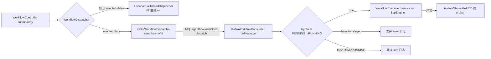

# Kafka 提交/执行解耦链路（v1.1 KTD-8）

> 分析时间：2026-08-25 ｜ target：main@2a37d6b27e5d50687c656adbeedd2b92c0fdee92 ｜ 模式：deep-dive
> 取证方式：kafka-starter 四类全量精读 + WorkflowController retry 复位逻辑 + WorkflowExecutionService + KafkaDispatchE2eIT + git U1-U3/review 修复史
> 分析范围：producer/consumer/autoconfig 全链、at-least-once 幂等三防、retry 语义、单 JVM 约束；未覆盖：broker 集群配置

## 1. 功能目标

把「提交」（HTTP 线程）与「执行」（引擎分钟级阻塞）经 Kafka 解耦，为跨节点部署铺路 [需求已确认]（KTD-8）。当前单 JVM（producer+consumer 同应用）[历史已确认]（CLAUDE.md v1.1 交付记录「单 JVM 语义」）。

## 2. 入口与触发方式

| 类型 | 触发点 | 调用方/来源 | 证据 |
|---|---|---|---|
| 开关 | `agentflow.kafka.enabled`（opt-in，默认本地 VT 不变） | demo-api ApiConfig @ConditionalOnProperty | `demo-api/src/main/java/com/agentflow/demo/api/ApiConfig.java#L224-L235` |
| 生产 | submit/retry → `dispatcher.dispatch` | WorkflowController（两处统一走 dispatcher——消除 submit 走 Kafka/retry 走本地双路径漂移） | `agentflow-api/src/main/java/com/agentflow/api/WorkflowController.java` |
| 消费 | `@KafkaListener(topics=agentflow-workflow-dispatch)` | broker 投递 | `agentflow-kafka-starter/src/main/java/com/agentflow/kafka/KafkaWorkflowConsumer.java#L40` |

## 3. 调用链

```
submit → dispatcher.dispatch(WorkflowDispatchRequest)      # 接口抽象，本地/Kafka 可换
  Kafka 版: kafkaTemplate.send(TOPIC, workflowId, mapper.writeValueAsString(message))
    # StringSerializer 承载 JSON（spring-kafka 4.1 废弃 JsonSerializer）+ 自持 ObjectMapper
    # （agentflowKafkaObjectMapper @Bean：JavaTimeModule + 禁 WRITE_DATES_AS_TIMESTAMPS）
  ~~ MQ: agentflow-workflow-dispatch ~~>
onMessage(String payload)
  ├─ mapper.readValue 失败 → log.error 跳过（重放会重投）
  ├─ tryClaim(workflowId) 原子幂等：
  │    false + findStatus 空   → log.error 丢弃（unstaged 防 ledger 污染）
  │    false + 已 RUNNING/终态 → log.info 跳过（重放/并发去重）
  │    true（PENDING→RUNNING 恰一胜出）→ 继续
  └─ executionService.run(...)（与本地路径同一语义）
       异常 → updateStatus(FAILED)（防 orphan PENDING）
```

**retry 特殊路径** [代码已确认]（`agentflow-api/src/main/java/com/agentflow/api/WorkflowController.java#L322-L325`）：FAILED 工作流直接派发会被终态跳过吞掉 → 先 `updateStatus(PENDING)` 复位再 dispatch → consumer tryClaim 才能命中。

## 4. 核心类/方法职责

| 类/方法 | 职责 | 关键逻辑 | 证据 |
|---|---|---|---|
| `WorkflowDispatcher`（api 模块接口） | 派发抽象 | 本地 VT 默认 + Kafka 第二实现；controller 只认接口 | `agentflow-api/src/main/java/com/agentflow/api/WorkflowDispatcher.java` |
| `KafkaWorkflowDispatcher#dispatch` | producer | key=workflowId（同 key 同 partition 保序） | `agentflow-kafka-starter/src/main/java/com/agentflow/kafka/KafkaWorkflowDispatcher.java#L37` |
| `KafkaWorkflowConsumer#onMessage` | 幂等消费 | tryClaim 前置 + 三分支日志语义 | `agentflow-kafka-starter/src/main/java/com/agentflow/kafka/KafkaWorkflowConsumer.java#L42-L73` |
| `KafkaAgentFlowAutoConfiguration` | 装配（7 @Bean） | producer/consumer factory、dispatcher、consumer、自持 ObjectMapper（auto.offset.reset=earliest 任务队列语义） | `agentflow-kafka-starter/src/main/java/com/agentflow/kafka/KafkaAgentFlowAutoConfiguration.java` |
| `WorkflowExecutionService#run` | 执行语义单一真相源 | 26 callers 横跨本地/Kafka/retry 三路 | CodeGraph |

## 5. 数据模型与数据变化

| 数据对象 | 操作 | 一致性 | 证据 |
|---|---|---|---|
| Kafka 消息 | String JSON（WorkflowExecutionMessage: workflowId/name/version/inputs） | wire 格式自持（不依赖框架 serializer 演化） | `agentflow-kafka-starter/src/main/java/com/agentflow/kafka/WorkflowExecutionMessage.java` |
| workflow_executions.status | tryClaim 条件 UPDATE（消费端）+ retry 复位（API 端） | 原子转移 | TRY_CLAIM_SQL |

## 6. 同步与异步链路

- submit：HTTP 线程只到 producer.send 即返回 202——完全解耦 [代码已确认]。
- 消费：@KafkaListener 容器线程 → run（分钟级阻塞在 listener 线程）[代码已确认]——并发消费数受容器 factory 配置约束。
- 与本地模式对等性：两路径共享 WorkflowExecutionService（KTD-B），行为差异仅在线程来源 [代码已确认]。

## 7. 异常处理

| 场景 | 系统行为 | 证据 |
|---|---|---|
| 消息反序列化失败 | log.error + return（跳过不重试——毒丸消息防死循环） | `agentflow-kafka-starter/src/main/java/com/agentflow/kafka/KafkaWorkflowConsumer.java#L44-L49` |
| unstaged 任意 id | 丢弃 + error 日志（防伪造执行） | 同上 #L56-L59 |
| run 抛异常 | 兜底 FAILED（防 orphan PENDING 永挂） | 同上 #L68-L72 |
| 定义缺失 | loadDefinitionWithRetry 3×1s 后抛 → FAILED | `agentflow-api/src/main/java/com/agentflow/api/WorkflowExecutionService.java#L103-L115` |
| 重复投递 | tryClaim false → 跳过（不双跑双计费） | onMessage 主路径 |

## 8. 幂等、并发、事务

- **at-least-once + 幂等消费**：不追求 exactly-once，靠 tryClaim 把重复投递挡在执行前 [代码已确认]。
- **跨节点 read-after-write 容忍**：定义重取 3×1s 是为「提交节点已 store 定义、执行节点稍后才可见」的窗口 [代码已确认]（javadoc「为未来跨节点留容忍窗口」）。
- 事务：无（消息发送与 initWorkflow 之间崩溃 → 消息丢失但 PENDING 记录在——retry 端点可救）；未发现 outbox 模式，单 JVM 下 producer/consumer 同库影响小 [合理推断]。

## 9. Mermaid 流程图



## 10. 关键代码证据索引

| # | 证据 | 类型 | 支持的结论 |
|---|---|---|---|
| 1 | `agentflow-kafka-starter/src/main/java/com/agentflow/kafka/KafkaWorkflowConsumer.java` | 源码 | 幂等三防全量 |
| 2 | `agentflow-kafka-starter/src/main/java/com/agentflow/kafka/KafkaAgentFlowAutoConfiguration.java#L118` | 源码 | 自持 ObjectMapper @Bean |
| 3 | `agentflow-api/src/main/java/com/agentflow/api/WorkflowController.java#L322-L325` | 源码 | retry 复位 PENDING 注释 |
| 4 | `agentflow-api/src/main/java/com/agentflow/api/WorkflowExecutionService.java` | 源码 | 共享执行语义（KTD-B） |
| 5 | commit `5c6b75c`/`2175b3a`/`456e1ec` | git | JsonSerializer 废弃替代 / tryClaim 升级 / review 修复 |
| 6 | `agentflow-kafka-starter/src/test/java/com/agentflow/kafka/KafkaDispatchE2eIT.java` | 测试 | 真 Kafka E2E（3 用例 + 重放幂等） |

## 11. 我的实现理解

Kafka 模块展示的是**解耦的纪律感**而非 Kafka 用法本身：① submit 和 retry **都**走 dispatcher（消除双路径漂移——如果 submit 走 Kafka 而 retry 走本地，两种路径行为会渐行渐远）；② 幂等不在消费框架层做（@KafkaListener 无幂等能力）而在业务状态机层做（tryClaim 条件转移）——这使幂等语义对本地/Kafka/未来 gRPC 三种派发方式统一；③ wire 格式自持（String+自有 mapper）不把序列化语义外包给框架废弃类。三个决策都是「把语义握在自己手里」的同一种品味。

retry 复位 PENDING 是最好的教学案例：Kafka 模式下「重试」表面是 API 调用，实际跨了「复位状态 + 重发消息 + 重新 claim」三步——不做状态复位，消费端幂等（终态跳过）会**正确地把 retry 消息吞掉**，重试静默失效。幂等设计消费掉了上游的语义，上游必须知情。这个 bug 是 ce-code-review 3 个 reviewer 独立确认的。

## 12. 我还需要确认的问题

（已同步 open-questions.md）
- Q12：listener 并发度与 VT 引擎的配合（容器线程数 < 同层节点数时是否成瓶颈）[待确认]。
