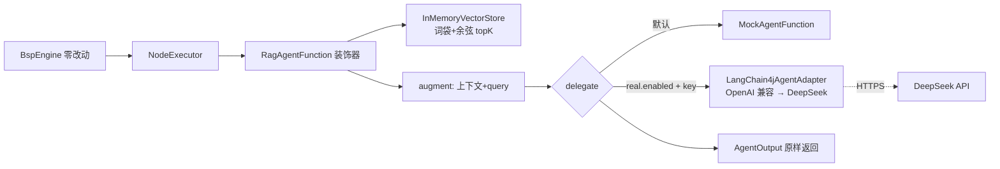

# RAG 扩展点验证 + 真实 LLM 接线（KTD-6 实证闭环）

> 分析时间：2026-08-25 ｜ target：main@2a37d6b27e5d50687c656adbeedd2b92c0fdee92 ｜ 模式：deep-dive
> 取证方式：demo-rag 模块全量精读（RagAgentFunction/InMemoryVectorStore/RagDemoConfig）+ RagEngineZeroChangeTest + RagRealLlmIT + demo-api realDeepSeekAdapter 装配 + git 交付史
> 分析范围：AgentFunction 扩展点从「接口设计」到「三种实证」的完整验证链；未覆盖：DeepSeek API 内部

## 1. 功能目标

证明 KTD-6「引擎零改动、Agent 扩展点成立」不是设计断言而是被测试锁定的事实——用三个递进实证：mock 直跑 → RAG 装饰器（非 LLM 能力挂进同一接口）→ 真实 DeepSeek 端到端 [需求已确认]（KTD-6 + CLAUDE.md KTD-6 验证记录）。

## 2. 入口与触发方式

| 类型 | 触发点 | 调用方/来源 | 证据 |
|---|---|---|---|
| 引擎直跑 | BspEngine.execute(def with agent: rag) | RagEngineZeroChangeTest（断言引擎类无 RAG 感知） | `demo-rag/src/test/java/com/agentflow/demo/rag/RagEngineZeroChangeTest.java` |
| mock 模式 | RagDemoConfig 默认 | delegate=MockAgentFunction | `demo-rag/src/main/java/com/agentflow/demo/rag/RagDemoConfig.java` |
| 真实 LLM | `agentflow.rag.real.enabled=true` + env DEEPSEEK_API_KEY | delegate=LangChain4jAgentAdapter(OpenAiChatModel→DeepSeek) | 同上 + `demo-api/src/main/java/com/agentflow/demo/api/ApiConfig.java#realDeepSeekAdapter` |
| 真实验证 | RagRealLlmIT（Failsafe，assumeTrue(key)） | mvn verify 有 key 才跑 | `demo-rag/src/test/java/com/agentflow/demo/rag/RagRealLlmIT.java` |

## 3. 调用链

```
BspEngine（零改动）→ NodeExecutor → agentResolver.apply("rag")
  → RagAgentFunction（装饰器模式）:
       ① vectorStore.topK(originalQuery, 3)          # 确定性词袋 embed + 余弦 top-k
       ② augment: hits → "[上下文]\n- doc1\n- doc2\n\n原文query"
       ③ 重建 AgentInput（只换 promptTemplate，其余 11 字段透传——含 trace/budget/round/approvalDecision）
       ④ delegate.execute(delegateInput)              # mock 或真实 LLM
       ⑤ 委托 AgentOutput 原样返回；委托异常原样透传（不吞）
```

**真实 LLM 装配链** [代码已确认]：
```
ApiConfig.realDeepSeekAdapter（@ConditionalOnProperty agentflow.real.enabled + env key）:
  OpenAiChatModel.builder().baseUrl(deepseek 兼容端点).apiKey(env DEEPSEEK_API_KEY).modelName(deepseek-chat)
  → LangChain4jAgentAdapter(model, tools, trace, redactor, metrics, model, schemaValidator)
  → NodeRegistry.register("agentflow.real.agent:deepseek", real)
  其余 agent 名仍回落 mock fallback（向后兼容，mock 测试全绿）
```

## 4. 核心类/方法职责

| 类/方法 | 职责 | 关键逻辑 | 证据 |
|---|---|---|---|
| `RagAgentFunction` | 检索增强装饰器 | 只换 promptTemplate 重建 AgentInput——trace/budget/round 全部透传（不丢横切上下文） | `demo-rag/src/main/java/com/agentflow/demo/rag/RagAgentFunction.java#L53-L67` |
| `InMemoryVectorStore` | 确定性 embed + 余弦 topK | tokenSet 词袋 + cosine；无外部服务依赖（离线可测） | `demo-rag/src/main/java/com/agentflow/demo/rag/InMemoryVectorStore.java#L35-L81` |
| `RagDemoConfig` | delegate 条件切换 | mock 默认 / real 门控（env key 只从环境读，禁止硬编码） | `demo-rag/src/main/java/com/agentflow/demo/rag/RagDemoConfig.java` |
| `RagEngineZeroChangeTest` | 扩展点零改动断言 | BspEngine 直跑 `agent: rag` 到 SUCCESS——引擎代码无任何 RAG 感知 | `demo-rag/src/test/java/com/agentflow/demo/rag/RagEngineZeroChangeTest.java` |
| `RagRealLlmIT` | 真实端到端 | 断言真实 content 非空 + metrics.totalCost()>0（真实 token 计费） | `demo-rag/src/test/java/com/agentflow/demo/rag/RagRealLlmIT.java` |

## 5. 数据模型与数据变化

无新表（RAG 是纯计算装饰器）；AgentInput 的 11 字段经 RagAgentFunction 完整透传是关键数据契约 [代码已确认]。

## 6. 同步与异步链路

全同步（topK 微秒级 + delegate LLM 调用）；异步/超时由引擎外层统一施加——装饰器不需要自己管并发 [代码已确认]。

## 7. 异常处理

| 场景 | 行为 | 证据 |
|---|---|---|
| 委托抛异常 | 原样透传 AgentExecutionException（error path 不吞） | RagAgentFunction javadoc |
| 无检索命中 | 仅原文 query（augment 空命中短路） | augment 实现 |
| 无 DEEPSEEK_API_KEY | real 装配不生效回落 mock；IT assumeTrue 跳过（verify 不红） | RagDemoConfig + IT 门控 |

## 8. 幂等、并发、事务

RagAgentFunction 无状态（fields 全 final）；InMemoryVectorStore add 线程安全（演示规模）[代码已确认]。

## 9. Mermaid 流程图



## 10. 关键代码证据索引

| # | 证据 | 类型 | 支持的结论 |
|---|---|---|---|
| 1 | `demo-rag/src/main/java/com/agentflow/demo/rag/RagAgentFunction.java` | 源码 | 装饰器 + 11 字段透传 |
| 2 | `demo-rag/src/test/java/com/agentflow/demo/rag/RagEngineZeroChangeTest.java` | 测试 | 零改动断言 |
| 3 | `demo-api/src/main/java/com/agentflow/demo/api/ApiConfig.java#realDeepSeekAdapter` | 源码 | 真实 LLM 条件装配 |
| 4 | commit `9d09e6e`/`8540a1c` | git | U8 demo-rag / 真实模型接入两段交付 |
| 5 | `docs/GRAFANA.md` 真实指标记录 | 文档 | 真实 DeepSeek 流量指标证据（tokens 3275 / cost 7.68e-4） |

## 11. 我的实现理解

demo-rag 是「扩展点设计」的完整教学法：**一个扩展点的好坏不取决于接口多优雅，而取决于第三方实现它时需要知道多少内部知识**。RagAgentFunction 只知道 AgentInput/AgentOutput 两个 record——不知道 BSP、不知道 checkpoint、不知道 retry，照样参与了全套横切能力（trace 有它的节点、budget 记它的消耗、round 标它的轮次——因为这些都在 AgentInput 里由引擎注入，装饰器只需透传）。这是「横切上下文随数据走」的设计：新能力（预算/轮次）加字段而非改接口调用方。

三个实证的递进也有讲究：mock 证明「能跑」、RAG 证明「能装非 LLM 能力」、真实 DeepSeek 证明「能上生产」——每一步都是上一步的严格超集。面试讲 KTD-6 时这个三级火箭就是叙事结构。

InMemoryVectorStore 用确定性词袋而非 embedding API 是 demo 的诚实取舍：检索质量的展示物在 InterviewCoach 项目，这里只验证「扩展点形态」——不假装自己是向量检索专家。

## 12. 我还需要确认的问题

（已同步 open-questions.md）
- Q14：real.enabled 模式下其余 agent 名回落 mock——混合模式（部分真实部分 mock）是否有生产用途还是纯演示便利 [待确认]。
