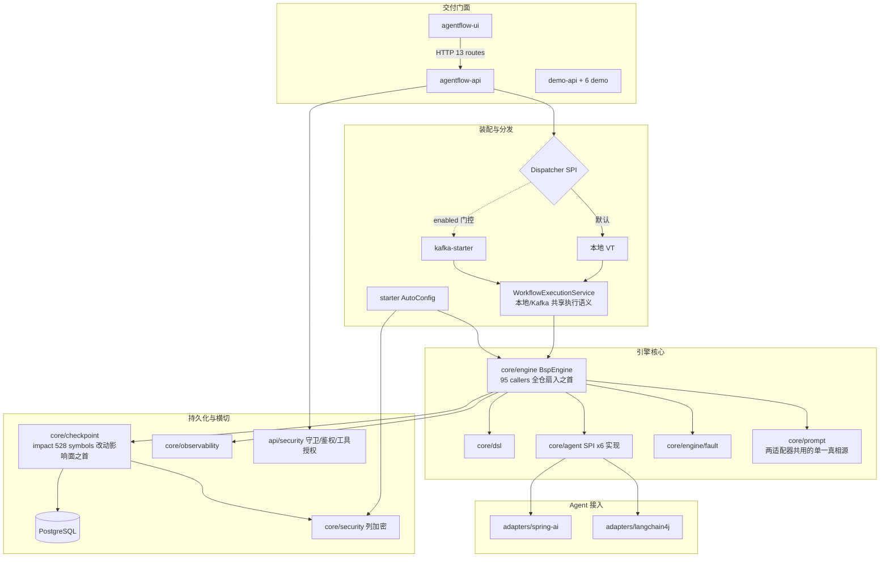

# 模块地图（按业务能力组织，不按技术目录）

> 分析时间：2026-08-25 23:55 ｜ target：main@2a37d6b27e5d50687c656adbeedd2b92c0fdee92 ｜ 模式：snapshot
> 取证方式：CodeGraph（模块间 callers/callees 关系 + 扇入统计）+ pom 依赖声明交叉验证
> 分析范围：13 Maven 模块 + UI；按「编排执行 / 持久化恢复 / Agent 接入 / API 安全 / 异步分发 / 装配 / 演示验证」七类能力组织
> 未覆盖/不可访问区域：无（基于全部 13 模块 CodeGraph 索引 + 源码结构）

| 模块 | 承担的业务能力 | 关键实体 | 上游（调用它） | 下游（它调用） | 复杂度/风险 | 证据 |
|---|---|---|---|---|---|---|
| core/dsl | YAML 声明→校验→分层 | WorkflowDefinition、NodeDefinition、EdgeDefinition(when/loop)、DAGLayerer | UI SubmitForm、WorkflowController、demo | core/engine（消费 SuperStep） | 中（环校验/回边三件套/喂回 channel 规则密集） | `agentflow-core/src/main/java/com/agentflow/dsl/SemanticValidator.java`（280 行）[代码已确认] |
| core/engine | BSP 执行循环+条件路由+迭代轮次+审批暂停/恢复 | BspEngine（46 members）、SuperStep、WorkflowContext | **全仓扇入最高：CodeGraph 95 callers**（api/starter/demo + 31 测试类） | dsl、agent、fault、checkpoint、observability、prompt | **高**（1,158 行；execute/recoverAndExecute/approveAndResume 三入口共享 runRounds） | `agentflow-core/src/main/java/com/agentflow/engine/BspEngine.java#L73` + CodeGraph callers "BspEngine" [代码已确认] |
| core/engine/checkpoint | 两级持久化+崩溃恢复+审批单+路由决策 | CheckpointManager SPI（CodeGraph impact: **528 affected symbols——全仓改动影响面最大**）、BarrierCheckpoint、ApprovalRequest、tryClaim | BspEngine、RecoveryProtocol、kafka-starter、api | PG/H2 | **高**（PostgresCheckpointManager 570 行 8 表 + 幂等语义；接口 20+ 方法被三实现继承） | `agentflow-core/src/main/java/com/agentflow/engine/checkpoint/PostgresCheckpointManager.java` + CodeGraph impact "CheckpointManager" [代码已确认] |
| core/agent | Agent 调用合约（框架无关） | AgentFunction SPI（**6 实现**：SpringAi/LangChain4j/Mock/RagAgentFunction/ApprovalGateAgent/DryRunMock）、AgentInput(11 字段)、Transient/Fatal 异常族 | BspEngine（NodeExecutor#apply 调用）、两适配器、demo-rag | — | 中（record 合约+异常语义是全系统稳定性根基） | CodeGraph query "AgentFunction"：6 个 implements 类 [代码已确认] |
| core/engine/fault | 容错三层链 | ErrorClassifier(composed)、RetryPolicy、TimeoutPolicy（CodeGraph: 13 callers in BspEngine）、ErrorHandler | core/engine | — | 中 | `agentflow-core/src/main/java/com/agentflow/engine/fault/` [代码已确认] |
| core/prompt | SpEL 解析+谓词求值+schema 校验（框架无关下沉件） | SpelPromptResolver（**CodeGraph callers：两适配器 namespace 共用——单一真相源的调用证据**）、PredicateEvaluator(3 members)、OutputSchemaValidator | engine（predicateEvaluator 字段）、两适配器 | — | 中（hardened SimpleEvaluationContext 安全边界） | CodeGraph callers "SpelPromptResolver" [代码已确认] |
| core/security | R22 列加密+凭证+脱敏 | ColumnEncryptor SPI、AesGcmColumnEncryptor、ColumnEncryptors 宽严工厂、CredentialManager、PromptRedactionFilter（CodeGraph: 2 callers——两适配器） | 两个 Postgres store、starter、两适配器（脱敏） | — | 高（密钥纪律 fail-closed） | `agentflow-core/src/main/java/com/agentflow/security/ColumnEncryptors.java` [代码已确认] |
| core/observability | 指标+trace+预算 | AgentFlowMetrics(5 指标族)、ExecutionTrace、WorkflowBudget(6 members: record/isExceeded/isActive...) | engine、adapters、api（TraceController） | Prometheus | 中（edge-triggered 预算/防双计费记录） | `agentflow-core/src/main/java/com/agentflow/observability/WorkflowBudget.java` [代码已确认] |
| core/version + core/debug | 定义版本管理 + 干跑/诊断 | WorkflowVersionManager、PostgresWorkflowDefinitionStore（CodeGraph: 10 callers 含 starter 装配 + 3 测试类）、DryRunEngine、DiagnosisService | api（WorkflowExecutionService 重取定义、DiagnosisController） | checkpoint | 低中 | CodeGraph explore "WorkflowDefinitionStore" [代码已确认] |
| adapters/spring-ai | 主 LLM 适配器 | SpringAiAgentAdapter（CodeGraph: 14 callers + 2 测试类）、TokenCountingAdvisor、MockAgentFunction、NodeRegistry#apply（CodeGraph: 13 callers） | starter/demo-api 装配、NodeRegistry | DeepSeek/OpenAI | 中高（advisor 链/usage 提取/cancel 降级框架坑集中地） | `agentflow-adapters/spring-ai/src/main/java/com/agentflow/adapters/springai/SpringAiAgentAdapter.java` [代码已确认] |
| adapters/langchain4j | 第二框架适配器（可移植性实证） | LangChain4jAgentAdapter（chatWithTools + SafeToolExecutor，CodeGraph: SafeToolExecutor 6 callers + 测试覆盖） | demo-api realDeepSeekAdapter、demo-rag delegate | DeepSeek | 中高（裸 ChatModel 工具循环≤5 轮+异常防泄漏） | `agentflow-adapters/langchain4j/src/main/java/com/agentflow/adapters/langchain4j/LangChain4jAgentAdapter.java` [代码已确认] |
| api | REST + 鉴权 + 守卫 + 审批端点 | WorkflowController、ApiKeyAuthFilter（26 callers）、WorkflowSubmissionGuard、CallerToolAllowlist（config ∪ DB）、ApprovalCenterController | UI（HTTP）、demo-api | dispatcher/引擎/checkpoint | 中高（IDOR/伪造 decidedBy/可见域/工具自授等安全语义密集） | CodeGraph: 13 route 节点 + `agentflow-api/src/main/java/com/agentflow/api/`（19 文件）[代码已确认] |
| kafka-starter | 提交/执行解耦 | KafkaWorkflowDispatcher、KafkaWorkflowConsumer（tryClaim 幂等 + unstaged 丢弃）、KafkaAgentFlowAutoConfiguration（7 @Bean 含自持 ObjectMapper） | demo-api 条件装配（`agentflow.kafka.enabled`） | WorkflowExecutionService（复用本地同一执行语义） | 中（at-least-once 语义下防双跑双计费） | `agentflow-kafka-starter/src/main/java/com/agentflow/kafka/` [代码已确认] |
| starter | 生产装配（mock/生产切换、双 strict 加密） | AgentFlowAutoConfiguration（postgresCheckpointManager @ConditionalOnBean(DataSource) + 生产 PG 定义存储 + fromEnvStrict） | demo-api @EnableAgentFlow、StarterIntegrationTest | 全部库模块 | 中（装配错误=安全静默失效，故 fail-closed） | `agentflow-starter/src/main/java/com/agentflow/starter/AgentFlowAutoConfiguration.java` [代码已确认] |
| demo-api + demo-*×6 | 可启动服务 + 拓扑演示 | ApiConfig（CodeGraph: 21 members——引擎全家桶 bean 工厂 + realDeepSeekAdapter + dispatcher 条件切换） | — | starter/adapters/core | 低（演示但承担验收角色：RagEngineZeroChangeTest 等） | `demo-api/src/main/java/com/agentflow/demo/api/ApiConfig.java` [代码已确认] |
| agentflow-ui | 六 Tab 控制台 | Dashboard、SubmitForm、ApprovalCenter（ApprovalCard）、api.ts withMockFallback | — | api（HTTP） | 中（读降级 mock 防白屏 / 写不降级防假成功 / 5xx 不降级防掩盖） | `agentflow-ui/src/lib/api.ts` + CodeGraph explore [代码已确认] |

## 模块关系 Mermaid 图（CodeGraph callers/callees 归纳）

## CodeGraph 度量的两大结构热点（换模块地图为「雷达」）

- **扇入之首 `BspEngine`（95 callers）**：全仓 31 个测试类 + api/starter/demo 主代码都直呼引擎——引擎签名一动全仓震。这是「核心引擎被广泛直接依赖」的量化证据，也解释了为何三入口共享 runRounds、构造器链逐层 null 兼容（不破坏旧调用方）[代码已确认]（CodeGraph callers "BspEngine"）。
- **改动影响面之首 `CheckpointManager`（impact 528 symbols）**：SPI 20+ 方法被 InMemory/Postgres/Noop 三实现 + RecoveryProtocol + kafka consumer + api 全链消费——接口演进的代价极高，故历史上一律用 default 方法向后兼容（如带 round 的 default 委托 round=0）[代码已确认]（CodeGraph impact "CheckpointManager" + git 历史 V5 迁移提交）。

## 未明确归属的模块（标 [待确认]）

- **Redis 的实际消费者**：`docker-compose.yml` 声明 redis 服务；CodeGraph 全库 query 无业务符号命中、core/api 源码无 spring-data-redis import。推测为早期规划的缓存层预留或 compose 模板惯性保留 [合理推断]（支撑事实：compose 有服务定义 + CodeGraph/源码双路验证零业务依赖；具体定位见 open-questions Q1）。
- **`com.agentflow.agent.ApprovalRequiredException`（异常形态）与 `engine.NodeResult.ApprovalRequired`（结果形态）的职责切分**：CodeGraph 显示前者被 core/agent 与 BspEngine 引用、后者内嵌于 NodeResult record；二者并存的设计理由未在可访问资料中发现 [待确认]（见 open-questions Q2）。
