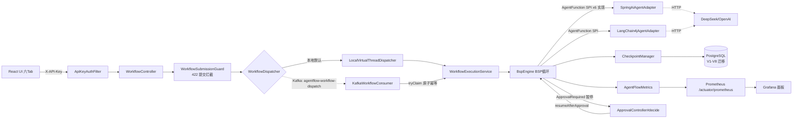

# 系统全景

> 分析时间：2026-08-25 23:55 ｜ target：main@2a37d6b27e5d50687c656adbeedd2b92c0fdee92 ｜ 模式：snapshot
> 取证方式：CodeGraph（266 文件 / 5,068 节点 / 11,949 边，索引已 sync）+ 源码精读 + git 历史
> 分析范围：13 个 Maven 模块（core/adapters×2/api/kafka-starter/starter/6 demo）+ React UI + DB 迁移 V1–V8 + CI；git 全量历史（169 commits）
> 未覆盖/不可访问区域：SonarCloud 后台、外部 LLM 供应商内部行为、Kafka broker 集群内部行为；`agentflow-ui/src/lib/mockData.ts` 仅作降级数据源未逐行分析

## 它是干什么的（产品视角，带可信度标签）

AgentFlow 是一个 **Java 原生轻量级 Multi-Agent 编排引擎**：用 YAML DSL 声明工作流（节点=Agent 调用，边=依赖），以 BSP（Bulk Synchronous Parallel）执行模型驱动多 Agent 像微服务一样协作，提供两级 Checkpoint 持久化、崩溃恢复、容错重试、成本核算与审批中断恢复 [需求已确认]（`docs/plans/agentflow/01-problem-frame.md`「为什么做 AgentFlow」：*不是填补生态空白，是从0复现展示后端工程能力*）。

它包含三层身份：
1. **可嵌入的引擎库**：`agentflow-core`（BSP 引擎 + DSL + checkpoint + 容错 + 可观测）经 `agentflow-starter` 的 `@EnableAgentFlow` 装配进任意 Spring Boot 应用 [代码已确认]（`agentflow-starter/src/main/java/com/agentflow/starter/AgentFlowAutoConfiguration.java`）；
2. **可启动的 REST 服务**：`demo-api` 把引擎 + 鉴权 + 审批 + Kafka 封装成 HTTP 服务（`POST /api/workflows` → 202 异步执行）[代码已确认]（`demo-api/src/main/java/com/agentflow/demo/api/AgentFlowApiApplication.java`）；
3. **简历项目**：定位「后端工程化 70% + Agent 30%」，与 ToyRush/InterviewCoach 构成三项目矩阵 [需求已确认]（`01-problem-frame.md`「简历定位（七三开）」）。

## 服务/进程清单与边界

| 单元 | 形态 | 职责 | 证据 |
|---|---|---|---|
| agentflow-core | 库 | DSL 解析校验、BSP 引擎、checkpoint SPI、容错、metrics、列加密 | 73 个 java 文件、8 个包 [代码已确认]；CodeGraph: core 1,488 个 method 节点 |
| agentflow-adapters/spring-ai | 库 | Spring AI 2.0 ChatClient 适配 + mock agent + advisor 链 | `agentflow-adapters/spring-ai/src/main/java/com/agentflow/adapters/springai/SpringAiAgentAdapter.java`（CodeGraph: 14 callers + 2 测试类覆盖）[代码已确认] |
| agentflow-adapters/langchain4j | 库 | LangChain4j 适配器（第二框架可移植性验证） | `agentflow-adapters/langchain4j/src/main/java/com/agentflow/adapters/langchain4j/LangChain4jAgentAdapter.java` [代码已确认] |
| agentflow-api | 库 | REST 端点 + API Key 鉴权 + 提交守卫 + 工具授权 | 19 个文件、CodeGraph: 13 条 route 节点 [代码已确认] |
| agentflow-kafka-starter | 库 | Kafka 提交/执行解耦（producer/consumer/autoconfig） | `agentflow-kafka-starter/src/main/java/com/agentflow/kafka/KafkaWorkflowConsumer.java` + `KafkaAgentFlowAutoConfiguration.java`（7 个 @Bean：producer/consumer factory、dispatcher、consumer、自持 ObjectMapper）[代码已确认] |
| agentflow-starter | 库 | `@EnableAgentFlow` + AutoConfiguration 生产装配 | `agentflow-starter/src/main/java/com/agentflow/starter/AgentFlowAutoConfiguration.java`（`agentflow.mock.enabled` 切 mock/生产；postgresCheckpointManager @ConditionalOnBean(DataSource)）[代码已确认] |
| demo-api | 可执行 | REST demo 服务（真实 LLM/Kafka/RAG 条件装配） | `demo-api/src/main/java/com/agentflow/demo/api/ApiConfig.java`（CodeGraph: 21 members——bspEngine/checkpointManager/realDeepSeekAdapter/workflowDispatcher 等 bean 工厂）[代码已确认] |
| demo-* × 6 | 可执行 | 拓扑演示（串行/fork-join/条件/循环/RAG） | `demo-supplier-risk/src/main/java` 等 [代码已确认] |
| agentflow-ui | 前端 | React 18 六 Tab 控制台（看板/提交/定义/轨迹/诊断/审批中心） | `agentflow-ui/src/App.tsx`（六组件条件渲染切换）[代码已确认] |

## 应用入口（HTTP / MQ / CLI）

**HTTP 入口 13 条**（CodeGraph route 节点全集，全部经 `ApiKeyAuthFilter` X-API-Key SHA-256 鉴权，`agentflow-api/src/main/java/com/agentflow/api/security/ApiKeyAuthFilter.java`——CodeGraph: 26 callers）[代码已确认]：

| 路由 | 控制器#方法 | 语义 |
|---|---|---|
| `POST /api/workflows` | WorkflowController#submit | 提交 YAML+inputs → 202 异步（守卫 422 拦截 → dispatcher 派发） |
| `GET /api/workflows` | WorkflowController#list | 看板列表 |
| `GET /api/workflows/{id}/status` | WorkflowController#status | 状态轮询 |
| `POST /api/workflows/{id}/retry` | WorkflowController#retry | 重试（Kafka 模式先复位 PENDING 再派发） |
| `GET /api/workflows/{id}/version-check` | WorkflowController | 执行版本 vs 最新定义冲突 |
| `GET /api/workflows/{id}/trace` | TraceController | ExecutionTrace 快照 |
| `POST /api/diagnosis` | DiagnosisController | 5 类问题诊断 |
| `GET /api/approvals/pending` | ApprovalCenterController#pending | 跨工作流待批聚合（非 admin 只见自己创建的） |
| `GET /api/workflows/{id}/approvals/pending` | ApprovalController#pending | 单工作流待批 |
| `POST /api/workflows/{id}/approvals/{approvalId}` | ApprovalController#decide | APPROVE/REJECT 决策 → resumeAfterApproval |
| `GET /api/tools/grants` | ToolGrantController | 工具授权自读/admin 查任意 |
| `POST /api/tools/grants` | ToolGrantController | grant（admin-only） |
| `DELETE /api/tools/grants/{callerId}/{toolName}` | ToolGrantController#revoke | revoke（admin-only） |

**MQ 入口**：`agentflow.kafka.enabled=true` 时 `KafkaWorkflowDispatcher#dispatch` 往 topic `agentflow-workflow-dispatch` 发 String-JSON（StringSerializer，spring-kafka 4.1 废弃 JsonSerializer 的替代），`KafkaWorkflowConsumer#onMessage` `@KafkaListener` 消费——先 `checkpointManager.tryClaim` 原子幂等再执行，未 staged 任意 id 丢弃 [代码已确认]（CodeGraph: WorkflowDispatcher 10 callers 横跨 api/kafka-starter/demo-api 三模块）。

**CLI/演示入口**：6 个 demo 模块各自的 main 直接跑 BspEngine（不经 HTTP）[代码已确认]。

## 外部依赖（DB / 缓存 / MQ / 第三方）

| 依赖 | 用途 | 证据 |
|---|---|---|
| PostgreSQL | checkpoint/审批/路由决策/定义/工具授权 5 类表（Flyway V1–V8） | `agentflow-core/src/main/resources/db/migration/` [代码已确认] |
| Redis | docker-compose 声明；业务代码（core/api）无 Redis import——CodeGraph 全库 query "redis" 无业务符号命中 [代码已确认]（声明与消费脱节本身是事实；定位见 open-questions Q1 [待确认]） |
| Kafka 3.9 (KRaft) | 提交/执行解耦（`--profile distributed`） | `docker-compose.yml` + `agentflow-kafka-starter/` [代码已确认] |
| LLM：DeepSeek（OpenAI 兼容）| 真实 Agent 调用（`agentflow.real.enabled` + env `DEEPSEEK_API_KEY` 门控） | `demo-api/src/main/java/com/agentflow/demo/api/ApiConfig.java#realDeepSeekAdapter`（CodeGraph: LangChain4jAgentAdapter 构造点）[代码已确认] |
| Prometheus + Grafana | 指标采集与面板（`--profile observability`，自动装配） | `deploy/grafana/provisioning/` [代码已确认] |

## 核心调用链（CodeGraph 验证的执行主路径）

**提交→执行主链** [代码已确认]（CodeGraph callers 链逐跳验证）：

```
WorkflowController#submit
  → WorkflowSubmissionGuard.check（422 预拦截）
  → WorkflowDispatcher.dispatch（10 callers：api 本地 VT 默认 / kafka-starter 生产可换）
      ├─ LocalVirtualThreadDispatcher#dispatch（默认，VirtualThread executor）
      └─ KafkaWorkflowDispatcher#dispatch ~~ MQ: agentflow-workflow-dispatch ~~>
           KafkaWorkflowConsumer#onMessage → tryClaim 原子幂等
  → WorkflowExecutionService#run（11 callers：两 dispatcher + ApprovalController 复用同一语义）
      → 定义重取（WorkflowVersionManager#loadDefinition，3 次重试 1s backoff——跨节点容忍窗口）
      → BspEngine#execute（CodeGraph: 95 callers，全仓扇入最高）
          → runRounds（3 callers：execute/recoverAndExecute/approveAndResume 三入口共享）
              → runStep → NodeExecutor（21 callers，retryPolicy 包裹）
                  → AgentFunction#apply（6 实现）
              → applyBarrier（runStep 内唯一调用点）→ updateReachability（路由剪枝）
```

**审批恢复链** [代码已确认]：`ApprovalController#decide` → `WorkflowExecutionService#resumeAfterApproval`（3 callers）→ `BspEngine#approveAndResume`（CodeGraph: 9 个测试调用锁定行为：resume/reject/再暂停/兄弟输出保留/takenEdges 预置）。

## 全局 Mermaid 架构图


