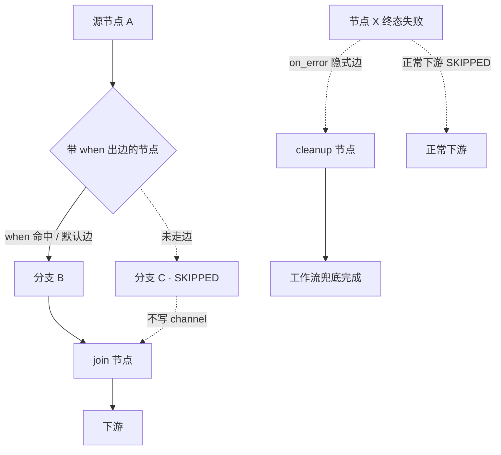

## Summary

给 AgentFlow 静态 DAG 加条件分支：`EdgeDefinition` 加可选 `when` 谓词（运行时选一条下游路径），`NodeDefinition` 加可选 `on_error: goto`（终态失败跳兜底节点）。引擎从「每层跑所有节点」改为「每层跑**可达**节点」，被路由切断的下游标 SKIPPED；checkpoint 持久化路由决策，恢复期重算 SKIPPED 不复活已跳节点。保持无环、保留 BSP 分层与 barrier。

---

## Problem Frame

v1 是静态 DAG：`DAGLayerer.computeSuperSteps` 执行前一次性算好所有节点层号，`BspEngine` 逐层「并行执行 → barrier」，任一节点失败即 abort（`applyBarrier` 对 `NodeResult.Failure` 抛异常）。这无法表达「节点输出决定下一步走 B 还是 C」，也无法表达「失败跳 cleanup 而非整体 abort」——正是 v2 明列能力（KTD-9）。本计划把静态 DAG 扩成「无环 + 运行时路由」而不推翻 BSP 卖点。

---

## Requirements

**DSL 表达**

- R1. 边可带可选 `when` 布尔谓词，求值上下文为出边 `from` 节点输出，`output.<field>` 引用。
- R2. 一节点多条出边最多一条默认边（不带 `when`）；按声明顺序取第一条为 true；都不为 true 且无默认边 → FAILED，诊断「无分支命中」。
- R3. 节点可声明 `on_error: goto <nodeId>`；终态失败跳过正常下游、改走该节点，工作流不因此 abort。

**执行模型与校验**

- R4. 保留 BSP super-step：每层可达节点并行执行，之后 barrier；可达 = 存在从源经「已走边」的可达路径。
- R5. 不可达节点标 SKIPPED（非 FAILED），不执行、不重试、不写 channel。
- R6. 无环：静态图（普通边 + on_error 隐式边，忽略谓词）须无环；on_error 目标必须是静态图可达的下游节点。
- R7. 校验拒绝：条件边目标不存在、单节点多条默认边、on_error 目标不存在、on_error 指向上游、静态环。

**可观测与恢复**

- R8. trace 记录每次路由决策（命中边、SKIPPED 节点）。
- R9. outcome 三终态：正常完成 / 经 on_error 兜底完成 / FAILED（失败原因作诊断标签）。
- R10. checkpoint 只持久化路由决策；恢复期用「已走路径 + 静态图」重算 SKIPPED，不单独落 SKIPPED 态。

**向后兼容**

- R11. 不含条件边、不含 on_error 的现有工作流行为不变；动态机制无条件构造时关闭。

---

## Key Technical Decisions

- **KTD-1 谓词根对象 `output`**：新增布尔求值入口，根对象 `{ output: from 节点输出 }`；`output.<field>` 优先读 `structuredOutput`、降级 `content`（对齐 `AgentOutput` 现有读取约定）。复用 `SpelPromptResolver` 的 hardened `SimpleEvaluationContext`（`DataBindingPropertyAccessor` + `MapAccessor`、禁 `T()`/方法调用），不复用其字符串模板替换本体。
- **KTD-2 求值错误 ≠ false**：`when` 的 SpEL 解析/类型/缺字段错误按 Fatal 抛出（对齐 `SpelPromptResolver` 对 `SpelEvaluationException` 重新抛出转 Fatal 的约定），只有成功求值为 false 才算「不命中」。
- **KTD-3 可达性为单一新概念**：每层跑「可达」节点，不可达标 SKIPPED。分支汇合（join 有跳过入边）仍可达（另一条已走边可达），join 执行一次；被跳分支 channel 未写，读缺键/缺失值需宽容。
- **KTD-4 on_error 是隐式边**：作为节点属性声明，但纳入 `checkAcyclic` 的静态环校验；「下游」= 静态图可达性。
- **KTD-5 checkpoint 单一真相源**：只持久化路由决策（已走边 / on_error 目标），SKIPPED 是「已走路径 + 静态图」的确定性函数，恢复期重算、不单独落库。
- **KTD-6 on_error 最小范围逆转失败传播**：只有声明了 on_error 的节点的失败转为续跑，其它节点失败仍 abort（保持 U2/U4/U5 失败传播不变量，仅对 on_error 节点开例外）。
- **KTD-7 三终态 outcome**：正常完成 / 经 on_error 兜底完成 / FAILED；「无分支命中」是 FAILED 下的诊断标签，不单列。

---

## High-Level Technical Design

执行模型：静态图仍预分层，运行时按路由决策剪枝可达集。

- 实线 = 已走边（参与可达性）；虚线 = 未走边 / on_error 隐式边（下游被 SKIPPED 或仅错误触发）。
- barrier 语义不变：每层可达节点并行 → barrier → 合并 channel → 下一层。
- 恢复：读持久化的路由决策 → 重算可达集 → 崩溃层已完成节点跳过+重放、SKIPPED 节点不复活、未完成可达节点续跑。

---

## Implementation Units

### U1. DSL：边加 `when`、节点加 `on_error`

- **Goal:** 扩展 DSL record，使 `when` 谓词与 `on_error` 目标可解析，且缺失时向后兼容。
- **Requirements:** R1, R3
- **Dependencies:** 无
- **Files:**
  - `agentflow-core/src/main/java/com/agentflow/dsl/EdgeDefinition.java`（改：加 `String when` 字段）
  - `agentflow-core/src/main/java/com/agentflow/dsl/NodeDefinition.java`（改：加 `String onError` 字段）
  - `agentflow-core/src/test/java/com/agentflow/dsl/WorkflowDSLParserTest.java`（改：补解析用例）
- **Approach:** `EdgeDefinition` 从 2-arg 扩为 3-arg（加 `when`），`NodeDefinition` 从 8-arg 扩为 9-arg（加 `onError`）。Jackson `SNAKE_CASE` 自动映射 `on_error` → `onError`，`when` 单字无需映射。保留旧便捷构造（`when`/`onError` 默认 null），旧 YAML 不填仍解析。不为空语义校验留到 U3。
- **Patterns to follow:** `AgentflowMeta` 加 `budget_tokens`/`budget_cost` 的扩展方式（record 加可空字段 + 旧构造委托）。
- **Test scenarios:**
  - 解析带 `when` 的边 → `when` 字段非空、内容原样。
  - 解析带 `on_error` 的节点 → `onError` 字段非空。
  - 不带新字段的旧 YAML → 解析成功、新字段为 null（向后兼容）。
- **Verification:** `mvn -pl agentflow-core test` 绿；新增 DSL 解析测试通过。

### U2. 谓词求值器（SpEL → boolean）

- **Goal:** 提供「表达式 → boolean」的布尔求值入口，根对象为 `output`。
- **Requirements:** R1, R2（求值侧）
- **Dependencies:** 无
- **Files:**
  - `agentflow-core/src/main/java/com/agentflow/prompt/PredicateEvaluator.java`（新）
  - `agentflow-core/src/test/java/com/agentflow/prompt/PredicateEvaluatorTest.java`（新）
- **Approach:** 新增 `PredicateEvaluator`，持 hardened `SimpleEvaluationContext`（复刻 `SpelPromptResolver` 的三行配置）。`evaluate(String expr, Map<String,Object> output)` 解析表达式 → `getValue` → 断言 boolean。根对象用 record `Root(Map<String,Object> output)`。`SpelEvaluationException` / 非 boolean 结果 / 类型不匹配 → 重新抛 `FatalException` 子类（对齐 KTD-2）。`output.<field>` 的字段读取：`output` Map 键为 `structuredOutput` 的键优先、`content` 降级（由调用方拼好 Map 传入，求值器不感知来源）。
- **Patterns to follow:** `SpelPromptResolver` 的 `SimpleEvaluationContext.forPropertyAccessors(...)` 配置段。
- **Test scenarios:**
  - `output.verdict == 'approved'` 且 output 含 `verdict=approved` → true。
  - 求值为 false 的表达式 → false（非异常）。
  - 缺字段 `output.missing` → 抛 Fatal（不返回 false）。
  - `T(java.lang.System)` → 抛 Fatal（KTD-2 安全约束）。
  - 非 boolean 结果（字符串）→ 抛 Fatal。
- **Verification:** `mvn -pl agentflow-core test` 绿；PredicateEvaluator 测试覆盖 true/false/三种异常。

### U3. SemanticValidator 条件边与 on_error 校验

- **Goal:** 静态校验条件边与 on_error，并把 on_error 隐式边纳入环检测。
- **Requirements:** R2（默认边约束）, R6, R7
- **Dependencies:** U1
- **Files:**
  - `agentflow-core/src/main/java/com/agentflow/dsl/SemanticValidator.java`（改）
  - `agentflow-core/src/test/java/com/agentflow/dsl/SemanticValidatorTest.java`（改/新）
- **Approach:** ① 统计每节点带 `when` 的出边，带 `when` 的出边数 > 1 且无默认边合法，但默认边（不带 when）> 1 → 拒绝；② `on_error` 目标必须存在于 `ids`；③ `checkAcyclic` 除 `def.edges()` 外，把 `on_error` 作为 `(node.id → node.onError)` 的隐式边一并入图，从而捕获 on_error 回边（上游目标会成环）；④ 条件边 `from`/`to` 的存在性校验沿用现有逻辑（U1 已保证 `to` 可空，此处在 `when` 非空时要求 `to` 非空）。
- **Patterns to follow:** 现有 `checkAcyclic` 的 Kahn 拓扑排序（就地扩展边列表，不改算法）。
- **Test scenarios:**
  - `Covers AE6.` on_error 指向上游节点 → 抛 WorkflowValidationException（成环）。
  - `Covers AE6.` 条件边构成静态环 → 拒绝。
  - 单节点两条默认边 → 拒绝。
  - on_error 目标不存在 → 拒绝。
  - 合法条件边 + 合法 on_error → 通过。
- **Verification:** `mvn -pl agentflow-core test` 绿；新增校验用例通过，既有静态 DAG 校验不回归。

### U4. 引擎可达性剪枝 + SKIPPED

- **Goal:** 引擎按路由决策剪枝不可达节点，标 SKIPPED。
- **Requirements:** R2, R4, R5
- **Dependencies:** U1, U2
- **Files:**
  - `agentflow-core/src/main/java/com/agentflow/engine/BspEngine.java`（改：execute 循环 + 可达集计算）
  - `agentflow-core/src/main/java/com/agentflow/engine/DAGraph.java`（改：暴露前驱/后继 + 无 `when` 出边的 fan-out 判断，若已有则复用）
  - `agentflow-core/src/test/java/com/agentflow/engine/BspEngineConditionalTest.java`（新）
- **Approach:** 引入「路由决策」运行时状态（本轮已走边集合，初始为空=全部静态边可达）。每层执行前，从源出发沿「已走边」做可达性遍历，得到本层可达节点；静态层里不可达的节点标 SKIPPED（不提交执行）。带 `when` 出边的节点完成后：按声明顺序用 `PredicateEvaluator` 求值各 `when`，取第一条 true（或无 `when` 的默认边），把该边记入「已走边」，其余出边视为未走。纯静态节点（无 `when` 出边）保持 fan-out（所有出边都走）。SKIPPED 状态先作为内存/trace 概念落 `NodeTrace`（U6 完善持久化）。
- **Patterns to follow:** `BspEngine.runSuperStep` 现有的 `for (String id : step.nodeIds())` 循环；`DAGLayerer.computeSuperSteps` 的静态分层仍作「潜在层」，剪枝在层内做。
- **Test scenarios:**
  - `Covers AE1.` 二路分支 verdict=approved → approve 执行、reject SKIPPED。
  - `Covers AE4.` 两分支汇入 join → join 执行一次、不被跳过分支阻塞。
  - `Covers AE5.` 纯静态 DAG（无条件边）→ 行为与 v1 一致（全层执行）。
  - `Covers AE2.` 无默认且谓词均 false → 工作流 FAILED、诊断「无分支命中」。
  - 混合 fan-out：节点一条默认边 + 一条 `when` 边 → 命中 when 走 when、否则默认。
- **Verification:** `mvn -pl agentflow-core test` 绿；BspEngineConditionalTest 覆盖 AE1/AE2/AE4/AE5。

### U5. on_error 失败续跑

- **Goal:** on_error 节点的终态失败转为续跑兜底节点，而非 abort。
- **Requirements:** R3, R6
- **Dependencies:** U4
- **Files:**
  - `agentflow-core/src/main/java/com/agentflow/engine/BspEngine.java`（改：applyBarrier 失败处理）
  - `agentflow-core/src/test/java/com/agentflow/engine/BspEngineOnErrorTest.java`（新）
- **Approach:** `applyBarrier` 收集 `NodeResult.Failure` 时，对声明了 `on_error` 的节点：不并入 abort 集合，改记为「on_error 跳转」路由决策（标记该节点正常出边未走、on_error 隐式边已走），其正常下游在下层被剪枝为 SKIPPED；其余失败仍按现有逻辑抛 `WorkflowExecutionException` abort（KTD-6）。`on_error` 目标自身失败不二次跳转。
- **Patterns to follow:** 现有 `applyBarrier` 的 failure 聚合 → abort 路径；`ErrorHandler` 补偿调用点。
- **Test scenarios:**
  - `Covers AE3.` 节点终态失败 → on_error 目标执行、正常下游 SKIPPED、工作流按兜底完成。
  - `Covers AE10.` 同节点条件边 + on_error：成功走谓词分支、失败走 on_error，互斥。
  - on_error 目标自身失败 → 工作流 FAILED（不二次跳转）。
  - 无 on_error 的节点失败 → 仍 abort（失败传播不回归）。
- **Verification:** `mvn -pl agentflow-core test` 绿；BspEngineOnErrorTest 覆盖 AE3/AE10 + 回归。

### U6. 可观测：trace 路由决策 + 三终态

- **Goal:** trace 记录路由决策与 SKIPPED，outcome 收敛为三终态。
- **Requirements:** R8, R9
- **Dependencies:** U4, U5
- **Files:**
  - `agentflow-core/src/main/java/com/agentflow/observability/ExecutionTrace.java`（改：路由决策 + SKIPPED 节点记录）
  - `agentflow-core/src/main/java/com/agentflow/observability/NodeTrace.java`（改：加 SKIPPED 状态）
  - `agentflow-core/src/main/java/com/agentflow/engine/BspEngine.java`（改：outcome 三终态写入）
  - `agentflow-core/src/test/java/com/agentflow/observability/ConditionalTraceTest.java`（新）
- **Approach:** `ExecutionTrace` 加「路由决策列表」（已走边 / on_error 跳转）与「SKIPPED 节点集合」快照字段；`NodeTrace` 状态加 SKIPPED。工作流完成时按 KTD-7 写三终态：正常完成 / 兜底完成 / FAILED（失败原因 = 无分支命中 或 终态失败，作诊断标签）。指标沿用 `recordWorkflowExecuted{status}`，兜底完成与正常完成用独立 status 标签（供 Grafana 区分）。
- **Patterns to follow:** `ExecutionTraceRegistry` / `NodeTrace` 现有 record 结构；`AgentFlowMetrics` 的 status 标签约定（小写）。
- **Test scenarios:**
  - 条件路由后 trace 含命中边记录 + SKIPPED 节点集合。
  - on_error 兜底 → outcome 为兜底完成。
  - 无分支命中 → outcome FAILED + 诊断标签。
  - 静态 DAG 完成 → outcome 正常完成（回归）。
- **Verification:** `mvn -pl agentflow-core test` 绿；ConditionalTraceTest 覆盖路由决策/trace/三终态。

### U7. checkpoint 路由决策持久化 + 恢复重算 SKIPPED

- **Goal:** 崩溃恢复按持久化路由决策重放路径，不复活 SKIPPED 节点。
- **Requirements:** R10
- **Dependencies:** U4, U5
- **Files:**
  - `agentflow-core/src/main/java/com/agentflow/engine/checkpoint/ExecutionState.java`（改：加路由决策字段）
  - `agentflow-core/src/main/java/com/agentflow/engine/checkpoint/RecoveryProtocol.java`（改：重算 SKIPPED / 续跑可达节点）
  - `agentflow-core/src/main/java/com/agentflow/engine/checkpoint/CheckpointManager.java`（改：接口加 saveRoutingDecisions / findRoutingDecisions）
  - `agentflow-core/src/main/java/com/agentflow/engine/checkpoint/InMemoryCheckpointManager.java`（改）
  - `agentflow-core/src/main/java/com/agentflow/engine/checkpoint/PostgresCheckpointManager.java`（改）
  - `agentflow-core/src/main/resources/db/migration/V4__routing_decisions.sql`（新：routing_decisions 表或列）
  - `agentflow-core/src/test/java/com/agentflow/engine/checkpoint/RecoveryConditionalTest.java`（新）
- **Approach:** 新增持久化的「路由决策」记录（已走边 / on_error 目标，随 barrier 一并落库）。`RecoveryProtocol.recover` 读回路由决策 → 用「已走路径 + 静态图」重算可达集 → 崩溃层里 SKIPPED 节点不进入「待执行」，已完成可达节点跳过+重放，未完成可达节点续跑。不新增独立的 SKIPPED 持久化态（KTD-5）。`NodeStatus` 是否加 SKIPPED 值由实现定，但 checkpoint 权威真相源是路由决策。
- **Patterns to follow:** 现有 `saveBarrier` / `findLatestBarrier` / `findCompletedNodes` 的 SPI 扩展方式；`V1__checkpoint_schema.sql` / `V3__workflow_definitions.sql` 的 Flyway 迁移。
- **Test scenarios:**
  - `Covers AE8.` 崩溃后 `recoverAndExecute` 按路由决策重算 SKIPPED，被跳节点不重跑、不重复计费。
  - 恢复期谓词不重求值（路由决策为权威）→ 重放同一条路径。
  - 路由决策为空（静态 DAG）→ 恢复行为与 v1 一致（回归）。
- **Verification:** `mvn -pl agentflow-core test` 绿（含 RecoveryConditionalTest）；`mvn verify` 全绿 + JaCoCo 达标。

### U8. Demo 模块验收

- **Goal:** 新增 demo 覆盖条件路由 + 分支汇合 + on_error 兜底，端到端证明。
- **Requirements:** R1–R11 端到端，Success Criteria
- **Dependencies:** U4, U5, U6, U7
- **Files:**
  - `demo-conditional/`（新模块，pom + Application + workflow YAML + test）
  - `demo-conditional/src/test/java/com/agentflow/demo/conditional/ConditionalDemoTest.java`（新）
- **Approach:** 对齐 U11（合同审核）/U12（投资分析）demo 风格，用 mock_response 驱动一个路由工作流：classify →（approved / rejected 二路分支）→ 汇合 report，外加一个会失败的节点走 on_error 兜底。断言节点执行集、SKIPPED 集、outcome 三终态。
- **Patterns to follow:** `demo-contract-review` / `demo-investment-analysis` 的模块结构与 `MockAgentFunction` 用法。
- **Test scenarios:**
  - `Covers AE1/AE3/AE4.` 路由 + 汇合 + on_error 兜底端到端跑通，SKIPPED/outcome 断言正确。
- **Verification:** `mvn verify` 全仓绿（新模块入 parent pom）；`mvn -pl demo-conditional test` 绿。

---

## Scope Boundaries

**Deferred to Follow-Up Work**

- 循环 / 回边（反思、重试闭环、迭代到收敛）——需动态 ready-set 执行模型，不在本次范围。
- `when` 谓词引用跨节点 context（`context.<channel>`）——首版只引用 `from` 节点输出。
- 分支运行时可视化（UI 高亮实际路径）——先落到 trace 数据。

**Outside this product's identity**

- 让 Agent 运行时发明任意新节点/目标（纯自主构图）——与「YAML 声明式 + 可静态校验」冲突，不做。

---

## Risks & Dependencies

- **U7（checkpoint 恢复）是本计划最高风险单元**：动 DB migration + `RecoveryProtocol` + `CheckpointManager` 接口，且恢复正确性依赖「路由决策」与「静态图」重算的一致性。缓解：U7 独立成单元、路由决策为单一真相源（KTD-5）、恢复期不重求值谓词。
- **on_error 逆转「失败即 abort」不变量**：只对声明 on_error 的节点开例外（KTD-6），其余失败传播不变，降低对 U2/U4/U5 已部署语义的冲击。
- **`when` 声明顺序契约**：YAML 边列表须保持有序，`EdgeDefinition` 解析若落成 Set 会丢失 first-true-wins 顺序。缓解：DSL 保持 `List` 语义，U1 测试锁定顺序。

---

## Sources / Research

- `docs/brainstorms/2026-08-14-v2-conditional-branching-requirements.md` — 上游需求（origin）。
- `agentflow-core/src/main/java/com/agentflow/dsl/EdgeDefinition.java` — 现有 `(from, to)` record（加 `when`）。
- `agentflow-core/src/main/java/com/agentflow/dsl/NodeDefinition.java` — 现有 8 字段 record（加 `onError`）。
- `agentflow-core/src/main/java/com/agentflow/dsl/SemanticValidator.java` — `checkAcyclic` 只遍历 `def.edges()`，需纳入 on_error 隐式边。
- `agentflow-core/src/main/java/com/agentflow/engine/BspEngine.java` — `runSuperStep` 无条件跑层内所有节点；`applyBarrier` 任一失败即 abort。
- `agentflow-core/src/main/java/com/agentflow/prompt/SpelPromptResolver.java` — hardened `SimpleEvaluationContext` 配置（复用其配置，非本体）。
- `agentflow-core/src/main/java/com/agentflow/agent/AgentOutput.java` — `structuredOutput` 优先 / `content` 降级的读取约定。
- `agentflow-core/src/main/java/com/agentflow/engine/checkpoint/` — `NodeStatus`（IN_PROGRESS/COMPLETED/FAILED）、`ExecutionState`、`RecoveryProtocol`、`CheckpointManager`。
