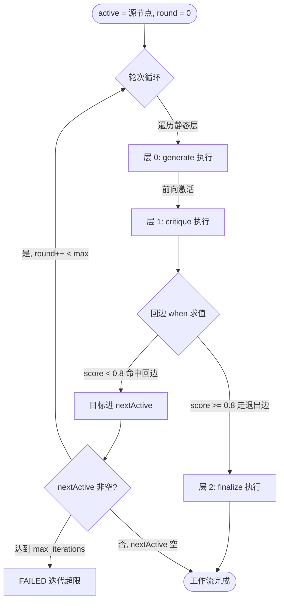

## Summary

给 AgentFlow 的静态 DAG 加循环/回边：图从「无环」放宽到「有界有环」，让节点输出决定「重跑一段子图直到收敛或达迭代上限」。最小切入是反思循环（生成→评估→不满意回边重跑→满意退出）：`EdgeDefinition` 加 `loop` 标记 + `max_iterations`，回边从静态分层豁免，`BspEngine` 外层加迭代轮次循环（保留预分层与 barrier），checkpoint 加 `round` 维度。

---

## Problem Frame

v2 条件分支已把「静态 DAG」扩成「无环 + 运行时路由」，但循环仍被硬边界挡住：`SemanticValidator.checkAcyclic` 强制无环，`DAGLayerer.computeSuperSteps` 依赖无环分层，`BspEngine` 用一次性 `for (SuperStep step : steps)` 遍历、superStep 是有限静态层号。三者共同构成「不能循环」。本计划沿用 v2 的「可达性剪枝 + 条件边」成果，把它推到「回边 + 迭代轮次」——不推翻 BSP 卖点，而是让静态分层忽略回边、barrier 边界不变，代价是环上节点每轮重执行、由 checkpoint 轮次重放买回确定性。

---

## Requirements

**图模型与 DSL**

- R1. 边可显式标记为回边（`loop: true`），回边指向图中不晚于源节点的节点（形成环）。
- R2. 回边必须带 `when` 谓词；无条件回边在解析期拒绝。
- R3. 每个环必须声明迭代上限（`max_iterations`）；未声明上限的环在解析期拒绝。

**执行模型**

- R4. 静态分层豁免回边：回边不参与 DAG 最长路径分层，静态图（去回边）仍须无环。
- R5. 迭代轮次：引擎外层按轮次循环；每轮内按静态分层逐层执行可达节点（复用 v2 可达性剪枝），barrier 后求值回边/退出条件。
- R6. 环上节点每轮执行一次，上一轮输出对下一轮可见（喂回语义）。
- R7. 终止条件：退出边命中（离开环）、或达到迭代上限（FAILED，诊断「迭代超限」）、或无可执行节点。

**checkpoint 与恢复**

- R8. checkpoint 增加迭代轮次维度：barrier / 节点级记录 (round, superStep)；路由决策按 (round) 存每轮已走边（super_step 仅作该轮进度记录）。
- R9. 恢复期重建「第几轮 + 已完成节点 + 已走路由决策」；同轮崩溃层已完成节点跳过不重复计费，不复活已完成轮次。

**可观测与兼容**

- R10. trace 记录迭代轮次与每轮回边/退出决策，供诊断「为何迭代了 N 次」。
- R11. 无回边的现有工作流行为不变（退化回 v2 条件分支的静态执行）。

---

## Key Technical Decisions

- **KTD-1 回边显式标记 `loop: true`，不自动推断**。识别回边需要分层、分层需要无环（鸡生蛋）；显式标记让回边从静态分层豁免，静态图仍无环可分层。回边 = `loop: true` + `when` + `max_iterations` 三件套，缺一校验拒绝。
- **KTD-2 保留预分层 + 外层迭代轮次，不放弃 BSP**。静态分层忽略回边，barrier 边界不变；外层 while 轮次循环，每轮内复用 v2 可达性剪枝。这是「BSP 怎么在循环下保留」的答案——静态分层 + barrier 不变，代价是环上节点每轮重执行，checkpoint 轮次重放买回确定性。
- **KTD-3 回边复用条件边路由语义**。回边是「带 `when` + `loop`、指向更早节点的条件边」，退出边是默认边（无 `when`）。`resolveTakenTargets` 的按声明序求值逻辑零改动，只新增「回边命中 → 目标进下一轮、不终结本轮前向传播」的分派。
- **KTD-4 checkpoint round 维度用 default 方法向后兼容**。`CheckpointManager` 接口加带 `round` 的方法，旧方法 default 委托 `round=0`；无回边工作流 round 恒 0，现有行为与既有测试零改动。
- **KTD-5 有界性双保险**。每环 `max_iterations`（静态校验强制）+ 引擎全局 hard stop（纵深防御，防未声明上界/逻辑 bug 导致的死循环）。
- **KTD-6 喂回语义复用 `context.<channel>`**。channel 每轮 barrier 后更新，环上节点经 context 读上一轮输出（`${previousStep}` 占位符自然延伸），不新增「上一轮」引用视图。

---

## High-Level Technical Design

执行模型：外层迭代轮次循环 + 内层静态分层（回边豁免）+ 双 active 集合。

- 每轮内：`active`（本轮前向传播）逐层执行可达节点，前向边/退出边激活后继进 `active`；回边命中把目标累积到 `nextActive`（下一轮起点），不终结本轮前向传播。
- 轮次边界：一轮遍历完静态层后，`nextActive` 非空 → `round++`、`active = nextActive` 重来；空 → 收敛结束。
- barrier 语义不变：每层可达节点并行 → barrier 合并 channel → 路由决策 → 下一层。
- 恢复：读 checkpoint 的 (round, superStep) + 已走路由决策 → 重建「第几轮 + 本轮 active/nextActive + 已完成节点」→ 同轮崩溃层已完成节点跳过、其余续跑。

---

## Implementation Units

### U1. DSL：边加 `loop` 与 `max_iterations`

- **Goal:** 扩展 `EdgeDefinition`，使回边标记与迭代上限可解析，缺失时向后兼容。
- **Requirements:** R1, R3
- **Dependencies:** 无
- **Files:**
  - `agentflow-core/src/main/java/com/agentflow/dsl/EdgeDefinition.java`（改：加 `boolean loop` + `Integer maxIterations` 字段）
  - `agentflow-core/src/test/java/com/agentflow/dsl/WorkflowDSLParserTest.java`（改：补解析用例）
- **Approach:** `EdgeDefinition` 从 3-arg（`from, to, when`）扩为 5-arg，加 `loop`（默认 false）与 `maxIterations`（默认 null）。保留 3-arg/2-arg 便捷构造委托默认值。Jackson `SNAKE_CASE` 自动映射 `max_iterations` → `maxIterations`，`loop` 单字无需映射。`loop` 与 `maxIterations` 的语义约束（回边必须有 when + 上限、非回边不能带上限）留到 U2 校验。
- **Patterns to follow:** `AgentflowMeta` 加 `budget_tokens`/`budget_cost` 的扩展方式（record 加可空字段 + 旧构造委托）。
- **Test scenarios:**
  - 解析 `loop: true` + `max_iterations: 3` 的回边 → `loop=true`、`maxIterations=3`。
  - 不带新字段的旧 YAML → `loop=false`、`maxIterations=null`（向后兼容）。
  - 解析带 `when` 但不带 `loop` 的边 → 普通条件边（`loop=false`）。
- **Verification:** `mvn -pl agentflow-core test` 绿；新增 DSL 解析测试通过。

### U2. 有界环校验（SemanticValidator）

- **Goal:** 校验回边三件套 + 静态图（去回边）无环。
- **Requirements:** R2, R3, R4（静态图无环侧）
- **Dependencies:** U1
- **Files:**
  - `agentflow-core/src/main/java/com/agentflow/dsl/SemanticValidator.java`（改：回边校验 + 静态图环检测）
  - `agentflow-core/src/test/java/com/agentflow/dsl/SemanticValidatorTest.java`（改/新）
- **Approach:** ① 遍历 `def.edges()`，识别 `loop=true` 的回边；回边 `from`/`to` 存在性沿用现有校验。② 回边必须带非空 `when`（R2），否则拒绝「无条件回边」。③ 回边必须带非空 `maxIterations`（R3），否则拒绝「无上限环」。④ 非回边（`loop=false`）不得声明 `maxIterations`（避免误导）。⑤ `checkAcyclic` 改为只对「非回边 + on_error 隐式边」做环检测（回边从 `allEdges` 豁免），从而「静态图无环」成立、回边成环不被误拒。⑥ 回边方向校验：静态图（去回边）分层后，回边目标层号必须不晚于源节点（`level[to] <= level[from]`），否则拒绝「前向 loop 边」（前向 loop 边会被 U3 豁免分层、目标被 U4 误推迟一轮，属静默错分层）。⑦ 喂回 channel 校验：环上节点作为喂回读/写的 channel 不得声明非 `OVERWRITE` reducer（CONCAT/MAX/CUSTOM 会把上一轮值累积、污染下一轮喂回语义，见 Risks），校验拒绝或警告。
- **Patterns to follow:** 现有 `checkAcyclic` 的 Kahn 拓扑排序；`allEdges()` 的 on_error 隐式边收集方式。
- **Test scenarios:**
  - `Covers AE3.` 回边无 `when` → 解析期拒绝。
  - `Covers AE4.` 回边有 `when` 但无 `max_iterations` → 解析期拒绝。
  - 非回边带 `max_iterations` → 拒绝。
  - 回边目标不存在 → 拒绝。
  - 合法回边（when + max_iterations）+ 静态图无环 → 通过。
  - 静态图（去回边）有环（非回边构成环）→ 拒绝（回归 v2 无环约束）。
  - 前向 loop 边（`loop=true` 但 target 层号晚于 source）→ 拒绝（回边方向校验）。
  - 环上喂回 channel 声明 CONCAT reducer → 拒绝或警告（喂回语义防污染）。
- **Verification:** `mvn -pl agentflow-core test` 绿；新增校验用例通过，既有静态 DAG 校验不回归。

### U3. 回边豁免分层（DAGLayerer）

- **Goal:** 静态分层忽略回边，静态图（去回边）仍可最长路径分层。
- **Requirements:** R4
- **Dependencies:** U1
- **Files:**
  - `agentflow-core/src/main/java/com/agentflow/dsl/DAGLayerer.java`（改：分层时跳过 `loop=true` 的边）
  - `agentflow-core/src/test/java/com/agentflow/dsl/DAGLayererTest.java`（改/新）
- **Approach:** `computeSuperSteps` 在构建 `successors`/`inDegree` 时，跳过 `loop=true` 的回边；on_error 隐式边仍参与分层（沿用 `allEdges()`）。回边目标靠其非回边入边获得正确层号（反思循环里 generate 的入边是 critique 的回边被豁免后，generate 成为入度 0 的层 0 源）。
- **Patterns to follow:** 现有 `DAGLayerer.computeSuperSteps` 的 Kahn 变体；`WorkflowDefinition.allEdges()` 的边集合。
- **Test scenarios:**
  - 反思循环（generate→critique，critique→generate 回边，critique→finalize）→ generate 层 0、critique 层 1、finalize 层 2。
  - 纯静态 DAG（无回边）→ 分层与 v1/v2 一致（回归）。
  - 回边目标有非回边入边 → 层号由非回边入边决定，不受回边影响。
- **Verification:** `mvn -pl agentflow-core test` 绿；分层测试覆盖回边豁免 + 静态回归。

### U4. 迭代轮次执行（BspEngine + checkpoint round 接口）

- **Goal:** 外层轮次循环 + 回边路由分派 + 终止条件，环上节点每轮重执行、喂回上一轮输出；顺带把 checkpoint 的 round 接口与 data record 落到核心层（引擎循环要穿 round 进 checkpoint 写）。
- **Requirements:** R5, R6, R7, R8（接口/record 侧）, R10
- **Dependencies:** U1, U2, U3
- **Files:**
  - `agentflow-core/src/main/java/com/agentflow/engine/BspEngine.java`（改：execute 外层轮次循环 + 双 active 集合 + 回边路由）
  - `agentflow-core/src/main/java/com/agentflow/engine/checkpoint/CheckpointManager.java`（改：写/查方法加带 `round` 的 default 方法，旧签名 default 委托 `round=0`，KTD-4）
  - `agentflow-core/src/main/java/com/agentflow/engine/checkpoint/NodeOutputStore.java`（改：加 `int round` 字段）
  - `agentflow-core/src/main/java/com/agentflow/engine/checkpoint/BarrierCheckpoint.java`（改：加 `int round` 字段）
  - `agentflow-core/src/main/java/com/agentflow/observability/ExecutionTrace.java`（改：记录迭代轮次）
  - `agentflow-api/src/main/java/com/agentflow/api/DiagnosisService.java`（改：round-aware 去重 + 「迭代超限」诊断，api 模块联动）
  - `agentflow-core/src/test/java/com/agentflow/engine/BspEngineLoopTest.java`（新）
- **Approach:** `execute` 把「一次性 for 遍历 steps」改为「外层 while 轮次循环 + 内层 for 遍历 steps」。状态分两个集合：`active`（本轮前向传播，初始源节点）与 `nextActive`（回边目标累积，初始空）。每轮内沿用 `runStep` 逐层执行 `active` 中的可达节点；`resolveTakenTargets` 的返回值升级为「边限定目标」（携带命中的 `EdgeDefinition` 或其 `loop` 标记，非裸 `String`），据此分派：命中回边（`loop=true`）→ 目标进 `nextActive`、否则进 `active`（前向/退出）——不重查 `def.edges()` 反推 loop 标记（同目标多入边时裸 id 歧义）。一轮遍历完，`nextActive` 空 → 收敛结束；非空 → `round++`、`active = nextActive`、`nextActive` 清空重来。终止双保险：单回边命中达该边 `max_iterations` 仍未退出 → FAILED「迭代超限」；另设引擎级 `maxTotalRounds` 常量（纵深防御，防未声明上界/逻辑 bug 死循环，超限 FAILED「迭代超限(全局)」）。`round` 随 `runStep`/checkpoint 调用透传；trace 记录每轮迭代（供 R10）；`DiagnosisService` 改为按 `(round, nodeId)` 判重（同一 nodeId 跨轮合法执行不误判「重复执行」），并识别工作流级「迭代超限」失败原因。
- **Patterns to follow:** 现有 `runStep`/`updateReachability`/`resolveTakenTargets` 的可达性剪枝与条件边求值；`applyBarrier` 的失败聚合。
- **Test scenarios:**
  - `Covers AE1.` 二轮收敛：generate→critique 回边（score<0.8 重跑、score>=0.8 退出 finalize）→ generate 执行 2 次、finalize 执行 1 次。
  - `Covers AE2.` 迭代上限：`when` 恒真、`max_iterations=3` → 第 3 轮后 FAILED「迭代超限」，不无限循环。
  - `Covers AE5.` 喂回可见：第 2 轮 generate 的 `${previousStep}` 读到第 1 轮 critique 输出。
  - `Covers AE7.` 静态回归：无回边工作流逐层执行、行为与 v2 一致。
  - 回边 + 退出边组合：同节点回边命中进入下一轮、退出边命中离开环，两者互斥。
  - 无可执行节点终止（R7 第三分支）：一轮结束 `active` 与 `nextActive` 均空（无显式退出边）→ 正常完成，不抛异常。
- **Verification:** `mvn -pl agentflow-core test` 绿；BspEngineLoopTest 覆盖 AE1/AE2/AE5/AE7 + 无执行节点终止。

### U5. checkpoint round 持久化（InMemory/Postgres + migration）

- **Goal:** InMemory/Postgres 持久化 + V5 迁移把 round 维度落到存储，无回边工作流 round 恒 0 向后兼容。
- **Requirements:** R8
- **Dependencies:** U4
- **Files:**
  - `agentflow-core/src/main/java/com/agentflow/engine/checkpoint/InMemoryCheckpointManager.java`（改）
  - `agentflow-core/src/main/java/com/agentflow/engine/checkpoint/PostgresCheckpointManager.java`（改）
  - `agentflow-core/src/main/resources/db/migration/V5__loop_round.sql`（新：node_outputs / checkpoints / routing_decisions 加 round 列，default 0）
  - `agentflow-core/src/test/java/com/agentflow/engine/checkpoint/`（改：InMemory/Postgres 往返测试）
- **Approach:** InMemory 的 node key 加 round 段（`workflowId:round:superStep:nodeId`），barrier 按 `(round, superStep)` 排序。Postgres 三处改动须锁步：① `workflow_node_outputs` 的 `uq_node_output` 唯一约束从 `(workflow_id, super_step, node_id)` 改为 `(workflow_id, round, super_step, node_id)`；② `workflow_checkpoints` 的 `uq_workflow_checkpoint` 从 `(workflow_id, super_step)` 改为 `(workflow_id, round, super_step)`；③ `workflow_routing_decisions` 从「workflow_id 单行 latest-wins」改为「按 `(workflow_id, round)` 存每轮累计已走边（保留 `super_step` 列记录该轮已 barrier 层）」。V5 迁移须含 `DROP CONSTRAINT` + `ADD CONSTRAINT`（含 round 列），并同步重写 `PostgresCheckpointManager` 的三处 `ON CONFLICT` 子句（`saveNodeOutput`/`saveBarrier`/`saveRoutingDecisions`）以匹配新约束，否则 round≥1 写入撞旧约束或 SQL 报「no unique constraint matching ON CONFLICT」。round 列 `DEFAULT 0` 使旧行回填 round=0、无冲突。
- **Patterns to follow:** `V4__routing_decisions.sql` 的 Flyway 迁移方式；`V1__checkpoint_schema.sql` 的唯一约束与索引。
- **Test scenarios:**
  - 无回边工作流 round=0 → save/find 往返行为与迁移前一致（向后兼容）。
  - 带 round 的 saveNodeOutput/saveBarrier → findCompletedNodes 按 (round, superStep) 正确过滤。
  - 多 round 往返：round 0 与 round 1 同一 (superStep, nodeId) 不冲突、分别可查。
  - InMemory 与 Postgres（H2 兼容表）在 round 维度上往返一致。
- **Verification:** `mvn -pl agentflow-core test` 绿；checkpoint 往返测试覆盖 round 维度 + 向后兼容。

### U6. 恢复 round 维度（RecoveryProtocol + recoverAndExecute）

- **Goal:** 恢复期重建「第几轮 + 已完成节点 + 路由决策」，同轮崩溃层已完成节点跳过、不重复计费。
- **Requirements:** R9
- **Dependencies:** U4, U5
- **Files:**
  - `agentflow-core/src/main/java/com/agentflow/engine/checkpoint/ExecutionState.java`（改：加 `int round` 字段）
  - `agentflow-core/src/main/java/com/agentflow/engine/checkpoint/RecoveryProtocol.java`（改：按 (round, superStep) 定位崩溃点）
  - `agentflow-core/src/main/java/com/agentflow/engine/BspEngine.java`（改：`recoverAndExecute` 从「第 round 轮崩溃层」续跑）
  - `agentflow-core/src/test/java/com/agentflow/engine/checkpoint/RecoveryLoopTest.java`（新）
- **Approach:** 恢复必须重建「第几轮 + 本轮 active/nextActive」，三个缺口须在 U6 明确：① **轮次转换事件**——回边命中进入下一轮是 checkpoint 数据里的「(round, superStep)」之外的边界，`findLatestBarrier` 返回的最新 barrier 可能是「上一轮最后一层」而非「本轮崩溃层」，`nextSuperStep = superStep+1` 会越界（superStep == numLayers-1 时）。`recoverAndExecute` 持 `def`（可算 numLayers），须检测「latest.superStep == numLayers-1 且该轮有回边命中」→ 判为轮次边界，`nextRound = round+1`、从新轮层 0 续跑（并 re-enter 轮次循环，恢复后可能再迭代）。② **per-round 路由决策**——U5 已把路由决策按 `(workflow_id, round)` 存，恢复按「当前 round 的已走边」重建本轮 active/nextActive，不复用跨轮累计列表（否则 BFS 把上一轮回边/前向边误判为本轮可达、复活已完成轮次节点）。③ **nextActive 重建**——回边目标 = 当前 round 路由决策中 `loop=true` 边的 to，恢复期据此重建 nextActive（非从源节点 BFS 全体）。`findCompletedNodes` 按 `(round, nextSuperStep)` 查崩溃层已完成节点，同轮已完成节点跳过+重放、下一轮节点不复活、不同轮不重复计费。
- **Patterns to follow:** 现有 `RecoveryProtocol.recover` 的 nextSuperStep 定位与 stray 防护；`recoverAndExecute` 的 replayOutputs 重放。
- **Test scenarios:**
  - `Covers AE6.` 第 2 轮崩溃 → 恢复从第 2 轮崩溃层继续，第 1 轮节点不重跑、不重复计费。
  - 静态 DAG（round=0）崩溃恢复 → 行为与 v2 一致（回归）。
  - 崩溃层已完成节点（同 round 同 superStep）跳过 + 重放，未完成节点续跑。
- **Verification:** `mvn -pl agentflow-core test` 绿；RecoveryLoopTest 覆盖 AE6 + 回归。

### U7. demo-loop 端到端验收

- **Goal:** 新增反思循环 demo，端到端证明回边 + 迭代轮次 + 收敛。
- **Requirements:** R1–R11 端到端，Acceptance Examples（AE1–AE7）
- **Dependencies:** U4, U5, U6
- **Files:**
  - `demo-loop/`（新模块，pom + workflow YAML + test）
  - `demo-loop/src/test/java/com/agentflow/demo/loop/ReflectionLoopDemoTest.java`（新）
- **Approach:** 对齐 `demo-conditional` 模块风格，用 mock_response 驱动一个反思循环工作流：`draft`（生成）→ `critique`（评估，mock 分两次返回不同 score）→ 回边 `critique→draft`（`when: output.score < 0.8`，`loop: true`，`max_iterations: 3`）+ 退出边 `critique→finalize`（默认边）。断言节点执行集（draft 执行 2 次、finalize 1 次）、outcome 正常完成、trace 含迭代轮次记录。新模块入 parent pom。
- **Patterns to follow:** `demo-conditional/` 的模块结构与 `MockAgentFunction` 用法（含 `${previousStep}` 占位符喂回）。
- **Test scenarios:**
  - `Covers AE1.` 反思循环端到端跑通：draft 执行 2 次、finalize 1 次、trace 含轮次。
  - 迭代上限路径：score 恒低 → 达到 max_iterations 后 FAILED「迭代超限」。
- **Verification:** `mvn verify` 全仓绿（新模块入 parent pom）；`mvn -pl demo-loop test` 绿。

---

## Scope Boundaries

**Deferred to Follow-Up Work**

- 多节点迭代到收敛（辩论收敛、状态稳定判据）——本计划只做单回边反思循环。
- 图级并发循环（多个环并行、嵌套环）——需更复杂的轮次/就绪集建模。
- 循环 + 并行分支汇合（回边/退出边目标同时有并行分支入边）——join 节点跨轮双执行问题（一轮读陈旧循环输入、收敛时再执行一次），首版约束循环体线性、退出目标无并行入边。
- 循环运行时可视化（UI 高亮迭代轮次与回边路径）——先落到 trace 数据。

**Outside this product's identity**

- Agent 运行时发明任意新节点/目标（纯自主构图）——与「YAML 声明式 + 可静态校验」冲突，不做。

---

## Risks & Dependencies

- **U4（迭代轮次执行）是本计划最高风险单元**：动 `BspEngine` 核心执行循环（execute + recoverAndExecute 共用 `runStep`），且「双 active 集合 + 轮次边界」的正确性决定喂回/收敛/终止是否成立。缓解：回边复用 `resolveTakenTargets` 求值（零新增求值机制），静态图（去回边）仍无环使每轮内可达性剪枝逻辑不变。
- **U5/U6（checkpoint round 迁移 + 恢复）是次高风险**：动 DB migration + `CheckpointManager` 接口 + `RecoveryProtocol`，恢复正确性依赖「(round, superStep) 维度」与「路由决策按 round 记录」的一致性。缓解：round 维度用 default 方法委托 round=0 向后兼容（KTD-4），无回边工作流零回归。
- **喂回语义依赖 channel 每轮更新**：环上节点经 `context.<channel>` 读上一轮输出，若上游写 channel 失败/空值，谓词与模板求值须对缺失键宽容（沿用 v2 约定），否则回边求值异常会误判为 Fatal。另一隐患：非 `OVERWRITE` reducer（CONCAT/MAX/CUSTOM）会跨轮累积、污染下一轮喂回值——U2 已校验环上喂回 channel 拒绝非 OVERWRITE（见 U2 ⑦）。
- **有界展开（static unrolling）替代已考虑并拒绝**：`max_iterations` 是解析期常量，理论上可把循环静态展开为「节点副本链 + 既有条件边」复用 v1/v2 引擎零改动。但展开会让节点数随迭代上限线性膨胀（`max_iterations=N` → N 份副本），且 mock 模式无法表达「第 1 轮 score<0.8、第 2 轮 score>=0.8」的逐轮差异（同一 agent 的 `mock_response` 是静态的）——迭代轮次模型用「同一节点反复执行 + 喂回上一轮 channel」表达逐轮演化，是更正确的最小实现。此取舍已在 origin KTD-2 定方向。

---

## Sources / Research

- `docs/brainstorms/2026-08-14-v2-loop-backedge-requirements.md` — 上游需求（origin）。
- `docs/plans/2026-08-14-001-feat-v2-conditional-branching-plan.md` — v2 条件分支实现计划（本计划复用的可达性剪枝/条件边/路由决策持久化）。
- `agentflow-core/src/main/java/com/agentflow/dsl/EdgeDefinition.java` — 现有 `(from, to, when)` record（加 `loop`/`maxIterations`）。
- `agentflow-core/src/main/java/com/agentflow/dsl/SemanticValidator.java` — `checkAcyclic` 遍历 `allEdges()`，需豁免回边。
- `agentflow-core/src/main/java/com/agentflow/dsl/DAGLayerer.java` — 最长路径分层（回边豁免点）。
- `agentflow-core/src/main/java/com/agentflow/engine/BspEngine.java` — `execute` 一次性 for 遍历 + `runStep`/`resolveTakenTargets`/`updateReachability`（迭代轮次改造点）。
- `agentflow-core/src/main/java/com/agentflow/engine/checkpoint/` — `CheckpointManager`/`NodeOutputStore`/`BarrierCheckpoint`/`RecoveryProtocol`/`ExecutionState`（round 维度改造点）。
- `agentflow-core/src/main/resources/db/migration/V1__checkpoint_schema.sql` + `V4__routing_decisions.sql` — round 列迁移参照。
- `agentflow-core/src/main/java/com/agentflow/observability/ExecutionTrace.java` — 迭代轮次记录点。
