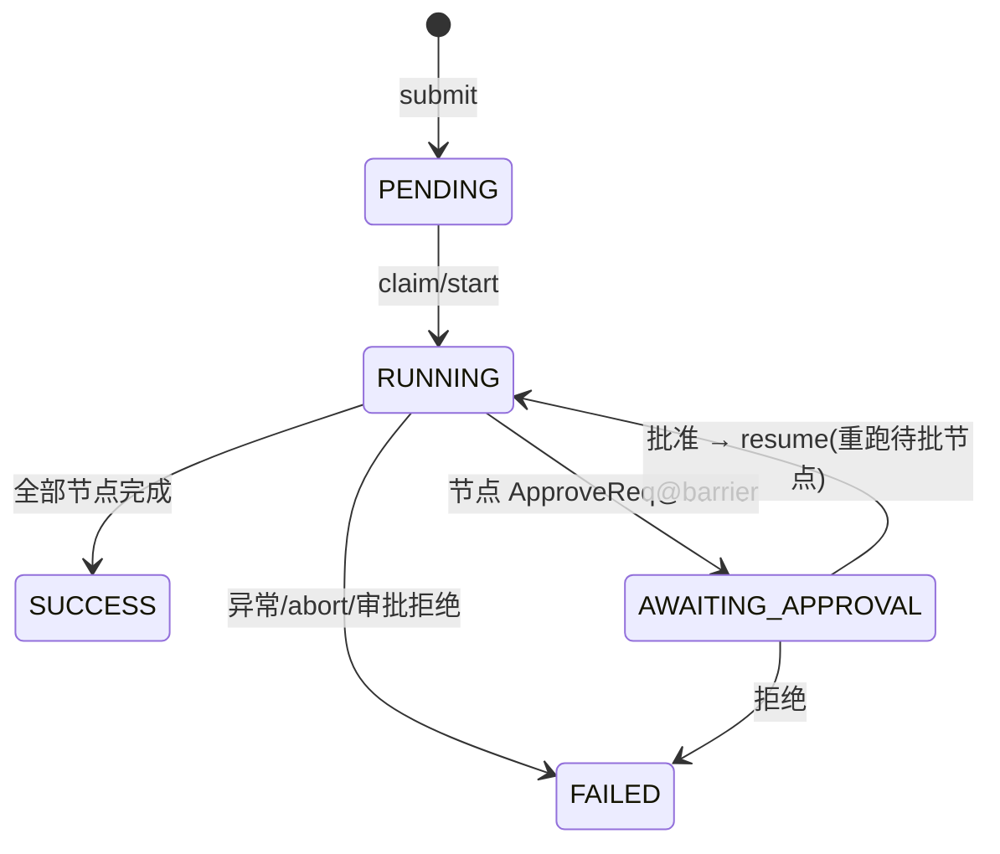
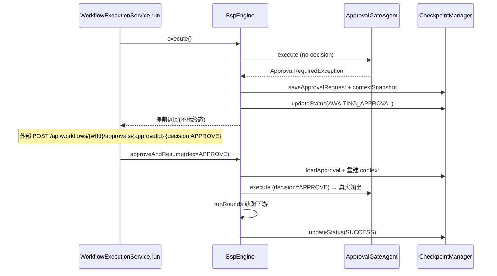
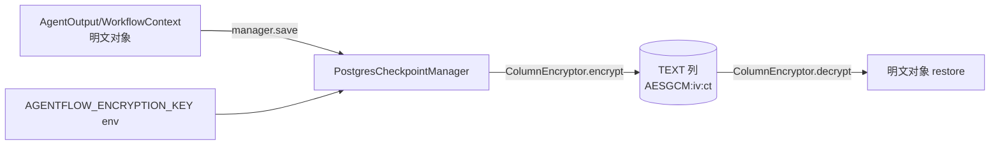

# feat: HITL 审批 + R22 列级加密 + RAG demo（v2/v1.1 收尾三件套）

> 类型：feat ｜ 日期：2026-08-20 ｜ 深度：Deep（跨 engine / checkpoint / api / 新 demo 模块）
> 定位：v2「完整 Human-in-the-Loop 审批中间件」→ ✅、v1.1「checkpoint 列级加密（R22）」→ ✅、v2「RAG 演示加分项」→ ✅。这是 agentflow 简历叙事「静态 DAG → 动态路由 → 迭代收敛 → 分布式解耦」之上的最后三块拼图，交付后进入文档整理 + 提交推送收尾。
> 前置：本项目已有的 engine checkpoint seam（U5/KTD-3）、`WorkflowExecutionService`（KTD-B）、`NodeResult` sealed 结果、postgres Flyway V1–V6、demo-api `ApiConfig` 显式 Bean wiring、`NodeRegistry` fallback→mock 均作为本计划的复用地基。

---

## Summary

三件独立但共享同一核心工程地基（checkpoint seam + 状态机 + `BspEngine` 骨架）的功能：

1. **HITL 审批** —— 让任意节点在「需要人工决策」处暂停工作流：Agent 抛 `ApprovalRequiredException` → 引擎在 super-step barrier 处持久化待批审批（`workflow_approvals`）+ 上下文快照 + 置状态 `AWAITING_APPROVAL` → 返回（**不**标 SUCCESS/FAILED）；外部经 API 批准后，引擎**重跑待批节点（注入批准决策）**并续跑下游；拒绝则工作流终态失败。
2. **R22 列级加密** —— 生产 Postgres 下对 checkpoint 敏感列（`node_outputs.output` / `checkpoints.channel_values` / `approvals` 载荷列）做 AES-256-GCM 静态加密，key 从 env `AGENTFLOW_ENCRYPTION_KEY` 读取；引擎 / DSL / API 零改动，仅 `PostgresCheckpointManager` 存取路径按可空 `ColumnEncryptor` 加解密。
3. **RAG demo** —— 新 `demo-rag` 模块：`InMemoryVectorStore`（离线确定性 embedder）+ `RagAgentFunction`（检索→增强→委托 LLM/mock），验证 KTD-6「引擎层零改动，Agent 扩展点成立」。

收尾统一为 `V7__hitl_approval_and_encryption.sql` 一个迁移（状态 CHECK 扩 `AWAITING_APPROVAL` + `workflow_approvals` 表 + 敏感列 `JSONB→TEXT`），文档同步 ROADMAP / CLAUDE.md / developer-notes，最后 commit + push 远程。

---

## Problem Frame

- **HITL**：`docs/ROADMAP.md` §4 v2 明确列出「完整 Human-in-the-Loop 审批中间件（中断→外部审批→恢复执行）」。现引擎是同步 BSP 循环，无「暂停等外部人」的语义——`WorkflowStatus` 仅 `PENDING/RUNNING/SUCCESS/FAILED`，`AgentFunction` 抛异常即失败。核心缺口：一个节点需要人类决策时，工作流既不能失败、也不能继续跑下游，而要「冻结在审核点」，等批准后从该点续跑。
- **R22**：`docs/ROADMAP.md` §3 把「checkpoint 敏感数据列级加密」列为 v1.1 升级点，现状是明文存储 + R21 鉴权保护。缺：可靠的静态加密，且不侵入引擎/DSL。
- **RAG**：v2 拍板「RAG 演示加分项——自定义 `RagAgentFunction`，引擎层零改动，验证 KTD-6 扩展点设计成立」，与 InterviewCoach 的 RAG 分工不重复（AgentFlow 只做编排侧接入）。

### 需求反面（本计划不做什么）
- **不**做跨节点分布式 HITL（Kafka 消费者线程上的审批恢复延后，保留本地 dispatcher 语义）。
- **不**做审批的 Web UI（留给后续，本计划交付 API + controller + demo）。
- **不**做 RAG 的持久索引 / 外部向量库接入（`InMemoryVectorStore` 足够验证 KTD-6）。
- **不**对 `workflow_definitions`（JSONB）加密（scope 聚焦 checkpoint 敏感列，文档记为 Deferred）。

---

## Key Technical Decisions

### KTD-H1 — 审批 = 「暂停 + 上下文快照 + 重跑待批节点」
审批节点首次执行抛 `ApprovalRequiredException`（携带请求描述；`AgentOutput` 不产出）→ 引擎在 super-step barrier 处识别 `NodeResult.ApprovalRequired` → 持久化：待批记录（nodeId/round/superStep + **含兄弟输出、不含审批节点的上下文快照，快照随审批行落库**）+ 置 `AWAITING_APPROVAL` → 提前退出 `runRounds`（不标 SUCCESS/FAILED）。批准后 `approveAndResume`：从审批行取快照重建 context → **重跑待批节点（`AgentInput` 注入批准决策）** → 其真实输出 merge → 从该 super-step 续跑下游（兄弟节点已含于快照、不重跑）。
- **为什么重跑而非「跳过/回填」**：审批的产物（该节点最终输出）只有人类批准后才存在，重跑让同一个 `AgentFunction` 凭决策给出真实结果，语义/代码都最干净。
- **为什么复用 recovery 式上下文重建**：`recoverAndExecute` 已有「保存的快照→重建 context→runRounds 续跑」全套，审批恢复复用同一骨架（新增 `runRounds` 显式 re-entry 而非复制），杜绝「复制必然漂移」的历史 P0 模式。

### KTD-H2 — 暂停时快照保留兄弟输出，恢复只重跑审批节点（正确性不依赖隔离）
暂停发生在 barrier 后，同 super-step 的兄弟节点已执行完毕。**它们的输出已合法 merge 进 barrier 语义的上下文快照**——暂停时把「含兄弟输出、不含审批节点（其不产出）」的上下文快照持久化进审批行；恢复时重建 context 即含兄弟输出，**兄弟不重跑、不重复计费**（对齐 `recoverAndExecute` 的 replay 语义）。审批节点自身在恢复时唯一重跑（带决策）。层隔离退化为「可读性」建议而非正确性前提；`SemanticValidator` 对审批节点同层有兄弟的场景加 **WARN**（复用 `VersionConflictDetector` WARN-not-block 语义）兜底提醒。

### KTD-H3 — `AgentInput` 加可空 `approvalDecision`
恢复路径注入决策；首跑路径为空。向后兼容（既有构造器委托默认 null，对齐 `budget`/`round` 的既有演进模式）。

### KTD-E1 — 列级加密用「可空 `ColumnEncryptor` + 密文自描述」而非 schema 加密列
`PostgresCheckpointManager` 构造器加可空 `ColumnEncryptor`。配置了 `AGENTFLOW_ENCRYPTION_KEY` 时用 `AesGcmColumnEncryptor`：AES-256-GCM，每值随机 12 字节 IV，存 `AESGCM:<ivBase64>:<ctBase64>` 自描述串。**列型必须 `JSONB→TEXT`**（密文非合法 JSON）。
- **Why 不引入额外列**：密文自描述（内嵌 IV + 算法标识）无需多列、无需元数据表，加解密只发生在 manager 边界。
- **Why 应用层而非列级 DB 函数**：保持加密在 Java 侧可控、可测、key 从 env 读；PG 原生 pgcrypto 属外部 SQL 面，与仓库「凭证只从 env、可测」约定不符。
- **Fail-closed 工厂**：`ColumnEncryptors.fromEnv()`（dev/demo 用）缺/非法 key → `NoopColumnEncryptor` + warn；`ColumnEncryptors.fromEnvStrict()`（生产 wiring 用）缺/非法 key → 启动抛异常。生产 Postgres 装配点（`AgentFlowAutoConfiguration`/真 PG 接线）一律用 strict——杜绝「缺 key 静默明文却仍标 R22 ✅」的加密表演（review P1 双共振）。
- **Legacy 明文行兼容**：`decrypt` 对非 `AESGCM:` 前缀的值**原样返回**（升级前落库的明文 JSON 文本读得动），新写才加密；启用 key 需 **key-before-first-write** 或显式 backfill（记 Risks）。

### KTD-E2 — 引擎/DSL/API 对加密零感知
加密只发生在 `PostgresCheckpointManager` 序列化/反序列化边界。`AgentOutput`/`WorkflowContext` 在内存中始终是明文对象，`InMemoryCheckpointManager`（dev）与 demo 不加密（明文 TEXT），生产 PG 才加密。

### KTD-R1 — RAG 用「确定性离线 embedder」保证 `mvn verify` 绿
`InMemoryVectorStore` 的 embedder 用 token 集合 + 余弦相似度（确定性、零外部依赖），离线可测。可选真实 LLM 路径由 env 门控，默认回退 mock。引擎对 `agent: rag` 节点零改动（`RagAgentFunction` 是普通 `AgentFunction` 实现）。**叙事定位**：本 demo 的价值主张是 **KTD-6 扩展点验证**（引擎零改动接入自定义 Agent），不是检索保真度——离线 embedder 是手段不是卖点（review 提示防「玩具」观感，InterviewCoach 才是 RAG 深度主场）。

---

## High-Level Technical Design

### 1) HITL 工作流状态机（新增 `AWAITING_APPROVAL`）

审批暂停形态：`RUNNING → AWAITING_APPROVAL`（引擎提前返回、不置终态）；批准后 `AWAITING_APPROVAL → RUNNING`（重跑待批节点）→ `SUCCESS | FAILED`。

### 2) HITL 暂停/恢复时序（单 JVM）

### 3) R22 加密数据通路（仅 Postgres 边界）

`NodeResult` sealed 扩充为三态：`Success | Failure | ApprovalRequired`（`ApprovalRequired` 携带 `ApprovalRequest`）。

---

## Scope Boundaries

- **In scope**：HITL 审批（core 类型/持久化/引擎暂停/引擎恢复/API/demo gate agent）；R22 列级加密（ColumnEncryptor + PG 接入 + V7 列型迁移）；RAG demo（`demo-rag` 模块 + demo-api 接线）；现状工程内的文档/测试/CI 同步。
- **Deferred to Follow-Up Work**（记于 ROADMAP，非本计划执行）：
  - 审批 Web UI（前端审批面板）。
  - 分布式 HITL（Kafka 消费者线程上的审批恢复 / 跨节点）。
  - `workflow_definitions` / `routing_decisions` 列加密（本计划聚焦 checkpoint 敏感列 + 新增 approvals 列）。
  - RAG 持久索引 / 外部向量库。
- **Outside**（明确不做）：多租户、Web 编辑器、真跨节点分布式引擎重构（R18③/R19）——它们是独立 v2 大项，不进本次收尾。

---

## System-Wide Impact

- **core**：新增 `Approval*` 类型、`WorkflowStatus.AWAITING_APPROVAL`、`NodeResult.ApprovalRequired`、`AgentInput.approvalDecision`；`BspEngine` 新增暂停/恢复路径（engine 骨架，需保证既有 `execute`/`recoverAndExecute` 零回归）；`ColumnEncryptor`；`CheckpointManager` 新增审批方法 + InMemory/Postgres 实现。
- **DB**：`V7` 迁移（表 `workflow_approvals` + status CHECK 扩 + 敏感列 `JSONB→TEXT`）。真 PG（`PostgresCheckpointManagerIT`）与 H2（`PostgresCheckpointManagerTest`）需同步——**这是测试环境 vs 生产环境差异的高发区**（ROADMAP 档 A 已记该教训）。
- **api**：`WorkflowController` 加审批端点 + `WorkflowExecutionService` HITL 感知 + `ApprovalController`（所有权校验复用 `WorkflowOwnershipChecker`）。
- **demo**：demo-api `ApiConfig` 注册 `approval` gate agent；新增 `demo-rag` 模块（新 pom 子模块 + 根 pom 登记 + CI 隐式纳入 verify）。
- **metrics/observability**：`AgentFlowMetrics` 增加审批相关计数（可选；`node.duration` 已覆盖节点耗时）。trace 记录审批暂停/恢复决策（可观测）。

---

## Implementation Units

### U1. [HITL 核心类型：Approval 领域模型 + NodeResult + NodeExecutor 映射]

**Goal**: 建立审批的领域类型与节点结果载体，让引擎能区分「节点请求审批」与「节点失败」。

**Requirements**: ROADMAP §4 HITL；KTD-H1。

**Dependencies**: 无（core 地基已有）。

**Files**:
- `agentflow-core/src/main/java/com/agentflow/engine/checkpoint/ApprovalRequest.java`（新建，record：approvalId / workflowId / nodeId / round / superStep / description / requestPayload / **contextSnapshot** / status / decidedBy / createdAt）
- `agentflow-core/src/main/java/com/agentflow/engine/checkpoint/ApprovalDecision.java`（新建，enum：APPROVE / REJECT）
- `agentflow-core/src/main/java/com/agentflow/engine/checkpoint/ApprovalStatus.java`（新建，enum：PENDING / APPROVED / REJECTED）
- `agentflow-core/src/main/java/com/agentflow/engine/checkpoint/WorkflowStatus.java`（改：加 `AWAITING_APPROVAL`）
- `agentflow-core/src/main/java/com/agentflow/engine/ApprovalRequiredException.java`（新建，extends `AgentExecutionException`，携带 `ApprovalRequest` 或描述字段）
- `agentflow-core/src/main/java/com/agentflow/engine/NodeResult.java`（改：sealed permits 加 `NodeResult.ApprovalRequired(String nodeId, ApprovalRequest request)`）
- `agentflow-core/src/main/java/com/agentflow/engine/NodeExecutor.java`（改：catch `ApprovalRequiredException` → 返回 `NodeResult.ApprovalRequired`（非 Failure））
- `agentflow-core/src/main/java/com/agentflow/engine/fault/RetryPolicy.java`（改：**第三 permit 处理**——execute 现对非 Success 做 `((NodeResult.Failure) r).error()` unchecked cast，需改为完整模式匹配，`ApprovalRequired` 直接透传，防 CCE→catch-all→FAILED 吞掉审批）
- `agentflow-core/src/main/java/com/agentflow/dsl/SemanticValidator.java`（改：审批节点同 super-step 有兄弟 → WARN 不阻断，复用 `VersionConflictDetector` 语义）
- 测试：`agentflow-core/src/test/java/.../engine/ApprovalHITLTypesTest.java`、`.../engine/fault/RetryPolicyApprovalTest.java`

**Approach**: 领域 record 用既有 POJO record 约定；`ApprovalRequest` 用 `approvalId`（UUID）作为持久化主键；`NodeExecutor.execute` 在 `ExecutionException` 分支里先判 `cause instanceof ApprovalRequiredException`，命中则构造 `NodeResult.ApprovalRequired`（携带 request），否则走既有 Failure 路径。`AgentOutput` 不变（审批节点**不**产出 output）。

**Patterns to follow**: `NodeResult` sealed 三态扩展现状；`WorkflowStatus`/`NodeStatus` 枚举既有形态；`AgentExecutionException` 异常层级。

**Test scenarios**:
- 节点抛 `ApprovalRequiredException` → `NodeExecutor.execute` 返回 `NodeResult.ApprovalRequired`（携带 request 的 nodeId/描述），**不**返回 Failure（happy path）。
- 普通异常 `FatalException`/`TransientException` → 仍返回 `NodeResult.Failure`（回归，error path）。
- 超时 → 仍 `NodeResult.Failure`（回归）。
- `ApprovalRequest` 构造：requestPayload / contextSnapshot / decidedBy 可空默认 null；`WorkflowStatus.valueOf("AWAITING_APPROVAL")` 合法（enum 约束）。
- `NodeResult` sealed：`switch` 覆盖全部三个 permits 分支编译通过（集成/编译级）。
- **RetryPolicy 回归**：`retryPolicy.execute` 收到 `NodeResult.ApprovalRequired` → 原样透传（不 cast 成 Failure、不吞），引擎能看到审批请求；`Success`/`Failure` 行为不变（integration，防 CCE 吞审批）。

**Verification**: 上述测试全绿；`NodeExecutorTest` 既有用例零回归；core 模块 JaCoCo ≥ 80%。

---

### U2. [HITL 持久化 SPI：CheckpointManager 审批方法 + InMemory 实现]

**Goal**: 定义审批持久化 seam（增删改查），并给出 `InMemoryCheckpointManager` 实现（dev/demo 双跑）。

**Requirements**: KTD-H1；R22 需后续复用同一 seam 的上下文快照列。

**Dependencies**: U1。

**Files**:
- `agentflow-core/src/main/java/com/agentflow/engine/checkpoint/CheckpointManager.java`（改：加审批 default 方法）
- `agentflow-core/src/main/java/com/agentflow/engine/checkpoint/NoopCheckpointManager.java`（改：审批方法 default no-op / throw）
- `agentflow-core/src/main/java/com/agentflow/engine/checkpoint/InMemoryCheckpointManager.java`（改：实现审批方法）
- 测试：`agentflow-core/src/test/java/.../engine/checkpoint/InMemoryCheckpointManagerApprovalTest.java`

**Approach**: `CheckpointManager` 加 default 方法（对齐 `tryClaim`/`saveRoutingDecisions` 既有 default 风格）：
- `String saveApprovalRequest(String workflowId, ApprovalRequest request)` — 落 PENDING，返回 approvalId（**快照随行持久化**：contextSnapshot 是 `ApprovalRequest` 的字段，暂停路径构造完整 request 一次写入）
- `List<ApprovalRequest> findPendingApprovals(String workflowId)`
- `Optional<ApprovalRequest> findApprovalById(String approvalId)` — 返回含 contextSnapshot 的完整请求（恢复重建上下文用）
- `boolean confirmApproval(String approvalId, ApprovalDecision decision, String decidedBy)` — PENDING→APPROVED/REJECTED，返回是否成功转移（幂等：已决策返回 false）

> 设计修正（review 合成）：**不**设独立的 `findApprovalContextSnapshot`（per-workflow 键在多级审批链下歧义）；快照随审批行走、按 approvalId 定位。`confirmApproval` 的 `decidedBy` 由服务端从 callerId 推导（U6），SPI 只接受已定值的 authorized caller。

InMemory 用 `ConcurrentHashMap<approvalId, ApprovalRequest>` + per-workflow 索引；`confirmApproval` 用 `compute` 原子转移（对齐 U5 `tryClaim` 的原子失败教训）。Noop 抛 `UnsupportedOperationException`（审批是显式能力，不静默吞）。

**Patterns to follow**: `tryClaim` 原子条件转移；`InMemoryCheckpointManager` 现有 `ConcurrentHashMap` 结构。

**Test scenarios**:
- `saveApprovalRequest`（含 contextSnapshot）→ `findPendingApprovals` 可见，status=PENDING；返回的 approvalId 可用于 `findApprovalById`（happy）。
- `findApprovalById` 返回含 contextSnapshot 的完整 request——快照字段随行持久化往返（integration，恢复重建依赖）。
- `confirmApproval(APPROVE)` → status=APPROVED；重复 confirm 返回 false（幂等，edge case）。
- `confirmApproval(REJECT)` → status=REJECTED（happy）。
- 多工作流隔离：wfA 的审批不影响 wfB（edge case）。
- `findApprovalById` 未知 id → empty（error path）。
- 并发 confirm 同一审批恰一成功（integration，原子性）。

**Verification**: 上述测试绿；`CheckpointManager` 既有实现（InMemory/Noop）零回归。

---

### U3. [V7 迁移 + PostgresCheckpointManager 审批/状态 + 敏感列 TEXT]

**Goal**: 落 V7 schema（HITL 表 + 状态枚举扩 + R22 列型），并让 Postgres 实现支持审批持久化与 TEXT 列读写。

**Requirements**: KTD-H1、KTD-E1；ROADMAP 档 A「测试环境 vs 生产差异」教训。

**Dependencies**: U2。

**Files**:
- `agentflow-core/src/main/resources/db/migration/V7__hitl_approval_and_encryption.sql`（新建）
- `agentflow-core/src/main/java/com/agentflow/engine/checkpoint/PostgresCheckpointManager.java`（改：实现审批方法 + output/channel 读写按 TEXT）
- 测试：`agentflow-core/src/test/java/.../engine/checkpoint/PostgresCheckpointManagerTest.java`（H2 建兼容表 + 真 SQL）、`.../engine/checkpoint/PostgresCheckpointManagerIT.java`（真 PG Failsafe，V7 validated + 审批往返）

**Approach**: V7 SQL：
- `ALTER TABLE workflow_executions DROP CONSTRAINT <status_check>;` 后重建 CHECK 含 `AWAITING_APPROVAL`（Postgres 自动名 `workflow_executions_status_check`；H2 兼容测试建表时直接写全枚举）。
- `CREATE TABLE workflow_approvals (approval_id TEXT PK, workflow_id TEXT NOT NULL, node_id TEXT NOT NULL, round INT, super_step INT, status VARCHAR(16) CHECK (...), request_payload TEXT, context_snapshot TEXT, decided_by TEXT, created_at, decided_at)` + `idx`（workflow_id, status）。
- 敏感列 `JSONB→TEXT`：`ALTER TABLE workflow_node_outputs ALTER COLUMN output TYPE TEXT USING output::text;` 与 `ALTER TABLE workflow_checkpoints ALTER COLUMN channel_values TYPE TEXT USING channel_values::text;`（显式 `USING`，防隐式 cast 依赖）。**同迁移内同步删除插入侧 `::jsonb` cast**（写密文时 `::jsonb` 会失败）。H2 测试用 `VARCHAR` 兼容类型。

`PostgresCheckpointManager` 实现审批方法（INSERT UPSERT + `findPendingApprovals` WHERE status='PENDING' + `confirmApproval` 条件 UPDATE WHERE status='PENDING' 原子转移）；`output`/`channel_values` 读写改为从 TEXT 列取/放 JSON 字符串（加密前的明文路径，R22/U7 在其上加解密）。

**Patterns to follow**: V5 loop-round / V6 tool-grants 的迁移写法；`ON CONFLICT` 幂等；`Semaphore(20)` 限流；H2 兼容表手法。

**Test scenarios**:
- 真 SQL 下审批 round-trip：INSERT PENDING → findApprovalById / findPendingApprovals（happy）。
- `confirmApproval` 条件 UPDATE：PENDING→APPROVED 恰一次，二次 no-op 返回 false（原子幂等，integration）。
- status CHECK 含 `AWAITING_APPROVAL` 可插入（edge case）。
- output/channel 以 TEXT 列读写 JSON 字符串，代码路径需把 `getString` 替换原 JSONB 读取（回归防线）。
- 真 PG（`PostgresCheckpointManagerIT`）V7 validated + 审批往返（Failsafe，无 PG 跳过）。

**Verification**: H2 测试 + 真 PG IT 绿；既有 checkpoint 往返测试（output/channel）在 TEXT 列下全绿（关键回归——历史上 JSONB→读写假设最多）。

---

### U4. [引擎：审批暂停（pause-on-approval）]

**Goal**: 引擎在 super-step barrier 处识别审批请求、持久化待批 + 上下文快照、置 `AWAITING_APPROVAL`、提前退出且不置终态。

**Requirements**: KTD-H1；ROADMAP HITL「中断」。

**Dependencies**: U1, U2。

**Files**:
- `agentflow-core/src/main/java/com/agentflow/engine/BspEngine.java`（改：`runStep`/`applyBarrier` 识别 `NodeResult.ApprovalRequired` → 暂停路径；`runRounds` 透出 paused 信号；`execute()` paused 时不标 SUCCESS/FAILED）
- `agentflow-core/src/main/java/com/agentflow/agent/AgentInput.java`（改：加 `approvalDecision`/审批上下文字段，可空，默认 null——既是 U4 传参也供 U5 恢复注入）
- 测试：`agentflow-core/src/test/java/.../engine/BspEngineApprovalPauseTest.java`

**Approach**: `applyBarrier` 遍历 `NodeResult`：遇 `ApprovalRequired` →（a）构造完整 `ApprovalRequest`（含当前 `context` 的副本作为 contextSnapshot——**兄弟节点输出已 merge、审批节点不产出**，故快照即「暂停点的合法 channel 状态」），`cp.saveApprovalRequest(workflowId, request)` 一次落库；(b) 记录「暂停」（paused flag 返回到 `runStep` → `runRounds` → `execute`）；(c) `cp.updateStatus(workflowId, AWAITING_APPROVAL)`；(d) **不**把该节点输出 merge、不 abort、不抛异常。`runRounds` 检测到 paused 即 break（不进入下一 round）。`execute()` 收到 paused：跳过 SUCCESS/FAILED 记录（trace 记 `AWAITING_APPROVAL`，metrics 记审批 count），返回部分 context。**finally 兜底注意**：`execute` 的 `finally { if (!outcomeRecorded) recordStatus(FAILED) }` 在 paused 分支必须跳过——paused 是合法中间态，不是失败（review 残留风险点名）。

`NodeResult.ApprovalRequired` 必须放在同 super-step 其它失败处理之前判断（审批优先，不 abort）；若同层既有 ApprovalRequired 又有 Failure，以审批暂停为准（兄弟输出已入快照，恢复时不重跑）。**载荷脱敏**：`requestPayload` 进 trace/StructuredLogger 前过 `PromptRedactionFilter`（对齐既有 prompt 脱敏纪律），暂停快照仅入库不下发列表 API。

**Patterns to follow**: `applyBarrier` 现有 on_error/失败聚合分支；`runRounds` 收敛判定的提前 break；`updateStatus` 生命周期。

**Test scenarios**:
- 单节点审批：节点抛 `ApprovalRequiredException` → engine 返回、status=AWAITING_APPROVAL、下游节点**未运行**、审批记录持久化含上下文快照（happy，Covers 核心 AE）。
- 审批节点同层有兄弟（Success）→ 兄弟输出进入暂停快照、审批节点不产出；`SemanticValidator` 对该编排 WARN（edge case）。
- 审批节点同层有兄弟 Fail → 仍暂停（审批优先）且兄弟 Fail 不影响快照（edge case）。
- 无审批工作流 → 正常 SUCCESS，`AgentInput.approvalDecision()` 恒 null（回归）。
- paused 后 `execute` 不写 `workflow.executed{success|failed}`，而写审批计数（metrics，integration）。
- 恢复入口（U5）前，`recoverAndExecute` 对 AWAITING_APPROVAL 状态不误恢复（edge case，防御）。

**Verification**: 引擎暂停测试全绿；既有 BspEngine 测试（含 v2/v2.1 条件分支/循环）零回归——`AgentInput` 新增字段走既有构造器默认 null，不破坏任何既有构造点。

---

### U5. [引擎恢复：approveAndResume]

**Goal**: 批准后引擎重跑待批节点（注入决策）并续跑下游直至 SUCCESS/FAILED。

**Requirements**: KTD-H1；ROADMAP HITL「恢复执行」。

**Dependencies**: U4。

**Files**:
- `agentflow-core/src/main/java/com/agentflow/engine/BspEngine.java`（改：新增 `approveAndResume(recovery?, def, resolver, reducer, workflowId, approvalId, decision, decidedBy)` 重载；复用 `runRounds` re-entry）
- 测试：`agentflow-core/src/test/java/.../engine/BspEngineApprovalResumeTest.java`

**Approach**: `approveAndResume`：
1. `cp.confirmApproval(approvalId, decision, decidedBy)`；非 APPROVE → 置 FAILED 提前返回（拒绝路径，API 侧也可处理）。
2. 加载审批（`nodeId/round/superStep` + contextSnapshot，快照含兄弟输出）。
3. 重建 `WorkflowContext`（快照）；`cp.updateStatus(RUNNING)`。
4. 构造 `AgentInput` 让待批节点可见 `approvalDecision=APPROVE`；用 `NodeExecutor` 执行该节点 → 真实 `AgentOutput` → `applyOutput` merge 进 context。
5. 从该 super-step 起 `runRounds` 续跑：**首轮 startLayer=审批层 S、`firstExcluded`=S 层的兄弟节点**（兄弟输出已在快照，不重跑不重计费），active 从审批节点可达下游起算；`round` 对齐审批行。
6. **`takenEdges` 预置**：从 `cp.findRoutingDecisions(workflowId, round)` 加载已走边（含审批前各层决策）再续跑——防 `saveRoutingDecisions` UPSERT 覆盖丢边导致恢复期可达集/SKIPPED 错算（review P2）。
7. 收尾 SUCCESS / FAILED（复用 `execute`/`recoverAndExecute` 的 outcome 记录与 trace 语义）。

**超时语义（review 决议）**：AWAITING_APPROVAL 是「挂起」，期间工作流总超时**不计**——恢复时 `workflowStart` 重新取 `Instant.now()` 作为本轮基线（`runRounds` 内 `timeoutPolicy.isWorkflowExceeded(workflowStart)` 从恢复时刻起算）；节点级超时（`NodeExecutor` 内）不受影响。

**Arch**: 复用 `computeReachable`/`runRounds`/`buildSuperSteps`；审批节点的重跑走 NodeExecutor（含重试/超时），key 是 `AgentInput.approvalDecision` 使 `ApprovalGateAgent` 首跑vs恢复行为分叉。

**Patterns to follow**: `recoverAndExecute` 的上下文重建 + runRounds re-entry + outcome 记录。

**Test scenarios**:
- APPROVE → 待批节点以 decision=APPROVE 重跑并产出真实输出 → 下游续跑至 SUCCESS；审批记录 APPROVED（happy，Covers 核心 AE）。
- REJECT → 工作流 FAILED，下游不跑，审批 REJECTED（happy，error path）。
- 待批节点重跑仍抛 `ApprovalRequired`（再次请求批）→ 再次 AWAITING_APPROVAL（多级审批链，edge case）。
- 上下文恢复正确：审批点之前的 barrier 输出在新 context 可见（integration）。
- **兄弟输出保留**：审批层含兄弟 Success → 恢复后兄弟不重跑、其输出仍在新 context（integration，KTD-H2 正确性不依赖隔离）。
- **takenEdges 预置**：审批前已有 when 路由决策 → 恢复后 `saveRoutingDecisions` 不覆盖丢边，崩溃恢复重算可达集正确（integration，review P2）。
- 无审批记录 / 已决策审批 → 幂等 no-op / 明确报错（error path）。
- 二次 approve 已 APPROVED 审批 → no-op（幂等，edge case）。

**Verification**: 恢复测试全绿；既有 engine 测试零回归；JaCoCo ≥ 80%。

---

### U6. [API：审批端点 + WorkflowExecutionService HITL 感知 + demo gate agent 接线]

**Goal**: REST 审批端点（查待批/决策）+ 服务层 HITL 感知（run 不误标 SUCCESS、resume 路径）+ demo-api 注册审批 gate agent，端到端可验。

**Requirements**: KTD-H1；ROADMAP HITL「外部审批」。

**Dependencies**: U4, U5。

**Files**:
- `agentflow-api/src/main/java/com/agentflow/api/WorkflowExecutionService.java`（改：`run()` 执行后若 status==AWAITING_APPROVAL 则不标 SUCCESS，留在该态；新增 `resumeAfterApproval(...)`：RUNNING → `engine.approveAndResume` → 终态收口）
- `agentflow-api/src/main/java/com/agentflow/api/ApprovalController.java`（新建，`/api/workflows/{wfId}/approvals`：`GET .../pending` 待批列表、`POST .../{approvalId}` 决策 approve/reject——都经 `WorkflowOwnershipChecker` 校验 + approval 归属该校验）
- `agentflow-api/src/main/java/com/agentflow/api/security/WorkflowOwnershipChecker.java`（改：可复用于审批归属，或加 helper）
- `demo-api/src/main/java/com/agentflow/demo/api/ApiConfig.java`（改：注册 `ApprovalGateAgent`（agent 名 `approval` 或经节点属性门控）到 NodeRegistry）
- `demo-api/src/main/java/com/agentflow/demo/api/agents/ApprovalGateAgent.java`（新建：AgentFunction——首跑（`input.approvalDecision()==null`）抛 `ApprovalRequiredException`（描述从 prompt/固定文案），恢复跑（decision!=null）返回真实 `AgentOutput`）
- 测试：`agentflow-api/src/test/java/.../api/ApprovalControllerTest.java`、`WorkflowExecutionServiceHitlTest.java`、`demo-api/.../ApprovalGateAgentTest.java`

**Approach**: `WorkflowController`/`ApprovalController` 所有权校验复用 `WorkflowOwnershipChecker`；`POST /approvals/{id}` 请求体**仅** `{decision}`——**`decidedBy` 服务端从 `ApiKeyAuthFilter` 的 callerId 推导**（对齐 `WorkflowOwnershipChecker.callerIdFrom`/`ToolGrantController` admin 模式），客户端传入的 `decidedBy` 一律忽略（review P1：防审批审计身份伪造）。APPROVE → `workflowExecutionService.resumeAfterApproval`；REJECT → `confirmApproval(REJECTED, callerId)` + `updateStatus(FAILED)`。
- **审批人身份决策**：v1 审批人 = 有权访问该工作流的外呼方（创建者持有 ownership；admin key 持有者可代批，复用 `AGENTFLOW_ADMIN_API_KEYS` 门控）——独立「审批人角色」模型记 Deferred（ROADMAP），避免默认 approver==creator 的隐式假设。
- **载荷不下发**：`GET /approvals/pending` 返回**精简投影**（approvalId / nodeId / description / status / createdAt），`requestPayload`/`contextSnapshot` 仅存库用于恢复，不下发 API（review P2：防敏感载荷旁路泄漏）。

`ApprovalGateAgent` 用 `agent: approval` 名 + mock 语义（decision=null 即 pending）。resume 走本地 dispatcher 语义（Kafka 跨节点恢复 Deferred，见 Scope——**显式注明恢复是本地路径**，防未来模式切换时被误认为跨模式一致）。

**Patterns to follow**: `WorkflowController` 鉴权/所有权模式；`ToolGrantController`（R21）的 controller 形态；`WorkflowExecutionService.run` KTD-B 收口。

**Test scenarios**:
- `POST /api/workflows/{wfId}/approvals/{approvalId}` APPROVE → 服务调 engine.approveAndResume → 工作流最终 SUCCESS；审批 APPROVED（integration）。
- `POST /api/workflows/{wfId}/approvals/{approvalId}` REJECT → 工作流 FAILED（happy）。
- 待批列表 `GET /api/workflows/{wfId}/approvals/pending` 只含 PENDING，且响应**不含** requestPayload/contextSnapshot（投影，security）。
- **decidedBy 服务端推导**：请求体带任意 `decidedBy` → 被忽略，审批记录 `decided_by` = callerId hash（security，防伪造）。
- 越权：非创建者/非 admin 查/批 → 403（security，error path）。
- approval 归属与 workflow 不匹配 → 400/403（security）。
- `run()` 在 AWAITING_APPROVAL 后不误标 SUCCESS（服务层关键断言，integration）。
- `run()` 无审批工作流 → SUCCESS（回归）。

**Verification**: controller + 服务 + gate agent 测试绿；api 模块既有测试零回归；demo-api 起服后 YAML 提交流程遇 `agent: approval` 节点走审批挂起、批准后完成（可选 live 验证）。

---

### U7. [R22：ColumnEncryptor + PostgresCheckpointManager 条件加密]

**Goal**: 可空 `ColumnEncryptor`（AES-256-GCM，key 从 env 读）+ `PostgresCheckpointManager` 存取路径条件加解密，敏感列静态加密。

**Requirements**: ROADMAP §3 R22；KTD-E1/KTD-E2。

**Dependencies**: U3（TEXT 列已就位）。

**Files**:
- `agentflow-core/src/main/java/com/agentflow/security/ColumnEncryptor.java`（新建，interface：`String encrypt(String)` / `String decrypt(String)`）
- `agentflow-core/src/main/java/com/agentflow/security/NoopColumnEncryptor.java`（新建，恒等）
- `agentflow-core/src/main/java/com/agentflow/security/AesGcmColumnEncryptor.java`（新建：AES-256-GCM，12B 随机 IV，`AESGCM:<ivB64>:<ctB64>` 自描述，detached auth tag）
- `agentflow-core/src/main/java/com/agentflow/security/ColumnEncryptors.java`（新建，工厂：`fromEnv()`（dev/demo）缺/非法 key → `NoopColumnEncryptor` + warn；`fromEnvStrict()`（生产）缺/非法 key → 抛 IllegalArgumentException——fail-closed）
- `agentflow-core/src/main/java/com/agentflow/engine/checkpoint/PostgresCheckpointManager.java`（改：构造器加可空 `ColumnEncryptor`（默认 `NoopColumnEncryptor`），`saveNodeOutput`/`saveBarrier`/审批载荷/读取时 encrypt/decrypt）
- `agentflow-starter/src/main/java/com/agentflow/starter/AgentFlowAutoConfiguration.java`（改：`postgresCheckpointManager(DataSource)` bean 注入 `ColumnEncryptors.fromEnvStrict()`——**生产装配确定接入 strict**，不是「核查是否有则接」）
- 测试：`agentflow-core/src/test/java/.../security/AesGcmColumnEncryptorTest.java`、`ColumnEncryptorsTest.java`、`PostgresCheckpointManagerEncryptionTest.java`（H2）

**Approach**: `AesGcmColumnEncryptor`：`SecretKey` 从 base64(32B) 显式派生（固定算法标识，杜绝工厂间派生漂移——review 残留点名）；每次 encrypt 生成 12B 随机 IV；GCM 自带完整性（篡改 → decrypt 抛 AEADBadTagException）。`Noop` 返回原文。`PostgresCheckpointManager` 序列化输出前 `encryptor.encrypt(json)` 写入 TEXT 列，读时 **`decrypt` 对非 `AESGCM:` 前缀值原样返回**（legacy 明文行兼容——升级前落库的数据读得动，新写才加密；启用 key 需 key-before-first-write 或显式 backfill，记 Risks）再反序列化。审批载荷列（request_payload/context_snapshot）同。**不**触碰引擎/DSL/`InMemory`。

**Patterns to follow**: `CredentialManager`（凭证只从 env 读）；`PromptRedactionFilter`（security 包既有成员）；`PostgresCheckpointManager` 序列化/反序列化点。

**Test scenarios**:
- AesGcm round-trip：encrypt → decrypt == 原文；两次 encrypt 密文不同（随机 IV，edge case）。
- 篡改密文（翻 bit）→ decrypt 抛异常（GCM 完整性，error path）。
- 缺 `AGENTFLOW_ENCRYPTION_KEY` → `ColumnEncryptors.fromEnv()` 返回 Noop（身份，兼容）；非法长度 → Noop + 告警；**`fromEnvStrict()` 缺/非法 → 抛异常**（fail-closed，edge case）。
- **Legacy 明文兼容**：`decrypt` 遇非 `AESGCM:` 前缀值原样返回（升级前明文行读得动），`AESGCM:` 前缀值才走 AES（integration，防历史数据打碎）。
- H2：Noop 下 output/channel 明文 JSON 文本落 TEXT 列（回归，与 U3 一致）；AesGcm 下落密文（原始列不含明文子串）、读取解密还原 `AgentOutput`（integration——静态加密证据）。
- 加密对引擎透明：engine（U1-U5 测试）不解密路径零改动即通过（回归防线）。

**Verification**: 加密/工厂/manager 测试全绿；既有 PG 测试（Noop 明文）零回归；`mvn verify` 全仓绿 + JaCoCo ≥ 80%；ROADMAP R22 项标 ✅。

---

### U8. [demo-rag 模块：RagAgentFunction + InMemoryVectorStore]

**Goal**: 新建 `demo-rag` 模块，验证 KTD-6「引擎层零改动、Agent 扩展点成立」：节点 `agent: rag` 走「检索 → 增强 → 委托」全流程。

**Requirements**: ROADMAP §4 RAG 加分项；KTD-R1。

**Dependencies**: core（AgentFunction/AgentInput/AgentOutput 已稳定）。

**Files**（新建模块 `demo-rag/`）:
- `demo-rag/pom.xml`（新建：parent + 依赖 core + 可选 langchain4j；JaCoCo 门禁按 demo 惯例处理）
- `demo-rag/src/main/java/com/agentflow/demo/rag/InMemoryVectorStore.java`（新建：doc 列表 + 确定性 embedder（token 集合/余弦）离线可测）
- `demo-rag/src/main/java/com/agentflow/demo/rag/RagAgentFunction.java`（新建，implements `AgentFunction`：query → top-k retrieve → 增强 prompt → 委托 wrapped AgentFunction（mock/真实）→ 返回 `AgentOutput`）
- `demo-rag/src/main/java/com/agentflow/demo/rag/RagDemoApplication.java` / `RagDemoConfig.java`（新建：NodeRegistry 注册 `rag`）
- 根 `pom.xml`（改：注册 `<module>demo-rag</module>`）
- `demo-api/src/main/java/com/agentflow/demo/api/ApiConfig.java`（改：可选注册 `rag` → `RagAgentFunction`，默认 mock fallback）
- 测试：`demo-rag/src/test/java/.../rag/InMemoryVectorStoreTest.java`、`RagAgentFunctionTest.java`、`RagEngineZeroChangeTest.java`（BspEngine 跑含 `agent: rag` 节点的工作流，证明引擎零改动）

**Approach**: `RagAgentFunction` 构造注入 `InMemoryVectorStore` + wrapped `AgentFunction`（下游 LLM 或 mock）。`execute`：读 `input.promptTemplate()` 为 query → top-k → 拼 augmented prompt → 委托 wrapped → 返回；`AgentOutput` 的 channel 写入由委托结果透传。`InMemoryVectorStore` 用确定性 token 集合 embedder（离线、无外部服务，保证 `mvn verify` 绿）。demo 默认 wrapped=mock（零 LLM 密钥），`agentflow.rag.real.*` env 可选接真实模型（同 `agentflow.real` 模式，凭证只从 env）。

**Patterns to follow**: `demo-supplier-risk` 自定义 `*Agent` 模式；`MockAgentFunction` 委托；demo-api `ApiConfig` 可选真实 agent 条件装配。

**Test scenarios**:
- `InMemoryVectorStore`：top-k 检索按相似度排序、确定性（同 query 同结果，happy）。（edge case：空库、k>库大小、空 query。）
- `RagAgentFunction`：query → 检索 → augmented prompt 含命中 doc → 委托结果返回（happy）。
- 委托 wrapped 抛异常 → 透传 `AgentExecutionException`（error path）。
- **KTD-6 证明**：`BspEngine.execute` 跑 `nodes: [{id: q, agent: rag, prompt_template: "咨询x"}]` 无需任何引擎/DSL 改动即成功输出（integration——本计划核心验证）。
- mock fallback：未接真实 LLM 时 `rag` 节点零密钥可跑（回归）。

**Verification**: demo-rag 模块测试绿；根 pom 登记后 `mvn verify` 全仓（含新模块）绿 + JaCoCo 达标；ROADMAP RAG 项标 ✅。

---

### U9. [文档系统收尾：CLAUDE.md / ROADMAP / developer-notes / README / GRAFANA]

**Goal**: 把三件套 + 工程现状完整沉淀进文档，保持「文档随开发同步」约定，供简历/面试/接手。

**Requirements**: 仓库「文档随开发同步（强制）」约定；用户「把文档系统整理好，写好每一个文档，沉淀下来」。

**Dependencies**: U1–U8 落地后（含测试绿）。

**Files**:
- `docs/ROADMAP.md`（改：v1.1/§2 R22 ✅；§4 v2 HITL ✅ + RAG demo ✅；更新日期与「收尾」节）
- `CLAUDE.md`（改：当前进度段新增 HITL/R22/RAG + 测试数 + 已合 main 说明）
- `docs/developer-notes/03-*.md`（改：补 HITL 暂停/恢复 + R22 加密 + RAG 的验收发现与「测试绿≠生产生效」类教训）
- `docs/residual-review-findings/`（改：如有残留项标记）
- `README.md`（改：架构/能力清单补 HITL、R22、RAG demo）
- `docs/GRAFANA.md`（仅在指标面变化时同步）
- `docs/plans/` 本计划文件（保留为决策件）

**Approach**: 遵循仓库既有「当前进度」blockquote 叙事体例；ROADMAP 勾选到期的 []；developer-notes 记录三个 feature 的关键决策与验收证据（尤其 AWAITING_APPROVAL 状态 CHECK 迁移、JSONB→TEXT 的兼容回归、KTD-6 RAG 零改动证明）。不重写 plan 正文（plan 是决策件）。

**Patterns to follow**: 现 CLAUDE.md/ROADMAP/developer-notes 的章节结构与 commit 体例。

**Test scenarios**: `Test expectation: none -- 纯文档/工程元数据，无行为变更（以仓库既有测试全绿 + 文档术语与代码一致为准）。`

**Verification**: 文档与代码事实一致（如状态枚举、表名、env key、模块名都能在代码中 grep 到）；`mvn verify` 全仓绿。

---

## Risks & Dependencies

- **引擎复杂度**：`BspEngine` 已是多特性（v2 路由/循环/恢复）叠加体，HITL 暂停/恢复必须走 `runRounds`/`applyBarrier` 既有骨架，避免另起炉灶造成执行路径漂移。**缓解**：U4/U5 明确复用 `runRounds` re-entry + `computeReachable`；每单元附回归测试（v2 条件分支/循环测试全绿）。
- **JSONB→TEXT 回归**：这是「测试环境 vs 生产环境差异」高发区（ROADMAP 档 A 教训）——H2 测试建兼容表 + 真 PG IT 双保险，且 `PostgresCheckpointManagerTest` 的 output/channel 往返是关键回归。
- **`workflow_executions` status CHECK 迁移**：inline CHECK 约束名在 Postgres 是自动的（`workflow_executions_status_check`）；H2 测试自行建表直接含全枚举，避免依赖自动命名。
- **审批暂停 vs Kafka 派发**：本地 dispatcher 语义下审批恢复走 `resumeAfterApproval`；Kafka 模式跨节点审批恢复 Deferred（记 ROADMAP，不在本计划范围）——避免把 HITL 与分布式解耦叠加成超大变更。恢复路径显式标记「本地」，防未来模式切换被误认为跨模式一致。
- **审批暂停与总超时**：AWAITING_APPROVAL 期间工作流总超时不计（恢复重定基线）；节点级超时不变。若需「审批超时自动拒绝」，属扩展（记 Deferred，本计划不实现）。
- **R22 密钥前置**：启用 key 需 **key-before-first-write**（生产 PG 首次写数据前配好），或显式 backfill；`AESGCM:` 前缀守卫保证旧明文行读得动但不会自动变密。key 轮换（改 key 使旧密文不可解）不在 v1 范围，记 ROADMAP。
- **JaCoCo 门禁**：新模块/新代码需 ≥80%；demo 模块按仓库既有惯例处理（demo-supplier-risk 等参考其门禁）。验收与 `KafkaDispatchE2eIT`/真 PG 一致的「无环境整类跳过不红」原则。
- **凭证/加密 key**：`AGENTFLOW_ENCRYPTION_KEY` 只从 env 读，禁止写死（对齐 `CredentialManager`/`DEEPSEEK_API_KEY` 纪律）。

---

## Deferred Implementation Notes

- 审批「恢复」在 Kafka（跨节点）模式的接线方式——先本地 dispatcher 语义，Kafka 恢复记 Deferred。
- R22 是否扩展加密到 `workflow_definitions` / `routing_decisions` 列——聚焦 checkpoint 敏感列，其余记 Deferred。
- 审批 Web UI / 前端审批面板——Deferred。
- `RagAgentFunction` 真实模型接入的后端提供商细节（OpenAI 兼容）——实现时按 `agentflow.real` 模式从 env 读。
