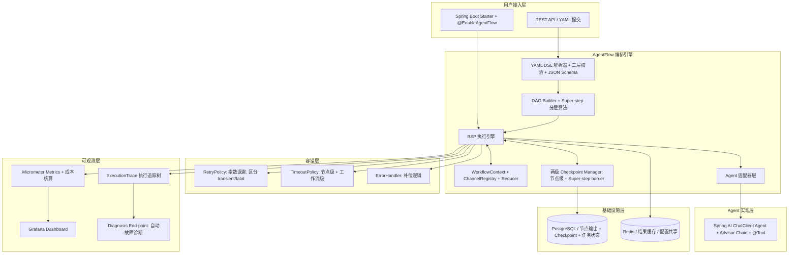
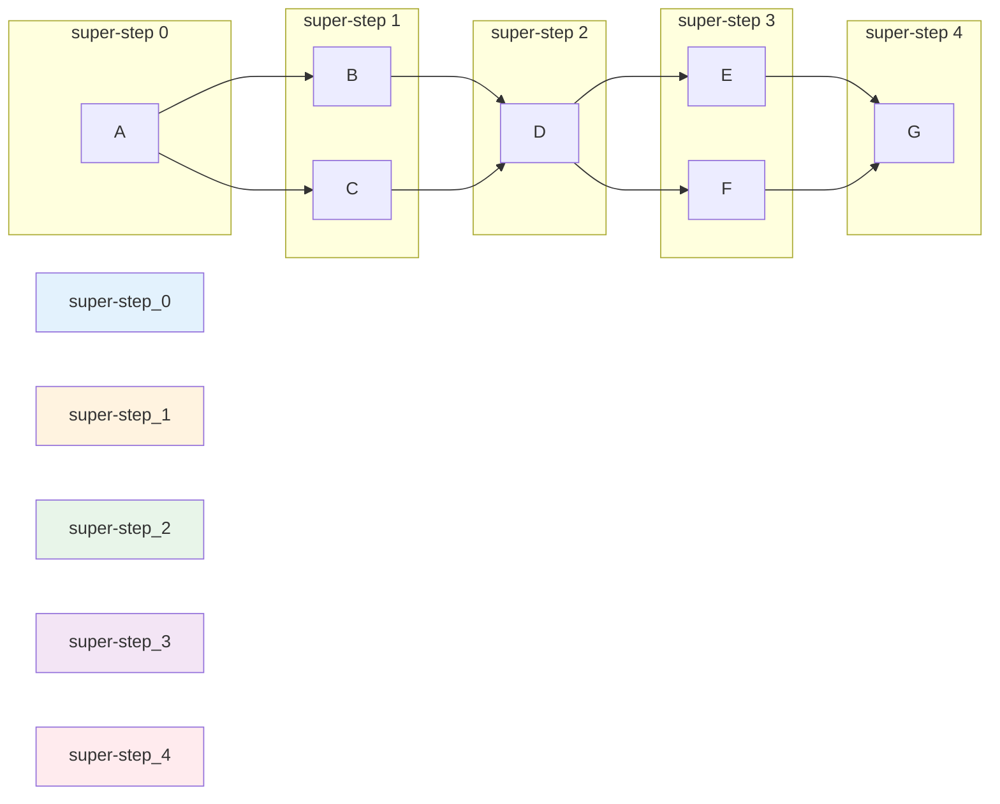
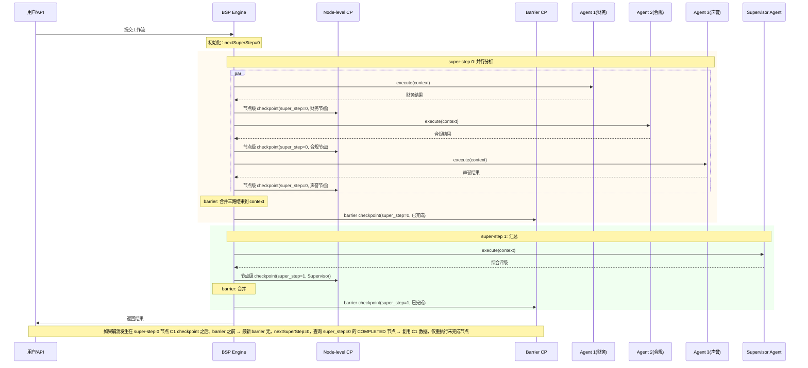
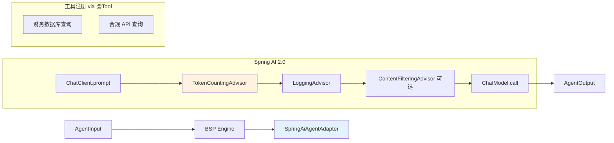
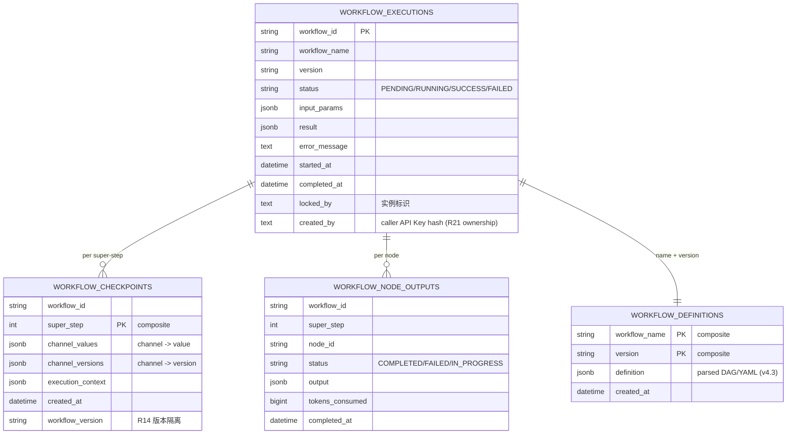
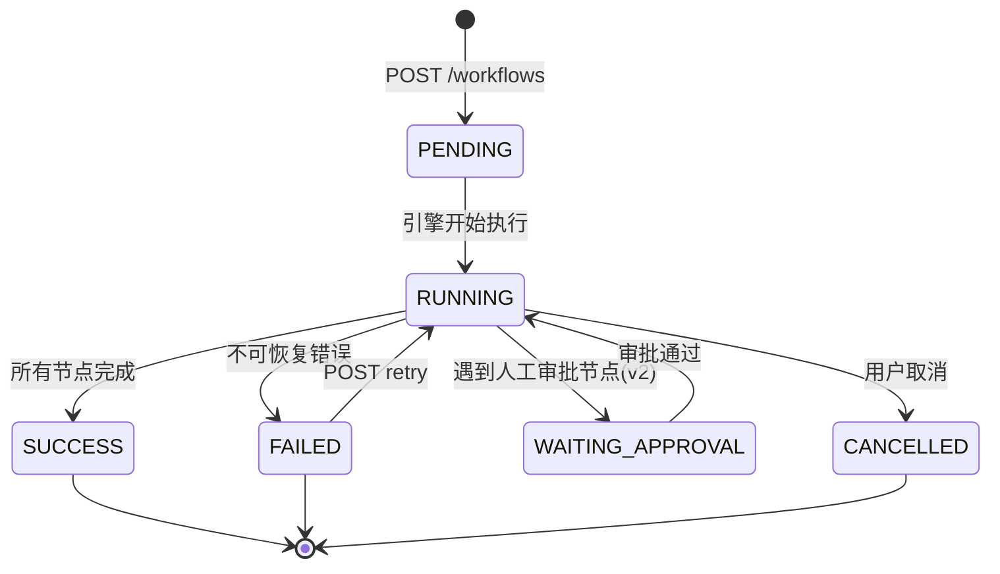

## High-Level Technical Design

### 整体架构



### BSP 执行模型与分层算法



**分层算法伪代码**：
```java
public List<SuperStep> computeSuperSteps(DAGraph<AgentNode> dag) {
    Map<String, Integer> levels = new HashMap<>();
    Queue<String> queue = new LinkedList<>();
    
    // Step 1: 所有入度为 0 的节点 → level 0
    for (AgentNode node : dag.getNodes()) {
        if (node.getInDegree() == 0) {
            levels.put(node.getId(), 0);
            queue.offer(node.getId());
        }
    }
    
    // Step 2: BFS 遍历，每个节点 level = max(前驱 level) + 1
    while (!queue.isEmpty()) {
        String current = queue.poll();
        for (AgentNode neighbor : dag.getSuccessors(current)) {
            int newLevel = levels.get(current) + 1;
            neighbor.inDegreeDec();  // 减少剩余未处理入度
            levels.merge(neighbor.getId(), newLevel, Math::max);
            if (neighbor.getInDegree() == 0) {
                queue.offer(neighbor.getId());
            }
        }
    }
    
    // Step 3: 按 level 分组
    return groupByLevel(levels);  // List<SuperStep>
}
```

### BSP 执行时序



### AgentFunction 接口与 Advisor Chain 整合



### 两级 Checkpoint 数据模型



### Workflow 生命周期状态机



← 返回 [`00-overview.md`](./00-overview.md)
